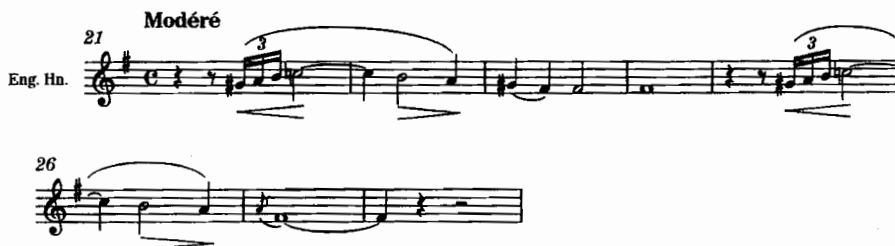
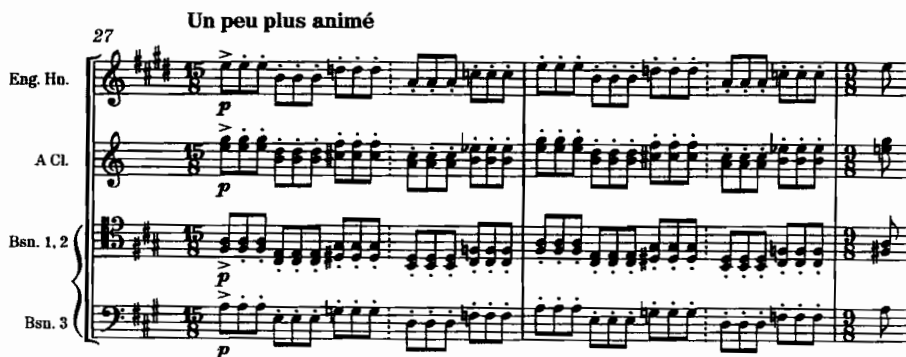

# สัปดาห์ที่ 10 — กรณีศึกษาสีสันของวง: Debussy และ Ravel

## คำถามนำ

สีสันของวงดนตรีในช่วงต้นศตวรรษที่ 20 มิได้เป็นเพียงการตกแต่งท้ายทำนอง หากแต่เป็น **วิธีการพัฒนาโมทีฟและฮาร์โมนี** โดยตัวมันเอง

## ขอบเขต

- การวิเคราะห์ orchestration จริงในช่วงต้นศตวรรษที่ 20
- หมวดหมู่เนื้อเสียงในวงดนตรี (Ludwin 4.2)
- กรณีศึกษาการเรียบเรียงของ Debussy ใน Ludwin 3.5–3.6 (สารบัญระบุหัวข้อ *The Girl with…* / Debussy Arrangement; ประมวลรายวิชาเรียกว่า *The Girl with the Flaxen Hair*)
- Ravel *Rapsodie Espagnole* — Motive Z (Ludwin 4.3)

**หมายเหตุปฏิทินสำคัญ:** วันอังคารที่ **13 ตุลาคม 2569** เป็นวันหยุด (วันคล้ายวันสวรรคตพระบาทสมเด็จพระบรมชนกาธิเบศร มหาภูมิพลอดุลยเดชมหาราช) **ไม่มีการเรียนการสอน** และไม่มีไฟล์เนื้อหาการสอนสำหรับวันดังกล่าว ให้ใช้ช่วงเวลานี้ศึกษาด้วยตนเองล่วงหน้าเพื่อเชื่อมโยงระหว่างสัปดาห์ที่ 10 กับสัปดาห์ที่ 11

## ผลลัพธ์

1. จำแนก texture ตามหมวดหมู่ของ Ludwin
2. อธิบายกระบวนการแปรจากเปียโนสู่วงดนตรีในกรณีศึกษาของ Debussy ตาม source
3. ติดตามโมทีฟผ่านการเปลี่ยนสีเสียงในงานของ Ravel
4. เรียบเรียงวรรคหนึ่งตามแนวทางที่วิเคราะห์ได้ และอีกฉบับหนึ่งตามแนวทางของตนเอง

## คำศัพท์สำคัญ

ให้ใช้คำศัพท์จากประมวลรายวิชาและ source ของสัปดาห์นี้เป็นหลัก โดยเขียนคำจำกัดความสั้น ๆ ด้วยภาษาของตนเองลงในสมุดบันทึก และอ้างอิงเลขหน้าหรือข้อเสนอแนะจากหนังสือเมื่อทบทวน

## เนื้อหาหลัก

### Categories ของ orchestration (Ludwin 4.2)

ให้ใช้คำนิยามใน Ludwin เป็นภาษากลางของชั้นเรียน โดยไม่ควรประดิษฐ์หมวดหมู่ใหม่ขึ้นเอง

### Debussy case (Ludwin 3.5–3.6)

ให้ศึกษาทั้งฉบับที่ source นำเสนอ และสิ่งที่เปลี่ยนแปลงไปเมื่อย้ายจากเปียโนสู่วงดนตรี

*เครดิต: Adler, Ch. 4, Example 4-2, Debussy, **Prélude à “L’après-midi d’un faune,”** m. 4. ใช้ประกอบการฟังสี ไม่แทนที่กรณี *Girl with the Flaxen Hair* ใน Ludwin*

*เครดิต: Adler, Ch. 8, Example 8-10, Debussy, **Nocturnes**, “Nuages.” ฝึกชี้ color layer*

*เครดิต: Adler, Ch. 8, Example 8-11, Debussy, **Nocturnes**, “Fêtes.”*

### Ravel Motive Z (Ludwin 4.3)

ให้ติดตามโมทีฟผ่านการเปลี่ยนแปลงสีเสียง โดยคำถามในการฟังต้องระบุห้องและเครื่องดนตรีตามที่ source แสดงไว้อย่างชัดเจน

*เครดิต: Adler, Ch. 2, Example 2-78 (Debussy *Ibéria* harmonics) — ใช้เป็นตัวอย่าง adjacent French orchestral color; กรณีหลัก Ravel อยู่ใน Ludwin 4.3*

## งานในชั้นเรียน

ให้เรียบเรียงวรรคหนึ่งออกมาเป็นสองฉบับ ดังนี้

1. ฉบับที่ 1 ตามแนวทางที่วิเคราะห์ได้จาก case study
2. ฉบับที่ 2 ตามแนวทางของตนเอง

พร้อมอธิบายสิ่งที่เปลี่ยนแปลงไปและเหตุผลประกอบ

## Further study

| หัวข้อ | แหล่ง | งาน |
|---|---|---|
| Debussy orchestration example | Ludwin 3.5 | ทำเครื่องหมายสีต่อ phrase |
| Debussy Arrangement (*The Girl with…* ใน TOC Ludwin 3.6) | Ludwin 3.6 | เทียบ piano กับ orchestra/arrangement ตามหน้าที่ source แสดง |
| Categories | Ludwin 4.2 | จำแนก 4 วรรค |
| Rapsodie Espagnole Motive Z | Ludwin 4.3 | ติดตาม motive ผ่านเครื่อง |
| Adjacent Debussy color | Adler Nuages/Fêtes/Faune | ฝึกภาษา color layer |

## กิจกรรมในชั้นเรียน 120 นาที

**นาทีที่ 0–20** ฟังและจำแนกหมวดหมู่ · **นาทีที่ 20–50** วิเคราะห์กรณีศึกษา Debussy · **นาทีที่ 50–80** วิเคราะห์กรณีศึกษา Ravel · **นาทีที่ 80–110** เรียบเรียงสองแนวทาง · **นาทีที่ 110–120** สรุปบทเรียน

## งานศึกษาด้วยตนเอง 6 ชั่วโมง และมอบหมายช่วงวันหยุด 13 ตุลาคม 2569

- งานปกติของสัปดาห์ที่ 10: การวิเคราะห์และแบบฝึกสองแนวทาง
- **ช่วงวันหยุด 13 ตุลาคม:** ให้ศึกษาด้วยตนเองล่วงหน้าสำหรับสัปดาห์ที่ 11 โดยอ่าน Adler บทที่ 17 หมวด transcription และเตรียมท่อนเปียโนที่จะนำมาถอดแบบ (ไม่มีการเรียนการสอนในวันหยุดดังกล่าว)

## เชื่อมสัปดาห์ที่ 11

เนื้อหาจะเคลื่อนจากกรณีศึกษาด้านสีเสียงไปสู่การถอดแบบจาก keyboard หรือ small ensemble สู่วงออร์เคสตรา โดยรักษา style และ voice leading ของต้นฉบับไว้

## แหล่งอ้างอิง

Ludwin 3.5–3.6, 4.2–4.3 · Adler ตัวอย่าง Debussy ประกอบ

## Image credits

`adler-harp-debussy-faune.png`, `adler-debussy-nuages-ww-color.png`, `adler-debussy-fetes-ww.png`, `adler-harmonics-debussy-iberia.png`

## เกณฑ์ตรวจตนเอง (เพิ่มเติม)

- [ ] หัวข้อและวันที่ตรงกับประมวลรายวิชา
- [ ] งานส่งตรงตามข้อกำหนดของประมวลรายวิชา ไม่มีเกณฑ์คะแนนใหม่เพิ่มเติม
- [ ] ภาพทุกไฟล์เปิดได้และมีเครดิตกำกับครบถ้วน
- [ ] มีรายการ further study อย่างน้อย 4 รายการจาก source
- [ ] มีใบงานและแผนการศึกษาด้วยตนเอง 6 ชั่วโมง
- [ ] มีจุดเชื่อมโยงไปยังสัปดาห์ถัดไป
- [ ] สถานะยังคงเป็น รอตรวจโดยผู้สอน
