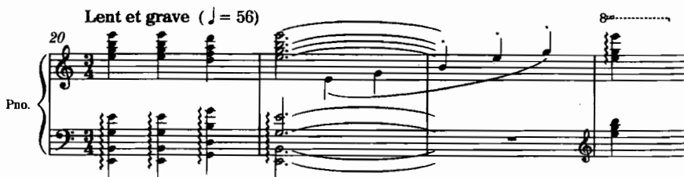
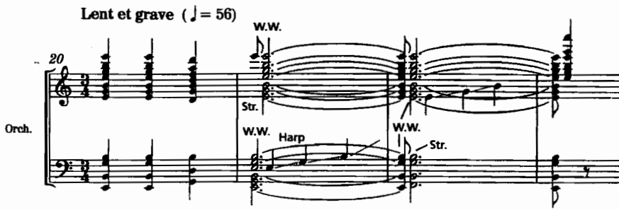
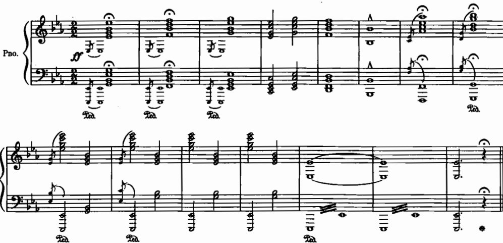
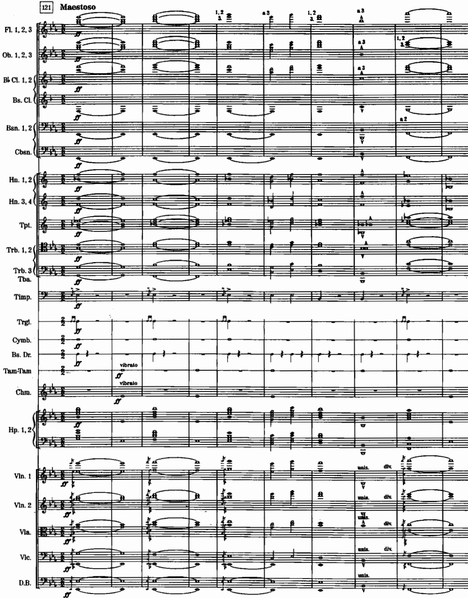
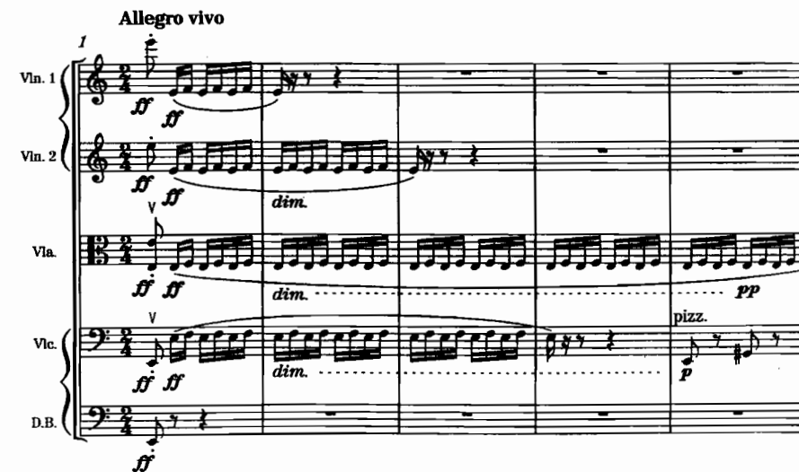

# สัปดาห์ที่ 11 — การถอดแบบสู่วงออร์เคสตรา

## คำถามนำ

การถอดแบบ (transcription) ที่ดีย่อมรักษา **ลีลา การเดินแนวเสียง และวรรคตอน** ไว้เป็นสำคัญ มิใช่เพียงการคัดลอกโน้ตเปียโนไปใส่ไวโอลินทีละเสียง

## ขอบเขต

- การถอดแบบจาก keyboard/small ensemble สู่วงออร์เคสตรา
- การถอดแบบจาก band/wind ensemble สู่วงออร์เคสตรา
- การปรับให้เข้ากับกำลังวงจริง
- piano → strings; piano → winds+strings (Adler 5, 8, 17)
- key signatures และ 8va (Goss Q13–Q14)

**หมายเหตุ:** ช่วงวันหยุด 13 ตุลาคม 2569 ที่ผ่านมาเป็นการมอบหมายให้ศึกษาด้วยตนเองล่วงหน้า เนื้อหาวันนี้จึงเป็นการตรวจงานเตรียมและลงมือถอดแบบในชั้นเรียน

**งานส่ง:** ถอดแบบท่อนเปียโนหนึ่งท่อนสู่วงออร์เคสตรา จัดส่งพร้อมต้นฉบับและคำอธิบายการตัดสินใจประกอบ

## ผลลัพธ์

1. แยก melodic essential ออกจาก piano figuration ได้
2. แจกจ่ายแนวเสียงโดยรักษา voice leading ของต้นฉบับไว้
3. จัดการ 8va และ key signature ตามหลักของ Goss Q13–Q14
4. อธิบายสิ่งที่เปลี่ยนแปลงไปเนื่องจากข้อจำกัดของเครื่องดนตรี

## คำศัพท์สำคัญ

ให้ใช้คำศัพท์จากประมวลรายวิชาและ source ของสัปดาห์นี้เป็นหลัก โดยเขียนคำจำกัดความสั้น ๆ ด้วยภาษาของตนเองลงในสมุดบันทึก และอ้างอิงเลขหน้าหรือข้อเสนอแนะจากหนังสือเมื่อทบทวน

## เนื้อหาหลัก

Adler ในบทที่ 17 แบ่งประเด็นเรื่อง transcription ไว้อย่างเป็นระบบ พร้อมตัวอย่างเปรียบเทียบระหว่างเปียโนกับวงออร์เคสตรา

*เครดิต: Adler, Ch. 17, Example 17-1, Ravel, **Ma mère l’oye**, “Le jardin féerique,” mm. 20–23. เปรียบต้นทางกับฉบับวง*

*เครดิต: Adler, Ch. 17, Example 17-8, Musorgsky/Ravel, **Pictures at an Exhibition**, “The Great Gate of Kiev.”*

*เครดิต: Adler, Ch. 17, Example 17-6, Bizet, **Jeux d’enfants**, “La toupie,” mm. 1–5*

### หลักตัดสินใจ

| ปัญหาบนเปียโน | คำถามถอดแบบ | ทางเลือก |
|---|---|---|
| Figuration หนา | ต้องครบทุกโน้ตหรือเป็น gesture | ลดเป็น color ostinato |
| มือซ้ายกระโดด | ใครถือเบส ใครถือ harmony | bass + mid pad |
| Pedal blur | วงจะ blur อย่างไร | sustain strings/harp vs dry winds |
| 8va lines | เขียน 8va หรือ pitch จริง | Goss Q13 |
| กำลังวงจำกัด | ตัดอะไรโดยไม่เสียโครง | ปรับตามจริง |

## Further study

| หัวข้อ | ตัวอย่าง | งาน | แหล่ง |
|---|---|---|---|
| Piano→orch color | Ravel *Ma mère l’oye* Ex. 17-1 | เทียบ pitch assignment | Adler 17 |
| Monumental transcription | Great Gate Ex. 17-8 | ชี้ octave/unison strategy | Adler 17 |
| Light figuration | Bizet *Jeux d’enfants* Ex. 17-6 | แยก essential rhythm | Adler 17 |
| 8va / keys | Goss Q13–Q14 | ตรวจพาร์ตหลังถอด | Goss 100 Tips appendix |
| Piano to strings | Adler Ch. 5 transcription sections | ใช้เมื่อเป้าหมายเป็นสาย | Adler 5 |

## กิจกรรมในชั้นเรียน 120 นาที

**นาทีที่ 0–20** แนวคิดเบื้องต้น · **นาทีที่ 20–50** เปรียบเทียบต้นฉบับกับฉบับถอดแบบ · **นาทีที่ 50–70** สาธิตการแจกจ่ายแนวเสียง · **นาทีที่ 70–110** เวิร์กชอปถอดแบบ · **นาทีที่ 110–120** peer feedback

## งานศึกษาด้วยตนเอง 6 ชั่วโมง

ถอดแบบท่อนเปียโนหนึ่งท่อน · เขียนคำอธิบายการตัดสินใจประกอบ · ตรวจสอบ transposition/8va · เตรียมส่งงานคู่กับต้นฉบับ

## เชื่อมสัปดาห์ที่ 12

เนื้อหาจะเคลื่อนจากการถอดแบบไปสู่ Hollywood sound และข้อจำกัดด้าน playback และแนวปฏิบัติเชิงวิชาชีพ พร้อมทั้งเริ่มเสนอหัวข้อโครงงานที่ 2

## แหล่งอ้างอิง

Adler Ch. 17, 5, 8 · Goss Q13–Q14

## Image credits

`adler-ravel-mamere-piano.png`, `adler-ravel-mamere-orch.png`, `adler-mussorgsky-great-gate-piano.png`, `adler-mussorgsky-great-gate-ravel.png`, `adler-bizet-jeux-denfants.png`

## เกณฑ์ตรวจตนเอง (เพิ่มเติม)

- [ ] หัวข้อและวันที่ตรงกับประมวลรายวิชา
- [ ] งานส่งตรงตามข้อกำหนดของประมวลรายวิชา ไม่มีเกณฑ์คะแนนใหม่เพิ่มเติม
- [ ] ภาพทุกไฟล์เปิดได้และมีเครดิตกำกับครบถ้วน
- [ ] มีรายการ further study อย่างน้อย 4 รายการจาก source
- [ ] มีใบงานและแผนการศึกษาด้วยตนเอง 6 ชั่วโมง
- [ ] มีจุดเชื่อมโยงไปยังสัปดาห์ถัดไป
- [ ] สถานะยังคงเป็น รอตรวจโดยผู้สอน
