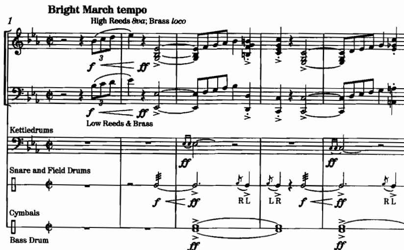
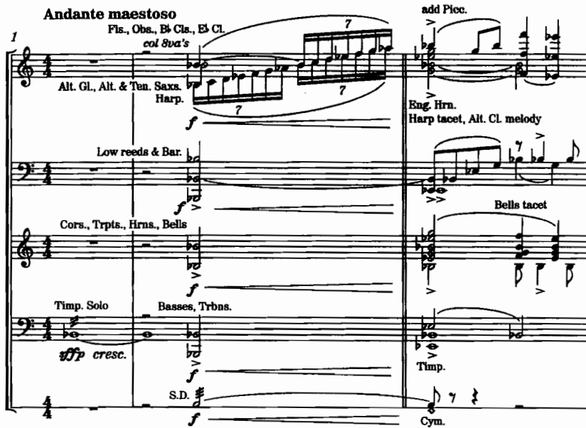
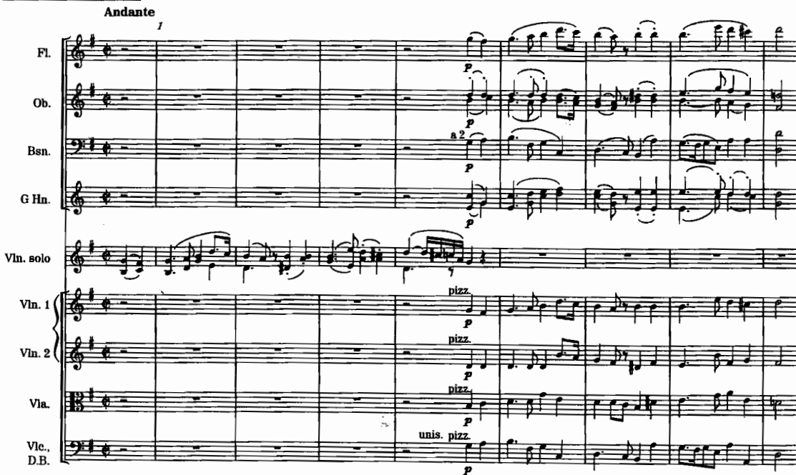
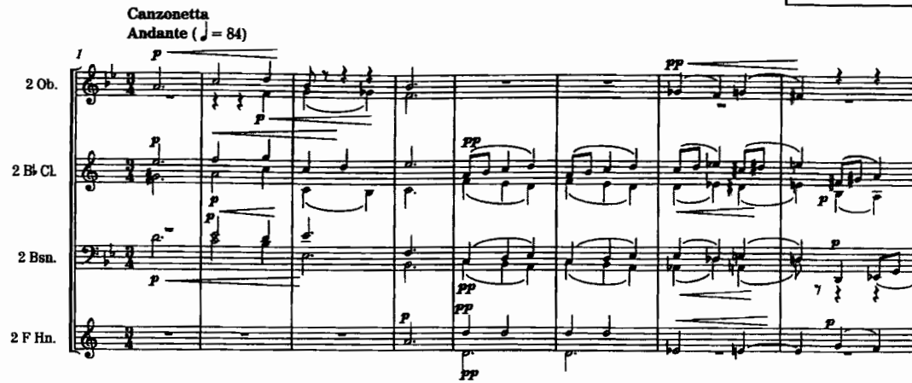
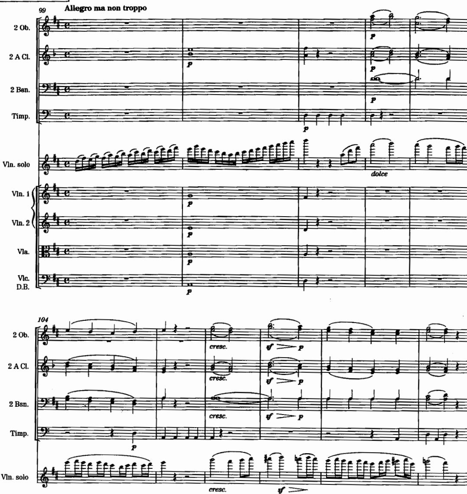

# สัปดาห์ที่ 13 — วินด์แบนด์ และวงในบทบาทผู้บรรเลงประกอบ

## คำถามนำ

การย้ายจากวงออร์เคสตราไปสู่วินด์แบนด์ (หรือในทิศทางกลับกัน) มิใช่เพียงการตัดเครื่องสายออกแล้วจบสิ้น หากแต่ต้องค้นหา **ตัวแทนที่ทำหน้าที่เดียวกันของเสียงเดิม** และเว้นพื้นที่ให้ศิลปินเดี่ยวหรือนักร้องได้แสดงออกอย่างเต็มที่

## ขอบเขต

- marching band vs wind ensemble/concert band (Adler 19)
- เครื่องกระทบในวงดนตรีประเภทนี้
- การจัดวางสกอร์และ condensed score
- การถอดแบบจาก orchestra สู่ band
- orchestra ในบทบาทผู้บรรเลงประกอบ (Adler 16)
- แนวทางเชิงสไตล์ และความแตกต่างระหว่างพาร์ตที่เขียนตายตัวกับพาร์ตแบบด้นสด (Rabson 7–8)

**งานส่ง:** เรียบเรียงแนวคิดเดียวกันสำหรับวินด์แบนด์ เปรียบเทียบกับฉบับออร์เคสตรา พร้อมวิเคราะห์ข้อได้เปรียบและข้อจำกัด

## ผลลัพธ์

1. อธิบายความแตกต่างระหว่าง band กับ wind ensemble ตามหลักของ Adler
2. ค้นหาตัวแทน (substitute) ที่ทำหน้าที่ของเครื่องสายในบริบทของวินด์แบนด์
3. เรียบเรียงส่วนประกอบ (accompaniment) ที่ไม่กลบเสียงของ soloist
4. เปรียบเทียบสองฉบับที่เรียบเรียงจากวัสดุทางดนตรีเดียวกัน

## คำศัพท์สำคัญ

ให้ใช้คำศัพท์จากประมวลรายวิชาและ source ของสัปดาห์นี้เป็นหลัก โดยเขียนคำจำกัดความสั้น ๆ ด้วยภาษาของตนเองลงในสมุดบันทึก และอ้างอิงเลขหน้าหรือข้อเสนอแนะจากหนังสือเมื่อทบทวน

## เนื้อหาหลัก

### Score layout for band

*เครดิต: Adler, Ch. 19, Example 19-2, E. E. Bagley, **National Emblem**, ed. Fennell*

*เครดิต: Adler, Ch. 19, Example 19-3, Ward/Dragon, **America the Beautiful***

Adler ยังนำเสนอ layout ของ concert band และแนวทางการถอดแบบจากวงออร์เคสตรา โดยค้นหา analogue ของเทคนิคต่าง ๆ เช่น pizz. และ sustain ให้เหมาะสมกับบริบทของวินด์แบนด์

### Orchestra as accompanist

*เครดิต: Adler, Ch. 16, Example 16-1, Beethoven, **Romance for Violin and Orchestra**, Op. 40, mm. 1–8*

*เครดิต: Adler, Ch. 16, Example 16-5, Tchaikovsky, **Violin Concerto**, second movement, mm. 1–24*

*เครดิต: Adler, Ch. 16, Example 16-13, Beethoven, **Violin Concerto**, first movement, mm. 99–109*

### Rabson 7–8

ให้นำมาใช้เมื่อพาร์ตเครื่องสายหรือแนวทางเชิงสไตล์ต้องการเส้นแบ่งที่ชัดเจนระหว่างส่วนที่เขียนตายตัวกับส่วนที่บรรเลงแบบด้นสด โดยต้องระบุไว้อย่างชัดเจนในสกอร์

## Further study

| หัวข้อ | ตัวอย่าง | งาน | แหล่ง |
|---|---|---|---|
| Band layout | National Emblem; America the Beautiful | วาด order ของสกอร์ | Adler 19 |
| Accompaniment space | Beethoven Romance; Tchaikovsky VC II | ทำเครื่องหมาย dynamic ceiling | Adler 16 |
| Tutti without crushing solo | Beethoven VC I, mm. 99–109 | ชี้ช่องของ soloist | Adler 16 |
| Style / improv boundary | Rabson Ch. 7–8 | ระบุว่าส่วนใดเขียนตายตัว | Rabson |

## กิจกรรมในชั้นเรียน 120 นาที

**นาทีที่ 0–20** เปรียบเทียบ orchestra กับ band · **นาทีที่ 20–50** วิเคราะห์บทบาทผู้บรรเลงประกอบ · **นาทีที่ 50–70** สาธิตการหาตัวแทนของเครื่องสาย · **นาทีที่ 70–110** เรียบเรียงสองฉบับ · **นาทีที่ 110–120** สรุปบทเรียน

## งานศึกษาด้วยตนเอง 6 ชั่วโมง

จัดทำฉบับ wind band และฉบับ orchestra จากวัสดุทางดนตรีเดียวกัน · จัดทำตารางเปรียบเทียบข้อได้เปรียบและข้อจำกัด · ตรวจสอบว่า soloist (หากมี) มีที่หายใจและมีพื้นที่ให้เสียงได้ยินชัดเจน

## เชื่อมสัปดาห์ที่ 14

ไม่ว่าจะเลือกวงดนตรีประเภทใด สกอร์และพาร์ตต้องสื่อสารได้อย่างชัดเจน สัปดาห์ที่ 14 จะเน้นเรื่อง layout, page turns, cues และการปรับแก้งาน

## แหล่งอ้างอิง

Adler Ch. 19, 16 · Rabson Ch. 7–8

## Image credits

`adler-band-national-emblem-1.png`, `adler-band-america-beautiful-1.png`, `adler-beethoven-romance-accomp.png`, `adler-tchaikovsky-violin-concerto-slow.png`, `adler-beethoven-violin-concerto-tutti.png`

## เกณฑ์ตรวจตนเอง (เพิ่มเติม)

- [ ] หัวข้อและวันที่ตรงกับประมวลรายวิชา
- [ ] งานส่งตรงตามข้อกำหนดของประมวลรายวิชา ไม่มีเกณฑ์คะแนนใหม่เพิ่มเติม
- [ ] ภาพทุกไฟล์เปิดได้และมีเครดิตกำกับครบถ้วน
- [ ] มีรายการ further study อย่างน้อย 4 รายการจาก source
- [ ] มีใบงานและแผนการศึกษาด้วยตนเอง 6 ชั่วโมง
- [ ] มีจุดเชื่อมโยงไปยังสัปดาห์ถัดไป
- [ ] สถานะยังคงเป็น รอตรวจโดยผู้สอน
