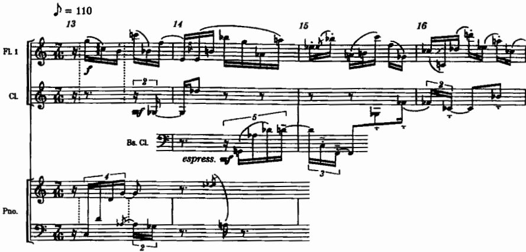
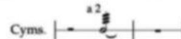
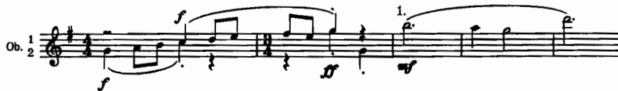

# สัปดาห์ที่ 15 — โครงงานสร้างสรรค์ที่ 2 (ปลายภาค)

## คำถามนำ

สัปดาห์สุดท้ายของการเรียนตามตารางเรียนนี้เน้นการ **นำเสนอผลงาน แสดงหลักฐานการปรับปรุง และสะท้อนผลการเรียนรู้เทียบกับ CLO** มิใช่สัปดาห์ที่สอนเทคนิคใหม่

## ขอบเขตตามประมวลรายวิชา

**ชื่องาน:** ผลงานเรียบเรียงเสียงต้นฉบับ

- ความยาว **2–4 นาที**
- แสดงแนวคิดด้านโครงสร้างและสีสันอย่างชัดเจน
- **ต้องมีหลักฐานการปรับปรุงจากข้อเสนอแนะในสัปดาห์ที่ 14**
- คาบเรียนสุดท้ายก่อนวันสุดท้ายของการเรียนการสอน 20 พฤศจิกายน 2569
- แฟ้มผลงานฉบับสมบูรณ์ต้องจัดส่งภายในช่วงสอบปลายภาค **23 พฤศจิกายน – 4 ธันวาคม 2569** ตามวันที่สำนักทะเบียนจัดสรร

## สิ่งที่ต้องส่ง (ตามประมวลรายวิชา)

1. โครงร่างและสกอร์ย่อ
2. สกอร์เต็มในรูปแบบ PDF พร้อมไฟล์โปรแกรมบันทึกโน้ต
3. ชุดพาร์ตครบตามกำลังวง ในรูปแบบ PDF
4. เสียงตัวอย่างหรือการบันทึกการอ่านโน้ต
5. บันทึกการปรับปรุงฉบับก่อน–หลังพร้อมเหตุผลประกอบ
6. คำชี้แจงแหล่งที่มาและจรรยาบรรณ
7. การสะท้อนผลการเรียนรู้เทียบกับ CLO พร้อมแผนการพัฒนาต่อไป

**การนำเสนอ:** 10–12 นาที รวมช่วงวิพากษ์

## สัดส่วนคะแนนที่เกี่ยวข้อง

- โครงงานที่ 2 = **30%**
- การนำเสนอ ข้อเสนอแนะ จรรยาบรรณ และการสะท้อนผล (รวมรายการในตารางประเมิน) เป็นส่วนหนึ่งของ **10%** ตามประมวลรายวิชา
- ให้ใช้เกณฑ์การประเมินโครงงาน 5 หัวข้อตามที่ประมวลรายวิชากำหนด (25/25/20/15/15) **โดยมิได้สร้าง rubric ใหม่**

## เมื่อจบรายวิชาในคาบนี้ ผู้เรียนจะสามารถ

1. นำเสนอผลงานความยาว 2–4 นาทีพร้อมสกอร์ประกอบ
2. ชี้ให้เห็นการเปลี่ยนแปลงที่เกิดขึ้นจาก feedback ในสัปดาห์ที่ 14
3. สะท้อนผลการเรียนรู้เทียบกับ CLO1–5 ตามที่รายวิชากำหนด
4. เตรียมแฟ้มผลงานฉบับสมบูรณ์สำหรับกำหนดส่งในช่วงสอบปลายภาค

## Checklist ก่อนนำเสนอ

- [ ] ความยาว 2–4 นาที
- [ ] มีฉบับ before/after จากสัปดาห์ที่ 14
- [ ] parts ครบตามกำลังวง
- [ ] จรรยาบรรณ แหล่งที่มา และ AI disclosure เป็นไปตามนโยบายของรายวิชา
- [ ] สามารถนำเสนอได้ภายในเวลา 10–12 นาที

## กิจกรรมในชั้นเรียน 120 นาที

1. **นาทีที่ 0–10** — ชี้แจงลำดับคิวและจุดเน้นการวิพากษ์ตามเกณฑ์ของประมวลรายวิชา
2. **นาทีที่ 10–110** — นำเสนอรายบุคคล 10–12 นาที
3. **นาทีที่ 110–120** — สรุปภาพรวมของรายวิชาและย้ำกำหนดส่งแฟ้มผลงานฉบับสมบูรณ์ในช่วงสอบปลายภาค

## ใบงานผู้ฟัง

| ผู้นำเสนอ | โครงสร้างที่ได้ยิน | สีที่ชัด | หลักฐานการปรับปรุง | คำถาม |
|---|---|---|---|---|
|  |  |  |  |  |

## งานศึกษาด้วยตนเองหลังคาบ

ให้ใช้ช่วงเวลาจนถึงกำหนดส่งปลายภาคในการขัดเกลาแฟ้มผลงานตาม feedback ที่ได้รับในวันนำเสนอ โดยมิได้เพิ่มข้อกำหนดใหม่แต่อย่างใด

## ภาพประกอบ (ช่วยตรวจสอบความพร้อม มิใช่เนื้อหาเทคนิคใหม่)

*เครดิต: Adler, Ch. 18, Example 18-1*

*เครดิต: Gould, **Behind Bars***

*เครดิต: Adler, Ch. 18, Example 18-10*

## คำศัพท์สำคัญ

ให้ใช้คำศัพท์จากประมวลรายวิชาและ source ของสัปดาห์นี้เป็นหลัก โดยเขียนคำจำกัดความสั้น ๆ ด้วยภาษาของตนเองลงในสมุดบันทึก และอ้างอิงเลขหน้าหรือข้อเสนอแนะจากหนังสือเมื่อทบทวน

## Further study

ไม่มี repertoire หรือเทคนิคใหม่ในสัปดาห์นี้ ให้ใช้ผลงานของตนเองและบันทึกฉบับ before/after ประกอบการนำเสนอ

| ประเด็นพูด | หลักฐาน |
|---|---|
| โครงสร้าง | outline/reduction |
| สีเสียง | 2–3 ช่วงของการตัดสินใจ |
| การปรับปรุง | before/after จากสัปดาห์ที่ 14 |
| จรรยาบรรณ | คำชี้แจงแหล่งที่มา |
| CLO reflection | ตารางสะท้อนผลโดยสรุป |

## แหล่งอ้างอิง

- ประมวลรายวิชา: โครงงานสร้างสรรค์ที่ 2, สัดส่วนคะแนน, กำหนดส่งปลายภาค
- Adler 18 / Gould Part 3 สำหรับความพร้อมของสกอร์และพาร์ต

## Image credits

`adler-score-layout-18-1a.png`, `adler-two-instruments-one-staff.png`, `gould-part-prep-1.png`

## เกณฑ์ตรวจตนเอง (เพิ่มเติม)

- [ ] หัวข้อและวันที่ตรงกับประมวลรายวิชา
- [ ] งานส่งตรงตามข้อกำหนดของประมวลรายวิชา ไม่มีเกณฑ์คะแนนใหม่เพิ่มเติม
- [ ] ภาพทุกไฟล์เปิดได้และมีเครดิตกำกับครบถ้วน
- [ ] มีรายการ further study อย่างน้อย 4 รายการจาก source
- [ ] มีใบงานและแผนการศึกษาด้วยตนเอง 6 ชั่วโมง
- [ ] มีจุดเชื่อมโยงไปยังสัปดาห์ถัดไป
- [ ] สถานะยังคงเป็น รอตรวจโดยผู้สอน
