# สัปดาห์ที่ 2 — เครื่องสาย 1: เครื่องดนตรีในฐานะระบบทางกายภาพ

## คำถามนำ

เมื่อผู้เรียบเรียงบันทึกโน้ตให้ไวโอลิน วิโอลา เชลโล หรือดับเบิลเบส คำถามพื้นฐานที่ต้องเผชิญคือ กำลังบันทึก “เสียงบนหน้ากระดาษ” เพียงเท่านั้น หรือกำลังออกแบบการเคลื่อนไหวของมือซ้าย มือขวา สาย และคันชัก ให้เกิดเป็นเสียงที่ผู้บรรเลงสามารถบรรเลงได้จริง

เนื้อหาสัปดาห์นี้เริ่มต้นจากลักษณะทางกายภาพของเครื่องสาย แล้วจึงแปลลักษณะดังกล่าวให้เป็นความรู้เรื่องช่วงเสียง การวางนิ้ว การแบ่งเสียง และการใช้คันชัก ทั้งนี้ ความรู้เพียงว่า “กระทำได้” ยังไม่เพียงพอต่อการเรียบเรียงที่มีคุณภาพ ผู้เรียบเรียงจำเป็นต้องแยกแยะได้ว่าสิ่งใดกระทำได้โดยง่าย สิ่งใดกระทำได้แต่ต้องอาศัยการเตรียมตัวของผู้บรรเลง และสิ่งใดจะทำให้เสียงที่ปรากฏจริงคลาดเคลื่อนไปจากที่จินตนาการไว้

## ขอบเขตตามประมวลรายวิชา

สัปดาห์นี้ครอบคลุมประเด็นดังต่อไปนี้

- โครงสร้างของเครื่องสายและหลักการเกิดเสียง
- การตั้งเสียง (tuning) และความแตกต่างระหว่างการตั้งสายเป็นคู่ห้ากับคู่สี่
- ช่วงเสียงและตำแหน่งการวางนิ้วของไวโอลิน วิโอลา เชลโล และดับเบิลเบส
- เทคนิค double stop, triple stop, quadruple stop และการเขียนคำสั่ง `divisi`
- เทคนิค vibrato, non vibrato, glissando และ portamento
- คันชัก ทิศทางของคันชัก และความสัมพันธ์ระหว่าง bowing, articulation, dynamics และความดังของเสียง
- การฟังตัวอย่างเสียงจากการบันทึกเสียงควบคู่กับการอ่านสกอร์และภาพประกอบจาก Adler และ Rabson

คำถามหลักตามประมวลรายวิชาคือ **ผู้เรียนจะเรียบเรียงบทเพลงสำหรับเครื่องสายความยาวสั้น ๆ ในสองช่วงเสียงที่แตกต่างกันได้อย่างไร โดยระบุปัญหาทางกายภาพของผู้บรรเลงที่พบและวิธีการแก้ไข**

## เมื่อจบสัปดาห์นี้ ผู้เรียนจะสามารถ

1. ระบุส่วนประกอบพื้นฐานของเครื่องสาย และอธิบายบทบาทของแต่ละส่วนต่อกลไกการเกิดเสียง
2. บันทึกโน้ตสายเปล่าและช่วงเสียงเบื้องต้นของไวโอลิน วิโอลา เชลโล และดับเบิลเบสได้อย่างถูกต้อง ทั้งในแง่ชนิดของกุญแจเสียงและการทดเสียง (transposition)
3. จำแนกความแตกต่างระหว่างเทคนิค double, triple, quadruple stop กับคำสั่ง `divisi` และวิเคราะห์ผลกระทบต่อความดัง ความต่อเนื่องของเสียง และความคล่องตัวในการบรรเลง
4. เลือกใช้เทคนิค vibrato, non vibrato, glissando หรือ portamento ให้สอดคล้องกับเป้าหมายด้านสีสันของเสียงที่ต้องการ
5. เรียบเรียงบทเพลงสั้น ๆ (passage) ในสองช่วงเสียง พร้อมระบุประเด็นปัญหาด้านการเปลี่ยนสาย การวางนิ้ว การแบ่งคันชัก หรือลมหายใจของวลีที่จำเป็นต้องตรวจสอบเพิ่มเติม
6. วิเคราะห์ตัวอย่างสกอร์ประกอบการฟังบันทึกเสียง และอธิบายได้ว่าการบันทึกโน้ตที่ดูถูกต้องบนหน้ากระดาษปรากฏเป็นเสียงจริงอย่างไรเมื่อถูกบรรเลง

## ภาพรวมเครื่องสายทั้งตระกูล

Adler อธิบายว่า violin family คือกลุ่มเครื่องสายสีที่มีองค์ประกอบทางโครงสร้างและเทคนิคร่วมกันเป็นจำนวนมาก แต่มิได้หมายความว่าเครื่องดนตรีในตระกูลนี้จะสามารถใช้แทนกันได้ทั้งหมด เครื่องสายมีช่วงเสียงกว้าง มีสีเสียงที่ต่อเนื่อง และสามารถผลิตเสียงยาวได้โดยไม่จำเป็นต้องหยุดพักเพื่อหายใจดังเช่นเครื่องเป่า อย่างไรก็ตาม คุณสมบัติด้านความต่อเนื่องดังกล่าวต้องแลกมาด้วยข้อจำกัดของคันชัก การสั่นสะเทือนของสาย และตำแหน่งของมือบน fingerboard

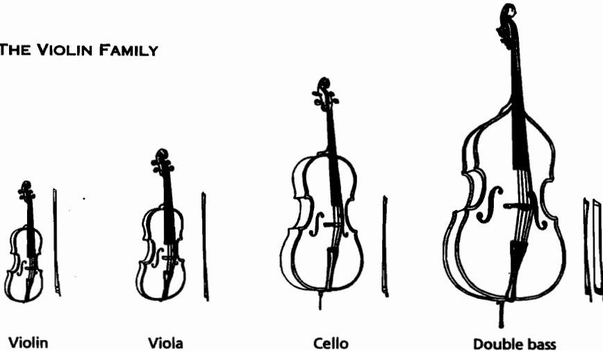

*เครดิต: Samuel Adler, **The Study of Orchestration**, Ch. 2, “The Violin Family”. ใช้ประกอบการสังเกตความสัมพันธ์เชิงตระกูล มิใช่ใช้แทนตารางช่วงเสียง*

### ระบบกายภาพที่ผู้เรียบเรียงต้องมองเห็น

1. **สาย (string)** ทำหน้าที่เป็นแหล่งกำเนิดการสั่นสะเทือน แต่เสียงที่ปรากฏจริงถูกขยายและปรับเปลี่ยนสีเสียงโดยตัวเครื่องและสะพานสาย
2. **fingerboard** เป็นส่วนที่ผู้บรรเลงใช้ย่นความยาวของสายด้วยการกดนิ้ว อันเป็นกลไกในการเปลี่ยนระดับเสียง (pitch) โดยไม่มี frets ช่วยกำหนดตำแหน่งที่ตายตัว
3. **bridge** ทำหน้าที่ถ่ายทอดการสั่นสะเทือนของสายไปยังตัวเครื่อง การเปลี่ยนตำแหน่งที่คันชักสัมผัสสายจึงส่งผลโดยตรงต่อ spectrum และน้ำหนักของเสียง
4. **คันชัก (bow)** เป็นตัวควบคุมระยะเวลาของการสั่น น้ำหนักของการเริ่มเสียง (attack) ตำแหน่งของเสียงภายในวลี (phrase) และศักยภาพในการสร้าง crescendo
5. **ระยะห่างระหว่างสาย** ทำให้การเปลี่ยนสายและการบรรเลงหลายเสียงพร้อมกันเป็นประเด็นทางกายภาพที่แท้จริง มิใช่เพียงประเด็นด้านการอ่านโน้ตเท่านั้น

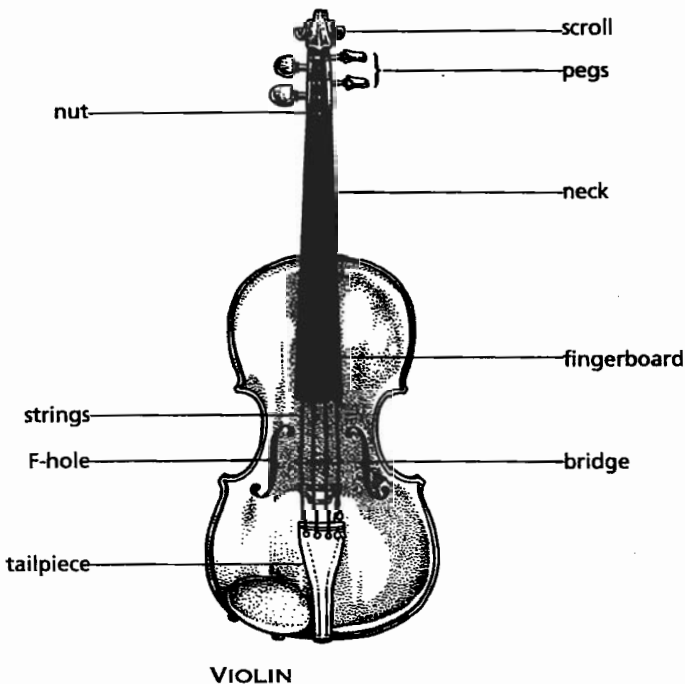

*เครดิต: Adler, Ch. 2, “Construction”. ให้ชี้ตำแหน่ง body, neck, fingerboard, bridge, tailpiece และ sound post ก่อนอธิบายกลไกการเกิดเสียงจากคันชัก*

Rabson ใช้ภาพเครื่องสายเป็นจุดเริ่มต้นของบทสนทนากับผู้บรรเลง และเน้นย้ำว่าความเข้าใจที่รอบด้านจำเป็นต้องคำนึงถึงความแตกต่างระหว่างการบรรเลงสดกับเสียงที่ได้จากโปรแกรมจำลองเสียง เสียงจากโปรแกรมอาจทำให้ผู้เรียบเรียงรับรู้ pitch และ articulation ได้อย่างคร่าว ๆ แต่ไม่อาจทดแทนการตัดสินใจในประเด็นเรื่อง intonation, vibrato, timbre และน้ำหนักคันชักของผู้บรรเลงจริงได้

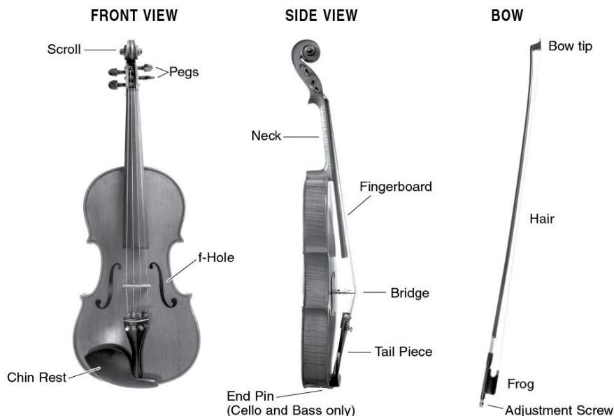

*เครดิต: Mimi Rabson, **Arranging for Strings**, Ch. 2, Fig. 2.1. ใช้เปรียบเทียบคำศัพท์ระหว่าง Adler กับ Rabson แล้วเลือกใช้คำที่คงที่ตลอดงานที่ส่ง*

## 1. การตั้งเสียง: สายเปล่าเป็นแผนที่ ไม่ใช่โน้ตตกแต่ง

เครื่องสายสามชนิดแรกของวงออร์เคสตรา ได้แก่ ไวโอลิน วิโอลา และเชลโล ตั้งสายเป็นคู่ห้า (perfect fifth) ในขณะที่ดับเบิลเบสตั้งสายเป็นคู่สี่ (perfect fourth) และเสียงที่บันทึกไว้ให้ดับเบิลเบสบรรเลงจะดังออกมาต่ำกว่าที่เขียนไว้หนึ่งช่วงคู่แปด (octave) การจดจำเพียงชื่อโน้ตของสายเปล่ายังไม่เพียงพอต่อการเรียบเรียงที่ดี ผู้เรียบเรียงจำเป็นต้องเข้าใจด้วยว่าสายเปล่าเอื้อประโยชน์อย่างไรต่อ passage หนึ่ง ๆ เช่น ช่วยให้เสียงกังวานขึ้น ช่วยให้การบรรเลง double stop ทำได้โดยง่าย หรือในทางกลับกัน อาจทำให้การเปลี่ยนสายกลายเป็นอุปสรรคต่อการบรรเลงแบบ legato

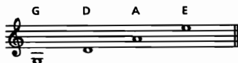

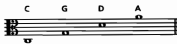

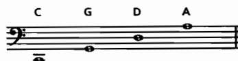

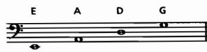

*เครดิตภาพทั้งสี่: Adler, Ch. 2, Examples 2-1–2-4. ใช้ลากเส้นสายเปล่าในสกอร์ก่อนคำนวณ fingering*

### ตารางจำอย่างมีเหตุผล

| เครื่อง | สิ่งที่ต้องจำในสัปดาห์นี้ | คำถามเชิงการเรียบเรียง |
|---|---|---|
| Violin | สายเปล่าเป็นคู่ 5, treble clef, ช่วงสูงโดดเด่น | ทำนองนี้ควรใช้สายเปล่าเพื่อความสว่าง หรือหลีกเลี่ยงเพื่อให้ vibrato ได้หรือไม่ |
| Viola | สายเปล่าเป็นคู่ 5, alto clef เป็นหลัก | แนวเสียงกลางนี้ต้องการสีเสียงหนาหรือจำเป็นต้องเปลี่ยน clef เพื่อให้อ่านง่าย |
| Cello | สายเปล่าเป็นคู่ 5, bass/tenor/treble clef ตาม register | เสียงต่ำต้องการความลึกหรือควรย้ายขึ้นเพื่อให้ articulation ชัด |
| Double bass | สายเปล่าเป็นคู่ 4, bass/tenor/treble clef, sounding octave ต่ำกว่าเขียน | แนวเบสนี้เขียนให้เกิดแรงกระแทกหรือปล่อยให้เสียงค่อย ๆ พูดจาก resonance |

### แบบฝึก 1 — สายเปล่าและการเปลี่ยนสาย

ให้ผู้เรียนเลือกทำนองของตนเองความยาว 4–8 ห้อง แล้วจัดทำสองฉบับ ดังนี้

- ฉบับที่ 1 ระบุตำแหน่งสายเปล่าที่ช่วยให้เสียงเปิดกว้างและกังวาน
- ฉบับที่ 2 หลีกเลี่ยงการใช้สายเปล่าในบางตำแหน่ง เพื่อให้ได้สีเสียงจากนิ้วกด (stopped tone) หรือเพื่อให้สามารถใช้ vibrato ได้อย่างสม่ำเสมอตลอดวลี

ให้บันทึกเหตุผลประกอบไว้ใต้สกอร์อย่างน้อยสองข้อ โดยหลีกเลี่ยงคำอธิบายกำกวมเช่น “เสียงดีกว่า” และให้ระบุอย่างชัดเจนว่าเกี่ยวข้องกับประเด็นด้าน resonance, timbre, intonation หรือการเปลี่ยนสายอย่างไร

## 2. การวางนิ้วและช่วงเสียง

Adler อธิบายว่าผู้บรรเลงสร้างโน้ตที่มีระดับเสียงสูงกว่าสายเปล่าได้ด้วยการกดนิ้วเพื่อย่นความยาวของสาย และด้วยการเลื่อนตำแหน่งมือไปยังจุดต่าง ๆ บน fingerboard การเลื่อนตำแหน่งขึ้นไปเช่นนี้อาจให้ pitch ตามที่ต้องการ แต่มิได้หมายความว่าสีเสียงเดิมจะยังคงอยู่เสมอไป เนื่องจากตำแหน่งของนิ้ว การเปลี่ยนสาย และแรงกดล้วนส่งผลต่อคุณภาพเสียงที่ปรากฏ

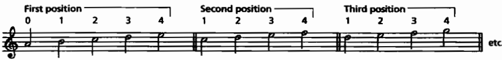

*เครดิต: Adler, Ch. 2, Example 2-6. ใช้สังเกตว่าความสูงของ pitch มิได้บ่งบอกตำแหน่งนิ้วเพียงแบบเดียวเสมอไป*

Rabson เน้นย้ำว่าช่วงเสียงที่สามารถบันทึกโน้ตได้กับช่วงเสียงที่บรรเลงได้อย่างสะดวกนั้นเป็นคนละเรื่องกัน และแต่ละ register ยังมีลักษณะเสียงเฉพาะตัวที่แตกต่างกัน กล่าวคือ ช่วงเสียงต่ำมักให้ความเข้มข้นและความลึก ช่วงเสียงกลางมีลักษณะใกล้เคียงกับน้ำเสียงพูด ส่วนช่วงเสียงสูงสามารถตัดผ่าน texture ได้ง่ายกว่าช่วงอื่น ด้วยเหตุนี้ การเรียบเรียงจึงต้องแยก “ขอบเขตที่กระทำได้ในทางทฤษฎี” ออกจาก “ขอบเขตที่เหมาะสมกับหน้าที่ของแนวเสียงนั้น ๆ” อย่างชัดเจน

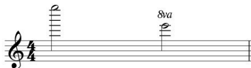

*เครดิต: Rabson, Ch. 2, Fig. 2.3. ใช้ตรวจสอบว่าการเขียน ledger lines จำนวนมากเกินไปทำให้การอ่านพาร์ตล่าช้าลงหรือไม่*

### แบบฝึก 2 — สีเสียงในสองช่วงเสียง

ให้ผู้เรียนบันทึกแนวคิดทางดนตรีเดียวกันสองครั้งในสองช่วงเสียงที่แตกต่างกัน ดังนี้

1. ช่วงเสียงต่ำถึงกลาง ทำหน้าที่เป็นพื้นเสียง (pad) หรือแนวรอง
2. ช่วงเสียงกลางถึงสูง ทำหน้าที่เป็นแนวหลักหรือจุดที่ดึงดูดความสนใจของผู้ฟัง

ให้บันทึกคำบรรยายผลลัพธ์ที่ต้องการกำกับไว้ด้วย เช่น “ช่วงต่ำต้องการความหนาแน่นของเสียงโดยไม่กลบแนวเบส” หรือ “ช่วงสูงต้องการให้ทำนองตัดผ่านเนื้อเสียงโดยไม่เพิ่มความดังเกินความจำเป็น” พร้อมทั้งทำเครื่องหมายประเด็นคำถามที่ต้องนำไปทดสอบกับผู้บรรเลงต่อไป

## 3. Double stop, triple stop, quadruple stop และ divisi

### Multiple stops

Adler จำแนก double stop ว่าเป็นการบรรเลงสองเสียงพร้อมกัน ส่วน triple stop และ quadruple stop เป็นการบรรเลงสามหรือสี่เสียงบนสายที่อยู่ประชิดกัน อย่างไรก็ตาม การปรากฏของคอร์ดสี่เสียงในสกอร์มิได้หมายความว่าทั้งสี่เสียงจะดังพร้อมกันตลอดเวลา เนื่องจากคันชักสมัยใหม่มีส่วนโค้งที่ทำให้การกดสายทั้งสี่พร้อมกันเป็นไปไม่ได้ในทางกายภาพ จึงจำเป็นต้อง arpeggiate โดยเฉพาะอย่างยิ่งเมื่ออยู่นอกช่วง dynamic ที่ดังเพียงพอ

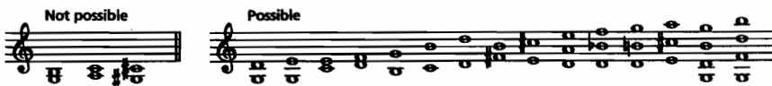

*เครดิต: Adler, Ch. 2, Example 2-7. ใช้แยกคอร์ดที่บรรเลงพร้อมกันได้จริงออกจากคอร์ดที่ต้อง arpeggiate หรือปรับเป็น divisi*

หลักเกณฑ์การตัดสินใจสำหรับงานในสัปดาห์นี้มีดังนี้

- double stop ที่ประกอบด้วยสายเปล่าหนึ่งหรือสองเสียง มักได้รับความช่วยเหลือจาก resonance แต่ยังจำเป็นต้องตรวจสอบว่า pitch และตำแหน่งนิ้วของทั้งสองเสียงไม่ขัดแย้งกัน
- triple stop ต้องการแรงกดของคันชักที่มากขึ้น และการ attack พร้อมกันของทั้งสามเสียงมักทำได้ชัดเจนก็ต่อเมื่ออยู่ในระดับความดังตั้งแต่ `mf` ขึ้นไป
- quadruple stop ควรได้รับการพิจารณาว่าจะปรากฏเป็นเสียง arpeggiate มิใช่เสียงที่ sustain พร้อมกันทั้งสี่เสียงดังเช่นเครื่องดนตรีประเภทคีย์บอร์ด
- คอร์ดที่มีความดังเบาหรือคอร์ดที่ต้องการความต่อเนื่องของเสียง มักเหมาะสมกับการใช้คำสั่ง `divisi` มากกว่า เนื่องจากผู้บรรเลงสองคนต่อหนึ่ง stand สามารถแบ่งบรรเลงเสียงบนและเสียงล่างได้

### Divisi

`divisi` เป็นคำสั่งให้ผู้บรรเลงในส่วนเดียวกันแบ่งกันบรรเลงโน้ตที่ต่างกัน ในขณะที่ `non div.` เป็นคำสั่งยกเลิกการแบ่งดังกล่าว และให้ผู้บรรเลงกลับไปบรรเลง double stop หรือ chord ตามที่บันทึกไว้ทั้งหมด การละเว้นไม่ระบุคำสั่งดังกล่าวทำให้ผู้บรรเลงต้องคาดเดาเจตนาของผู้เรียบเรียงเอง ซึ่งผลลัพธ์ที่ได้อาจคลาดเคลื่อนไปจากที่ตั้งใจไว้

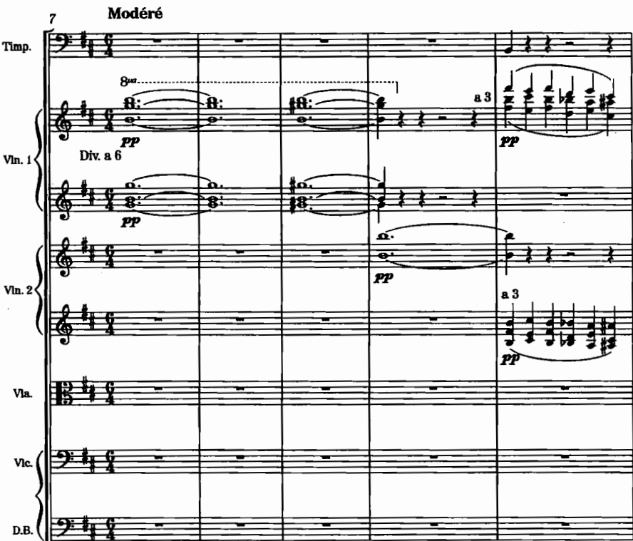

*เครดิต: Adler, Ch. 2, Example 2-11, Debussy, **Nocturnes**, “Nuages,” mm. 7–15. สังเกตว่าการแบ่งเสียงเปลี่ยนความหนาแน่นและความอ่านง่ายของพาร์ตอย่างไร*

### แบบฝึก 3 — คอร์ดเดียว สามวิธี

ให้ผู้เรียนเลือกคอร์ดสี่เสียงหนึ่งคอร์ด แล้วบันทึกออกมาสามฉบับ ดังนี้

1. ฉบับที่ 1 ใช้คำสั่ง `non div.` ให้ผู้บรรเลงแต่ละคนบรรเลง double stop ตามความเหมาะสม
2. ฉบับที่ 2 ใช้คำสั่ง `divisi` แบ่งเป็นสองคู่เสียง เพื่อรักษาความชัดเจนของแต่ละแนว
3. ฉบับที่ 3 บันทึกเป็น arpeggiated chord โดยระบุจังหวะและทิศทางของการไล่เสียงอย่างชัดเจน

ให้เพื่อนร่วมชั้นอ่านเฉพาะพาร์ตแล้วตอบว่าสามารถเข้าใจได้หรือไม่ว่าเสียงใดอยู่ตำแหน่งบน เสียงใดอยู่ตำแหน่งล่าง และควรกลับมาบรรเลงรวมเป็น `unisoni` ณ ตำแหน่งใด

## 4. Vibrato, non vibrato, glissando และ portamento

### Vibrato และ non vibrato

Rabson อธิบายว่านักดนตรีเครื่องสาย (string players) มักใช้ vibrato เป็นส่วนหนึ่งของลักษณะเสียงตามปกติอยู่แล้ว แม้ผู้เรียบเรียงจะมิได้ระบุคำสั่งไว้ก็ตาม หากต้องการเสียงที่มีลักษณะขาวหรือซีดกว่าปกติ ผู้เรียบเรียงจึงจำเป็นต้องระบุ `non vibrato` หรือ `senza vibrato` ไว้อย่างชัดเจน และควรพิจารณาด้วยว่าแนวอื่นภายใน texture เดียวกันมี vibrato หรือไม่ เนื่องจากความแตกต่างของ vibrato ระหว่างแนวจะทำให้แนวหนึ่งโดดเด่นขึ้นมาจากแนวอื่นโดยไม่ได้ตั้งใจ

### Glissando และ portamento

Adler จำแนก glissando ซึ่งมีเจตนาให้ผู้ฟังรับรู้การเคลื่อนผ่าน pitch หลายค่าอย่างชัดเจน ออกจาก portamento ซึ่งเป็นการเชื่อมเสียงอย่างเป็นธรรมชาติ และมักปรากฏใน expressive melody มากกว่า ทั้งนี้ เมื่อใช้ glissando ข้ามสาย การเคลื่อนที่ของมือจำเป็นต้องหยุดชะงักหรือเปลี่ยนสายในระหว่างทาง จึงมิใช่ continuous glissando ในความหมายเดียวกับการเลื่อนเสียงบนสายเดียวกันตลอดทั้งช่วง

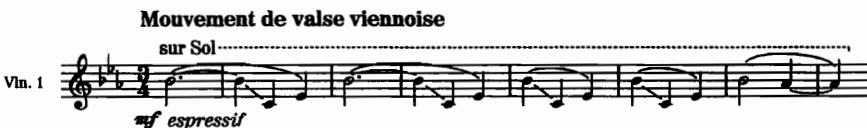

*เครดิต: Adler, Ch. 2, Example 2-14, Ravel, **La Valse**, at 30. ฟังว่าการเลื่อนเสียงทำหน้าที่เป็นสีสันของทั้งกลุ่ม มิใช่เพียง effect เดี่ยว*

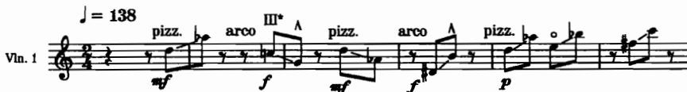

*เครดิต: Adler, Ch. 2, Example 2-15, Bartók, **Music for Strings, Percussion and Celesta**, second movement, 1 m. before 170. เปรียบเทียบความต่อเนื่องของเสียงกับการเปลี่ยนสาย*

### แบบฝึก 4 — แยกคำสั่งจากเป้าหมายเสียง

ให้ผู้เรียนบันทึกทำนองเดียวกันความยาว 4 ห้อง ออกมาสามรูปแบบ ดังนี้

- รูปแบบที่ 1 ใช้ `vibrato` เพื่อให้โน้ตที่มีค่ายาวปรากฏความมีชีวิตชีวาและความเข้มข้นของเสียง
- รูปแบบที่ 2 ใช้ `non vibrato` เพื่อให้สีเสียงมีลักษณะซีดหรือห่าง หรือเพื่อให้แนวอื่นโดดเด่นกว่า
- รูปแบบที่ 3 ใช้ `portamento` หรือ `gliss.` เพื่อเชื่อมโยงระหว่าง pitch สองจุด โดยต้องระบุด้วยว่าต้องการให้การเลื่อนเสียงปรากฏชัดเจนมากน้อยเพียงใด

ห้ามใช้คำสั่งหลายคำพร้อมกันโดยไม่อธิบายว่าคำสั่งใดเป็นเป้าหมายหลัก จากนั้นให้เพื่อนร่วมชั้นอ่านสกอร์แล้วประเมินว่าคาดว่าจะได้ยินเสียงในลักษณะเดียวกันกับที่ตั้งใจไว้หรือไม่

## 5. คันชัก: การเคลื่อนที่ที่กลายเป็น articulation

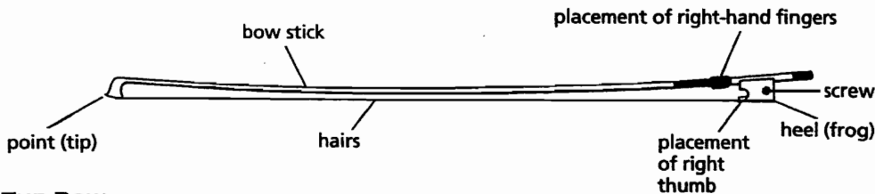

*เครดิต: Adler, Ch. 2, “The Bow”. ใช้ชี้ว่าตำแหน่งและแรงของมือขวาเกี่ยวข้องกับน้ำหนักเสียงอย่างไร*

การเปลี่ยนทิศทางคันชักมิได้เป็นเพียงเครื่องหมายบนหน้าโน้ตเท่านั้น หากแต่เป็นการจัดวางแรง น้ำหนัก และจังหวะเวลาที่ผู้บรรเลงใช้ในการเริ่มต้นเสียงแต่ละครั้ง ผู้เรียบเรียงจึงจำเป็นต้องแยกแยะประเด็นดังกล่าวออกเป็นอย่างน้อยสามระดับ ดังนี้

1. **ระดับที่หนึ่ง สิ่งที่บันทึกไว้บนโน้ต** — note value, slur, staccato, tenuto, accent, dynamics
2. **ระดับที่สอง สิ่งที่ผู้บรรเลงกระทำ** — down-bow, up-bow, lift, retake, การบรรเลงใกล้บริเวณ frog หรือ tip
3. **ระดับที่สาม สิ่งที่ผู้ฟังรับรู้** — น้ำหนักของ attack, ความต่อเนื่องของเสียง, ความชัดเจนของจังหวะ และทิศทางของวลีดนตรี

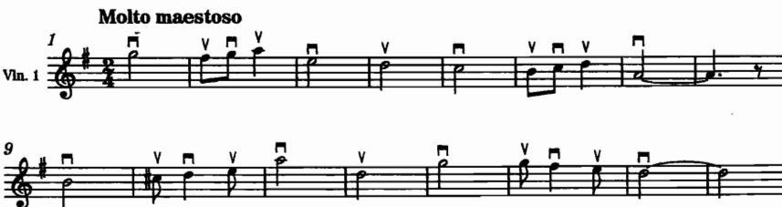

*เครดิต: Adler, Ch. 2, Example 2-18, Elgar, **Pomp and Circumstance No. 1**, trio. ฟังว่าการเปลี่ยนคันชักทุกตัวโน้ตไม่จำเป็นต้องฟังเป็นการสะดุด*

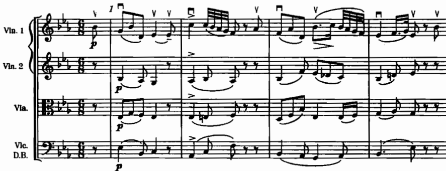

*เครดิต: Adler, Ch. 2, Example 2-19, Schubert, **Symphony No. 5**, second movement, mm. 1–8. นับจำนวนโน้ตที่ต้องอยู่ในคันชักเดียวและประเมินว่าพลังเสียงเพียงพอหรือไม่*

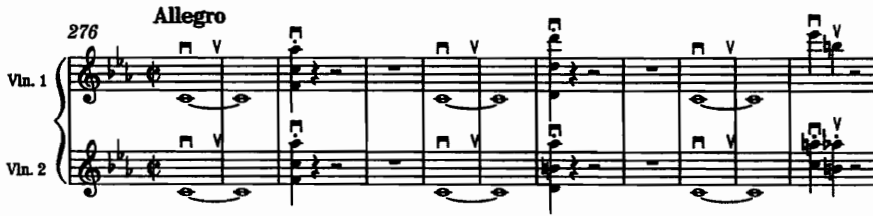

*เครดิต: Adler, Ch. 2, Example 2-20, Beethoven, **Coriolanus Overture**, mm. 276–286. สังเกตความสัมพันธ์ระหว่าง down-bow, accent และ triple stop*

Rabson เตือนว่า slur ของเครื่องลมกับ slur ของเครื่องสายมิได้ทำหน้าที่เดียวกัน กล่าวคือ ในเครื่องลม slur มักสื่อถึงวลีดนตรีหรือช่วงลมหายใจ ในขณะที่ในเครื่องสาย slur หมายถึงกลุ่มโน้ตที่บรรเลงในทิศทางคันชักเดียวกันเท่านั้น ดังนั้น การคัดลอก slur จากแนวเครื่องลมมาใช้กับแนวเครื่องสายโดยตรง อาจทำให้ผู้บรรเลงต้องลากคันชักเกินความยาวที่มีอยู่จริง

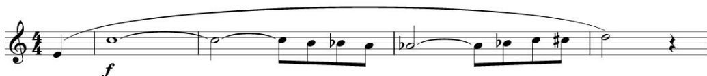

*เครดิต: Rabson, Ch. 3, Fig. 3.1–3.2. เปรียบเทียบความหมายของ slur กับการใช้ dynamics เพื่อรักษาความต่อเนื่องของวลี*

### หลักใช้ dynamics ก่อนบังคับ bowing

สำหรับผู้เริ่มต้นเรียบเรียง ควรบันทึก dynamic shape ให้ชัดเจนก่อนที่จะกำหนดรายละเอียดของ bowing อย่างละเอียด หากต้องการให้ผู้บรรเลงมีอิสระในการเลือก bowing ด้วยตนเอง ให้ระบุเพียง phrase จุดสูงสุด (high point) และ dynamic แล้วปรึกษาหารือกับผู้บรรเลงหลัก ส่วน passage ที่ต้องการจังหวะกระแทกเฉพาะจุด ควรระบุ down-bow หรือ articulation ที่จำเป็นไว้อย่างมีเหตุผลรองรับ

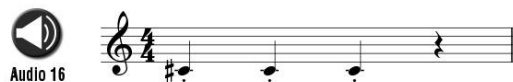

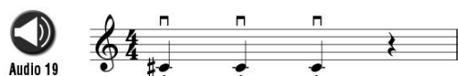

*เครดิตภาพทั้งสอง: Rabson, Ch. 3, Figs. 3.3 และ 3.6. ใช้เปรียบเทียบ staccato แบบคลาสสิกกับพลังของ down-bow ซ้ำใน Stravinsky, **The Rite of Spring**, “The Augurs of Spring, Dances of the Young Girls”*

*เครดิต: Rabson, Ch. 3, Fig. 3.20. สังเกตว่าการเขียน dynamics ที่ชัดเจนอาจช่วยให้ผู้บรรเลงตัดสินใจเรื่อง bowing ได้ดีกว่าการเขียนเครื่องหมายคันชักกำกับทุกตัวโน้ต*

## 6. ช่วงเสียงไม่เท่ากับช่วงที่เหมาะกับหน้าที่

การเลือกใช้ช่วงเสียงควรตั้งอยู่บนคำถามสามระดับ ดังนี้

- **กระทำได้หรือไม่**: ตรวจสอบสาย ตำแหน่งนิ้ว การเปลี่ยนตำแหน่งมือ และข้อจำกัดของคันชัก
- **กระทำได้อย่างต่อเนื่องหรือไม่**: ตรวจสอบ tempo, dynamic, ระยะเวลาที่ใช้ในการเปลี่ยนสาย และช่วงพักของมือ
- **เหมาะสมกับบทบาทหรือไม่**: ตรวจสอบว่าสีเสียงและความดังที่ได้เหมาะสมกับหน้าที่ของแนวหลัก แนวรอง หรือพื้นเสียงหรือไม่

### ตารางวินิจฉัย passage

| สิ่งที่เห็นบนสกอร์ | คำถามสำหรับผู้เรียบเรียง | วิธีตรวจต่อ |
|---|---|---|
| กระโดดข้าม octave มาก | ต้องข้ามสายหรือเลื่อนตำแหน่งหรือไม่ | ลองเขียนสาย/ตำแหน่ง หรือถามผู้บรรเลง |
| double stop เร็วและเบา | ต้องกดสองนิ้วพร้อมกันหรือควรใช้ `divisi` | ทำฉบับเปรียบเทียบและฟัง attack |
| triple stop ยาวที่ `p` | ผู้บรรเลงจะ sustain สามเสียงหรือ arpeggiate | ตรวจร่วมกับผู้บรรเลงและลดจำนวนเสียงหากจำเป็น |
| slur ยาวหลายห้อง | คันชักยาวพอหรือไม่ และ dynamic shape ทำได้หรือไม่ | แบ่ง slur หรือให้ผู้บรรเลงเสนอทางเลือก |
| melody อยู่ต่ำใน cello/viola | มีแนวอื่นกลบหรือไม่ | ฟังในเนื้อเสียงเต็มและปรับ register |
| passage สูงของ violin | ต้องการความสว่างหรือความเครียดของ register | เปรียบเทียบตำแหน่งสายและ vibrato |

## 7. บทเพลงสำหรับ further study จาก source

รายการต่อไปนี้คัดสรรจากตัวอย่างใน Adler และ Rabson ให้ผู้เรียนเลือกศึกษาอย่างน้อย 4 ชิ้น โดยต้องมีอย่างน้อย 1 ชิ้นที่อ่านสกอร์ควบคู่กับการฟังบันทึกเสียง

| ประเด็น | บทเพลง/ช่วงที่ระบุใน source | สิ่งที่ต้องฟังหรืออ่าน | แหล่ง |
|---|---|---|---|
| Divisi และการจัดเสียงสาย | Debussy, *Nocturnes*, “Nuages,” mm. 7–15 | ดูว่า `divisi` ช่วยให้ chordal texture โปร่งขึ้นอย่างไร | Adler, Ch. 2, Ex. 2-11 |
| Glissando | Ravel, *La Valse*, at 30 | ฟังการเลื่อนเสียงเป็นสีสันของกลุ่ม ไม่ใช่โน้ตเดี่ยว | Adler, Ch. 2, Ex. 2-14 |
| Glissando หลายสาย | Bartók, *Music for Strings, Percussion and Celesta*, second movement, 1 m. before 170 | สังเกตการเปลี่ยนสายและความต่อเนื่องของ gesture | Adler, Ch. 2, Ex. 2-15 |
| Fingered glissando | Mahler, *Symphony No. 7*, second movement, 2 mm. before 92 | เปรียบเทียบการเขียน pitch ทุกตัวกับ glissando ที่ไม่เขียนทุก pitch | Adler, Ch. 2, Ex. 2-17 |
| Non legato | Elgar, *Pomp and Circumstance No. 1*, trio | ฟังการเปลี่ยนคันชักโดยไม่ทำให้วลีขาด | Adler, Ch. 2, Ex. 2-18 |
| Legato และการจัดคันชัก | Schubert, *Symphony No. 5*, second movement, mm. 1–8 | ตรวจจำนวนโน้ตในคันชักเดียวและการประคองวลี | Adler, Ch. 2, Ex. 2-19 |
| Down-bow และ triple stop | Beethoven, *Coriolanus Overture*, mm. 276–286 | สังเกตการวาง accent กับแรงของคันชัก | Adler, Ch. 2, Ex. 2-20 |
| Bowing ที่เร็วและ register | Mendelssohn, *Symphony No. 4*, first movement, mm. 378–388 และ 461–464 | เปรียบเทียบจำนวนโน้ตต่อคันชักเมื่อ dynamic ต่างกัน | Adler, Ch. 2, Ex. 2-21–2-22 |
| ช่วงเสียงและสีสาย | Mimi Rabson, “King Street Tango” แบบเล่นสามสายเทียบกับ `sul G` | ฟังความแตกต่างของ resonance และ timbre เมื่อใช้สายต่างกัน | Rabson, Ch. 2, Figs. 2.15–2.16 |
| การเปลี่ยนสายอย่างราบรื่น | J. S. Bach, *Partita No. 3 in E major*, “Preludio” | ทำเครื่องหมายช่วงกระโดดที่ต้องข้ามสายและคาดการณ์ความยากในการทำ legato | Rabson, Ch. 2, “Large Interval Skips” |
| Pizzicato หลายเสียง | Ravel, *String Quartet*, second movement | ฟังการแบ่ง complex lines ระหว่างผู้บรรเลงและการใช้ chord ตอน peak | Rabson, Ch. 4, “Double, Triple, Quadruple Stops” |
| Down-bow ซ้ำเพื่อสร้างแรง | Stravinsky, *The Rite of Spring*, “The Augurs of Spring, Dances of the Young Girls” | จดว่าการทำ down-bow ซ้ำเปลี่ยน gesture ทางจังหวะอย่างไร | Rabson, Ch. 3, Fig. 3.6 |

### แบบบันทึกการฟัง

สำหรับผลงานแต่ละชิ้น ให้บันทึกประเด็นต่อไปนี้

1. ชื่อผลงาน ท่อน (movement) และหมายเลขห้อง/ตำแหน่งอ้างอิงตาม source
2. เครื่องดนตรีใดถือแนวหลัก และเครื่องดนตรีใดทำหน้าที่สนับสนุน
3. เทคนิคเครื่องสายที่ปรากฏในสกอร์
4. สิ่งที่ปรากฏจริงจากการฟังบันทึกเสียง ซึ่งไม่อาจคาดเดาได้จากการอ่านโน้ตเพียงอย่างเดียว
5. แนวทางการปรับแก้หนึ่งประเด็นที่จะนำไปทดลองใช้กับแบบฝึกของตนเอง

## 8. กิจกรรมในชั้นเรียน 120 นาที

1. **นาทีที่ 0–20 — ทบทวนภาพรวมและการตั้งเสียง**: ใช้ภาพตระกูลเครื่องสายและภาพสายเปล่าประกอบการอธิบาย ให้ผู้เรียนโยงความสัมพันธ์ระหว่าง pitch, string และ register
2. **นาทีที่ 20–40 — ฟังและอ่านสกอร์**: เปรียบเทียบ Debussy “Nuages”, Ravel *La Valse* และ Schubert *Symphony No. 5* โดยแบ่งกลุ่มผู้เรียนตามประเด็น divisi, glissando และ legato
3. **นาทีที่ 40–60 — สาธิตกลไกการบรรเลง**: สาธิตหรือรับชมวิดีโอผู้บรรเลงสาธิตการวางนิ้ว การเปลี่ยนสาย การบรรเลง double stop และการเปลี่ยนคันชัก จากนั้นให้ผู้เรียนทำเครื่องหมายจุดเสี่ยงในสกอร์ของตนเอง
4. **นาทีที่ 60–80 — ทดลองเรียบเรียง**: ผู้เรียนบันทึกทำนองความยาว 4–8 ห้องในสองช่วงเสียง พร้อมทางเลือกระหว่างสายเปล่ากับนิ้วกด และระบุประเด็นคำถามที่ต้องสอบถามผู้บรรเลง
5. **นาทีที่ 80–105 — เวิร์กชอป multiple stops และ bowing**: ปรับคอร์ดหนึ่งคอร์ดให้เป็นฉบับ non-divisi, divisi และ arpeggiated ตามลำดับ แล้วให้เพื่อนร่วมชั้นอ่านเฉพาะพาร์ต
6. **นาทีที่ 105–120 — วิจารณ์และสรุปบทเรียน**: ผู้เรียนแต่ละคนเลือกนำเสนอปัญหาหนึ่งข้อที่ได้แก้ไขแล้ว พร้อมอธิบายหลักฐานอ้างอิงจาก source และระบุประเด็นที่จะตรวจสอบเพิ่มเติมในสัปดาห์ที่ 3

### ผลลัพธ์ที่ควรได้เมื่อจบคาบ

- แบบฝึกทำนองในสองช่วงเสียง จำนวน 1 ชุด
- แบบฝึกคอร์ดสามรูปแบบ จำนวน 1 ชุด
- บันทึกการฟังอย่างน้อย 1 บทเพลง
- รายการคำถามสำหรับผู้บรรเลงเครื่องสายหรือผู้สอน

## 9. ใบงานในชั้นเรียน

### ใบงาน A — แผนที่ทางกายภาพของ passage

| ห้อง | เครื่อง/สายที่คาดว่าจะใช้ | ตำแหน่งหรือการเปลี่ยนสาย | เทคนิคคันชัก | ความเสี่ยง | วิธีตรวจ |
|---:|---|---|---|---|---|
| 1 |  |  |  |  |  |
| 2 |  |  |  |  |  |
| 3 |  |  |  |  |  |
| 4 |  |  |  |  |  |

### ใบงาน B — ตรวจ multiple stops

ตอบคำถามต่อไปนี้ใต้สกอร์

- ต้องการให้ทุกเสียงเกิดขึ้นพร้อมกัน หรือยอมรับการ arpeggiate ได้
- มีสายเปล่าที่ช่วยให้เสียงกังวานหรือทำให้การเปลี่ยนสายลำบากหรือไม่
- ควรใช้ `divisi`, `div. a 3`, `div. a 4` หรือ `non div.`
- dynamic และ tempo ที่กำหนดสอดคล้องกับความยากทางกายภาพหรือไม่

### ใบงาน C — เพื่อนอ่านพาร์ต

ให้เพื่อนอ่านเฉพาะพาร์ตแล้วตอบคำถามต่อไปนี้

1. ทราบหรือไม่ว่าจุดเริ่มต้นและจุดสิ้นสุดของการบรรเลงอยู่ที่ใด
2. เข้าใจหรือไม่ว่าตำแหน่งที่เปลี่ยนจาก `pizz.` กลับเป็น `arco` อยู่ที่ใด
3. อ่าน `divisi` และ `unisoni` ได้หรือไม่
4. คาดเดา bowing ได้ตรงกับเจตนาของผู้เรียบเรียงหรือไม่
5. มีเครื่องหมายใดที่ควรปรับปรุงใหม่ เพื่อให้ผู้บรรเลงไม่ต้องสอบถามซ้ำ

## 10. งานศึกษาด้วยตนเอง 6 ชั่วโมง

การจัดสรรเวลาโดยประมาณมีดังนี้

- 1.5 ชั่วโมง — ฟังและอ่านสกอร์ตามตาราง further study อย่างน้อย 4 ชิ้น
- 1.5 ชั่วโมง — เรียบเรียงและปรับแก้ passage ในสองช่วงเสียง พร้อมจัดทำ alternate versions
- 1 ชั่วโมง — ฝึกอ่านสายเปล่า กุญแจเสียง และการทดเสียงของดับเบิลเบส
- 1 ชั่วโมง — ทำ multiple-stop/divisi worksheet และตรวจสอบร่วมกับเพื่อนหรือผู้บรรเลง
- 1 ชั่วโมง — ปรับโน้ต ใส่ dynamic, articulation, bowing ที่จำเป็น และบันทึกเวอร์ชันก่อน–หลัง

หลักฐานที่ควรเก็บไว้มีดังนี้

- PDF หรือภาพสกอร์ฉบับแรกและฉบับแก้
- บันทึกการฟังพร้อมหมายเลขห้อง
- รายการคำถามที่ถามผู้บรรเลง/ผู้สอน
- เสียงตัวอย่างถ้ามี โดยระบุว่า playback มิใช่หลักฐานแทนการอ่านสกอร์จริง

## 11. จุดเชื่อมไปสัปดาห์ที่ 3

เนื้อหาสัปดาห์ที่ 2 มุ่งเน้นประเด็น “เครื่องสายแต่ละชนิดทำงานอย่างไร” ในขณะที่สัปดาห์ที่ 3 จะขยายขอบเขตไปสู่ประเด็น “กลุ่มเครื่องสายทำงานร่วมกันอย่างไร” โดยเพิ่มเนื้อหาเรื่อง harmonics, mutes, pizzicato, tremolo, ponticello, chops และ harp ดังนั้น ผู้เรียนควรเก็บรักษา passage ที่ยังมีปัญหาไว้เพื่อพัฒนาต่อในสัปดาห์ถัดไป โดยเฉพาะอย่างยิ่งในประเด็นดังต่อไปนี้

- ทำนองที่ต้องการสีเสียงจาก harmonic หรือ sul ponticello
- chord ที่ต้องเลือกระหว่าง divisi กับ multiple stop
- pad ที่ต้องเปลี่ยนคันชักแบบ staggered bowing
- passage ที่ต้องผสม string section กับ harp

## แหล่งอ้างอิง

- Samuel Adler, *The Study of Orchestration*, 3rd ed., Ch. 2 “Bowed String Instruments” และ Ch. 3 “Individual Bowed String Instruments”.
- Mimi Rabson, *Arranging for Strings*, Ch. 1 “String Player Perspectives”, Ch. 2 “Tuning, Range, and Timbre”, Ch. 3 “Basic Bowings and Articulations”.
- Thomas Goss, *100 Orchestration Tips*, tips 75, 82–88 ตาม syllabus.
- Thomas Goss, *100 More Orchestration Tips*, tips 1, 5–7, 11–12, 14, 21, 27 ตาม syllabus.
- Elaine Gould, *Behind Bars*, Part 1 “General Conventions” และ Part 2 “Strings”/“Dynamics and Articulation” ตาม syllabus.
