# สัปดาห์ที่ 3 — เครื่องสาย 2: เทคนิคและการเรียบเรียงทั้งกลุ่ม

## คำถามนำ

หากสัปดาห์ที่ 2 ตั้งคำถามว่า “เครื่องสายแต่ละชนิดทำงานอย่างไร” สัปดาห์นี้จะตั้งคำถามต่อเนื่องว่า **กลุ่มเครื่องสายทำงานร่วมกันอย่างไร** และเทคนิคพิเศษแต่ละประเภทเปลี่ยนแปลง “หน้าที่ของเสียง” ภายใน texture อย่างไร

ความรู้เพียงว่า harmonics, mute, pizzicato, tremolo หรือ ponticello “กระทำได้” ยังไม่เพียงพอต่อการเรียบเรียงที่มีคุณภาพ ผู้เรียบเรียงจำเป็นต้องตัดสินใจว่าเทคนิคดังกล่าวทำให้แนวเสียงนั้นกลายเป็นแนวหน้า แนวกลาง หรือพื้นหลัง แล้วจึงเลือกวิธีบันทึกโน้ตและกำหนดระยะเวลาเปลี่ยนเทคนิคให้สอดคล้องกับสิ่งที่ผู้บรรเลงสามารถกระทำได้จริง

## ขอบเขตตามประมวลรายวิชา

สัปดาห์นี้ครอบคลุมประเด็นดังต่อไปนี้

- เทคนิคฮาร์โมนิกธรรมชาติ (natural harmonics) และฮาร์โมนิกประดิษฐ์ (artificial harmonics)
- เทคนิคมิวต์ (mute / con sordino)
- เทคนิคพิซซิคาโต รวมถึงพิซซิคาโตแบบบาร์ต็อก (Bartók / snap pizzicato)
- เทคนิคเทรโมโล (bowed tremolo และ fingered tremolo)
- เทคนิคซุลปอนติเชลโล (sul ponticello) ซุลทาสโต (sul tasto) และเทคนิคชอป (chops)
- เทคนิคเครื่องสายร่วมสมัย (contemporary string techniques)
- ความเป็นเอกเทศของแต่ละแนวภายในกลุ่มเครื่องสาย
- การจัดระนาบหน้า–กลาง–หลัง (foreground–middleground–background)
- ฮาร์ปและเครื่องดีด: คันเหยียบ กลิสซานโด และการซ้ำแนวกับเครื่องสาย

คำถามหลักตามประมวลรายวิชาคือ **การเรียบเรียงแบบฝึกเทคนิคเครื่องสาย 1 ชิ้น สำหรับกลุ่มเครื่องสายพร้อมฮาร์ป โดยระบุระนาบเสียงอย่างชัดเจน**

## เมื่อจบสัปดาห์นี้ ผู้เรียนจะสามารถ

1. จำแนกความแตกต่างระหว่าง natural harmonics กับ artificial harmonics และเลือกวิธีบันทึกโน้ตที่สื่อความหมายทั้ง pitch ที่ต้องการและวิธีการผลิตเสียง
2. กำหนดระยะเวลาเปลี่ยนระหว่าง `arco` กับ `pizz.`, `con sordino` กับ `senza sordino` และการกลับสู่ `normale` หลังเทคนิคพิเศษได้อย่างมีเหตุผลรองรับ
3. อธิบายหน้าที่ของ tremolo, sul ponticello, sul tasto, col legno และ chops ในฐานะ “สีสันของ texture” มิใช่เพียงรายการชื่อ effect
4. จัดวางแนวเครื่องสายให้มีระนาบหน้า–กลาง–หลัง และระบุได้ว่าแนวใดถือทำนอง แนวใดทำหน้าที่รองรับ และแนวใดเป็นพื้นเสียง
5. เรียบเรียงส่วนฮาร์ปความยาวสั้น ๆ โดยระบุ pedal setting เบื้องต้น และอธิบายหลักการซ้ำแนว (doubling) กับเครื่องสายตามแนวทางของ Ludwin
6. จัดส่งแบบฝึกเทคนิคชิ้นที่ 1 สำหรับกลุ่มเครื่องสายพร้อมฮาร์ป พร้อมตารางเทคนิคและแผนผังระนาบเสียงประกอบ

## คำศัพท์สำคัญ

| คำศัพท์ | ความหมายสั้น ๆ สำหรับงานสัปดาห์นี้ |
|---|---|
| Natural harmonic | แตะสายเปล่าเบา ๆ ที่ node เพื่อดึง partial ออกมา |
| Artificial harmonic | กด pitch พื้นด้วยนิ้วหนึ่ง แล้วแตะ node (มักคู่ 4) ด้วยนิ้วอีกนิ้ว |
| Con sordino / Senza sordino | ใส่ / ถอดมิวต์บนสะพานเสียง |
| Pizz. / Arco | ดีดสาย / กลับไปใช้คันชัก |
| Snap / Bartók pizz. | ดีดแรงจนสายกระแทก fingerboard |
| Bowed tremolo | สลับทิศคันชักเร็วมากบน pitch เดียว |
| Fingered tremolo | สลับ pitch สองตัวเร็ว ๆ (คล้าย trill กว้าง) |
| Sul ponticello | เล่นใกล้สะพานเสียง เสียงคม มี partial เด่น |
| Sul tasto | เล่นเหนือ fingerboard เสียงลม/พร่า |
| Col legno tratto / battuto | ลาก / ตีสายด้วยไม้ของคันชัก |
| Chops | เทคนิคคันชักแบบ percussive สำหรับจังหวะ (นอก pedagogy คลาสสิกมาตรฐาน) |
| Foreground / Middleground / Background | ระนาบหน้าที่ของแนวใน texture |
| Pedal setting (harp) | ตำแหน่งคันเหยียบที่กำหนด pitch ของสายทั้งชุด |

## 1. จากเทคนิคเดี่ยวสู่ “หน้าที่ของเสียง”

เนื้อหาสัปดาห์ที่ 2 ฝึกให้มองเครื่องสายในฐานะระบบทางกายภาพ ส่วนสัปดาห์นี้ขยับไปสู่คำถามว่า **เทคนิคที่เลือกใช้เปลี่ยนแปลงบทบาทของแนวภายในกลุ่มหรือไม่**

พึงตั้งคำถามสามระดับต่อไปนี้กับทุกเทคนิคที่เลือกใช้

1. **ส่งผลอย่างไรต่อ spectrum และ attack** — ทำให้เสียงใสขึ้น คมขึ้น พร่าลง หรือสั้นลง
2. **ส่งผลอย่างไรต่อความต่อเนื่องของเสียง** — sustain ได้นานหรือดับเร็ว จำเป็นต้องพักมือหรือเปลี่ยนอุปกรณ์หรือไม่
3. **ส่งผลอย่างไรต่อตำแหน่งใน texture** — ผลักแนวไปด้านหน้า ดึงไปด้านหลัง หรือทำให้แนวกลายเป็นสีพื้น

Rabson จำแนกเทคนิคมาตรฐาน (vibrato, sul tasto, pizzicato, tremolo, mute, harmonics) แยกออกจาก chops และ ponticello ในลักษณะที่ขยายไปสู่สีเสียงร่วมสมัยและแนวร็อก ในขณะที่ Adler รวม coloristic effects ไว้ในบทว่าด้วยเครื่องสาย ก่อนที่จะขยายไปสู่การเรียบเรียงทั้งกลุ่มในบทที่ 5

### หลักก่อนเขียน effect

- ควรกำหนดเป้าหมายด้านเสียงก่อนระบุชื่อเทคนิค เช่น “ต้องการพื้นเสียงที่บางและสั่นไหว” แล้วจึงเลือกระหว่าง bowed tremolo กับ fingered tremolo
- ทุกครั้งที่ใช้เทคนิคพิเศษ ต้องระบุตำแหน่งที่กลับสู่ `normale` / `naturale` / `arco` / `senza sordino` ไว้อย่างชัดเจน
- ไม่ควรเรียง effect ต่อเนื่องกันโดยไม่เผื่อเวลาสำหรับการเปลี่ยนตำแหน่งมือ เปลี่ยนคันชัก หรือถอดมิวต์

## 2. Tremolo, sul tasto, sul ponticello และ col legno

### Tremolo สองชนิด

Adler จำแนก tremolo ออกเป็นอย่างน้อยสองประเภทที่ผู้เรียบเรียงต้องไม่สับสนปะปนกัน ดังนี้

1. **Bowed tremolo** คือการสลับ up-bow และ down-bow อย่างรวดเร็วบน pitch เดียว มักใช้สร้างบรรยากาศหรือความรู้สึกเร่งรีบ
2. **Fingered tremolo** คือการสลับระหว่าง pitch สองตัว (โดยทั่วไปมีช่วงห่างตั้งแต่ second ขึ้นไป) อย่างรวดเร็ว มีลักษณะคล้าย trill ที่มีช่วงเสียงกว้างกว่าปกติ

ทั้งนี้ ต้องไม่สับสนกับสัญลักษณ์ที่มี slash ผ่านตัวโน้ตในลักษณะ **measured** ซึ่ง Adler เน้นย้ำว่ามิใช่ tremolo ในความหมายที่แท้จริง เนื่องจากมีค่าจังหวะที่นับได้แน่นอน

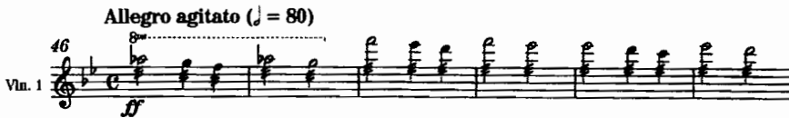

*เครดิต: Adler, Ch. 2, Example 2-46, Verdi, **Requiem**, “Dies irae,” mm. 46–51. ฟังว่า tremolo สร้างชั้นบรรยากาศอย่างไร ไม่ใช่เพียง “ทำให้ดังขึ้น”*

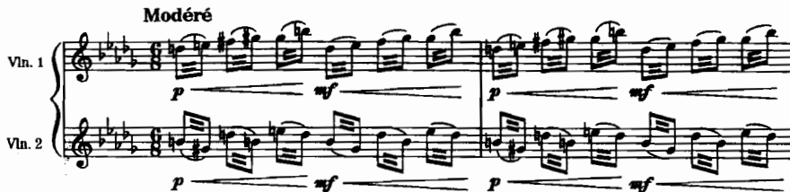

*เครดิต: Adler, Ch. 2, Example 2-47, Debussy, **La Mer**, first movement, at 8. ทำเครื่องหมาย pitch คู่ที่สลับกันและดูว่า slur บอก legato bow หรือไม่*

Rabson เสริมว่า bowed tremolo ให้ผลลัพธ์ที่ดีเมื่อมีผู้บรรเลงมากกว่าสองคนต่อแนว เนื่องจากจำนวนผู้บรรเลงที่มากขึ้นช่วยกลบความไม่สม่ำเสมอของแต่ละบุคคลได้

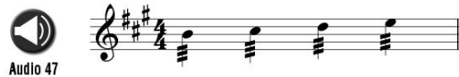

*เครดิต: Rabson, Ch. 4, Fig. 4.13. เปรียบเทียบการเขียน tremolo กับการคาดหวัง dynamic ที่ tip กับ mid-bow*

### Sul tasto และ sul ponticello

- **Sul tasto** คือการวางคันชักเหนือ fingerboard ให้เสียงมีลักษณะพร่ามัว คล้ายหมอกหรือเสียงจากระยะไกล (Rabson; Adler, Example 2-51)
- **Sul ponticello** คือการวางคันชักใกล้สะพานเสียงมาก ทำให้ partial เด่นชัดขึ้น เสียงมีลักษณะคมหรือแตกพร่า และอาจใช้ร่วมกับ tremolo ได้ (Adler, Example 2-52)
- Rabson ขยายความว่า ponticello ที่วางใกล้สะพานเสียงมากเป็นพิเศษสามารถให้สีเสียงคล้าย distortion และคำสั่ง `molto sul ponticello` จะดึง partial ออกมาได้มากยิ่งขึ้น โดยเฉพาะอย่างยิ่งเมื่อนิ้วซ้ายกดสายเบา

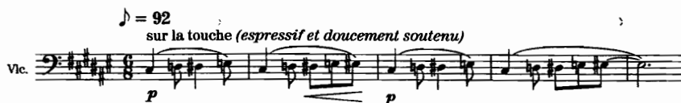

*เครดิต: Adler, Ch. 2, Example 2-51, Debussy, **Ibéria**, part 2, at 40. ฟังความพร่าของโทนเทียบกับตำแหน่งคันชักปกติ*

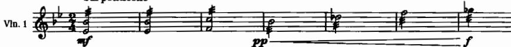

*เครดิต: Adler, Ch. 2, Example 2-52, Puccini, **Madama Butterfly**, Act I, 3 mm. before 38. สังเกตคำสั่ง sul ponticello และจินตนาการสีเสียงที่คมขึ้น*

*เครดิต: Rabson, Ch. 4, Fig. 4.3. ใช้เป็นตัวอย่างการเขียน sul tasto บนทำนองสั้น*

*เครดิต: Rabson, Ch. 5, Fig. 5.6 บริเวณ. เปรียบเทียบ ponticello แบบออร์เคสตรากับสีที่ Rabson เชื่อมกับ feedback/distortion*

### Col legno

Adler จำแนกเทคนิคนี้ออกเป็นสองประเภท ดังนี้

- **Col legno tratto** คือการลากส่วนไม้ของคันชักบนสาย ให้เสียงที่บางเบา มักใช้ร่วมกับ tremolo
- **Col legno battuto** คือการตีสายด้วยส่วนไม้ของคันชัก ให้เสียงสั้นและแห้ง คล้าย spiccato ที่มีลักษณะแห้งเป็นพิเศษ

ภายหลังการใช้เทคนิคเหล่านี้ ต้องระบุตำแหน่งกลับสู่ `normale` / `naturale` ไว้อย่างชัดเจนเสมอ

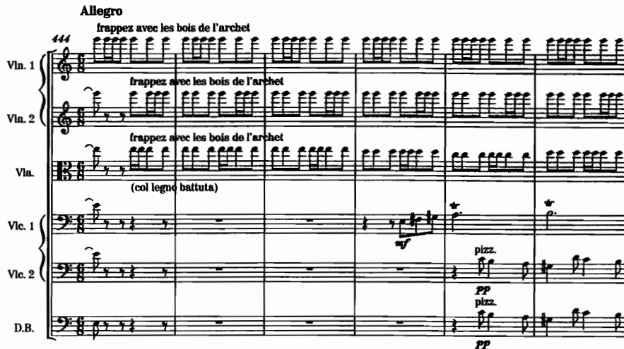

*เครดิต: Adler, Ch. 2, Example 2-54, Berlioz, **Symphonie fantastique**, fifth movement, mm. 444–455. ฟัง pitch definition ที่ลดลงและบทบาทแบบ percussive*

### แบบฝึก 1 — เทคนิคเดียวกัน สามหน้าที่

ให้ผู้เรียนเลือกทำนองหรือ pad ความยาว 4 ห้อง แล้วบันทึกออกมาสามฉบับ ดังนี้

1. ฉบับที่ 1 ใช้ bowed tremolo เพื่อเป็นพื้นหลังที่สั่นไหว
2. ฉบับที่ 2 ใช้ sul ponticello เพื่อผลักสีเสียงไปด้านหน้า แม้ในระดับ dynamic ที่ไม่สูงมากนัก
3. ฉบับที่ 3 ใช้ sul tasto เพื่อดึงแนวไปด้านหลังและเปิดพื้นที่ให้แนวอื่น

ให้บันทึกเหตุผลไว้ใต้สกอร์ว่าหน้าที่ของแนวเปลี่ยนแปลงไปอย่างไร โดยหลีกเลี่ยงคำตอบที่กำกวมเช่น “เสียงต่างกัน”

## 3. Pizzicato และ mute

### Pizzicato

Adler อธิบายขั้นตอนทางกายภาพว่า ผู้บรรเลงต้องเตรียมมือก่อนดีดสาย และต้องมีเวลาที่เพียงพอก่อนกลับไปใช้ `arco` โดยเฉพาะอย่างยิ่งการกลับไปจับคันชักที่ frog ซึ่งใช้เวลามากกว่าการเปลี่ยนจาก arco ไปเป็น pizz. ความหนาของสายและขนาดของเครื่องดนตรีล้วนส่งผลต่อความดังและระยะเวลา sustain โดยดับเบิลเบสสามารถ sustain ได้นานกว่าไวโอลินอย่างมีนัยสำคัญ

ประเด็นที่ต้องบันทึกไว้เสมอ มีดังนี้

- ใช้คำเต็มหรือคำย่อ `pizz.` และต้องระบุ `arco` เสมอเมื่อกลับไปใช้คันชัก
- หลีกเลี่ยงการสลับระหว่าง pizz. กับ arco โดยไม่เผื่อเวลาเตรียมตัว
- passage พิซซิคาโตที่ยาวและรวดเร็วอาจทำให้ผู้บรรเลงล้า จึงควรมี rest หรือสลับหน้าที่ระหว่างกลุ่มผู้บรรเลง
- คำสั่ง `l.v.` หรือ `let vibrate` ใช้เมื่อต้องการให้เสียงที่ดีดค้างอยู่นานที่สุดเท่าที่จะเป็นไปได้
- คอร์ด pizz. มักถูกบรรเลงแบบ arpeggiate จากเสียงต่ำขึ้นไปเสียงสูงโดยอัตโนมัติ เว้นแต่จะระบุ `non arpegg.` หรือกำหนดทิศทางด้วยลูกศรไว้เป็นอย่างอื่น

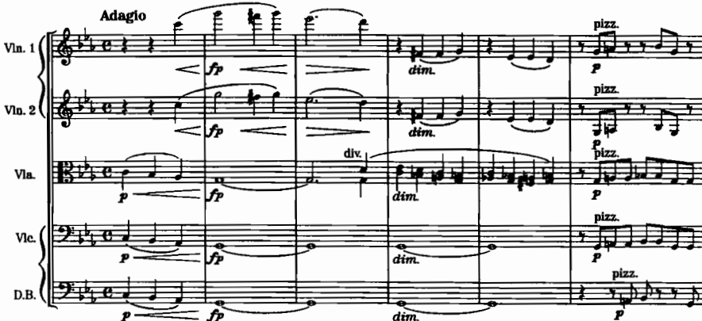

*เครดิต: Adler, Ch. 2, Example 2-55, Brahms, **Symphony No. 1**, fourth movement, mm. 1–17. ดูจังหวะเข้าของ pizz. และการเตรียม texture*

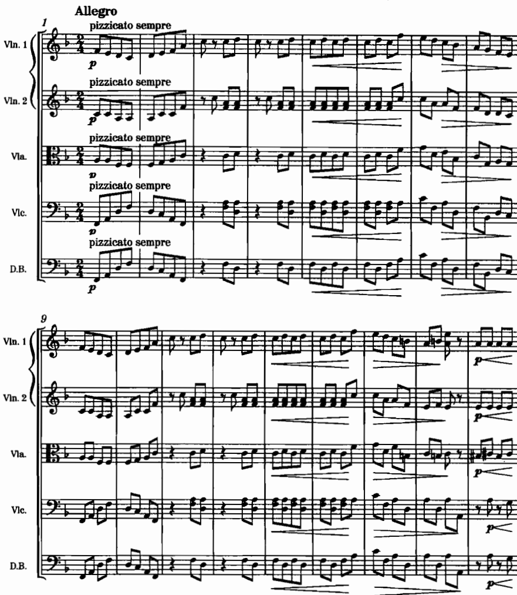

*เครดิต: Adler, Ch. 2, Example 2-61, Tchaikovsky, **Symphony No. 4**, third movement, mm. 1–17. ทำเครื่องหมายจุดพักที่ช่วยความทนทานของผู้เล่น*

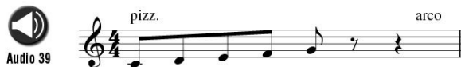

*เครดิต: Rabson, Ch. 4, Fig. 4.4. ใช้ตรวจว่ามี `arco` กลับชัดหรือไม่*

### Snap / Bartók pizzicato และ left-hand pizzicato

- **Snap / fingernail pizzicato** — Adler ระบุว่าเป็นนวัตกรรมของศตวรรษที่ 20 ที่เชื่อมโยงกับ Bartók โดย snap คือการดีดสายให้กระแทกกับ fingerboard
- Rabson ใช้คำเรียก Bartók pizzicato และเตือนว่าผู้บรรเลงอาจลังเลใจในการใช้เทคนิคนี้ เนื่องจากอาจทำให้สายหลุดจากการตั้งเสียงและกังวลเรื่องความเสียหายของเครื่องดนตรี จึงควรใช้เพื่อการเน้นเสียงเป็นหลัก มิใช่ใน passage ที่มีความเร็วสูง
- **Left-hand pizzicato** ใช้เครื่องหมาย `+` กำกับเหนือโน้ต และพบเห็นได้บ่อยกว่าในงาน chamber music หรือ solo มากกว่าในบท tutti

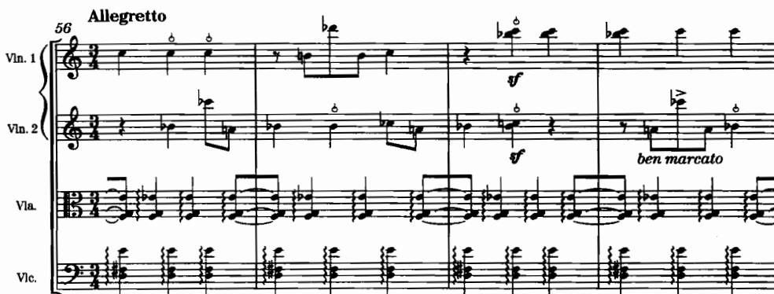

*เครดิต: Adler, Ch. 2, Example 2-58, Bartók, **String Quartet No. 4**, fourth movement, mm. 56–63. สังเกตสัญลักษณ์และจังหวะเน้น*

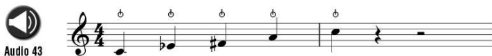

*เครดิต: Rabson, Ch. 4, Fig. 4.7. เปรียบเทียบสัญลักษณ์กับคำเตือนเรื่อง endurance และ intonation*

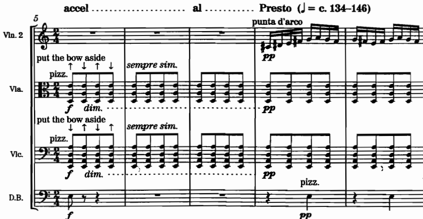

*เครดิต: Adler, Ch. 2, Example 2-60, Bartók, **Concerto for Orchestra**, fifth movement, mm. 5–9. ดูทิศทางการดีดคอร์ด*

### Mute

Adler อธิบายว่าคำสั่ง `con sordino` เป็นการติดตั้งมิวต์บนสะพานเสียง เพื่อดูดซับการสั่นสะเทือน ทำให้เสียงมีลักษณะนุ่มนวลและเรียบขึ้น อย่างไรก็ตาม **mute มิได้หมายความว่าเสียงจะต้องเบาเสมอไป** เนื่องจากช่วงเสียงดังแบบ muted ยังคงมีคุณภาพที่ตึงและถูกบีบ (constricted) แตกต่างจากเสียงแบบ open อย่างชัดเจน

Rabson อธิบายว่ามิวต์ทำหน้าที่ลดความถี่สูง ส่งผลให้โทนเสียงอุ่นขึ้นแต่มีความชัดเจนลดลง และต้องเผื่อเวลาสำหรับการติดตั้งหรือถอดมิวต์ไว้ด้วย (โดยประมาณไม่กี่วินาที) โดยเฉพาะอย่างยิ่งใน passage ที่มีความดังเบาและ texture ที่โปร่ง

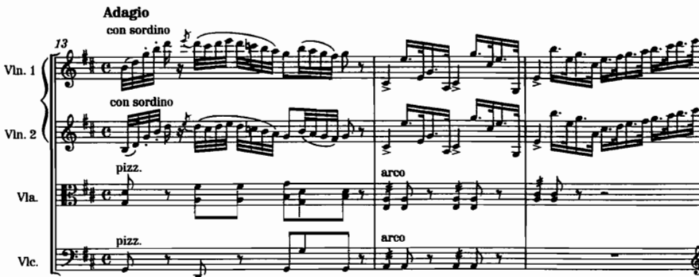

*เครดิต: Adler, Ch. 2, Example 2-63, Weber, **Oberon**, Overture, mm. 13–21. สังเกตจังหวะถอด mute ระหว่างเสียงยาวของแนวอื่น*

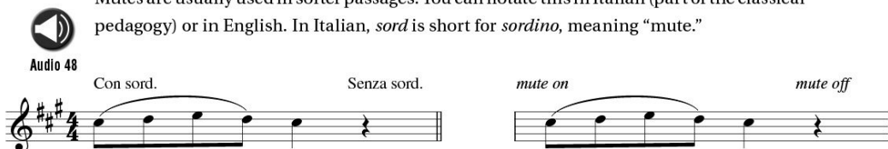

*เครดิต: Rabson, Ch. 4, Fig. 4.14. เปรียบเทียบการเขียนภาษาอิตาลีกับอังกฤษ*

### แบบฝึก 2 — ตารางเวลาเปลี่ยนเทคนิค

ให้บันทึก passage ความยาว 8 ห้องที่มีองค์ประกอบอย่างน้อยดังนี้

- pizz. แล้วกลับ arco
- con sordino แล้ว senza sordino
- หนึ่งจุดที่เป็น snap pizz. หรือ sul pont.

แล้วจัดทำตารางดังต่อไปนี้

| ห้อง | จาก | ไป | เวลาที่มี | ความเสี่ยง | ทางแก้ |
|---:|---|---|---|---|---|
|  |  |  |  |  |  |

## 4. Harmonics: natural และ artificial

### Natural harmonics

Adler อธิบายว่าการแตะสายเบา ๆ ที่ node เป็นวิธีแยก partial ออกจาก fundamental บนสายเปล่า โดย partial ลำดับที่ 1–6 สามารถใช้งานได้ดี และ partial ลำดับสูงยิ่งทำได้ง่ายขึ้นบนวิโอลา เชลโล และดับเบิลเบส เนื่องจากสายมีความยาวและความหนามากกว่า

รูปแบบการบันทึกโน้ตหลักมีสองวิธี ดังนี้

1. การใช้วงกลมเล็กกำกับเหนือ pitch ที่ต้องการให้ดังเป็นเสียง harmonic
2. การใช้โน้ต diamond กำกับตำแหน่ง node

จำเป็นต้องระบุสายที่ใช้ (เช่น `sul G`, `IV` ฯลฯ) เนื่องจาก pitch เดียวกันอาจเกิดขึ้นได้บนหลายสาย

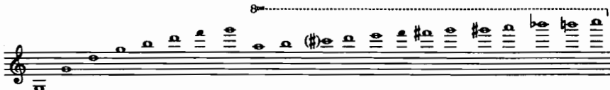

*เครดิต: Adler, Ch. 2, Example 2-67. ใช้เป็นแผนที่ partial ก่อนเลือก node*

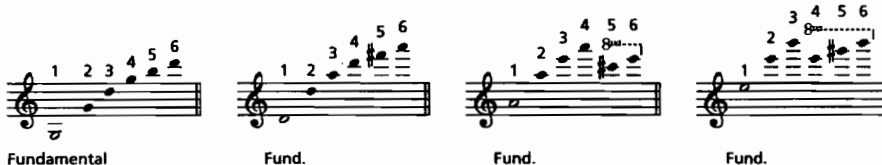

*เครดิต: Adler, Ch. 2, Example 2-68. ทำเครื่องหมาย partial ที่มั่นคงสำหรับงานออร์เคสตรา*

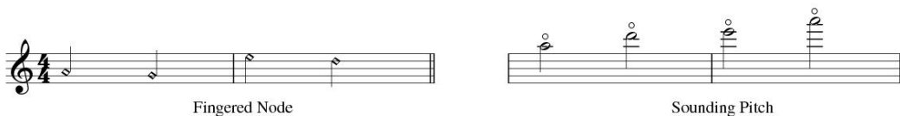

*เครดิต: Rabson, Ch. 4, Fig. 4.20. เปรียบเทียบ diamond กับวงกลม sounding pitch*

### Artificial harmonics

Adler แนะนำวิธีที่ใช้งานได้จริงในบริบทออร์เคสตรา คือ การหยุด pitch ด้วยนิ้วหนึ่ง แล้วแตะ node ที่ห่างออกไปเป็น**คู่สี่**ด้านบนด้วยนิ้วนางหรือนิ้วก้อย ผลลัพธ์ที่ได้คือ pitch ที่สูงกว่า stopped note อยู่สอง octave

- ไวโอลิน/วิโอลา: นิ้ว 1 หยุด นิ้ว 4 แตะ
- เชลโล: ใช้หัวแม่มือหยุด pitch และนิ้ว 3 หรือ 4 แตะ node — Goss ในข้อเสนอแนะที่ 93 เน้นย้ำว่าเชลโลมีช่วง artificial harmonics ที่ใช้งานได้กว้างและมีความชัดเจนเป็นพิเศษ
- ดับเบิลเบส: Adler ไม่แนะนำให้ใช้ artificial harmonics ในบริบทออร์เคสตรา เนื่องจากช่วงกว้างของมือไม่เอื้ออำนวย

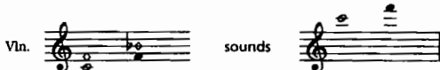

*เครดิต: Adler, Ch. 2, Example 2-73. รูปแบบ stopped note + diamond คู่ 4*

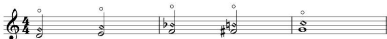

*เครดิต: Rabson, Ch. 4, Fig. 4.23. ดูว่า melodic artificial harmonics ลดความคล่องของนิ้วอย่างไร*

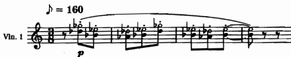

*เครดิต: Adler, Ch. 2, Example 2-78, Debussy, **Ibéria**, part 1, at 15. ฟังสีเงิน/ใสของ harmonics ใน texture จริง*

Goss เสนอมุมมองเพิ่มเติมในข้อ 93 ว่า partial ลำดับสูงของเชลโล (รวมถึง partial ลำดับที่ 5) มีความมั่นคงมากกว่าในเครื่องเสียงสูง และ artificial harmonics ของเชลโลสามารถขยายช่วงใช้งานได้กว้างกว่าที่ผู้เรียบเรียงซึ่งคุ้นเคยกับเปียโนมักคาดคะเน อย่างไรก็ตาม เทคนิคนี้ยังคงต้องใช้อย่างมีเจตนาเป็น effect ที่ตั้งใจ มิใช่การเขียนเสียงสูงโดยปราศจากการพิจารณา

### แบบฝึก 3 — ทำนองสั้นสองระบบ harmonic

ให้บันทึกทำนองความยาว 4–6 โน้ต ดังนี้

1. ฉบับที่ 1 ใช้ natural harmonics เท่านั้น พร้อมระบุสายและ partial ที่ใช้
2. ฉบับที่ 2 ใช้ artificial harmonics (touch-4th) พร้อมระบุ stopped pitch และตำแหน่ง diamond

ให้เพื่อนร่วมชั้นอ่านเฉพาะพาร์ต แล้วตอบว่าสามารถเข้าใจวิธีบรรเลงได้หรือไม่

## 5. Contemporary techniques และ chops

### จาก Adler: ตัวอย่างเทคนิคร่วมสมัย

Adler เน้นย้ำว่ามีเทคนิคใหม่จำนวนมากที่ยังไม่มีสัญลักษณ์การบันทึกโน้ตเป็นมาตรฐานสากลอย่างสมบูรณ์ ตัวอย่างที่ปรากฏใน Ch. 2 ได้แก่

- เล่นด้านหลังสะพานเสียง (wrong side of the bridge)
- เล่นหรือตี tailpiece
- เคาะตัวเครื่อง
- wide vibrato
- subharmonics / undertones
- เล่น pitch สูงสุดบนสายที่กำหนด
- fingering โดยไม่ลากคันชัก
- pizz. ด้วย plectrum หรือหวี
- half harmonics

หลักปฏิบัติสำหรับรายวิชานี้คือ **หากใช้เทคนิคที่อยู่นอกเหนือมาตรฐาน จำเป็นต้องเขียนคำอธิบายกำกับไว้ในสกอร์และพาร์ตเสมอ** โดยไม่พึงสันนิษฐานว่าผู้บรรเลงทุกคนจะตีความสัญลักษณ์เดียวกันได้ตรงกัน

### Chops (Rabson)

Chops เป็นกลุ่มเทคนิค bowing แบบ percussive ที่พบมากในดนตรี bluegrass และแนว roots มากกว่าในหลักปฏิบัติคลาสสิกมาตรฐาน ผู้บรรเลงจะลดทอนความชัดเจนของ pitch ด้วยมือซ้าย แล้วปล่อยให้คันชักตกกระทบบนสายเพื่อสร้างเสียงสั้น แห้ง และเป็นจังหวะ

Rabson เตือนไว้อย่างชัดเจนดังนี้

- จำเป็นต้องใช้ผู้บรรเลงที่มีความคุ้นเคยกับเทคนิคนี้อยู่แล้ว เนื่องจากการเรียนรู้อย่างเร่งด่วนในช่วงบันทึกเสียงหรือซ้อมช่วงสั้นมักไม่เพียงพอ
- สัญลักษณ์การบันทึกโน้ตยังไม่เป็นมาตรฐานสากล อาจใช้ slash noteheads ร่วมกับคำกำกับ `chops` ได้
- soft chop และ chunks เป็นสีเสียงแบบ percussive ที่มีน้ำหนักแตกต่างกัน

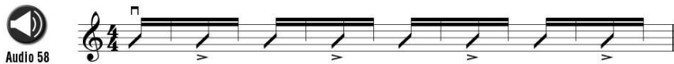

*เครดิต: Rabson, Ch. 5, Fig. 5.1. ใช้เฉพาะเมื่อบริบทงานอนุญาตและมีผู้เล่นที่ทำได้*

สำหรับแบบฝึกในสัปดาห์นี้ chops เป็นทางเลือกเสริมเท่านั้น มิใช่ข้อบังคับสำหรับทุกชิ้นงาน หากเลือกใช้ ต้องระบุ groove และกลุ่มผู้บรรเลงเป้าหมายไว้ด้วย

## 6. กลุ่มเครื่องสาย: เอกเทศและระนาบหน้า–กลาง–หลัง

### Individuality within the ensemble

Adler ในบทที่ 5 เริ่มต้นจากบทเรียนของ string quartet ในยุค Haydn–Mozart–Beethoven ดังนี้

1. แนวที่สอง วิโอลา และเชลโล ล้วนเป็นพันธมิตรที่มีความสำคัญเท่าเทียมกับไวโอลิน 1
2. การใช้ voice crossing สามารถทำหน้าที่ทั้งด้านสีสันและโครงสร้างได้
3. register ของแต่ละเครื่องส่งผลทั้งต่อสีเสียงและบทบาทหน้าที่
4. การขยายช่วงเสียงต้องสัมพันธ์กับหน้าที่ที่กำหนดไว้เสมอ

ตัวอย่างธีม “Emperor” ของ Haydn แสดงให้เห็นการจับคู่ทำนองกับพื้นเสียง (coupling) อย่างชัดเจน จากนั้น variations แต่ละบทจะส่งต่อทำนองไปยังแนวต่าง ๆ ตามลำดับ

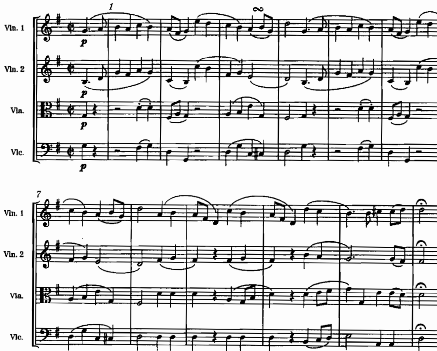

*เครดิต: Adler, Ch. 5, Example 5-1, Haydn, **String Quartet Op. 76, No. 3**, second movement, mm. 1–12. ทำเครื่องหมายว่าใครถือทำนอง ใครถือพื้น*

### Foreground material

Adler ใช้ตัวอย่างจาก Brahms Symphony No. 3 ท่อนที่สาม เพื่อแสดงให้เห็นว่าทำนองสามารถปรากฏอยู่ในแนวต่าง ๆ ได้ และ register ที่เปลี่ยนไปมีผลต่อน้ำหนักของ foreground

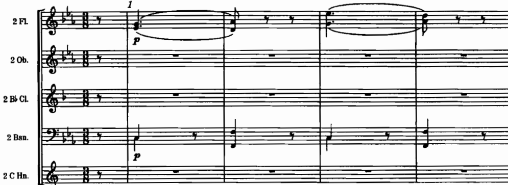

*เครดิต: Adler, Ch. 5, Example 5-7, Brahms, **Symphony No. 3**, third movement, mm. 1–14 (strings). ระบุแนว foreground และสิ่งที่รองรับ*

### บทบาทใน section ตาม Rabson

Rabson ในบทที่ 6 จำแนกหน้าที่หลักของเครื่องสายที่ใช้งานได้จริง ดังนี้

- melody / countermelody
- fills
- pads
- comping

การ double ทำนองเป็น octave ช่วยผลักแนวไปด้านหน้าได้ แต่ต้องระมัดระวังมิให้ชนกับแนวเสียงร้องหรือเครื่องดนตรีอื่นที่อยู่ใน register เดียวกัน

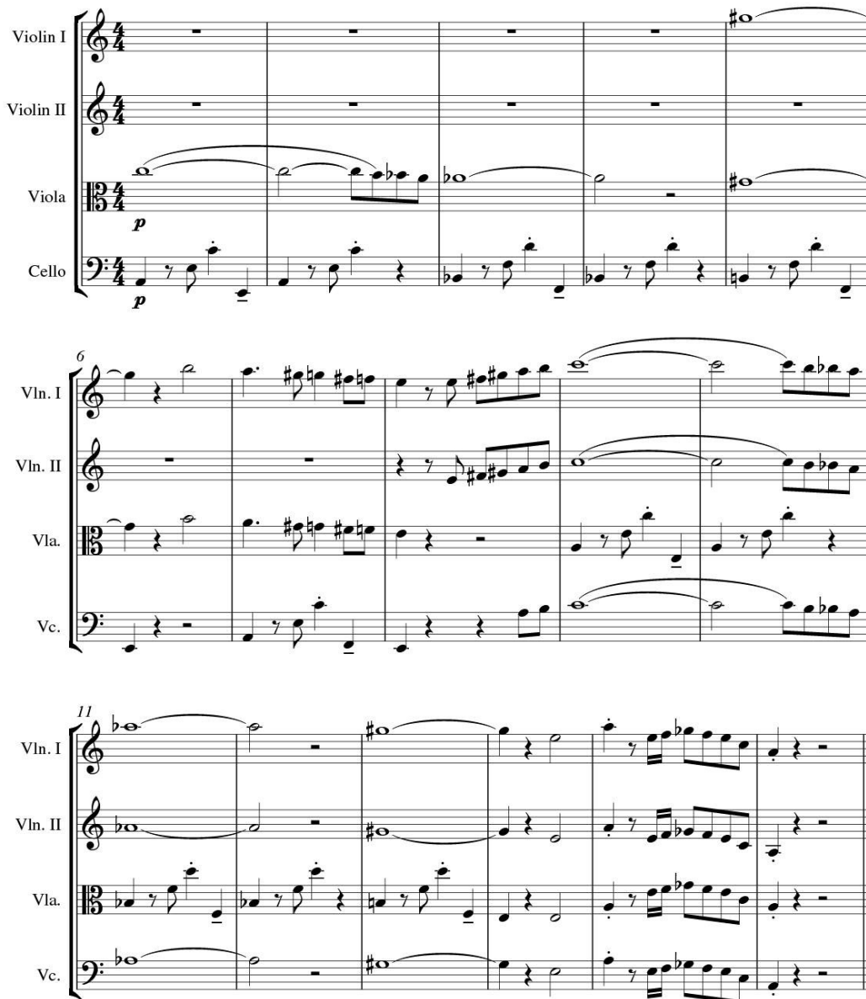

*เครดิต: Rabson, Ch. 6, Fig. 6.1, “King Street Tango” melody in octaves. ฟังว่า octave doubling เปลี่ยนน้ำหนัก foreground อย่างไร*

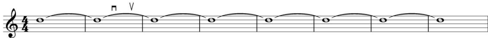

*เครดิต: Rabson, Ch. 6, ส่วน “Pads”. ใช้ตรวจว่า pad หนาเกินไปจนกลบทำนองหรือไม่*

### แผนผังระนาบเสียงสำหรับงานส่ง

| ระนาบ | คำถามตรวจ | ตัวอย่างเทคนิคที่มักเกี่ยว |
|---|---|---|
| Foreground | ผู้ฟังควรร้องตามหรือชี้แนวนี้ได้ทันทีหรือไม่ | melodic arco, octave doubling, register เด่น |
| Middleground | แนวนี้เคลื่อนไหวช่วยเล่าเรื่องแต่ไม่แย่งซีนหรือไม่ | countermelody, light tremolo, inner pizz. |
| Background | ถ้าตัดออก texture พังหรือเพียงบางลง | pads, sul tasto, soft muted sustain, harp harmonic wash |

## 7. ฮาร์ปและเครื่องดีด: คันเหยียบ สีเสียง และการซ้ำแนว

### กายภาพและ pedal ที่ผู้เรียบเรียงต้องรู้

Adler ในบทที่ 4 ระบุประเด็นสำคัญดังนี้

- ฮาร์ปแบบ double-action มีสายทั้งหมด 47 สาย ครอบคลุมช่วงเสียงประมาณหก octave เศษ
- เมื่อคันเหยียบทั้งหมดอยู่ในตำแหน่งยกขึ้น เครื่องดนตรีจะถูกตั้งอยู่ในบันไดเสียง C♭ major
- คันเหยียบแต่ละอันควบคุม pitch ชื่อเดียวกันในทุก octave (ยกเว้นสายต่ำสุดบางสายที่เป็นข้อยกเว้น)
- ลำดับ pedal: **D C B / E F G A** (ซ้ายสาม ขวาสี่)
- ห้ามกำหนดให้เปลี่ยนคันเหยียบสองอันของเท้าเดียวกันในเวลาเดียวกัน
- ควรระบุ pedal setting ไว้ก่อนเริ่ม passage เสมอ
- บทเพลงที่มีลักษณะ chromatic สูงจำเป็นต้องวางแผนการสะกดแบบ enharmonic ล่วงหน้า

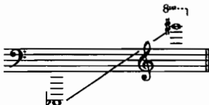

*เครดิต: Adler, Ch. 4, Example 4-1. ใช้ตรวจ register ก่อนเลือกทำนองหรือ glissando*

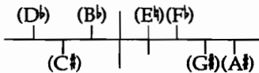

*เครดิต: Adler, Ch. 4, pedal graphic. ฝึกอ่าน setting แบบ graphic และแบบตัวอักษร*

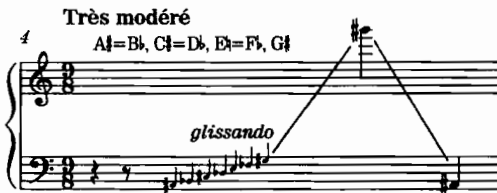

*เครดิต: Adler, Ch. 4, Example 4-2, Debussy, **Prélude à “L’après-midi d’un faune,”** m. 4. ดูว่า pedal setting แบบ enharmonic สร้าง pitch set สำหรับ glissando อย่างไร*

### สีและเทคนิคฮาร์ปที่เกี่ยวสัปดาห์นี้

- ช่วงเสียงต่ำมีลักษณะเข้มข้น มืด และกังวาน ช่วงเสียงกลางมีลักษณะอบอุ่น ส่วนช่วงเสียงสูงมีลักษณะใส แต่ dynamic และ sustain มีข้อจำกัด
- harmonics ของฮาร์ปมีความดังเบา จึงต้องอาศัย orchestration ที่บางหรือให้บรรเลงเดี่ยว
- glissando ต้องสอดคล้องกับ pedal setting ที่กำหนดไว้เสมอ
- เทคนิค `sons étouffés` และเทคนิคพิเศษอื่น ๆ มีปรากฏใน Adler แต่ควรใช้เมื่อจำเป็นต่อสีเสียงเท่านั้น มิใช่เพื่อแสดงความรู้ด้านคำศัพท์

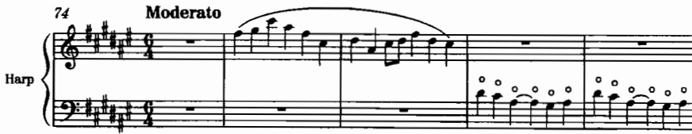

*เครดิต: Adler, Ch. 4, Example 4-12, Debussy, **Nocturnes**, “Nuages,” mm. 74–78. ฟังความเบาของ harp harmonic กับพื้น*

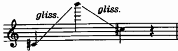

*เครดิต: Adler, Ch. 4, Example 4-17. ตรวจว่า glissando สัมพันธ์กับ pedal pitches จริง*

### การซ้ำแนวสายกับฮาร์ป (Ludwin 3.4)

Ludwin นำเสนอตาราง conventional doublings โดยใช้เครื่องสายเป็นแกนหลัก และระบุว่าการที่ฮาร์ปซ้ำแนวเครื่องสายมักจะ **เพิ่มสีสัน (color)** มากกว่าเพิ่มน้ำหนักของเสียง ตัวอย่างแนวทางจากตารางมีดังนี้

- การซ้ำแนวระหว่างฮาร์ปกับไวโอลิน 1/2 ที่ unison ช่วยเพิ่มสีสันและความสว่างตามที่ตารางระบุ
- การซ้ำแนวระหว่างฮาร์ปกับวิโอลาหรือเชลโล อาจเป็น unison หรือ octave ขึ้นอยู่กับบริบท
- การซ้ำแนวระหว่างฮาร์ปกับเบสที่ unison พบได้น้อยกว่า
- ฮาร์ปยังสามารถซ้ำแนวกับ piano, celesta, glockenspiel และ bells ในกลุ่มเครื่องให้สีเสียงได้เช่นกัน

หลักปฏิบัติสำหรับแบบฝึกในสัปดาห์นี้มีดังนี้

1. ตัดสินใจล่วงหน้าว่าฮาร์ปจะทำหน้าที่เป็น foreground เป็นประกาย (sparkle) เสริมทำนอง หรือเป็นโครงร่างฮาร์โมนิก (harmonic outline)
2. หากฮาร์ป double กับแนวสายที่บรรเลงแบบ pizz. ให้ตรวจสอบความพร้อมเพรียงของ attack ร่วมกัน
3. หากฮาร์ป double กับแนวสายที่ sustain ให้ตรวจสอบว่า arpeggio หรือ harmonic ของฮาร์ปช่วยเสริมหรือกลับทำให้เสียงพร่ามัวลง

## 8. ตัวอย่างสกอร์ที่ต้องอ่านคู่กับเสียง

| ประเด็น | ตัวอย่างใน source | สิ่งที่ต้องสังเกต |
|---|---|---|
| Bowed tremolo | Verdi, *Requiem*, “Dies irae,” mm. 46–51 | tremolo เป็นชั้นบรรยากาศ |
| Fingered tremolo | Debussy, *La Mer*, I, at 8 | ช่วงที่สลับและความต่อเนื่องของคันชัก |
| Sul ponticello | Puccini, *Madama Butterfly*, Act I, 3 mm. before 38 | สีคมและการกลับ normale |
| Col legno battuto | Berlioz, *Symphonie fantastique*, V, mm. 444–455 | pitch definition ลดลง |
| Pizzicato | Brahms, Symphony No. 1, IV, mm. 1–17 | การเข้าจังหวะของกลุ่ม |
| Lengthy pizz. | Tchaikovsky, Symphony No. 4, III, mm. 1–17 | rest กับ endurance |
| Snap pizz. | Bartók, SQ No. 4, IV, mm. 56–63 | accent แบบ percussive |
| Mute | Weber, *Oberon* Overture, mm. 13–21 | เวลาถอด mute |
| Harmonics | Debussy, *Ibéria*, I, at 15 | สีใสใน texture |
| Harp pedal/gliss. | Debussy, *Prélude à “L’après-midi d’un faune,”* m. 4 | enharmonic pedal set |
| Harp harmonic | Debussy, *Nocturnes*, “Nuages,” mm. 74–78 | dynamic ที่เบาเป็นพิเศษ |
| Section roles | Haydn, Op. 76/3, II, theme + variations | ทำนองย้ายแนว |
| Foreground | Brahms, Symphony No. 3, III, mm. 1–14 | ใครถือทำนองในสาย |

## 9. บทเพลงสำหรับ further study จาก source

ให้เลือกศึกษาอย่างน้อย 4 ชิ้น โดยต้องมีอย่างน้อย 1 ชิ้นที่อ่านสกอร์ควบคู่กับการฟังบันทึกเสียง และอย่างน้อย 1 ชิ้นที่เปรียบเทียบ full texture กับ reduction หรือพาร์ตย่อย

| หัวข้อ | บทเพลง/ตัวอย่าง | สิ่งที่ต้องฟังหรืออ่าน | แหล่งและตำแหน่ง |
|---|---|---|---|
| Bowed tremolo | Verdi, *Requiem*, “Dies irae,” mm. 46–51 | ทำเครื่องหมายว่า tremolo อยู่ที่แนวใดและทำหน้าที่พื้นหรือคลื่นความตึง | Adler, Ch. 2, Ex. 2-46 |
| Fingered tremolo | Debussy, *La Mer*, first movement, at 8 | ระบุคู่ pitch ที่สลับและจดว่า slur มีหรือไม่ | Adler, Ch. 2, Ex. 2-47 |
| Sul tasto | Debussy, *Ibéria*, part 2, at 40 | เปรียบเทียบความพร่ากับตำแหน่งคันชักปกติในท่อนใกล้เคียง | Adler, Ch. 2, Ex. 2-51 |
| Sul ponticello | Puccini, *Madama Butterfly*, Act I, 3 mm. before 38 | จดจุดเริ่ม–จบของ sul pont. และผลต่อสีทำนอง | Adler, Ch. 2, Ex. 2-52 |
| Col legno | R. Strauss, *Also sprach Zarathustra*, at 12; Berlioz, *Symphonie fantastique*, V, mm. 444–455 | แยก tratto กับ battuto จากสิ่งที่ได้ยิน | Adler, Ch. 2, Ex. 2-53–2-54 |
| Pizzicato orchestration | Brahms, Symphony No. 1, IV, mm. 1–17; Tchaikovsky, Symphony No. 4, III, mm. 1–17 | ทำเครื่องหมาย rest และการแบ่งงานระหว่างแนว | Adler, Ch. 2, Ex. 2-55, 2-61 |
| Snap pizz. | Bartók, String Quartet No. 4, IV, mm. 56–63 | นับ accent แบบ snap กับจังหวะรอบข้าง | Adler, Ch. 2, Ex. 2-58 |
| Harmonics | Debussy, *Ibéria*, I, at 15; Saint-Saëns, Violin Concerto, II, end; Borodin, SQ No. 1, III, Trio, mm. 1–20 | แยก natural/artificial จาก notation และจากเสียง | Adler, Ch. 2, Ex. 2-77–2-79 |
| Mute color | Weber, *Oberon* Overture, mm. 13–21 | ฟังคุณภาพ “ถูกบีบ” ของ muted sound แม้ไม่จำเป็นต้องเบาที่สุด | Adler, Ch. 2, Ex. 2-63 |
| Harp pedal logic | Debussy, *Prélude à “L’après-midi d’un faune,”* m. 4 | เขียน pedal set ใหม่ด้วยตัวเองแล้วตรวจ pitch ที่เกิด | Adler, Ch. 4, Ex. 4-2 |
| Harp + soft orchestra | Debussy, *Nocturnes*, “Nuages,” mm. 74–78; Ravel, *Daphnis et Chloé*, “Nocturne,” mm. 49–53 | ตรวจว่า orchestration รอบ harp harmonic บางพอหรือไม่ | Adler, Ch. 4, Ex. 4-12–4-13 |
| Individuality in section | Haydn, String Quartet Op. 76, No. 3, II, theme and variations | ทำตารางว่าทำนองอยู่ที่แนวใดในแต่ละ variation | Adler, Ch. 5, Ex. 5-1 ff. |
| Foreground placement | Brahms, Symphony No. 3, III, mm. 1–14 | ชี้ foreground จริงจากสกอร์สาย แล้วฟังว่าตรงกับสิ่งที่ได้ยินหรือไม่ | Adler, Ch. 5, Ex. 5-7 |
| Section roles / octaves | Rabson, “King Street Tango” melody in octaves | เปรียบเทียบน้ำหนักเมื่อ double octave กับเมื่อแนวเดียว | Rabson, Ch. 6, Fig. 6.1 |
| Cello harmonics practicality | Goss, tip 93 (และ Fig. 93c ใน source) | จดเหตุผลที่ cello artificial harmonics มั่นคงในช่วงที่กว้างขึ้น | Goss, *100 Orchestration Tips*, tip 93 |

### แบบบันทึกการฟัง

สำหรับผลงานแต่ละชิ้น ให้บันทึกประเด็นต่อไปนี้

1. ชื่อผลงาน ท่อน (movement) และตำแหน่งอ้างอิงตาม source
2. เทคนิคเครื่องสายหรือฮาร์ปที่ปรากฏ
3. ระนาบหน้า–กลาง–หลังที่สังเกตได้
4. สิ่งที่ปรากฏจริงจากการฟังบันทึกเสียง ซึ่งไม่อาจคาดเดาได้จากการอ่านโน้ตเพียงอย่างเดียว
5. แนวทางการตัดสินใจหนึ่งประเด็นที่จะนำไปทดลองใช้กับแบบฝึกของตนเอง

## 10. กิจกรรมในชั้นเรียน 120 นาที

1. **นาทีที่ 0–20 — แนวคิดและการฟัง**: ทบทวนคำถามเรื่อง “หน้าที่ของเสียง” ฟังเปรียบเทียบ bowed tremolo (Verdi) กับ sul tasto/sul ponticello (Debussy/Puccini) แล้วให้ผู้เรียนจัดวางเทคนิคบนแกนหน้า↔หลัง และแกนคม↔พร่า
2. **นาทีที่ 20–40 — วิเคราะห์สกอร์และเสียง**: แบ่งกลุ่มผู้เรียนอ่าน Brahms pizz. opening, Tchaikovsky lengthy pizz., Weber muted strings และ Debussy harp harmonic แล้วให้แต่ละกลุ่มประเมินว่ามีเวลาเพียงพอสำหรับการเปลี่ยนเทคนิคหรือไม่
3. **นาทีที่ 40–60 — สาธิตและวิจารณ์สัญลักษณ์การบันทึกโน้ต**: สาธิตหรือรับชมตัวอย่าง natural กับ artificial harmonics, snap pizz., ponticello และ harp pedal diagram จากนั้นร่วมกันปรับปรุง notation ที่คลุมเครือบนกระดาน
4. **นาทีที่ 60–95 — เวิร์กชอปแบบฝึกเทคนิคชิ้นที่ 1**: เรียบเรียงร่างสำหรับ string section ร่วมกับ harp ความยาว 8–16 ห้อง พร้อมระบุระนาบเสียงและตารางเทคนิค
5. **นาทีที่ 95–110 — peer reading**: ให้เพื่อนร่วมชั้นอ่านเฉพาะพาร์ต ตรวจสอบ `pizz./arco`, `sord.`, harmonics และ pedal setting
6. **นาทีที่ 110–120 — สรุปและเชื่อมโยงสู่สัปดาห์ที่ 4**: ผู้เรียนแต่ละคนเลือกนำเสนอปัญหาหนึ่งข้อที่ยังค้างอยู่ (ซึ่งมักเกี่ยวข้องกับเวลาเปลี่ยนเทคนิคหรือ pedal) พร้อมระบุประเด็นที่จะตรวจสอบต่อเมื่อเข้าสู่เนื้อหาเครื่องลมไม้

### ผลลัพธ์ที่ควรได้เมื่อจบคาบ

- ร่างแบบฝึกเทคนิคชิ้นที่ 1 ความยาวอย่างน้อย 8 ห้อง
- ตารางเทคนิคและแผนผังระนาบเสียง
- บันทึกการฟังอย่างน้อย 1 ชิ้น
- รายการประเด็นที่ต้องปรับแก้หลังการทำ peer reading

## 11. ใบงานในชั้นเรียน

### ใบงาน A — ตารางเทคนิคและหน้าที่

| ห้อง | เครื่อง/แนว | เทคนิค | หน้าที่ (หน้า/กลาง/หลัง) | ทำไมไม่ใช้เทคนิคอื่น | เวลาเปลี่ยนพอไหม |
|---:|---|---|---|---|---|
|  |  |  |  |  |  |
|  |  |  |  |  |  |
|  |  |  |  |  |  |
|  |  |  |  |  |  |

### ใบงาน B — ตรวจ harmonics และ mute/pizz.

ตอบคำถามต่อไปนี้ใต้สกอร์

- เป็น natural หรือ artificial harmonic และระบุสาย/node อย่างไร
- sounding pitch ที่ต้องการคืออะไร
- มี `con sordino` / `senza sordino` ครบหรือไม่
- `pizz.` กลับ `arco` ตรงไหน และมี rest พอหรือไม่
- หลัง sul pont./col legno มี `normale` หรือไม่

### ใบงาน C — ฮาร์ปและ doubling

| คำถาม | คำตอบจากสกอร์ของฉัน |
|---|---|
| Pedal setting เริ่มต้นคืออะไร |  |
| มีจุดที่เท้าเดียวกันต้องเปลี่ยนสอง pedal พร้อมกันหรือไม่ |  |
| ฮาร์ป double แนวสายใด ที่ unison หรือ octave |  |
| ฮาร์ปเพิ่มสี น้ำหนัก หรือ attack |  |
| ถ้าตัดฮาร์ปออก ระนาบใดหายไป |  |

### ใบงาน D — เพื่อนอ่านพาร์ต

1. ทราบหรือไม่ว่าเทคนิคพิเศษเริ่มต้นและสิ้นสุดที่ใด
2. อ่าน harmonics แล้วคาดเดาวิธีบรรเลงตรงกับเจตนาของผู้เรียบเรียงหรือไม่
3. มองเห็นแผนการติดตั้งและถอดมิวต์ได้ชัดเจนหรือไม่
4. พาร์ตฮาร์ประบุ pedal setting ชัดเจนเพียงพอหรือไม่
5. สามารถระบุได้หรือไม่ว่าแนวของตนอยู่ในระนาบหน้า กลาง หรือหลัง

## 12. งานศึกษาด้วยตนเอง 6 ชั่วโมง

การจัดสรรเวลาโดยประมาณมีดังนี้

- 1.5 ชั่วโมง — ฟังและอ่านสกอร์ตาม further study อย่างน้อย 4 ชิ้น พร้อมบันทึกผล
- 1.5 ชั่วโมง — พัฒนาแบบฝึกเทคนิคชิ้นที่ 1 (string section ร่วมกับ harp) ให้ครบทุกระนาบเสียง
- 1 ชั่วโมง — จัดทำตารางเทคนิค แผนผัง foreground–middleground–background และรายการ notation ที่ใช้
- 1 ชั่วโมง — ตรวจสอบ pedal setting ของฮาร์ปและตำแหน่งเปลี่ยน pizz./arco/sord./normale
- 1 ชั่วโมง — ปรับแก้ตาม peer feedback และเตรียมส่งงานตามช่องทางที่รายวิชากำหนด

หลักฐานที่ควรเก็บไว้มีดังนี้

- สกอร์ฉบับร่างและฉบับแก้
- ตารางเทคนิคและแผนผังระนาบเสียง
- บันทึกการฟังพร้อมตำแหน่งตาม source
- บันทึกคำถามที่ถามผู้บรรเลงเครื่องสาย/ฮาร์ป หรือผู้สอน
- หากมี playback ให้ระบุไว้อย่างชัดเจนว่าเป็นเพียงตัวช่วยเสริม มิใช่สิ่งทดแทนการอ่านสกอร์จริง

**งานส่งตามประมวลรายวิชา (มิได้กำหนดเกณฑ์ใหม่เพิ่มเติม):** แบบฝึกเทคนิคชิ้นที่ 1 เรียบเรียงสำหรับกลุ่มเครื่องสายพร้อมฮาร์ป โดยระบุระนาบเสียงและตารางเทคนิคที่ใช้

## 13. เกณฑ์ตรวจตนเองและจุดเชื่อมไปสัปดาห์ที่ 4

### ตรวจตนเองก่อนส่ง

- [ ] มีแนวเครื่องสายอย่างน้อยสามแนวที่ทำหน้าที่แตกต่างกัน หรือมีเหตุผลรองรับอย่างชัดเจนหาก texture มีความบาง
- [ ] มีส่วนฮาร์ปที่มีหน้าที่ชัดเจน มิใช่การเขียนอย่างว่างเปล่า (เช่น เสริมประกายทำนอง เสียงประสาน หรือ color double)
- [ ] สามารถระบุระนาบหน้า–กลาง–หลังได้โดยไม่กำกวม
- [ ] ตารางเทคนิคมีความครบถ้วน และทุกเทคนิคมีจุดเริ่มต้น–สิ้นสุดที่ชัดเจน
- [ ] harmonics ระบุวิธีการผลิตเสียงไว้อย่างชัดเจน มิใช่เพียงความต้องการ “เสียงใส” อย่างคลุมเครือ
- [ ] ระยะเวลาเปลี่ยน pizz./arco และ sord. เป็นไปได้จริงในทางปฏิบัติ
- [ ] pedal setting ของฮาร์ปไม่มีความขัดแย้งกันในเท้าเดียวกัน
- [ ] ไม่มีการกำหนดเกณฑ์คะแนนหรือ rubric ใหม่ที่นอกเหนือจากที่ประมวลรายวิชากำหนดไว้

### จุดเชื่อมไปสัปดาห์ที่ 4

สัปดาห์ที่ 4 จะเข้าสู่เนื้อหาเรื่อง **เครื่องลมไม้** ครอบคลุมประเด็น transposition วงจรลมหายใจ auxiliary instruments register a2 articulation และ special effects

ควรเตรียมความพร้อมจากงานเครื่องสายในสัปดาห์นี้ ดังนี้

- เลือก passage เครื่องสายที่มี pad หรือ melody ชัดเจน แล้วพิจารณาว่าหากเปลี่ยนเป็นเครื่องลมไม้ ข้อจำกัดด้านสีเสียงและลมหายใจจะบังคับให้ต้องตัดวลี ณ ตำแหน่งใด
- สังเกตตำแหน่งที่เครื่องสายสามารถบรรเลง tremolo หรือ sul tasto ได้ต่อเนื่องยาวนาน แต่เครื่องลมไม้จำเป็นต้องแบ่งช่วงหายใจ
- เก็บรักษาตัวอย่างการ doubling ระหว่างเครื่องสายกับฮาร์ปไว้ เพื่อเปรียบเทียบกับการ doubling ระหว่างเครื่องลมไม้กับเครื่องสายในสัปดาห์ถัดไป

## แหล่งอ้างอิง

- Samuel Adler, *The Study of Orchestration*, 3rd ed., Ch. 2 (Harmonics; coloristic effects; mutes; pizzicato; contemporary techniques), Ch. 4 (Harp), Ch. 5 (Scoring for Strings).
- Mimi Rabson, *Arranging for Strings*, Ch. 4 (Standard Techniques), Ch. 5 (Chops, Ponticello/Feedback, Portamento, and Falls), Ch. 6 (The String Section).
- Norman Ludwin, *Music for the Movies: The Hollywood Sound*, §3.4 Conventional String and Harp Doublings.
- Thomas Goss, *100 Orchestration Tips*, tips 92–94 (โดยเฉพาะ 93 Cello Harmonics ตาม syllabus).
- Elaine Gould, *Behind Bars*, Part 2 Harp / string-related notation conventions ตาม syllabus.

## Image credits

ภาพทั้งหมดคัดจากไฟล์ภาพใน `Choice1_BuzzBooks` และคัดลอกมาไว้ใน `Weekly content/images/` เพื่อใช้ประกอบการเรียนการสอนภายในชุดเนื้อหานี้:

**Adler, Ch. 2**

- `adler-tremolo-verdi-dies-irae.png` — Ex. 2-46
- `adler-fingered-tremolo-debussy-la-mer.png` — Ex. 2-47
- `adler-sul-tasto-debussy-iberia.png` — Ex. 2-51
- `adler-sul-ponticello-puccini.png` — Ex. 2-52
- `adler-col-legno-strauss-zarathustra.png` — Ex. 2-53
- `adler-col-legno-berlioz-fantastique.png` — Ex. 2-54
- `adler-pizzicato-brahms-sym1.png` — Ex. 2-55
- `adler-snap-pizz-bartok-sq4.png` — Ex. 2-58
- `adler-pizz-chords-bartok-concerto.png` — Ex. 2-60
- `adler-pizz-tchaikovsky-sym4.png` — Ex. 2-61
- `adler-muted-weber-oberon.png` — Ex. 2-63
- `adler-harmonic-series-on-g.png` — Ex. 2-67
- `adler-natural-harmonics-violin.png` — Ex. 2-68
- `adler-artificial-harmonics-notation.png` — Ex. 2-73
- `adler-harmonics-debussy-iberia.png` — Ex. 2-78

**Adler, Ch. 4–5**

- `adler-harp-photo.png`, `adler-harp-range.png`, `adler-harp-pedal-graphic.png`, `adler-harp-debussy-faune.png`, `adler-harp-harmonics-debussy-nuages.png`, `adler-harp-glissandi.png`
- `adler-haydn-emperor-theme.png` — Ex. 5-1
- `adler-brahms-sym3-foreground.png` — Ex. 5-7

**Rabson, Ch. 4–6**

- `rabson-sul-tasto.png`, `rabson-pizzicato.png`, `rabson-bartok-pizzicato.png`, `rabson-tremolo.png`, `rabson-con-sordino.png`, `rabson-natural-harmonics-notation.png`, `rabson-artificial-harmonics.png`
- `rabson-chops.png`, `rabson-ponticello.png`, `rabson-ponticello-nirvarky.png`
- `rabson-melody-octaves.png`, `rabson-king-street-tango-octaves.png`, `rabson-pads.png`

เนื้อหานี้เป็นการสรุปและเรียบเรียงใหม่จาก source โดยรักษาชื่อบทเพลง หมายเลขตัวอย่าง และเครดิตภาพตามต้นฉบับ ไม่เพิ่มข้อกำหนดการส่งงานหรือเกณฑ์คะแนนนอกเหนือจากประมวลรายวิชา
