# สัปดาห์ที่ 4 — เครื่องลมไม้: การทดเสียง การหายใจ และการผสมสี

## คำถามนำ

เครื่องลมไม้มิได้ “เล่นโน้ตบนหน้ากระดาษ” ในลักษณะเดียวกับเครื่องคีย์บอร์ด หากแต่บรรเลงผ่าน **วงจรลมหายใจ** embouchure ลิ้น และช่วงเสียงที่มีสีสันแตกต่างกันอย่างมาก

เนื้อหาสัปดาห์นี้ฝึกให้แยกแยะสามระดับก่อนเริ่มเรียบเรียง ดังนี้

1. **pitch ที่ผู้ฟังได้ยิน** (concert / sounding)
2. **pitch ที่ผู้บรรเลงอ่าน** (written / transposed)
3. **ลมและลิ้นที่จำเป็นต้องใช้** เพื่อให้วลีนั้นมีชีวิตชีวา

งานส่งของสัปดาห์นี้คือการ **ปรับแก้ท่อนเครื่องลมที่ไม่สอดคล้องกับธรรมชาติของเครื่องดนตรี** แล้วจัดส่งทั้งฉบับระดับเสียงจริงและพาร์ตที่ทดเสียงแล้ว

## ขอบเขตตามประมวลรายวิชา

สัปดาห์นี้ครอบคลุมประเด็นดังต่อไปนี้

- การจำแนกเครื่องลมไม้และหลักการทดเสียง (transposition)
- วงจรการหายใจเทียบกับระยะเวลาของโน้ตที่บันทึกได้จริง
- เครื่องดนตรีสำรอง (auxiliary instruments) และการเปลี่ยนเครื่องระหว่างบทเพลง
- คุณลักษณะของแต่ละช่วงเสียงในฟลูต โอโบ คลาริเน็ต และบาสซูน
- การซ้ำแนวและการบันทึกคำสั่ง `a2`
- การใช้กลุ่มเครื่องลมสร้างสีสันที่ตัดกับกลุ่มอื่น
- อาร์ติคูเลชันแบบใหม่และเสียงพิเศษ (เช่น flutter tongue, multiphonics ตามขอบเขตที่ source ระบุ)

คำถามหลักตามประมวลรายวิชาคือ **การปรับแก้ท่อนเครื่องลมที่ไม่สอดคล้องกับธรรมชาติของเครื่องดนตรี พร้อมจัดส่งทั้งฉบับระดับเสียงจริงและพาร์ตที่ทดเสียงแล้ว**

## เมื่อจบสัปดาห์นี้ ผู้เรียนจะสามารถ

1. จำแนก written pitch กับ concert pitch ของ piccolo, English horn, clarinet, bass clarinet และ contrabassoon ตามหลักเกณฑ์ของ Adler
2. วินิจฉัยวลีที่มีความยาวเกินวงจรลมหายใจ หรือ dynamic/register ที่ทำให้ลมหมดเร็วเกินไป โดยอ้างอิง Goss ข้อเสนอแนะที่ 1
3. อธิบายสีเสียงของ register หลักในฟลูต โอโบ คลาริเน็ต และบาสซูน แล้วเลือกหน้าที่ของแนวให้สอดคล้อง
4. ตัดสินใจระหว่างการใช้ solo กับ `a2` unison และระหว่าง unison กับ octave doubling ตาม Adler บทที่ 8
5. ปรับแก้ท่อนเครื่องลมหนึ่งท่อนให้สามารถบรรเลงได้จริง พร้อมจัดส่ง concert score และ transposed parts
6. ระบุตำแหน่งที่ควรใช้ auxiliary instrument หรือจำเป็นต้องเผื่อเวลาสำหรับการเปลี่ยนเครื่องหรือเปลี่ยน reed

## คำศัพท์สำคัญ

| คำศัพท์ | ความหมายสั้น ๆ |
|---|---|
| Concert / sounding pitch | ระดับเสียงที่ดังจริง |
| Written pitch | ระดับเสียงที่เขียนในพาร์ตผู้เล่น |
| Transposing instrument | เครื่องที่ sounding ≠ written |
| Auxiliary instrument | เครื่องสำรองในตระกูลเดียวกัน เช่น piccolo, English horn, bass clarinet |
| Tonguing | เริ่มเสียงด้วยลิ้น (tuh/duh) |
| Legato (winds) | โน้ตใน slur เล่นในลมเดียว ลิ้นเฉพาะโน้ตแรก |
| Double / triple tonguing | ลิ้นคู่/สาม เพื่อโน้ตเร็ว |
| Flutter tongue (*Flt.*) | ลิ้นหรือคอสั่น สร้างเสียง whir |
| `a2` / `a3` | ผู้เล่น 2 หรือ 3 คนเล่น unison บน staff เดียวกัน |
| Break (clarinet) | จุดเปลี่ยน fingering ระหว่าง B♭4–B4 ที่ต้องระวัง |
| Chalumeau / clarino | ชื่อ register ต่ำ/สูงของคลาริเน็ต |
| Circular breathing | เทคนิคเติมลมขณะเป่า — ไม่ใช่ทางลัดสากลสำหรับทุกวลี |

## 1. จำแนกเครื่องและหลักการทดเสียง

Adler จำแนกเครื่องลมไม้ได้จากหลายแกน เช่น single reed / double reed, cylindrical / conical และ **classification by transposition**

เครื่องที่ต้องฝึกแปลงในสัปดาห์นี้ (ตาม Adler) มีดังนี้

| เครื่อง | ความสัมพันธ์หลักที่ต้องจำ |
|---|---|
| Piccolo | เขียนต่ำกว่าเสียงจริงหนึ่ง octave |
| Contrabassoon | เขียนสูงกว่าเสียงจริงหนึ่ง octave |
| English horn in F | sounding ต่ำกว่า written หนึ่ง perfect 5th |
| Clarinet in B♭ / A | sounding ต่ำกว่า written หนึ่ง major 2nd / minor 3rd |
| Bass clarinet in B♭ | ตามระบบ notation ที่ใช้ (Adler อ้าง transposition chart; Gould ระบุ French notation เป็น ninth สูงกว่า sounding) |
| Alto flute in G | sounding ต่ำกว่า written หนึ่ง perfect 4th |

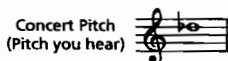

*เครดิต: Adler, Ch. 6, Example 6-1. ใช้ฝึกแปลงสองทิศทาง: จากเสียงจริง → พาร์ต และจากพาร์ต → เสียงจริง*

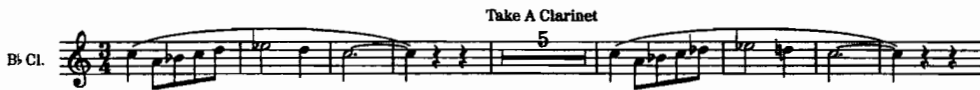

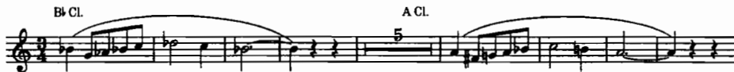

*เครดิต: Adler, Ch. 6, Examples 6-2 และ 6-3. ตรวจว่าพาร์ตทุกชิ้นในงานส่งสอดคล้องกับ concert score*

### แบบฝึก 1 — แปลงสองทาง

ให้เลือกทำนองความยาว 4 ห้องใน concert pitch แล้วจัดทำพาร์ต ดังนี้

1. B♭ clarinet
2. English horn
3. piccolo

จากนั้นให้ทำในทิศทางย้อนกลับ โดยเริ่มจากพาร์ต English horn แล้วแปลงกลับเป็น concert score ห้ามคาดเดา mixed clef โดยไม่อ่าน chart อ้างอิง

## 2. ลมหายใจ: วงจร ไม่ใช่ถังไร้ก้น

Goss ในข้อเสนอแนะที่ 1 เน้นย้ำว่าการหายใจของเครื่องลมเป็นกระบวนการ **cyclical** ซึ่งประกอบด้วยทั้งการหายใจเข้าและเป่าลมออก การตั้งคำถามเพียงว่า “โน้ตยาวได้กี่วินาที” โดยไม่คำนึงถึงจังหวะฟื้นตัวของลมหายใจ จะนำไปสู่วลีที่ผู้บรรเลงทำได้เพียงครั้งเดียวแล้วล้มเหลวในครั้งถัดไป

ข้อสรุปจาก Goss ที่ใช้เป็นเกณฑ์ตรวจงานมีดังนี้

- ไม่ควรใช้ตารางระยะเวลาสูงสุดเป็นใบอนุญาตให้เขียนวลียาวติดต่อกัน
- โอโบมักค้างเสียงได้นาน (เนื่องจากช่องลมผ่าน reed มีขนาดแคบ) แต่ embouchure อาจล้าได้เช่นกัน
- บาสซูนและคลาริเน็ตค้างเสียงยาวได้น้อยกว่าโอโบโดยเปรียบเทียบ
- ฟลูตค้างเสียงยาวได้ยากที่สุดในกลุ่มเครื่องลมไม้หลัก
- เครื่องขนาดใหญ่ (contrabassoon, bass clarinet, alto flute) และการบรรเลงในระดับ dynamic ที่ดัง ล้วนลดระยะเวลาลมหายใจลงอีก
- ควรศึกษาตัวอย่าง phrasing ที่มี rest ตามธรรมชาติ เช่นที่ Goss อ้างอิงจาก Mozart *Gran Partita* และ Janáček *Mládi*

Goss ใน *100 More* ข้อเสนอแนะที่ 1 เตือนเพิ่มเติมว่า **circular breathing มิใช่ทางแก้ที่ใช้ได้สากล** ผู้บรรเลงบางคนทำได้ บางคนไม่ถนัด อาจเกิด hiccup ของเสียง เปลี่ยน embouchure ลด vibrato และมีเสียงสูดลมทางจมูก จึงไม่ควรกำหนดไว้ในสกอร์โดยไม่เข้าใจผลข้างเคียงที่อาจเกิดขึ้น

Adler เสริมมุมมองด้าน orchestration ว่าความสามารถในการควบคุมลมหายใจแตกต่างกันไปตามเครื่องดนตรี และโอโบมักบรรเลงได้ยาวกว่าเครื่องลมอื่นในหลายบริบท แต่ยังจำเป็นต้องออกแบบวลีให้มีจุดหายใจรองรับอยู่เสมอ

### แบบฝึก 2 — วินิจฉัยวลีเครื่องลม

ให้เลือกวลีเครื่องลมไม้ความยาว 8–12 ห้อง (ของตนเองหรือจากตัวอย่าง) แล้วทำเครื่องหมายประเด็นต่อไปนี้

1. ตำแหน่งหายใจที่เป็นไปได้โดยไม่ทำลายโครงสร้างของวลี
2. ตำแหน่งที่ dynamic หรือ register ทำให้ลมหมดเร็วกว่าปกติ
3. ตำแหน่งที่ควรมอบหมายให้ผู้บรรเลงคนที่สองหรือ auxiliary รับช่วงต่อ แทนการยืดวลีเดิมออกไป

## 3. Articulation, tonguing และ special effects

### ลิ้นคือจุดเริ่มต้นของเสียง

ตามหลักของ Adler มีดังนี้

- การเริ่มเสียงด้วยลิ้นมีลักษณะคล้ายพยางค์ “tuh” (บางครั้งเป็น “duh”)
- หากไม่มี slur หมายถึงลิ้นแยกทุกโน้ต
- หากมี slur หมายถึงบรรเลงในลมเดียวกัน โดยใช้ลิ้นเฉพาะที่โน้ตแรกเท่านั้น
- เครื่องลมไม้สามารถบรรเลงโน้ตต่อเนื่องในลมเดียวได้มากกว่าที่เครื่องสายบรรเลงได้ในคันชักเดียว เนื่องจากไม่มีข้อจำกัดด้านความยาวของคันชัก

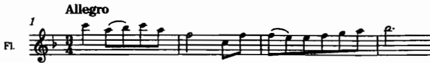

*เครดิต: Adler, Ch. 6, Example 6-6, Beethoven, **Symphony No. 8**, first movement, mm. 1–4. เปรียบเทียบโน้ตที่ลิ้นกับโน้ตใน slur*

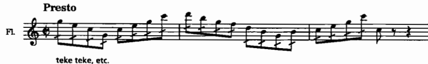

*เครดิต: Adler, Ch. 6, Example 6-9. ใช้เมื่อโน้ตเร็วเกิน single tongue ที่สบาย*

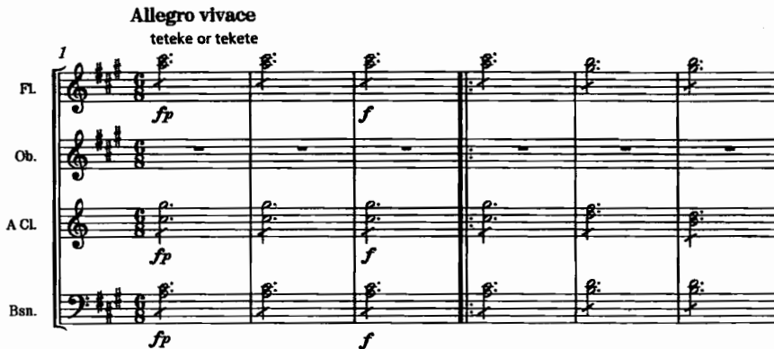

*เครดิต: Adler, Ch. 6, Example 6-10, Mendelssohn, **Symphony No. 4**, first movement, mm. 1–6. ฟังความสัมพันธ์ระหว่าง pattern ลิ้นกับจังหวะทำนอง*

### Flutter tongue และ glissando

- **Flutter tongue** มีลักษณะคล้าย unmeasured tremolo ของเครื่องสายในเชิงหน้าที่ แต่ให้สีเสียงแบบ whir ทำได้ง่ายบน flute, clarinet และ saxophone แต่ยากกว่าบน oboe และ bassoon บันทึกด้วย slash สามเส้นและ/หรือคำกำกับ flutter tongue / *Flt.*
- **Glissando** ประสบความสำเร็จมากที่สุดบน clarinet และ saxophone ในทิศทางขึ้น ส่วนทิศทางลงทำได้ดีระหว่าง pitch ที่อยู่ใกล้กัน เครื่องอื่นมักทำได้เพียงการ “เบน” pitch เล็กน้อยเท่านั้น

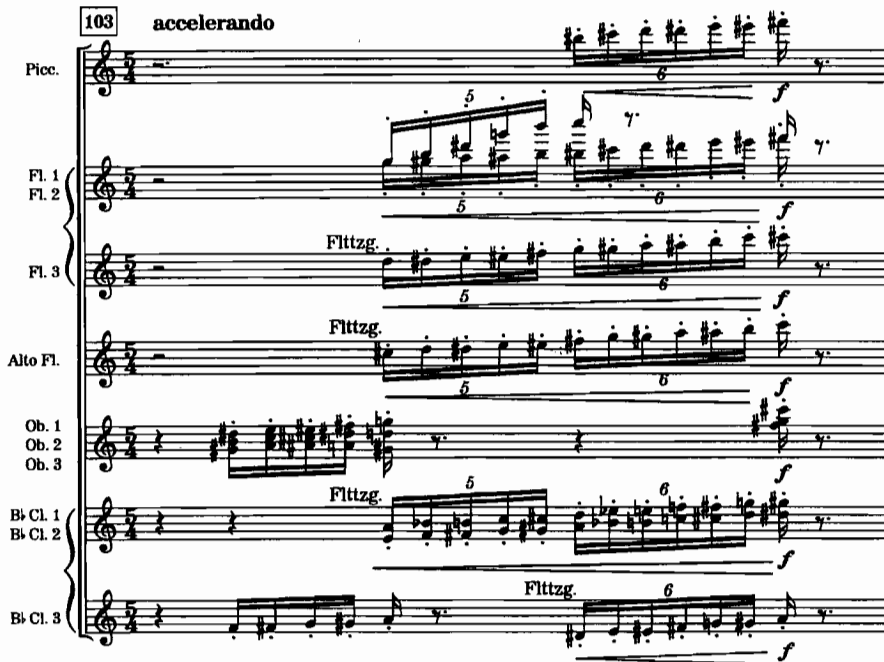

*เครดิต: Adler, Ch. 6, Example 6-13, Stravinsky, **Le Sacre du printemps**, Part I, “Cercles mystérieux des adolescentes,” at 103*

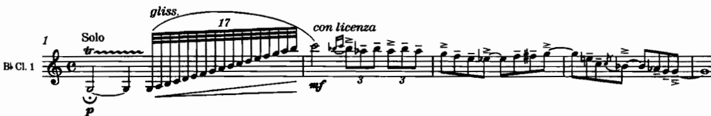

*เครดิต: Adler, Ch. 6, Example 6-14, Gershwin, **Rhapsody in Blue**, opening. สังเกตทิศขึ้นและความเป็น signature gesture*

### Multiphonics และเทคนิคขยาย

Adler ระบุว่า multiphonics และการแรเงา pitch ในรูปแบบใหม่พบได้ในบริบท solo/chamber มากกว่าในงาน orchestral มาตรฐาน และ **สัญลักษณ์การบันทึกโน้ตยังไม่เป็นมาตรฐานสากล** จึงจำเป็นต้องเขียนคำอธิบายกำกับไว้ในสกอร์และพาร์ตเสมอ

Goss ใน *100 More* ข้อเสนอแนะที่ 11 ชี้ให้เห็นว่าความจุด้าน special effects ของฟลูตเป็นประเด็นเฉพาะที่ควรใช้เมื่องานต้องการเท่านั้น มิใช่เพื่อแสดงความรู้ด้านคำศัพท์

## 4. Register และสีของแต่ละเครื่อง

หลักสำคัญของสัปดาห์นี้คือ **อย่าเลือกเครื่องจากชื่อ แต่ให้เลือกจากสีเสียงของ register ประกอบกับหน้าที่ของแนว**

### Flute / Piccolo

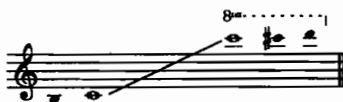

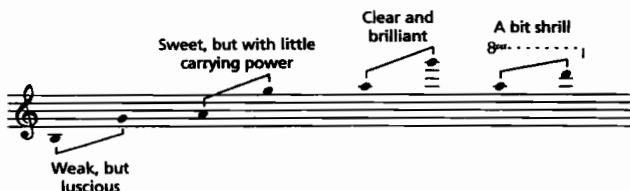

*เครดิต: Adler, Ch. 7, Examples 7-1 และ 7-2. ช่วงต่ำมักอ่อนและมีลมปน ช่วงกลางใส ช่วงสูงสว่างและตัดผ่าน texture ได้ดี*

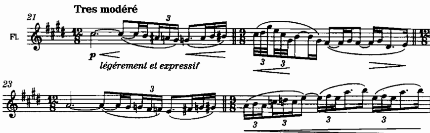

*เครดิต: Adler, Ch. 7, Example 7-6, Debussy, **Prélude à “L’après-midi d’un faune,”** mm. 21–24. ฟังการใช้ register กลาง–สูงอย่างเปิด*

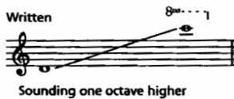

*เครดิต: Adler, Ch. 7, Example 7-20. จำว่า sounding สูงกว่า written หนึ่ง octave*

Goss ใน *100 More* ข้อเสนอแนะที่ 12 เน้นย้ำ “บทกวี” ของ middle register ฟลูต ส่วนข้อเสนอแนะที่ 14 เตือนเรื่องการเขียน unison ระหว่าง piccolo กับ flute ว่าต้องตั้งใจพิจารณาเรื่องสีเสียงและความดังให้รอบคอบ

### Oboe / English horn

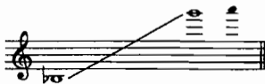

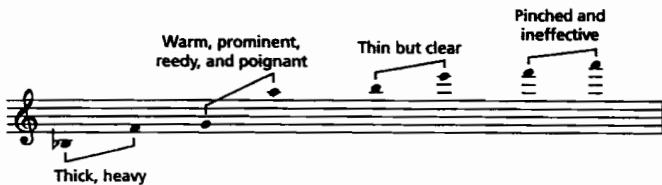

*เครดิต: Adler, Ch. 7, Examples 7-31 และ 7-32. ช่วงต่ำมีลักษณะหนาและเสี่ยงต่อเสียง honk ไม่เหมาะกับ *pp*; ช่วงสูงบางลง ซึ่งตรงข้ามกับแนวโน้มของฟลูตในหลายจุด*

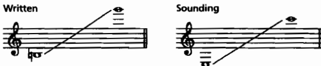

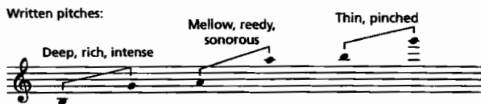

*เครดิต: Adler, Ch. 7, Examples 7-43 และ 7-44. ช่วงต่ำถึงกลางเป็นบุคลิกเด่นของเครื่อง ส่วนช่วงสูงมีลักษณะคล้ายโอโบจนสูญเสียเอกลักษณ์*

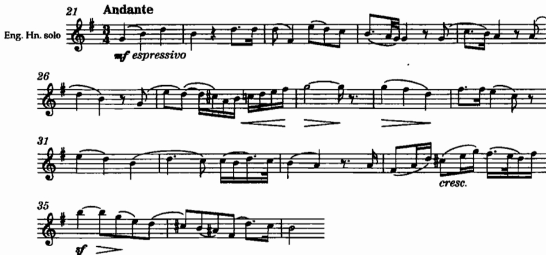

*เครดิต: Adler, Ch. 7, Example 7-45, Berlioz, **Roman Carnival Overture**, mm. 21–37*

Goss ใน *100 More* ข้อเสนอแนะที่ 5 ระบุว่าผู้บรรเลง double reed อาจต้องเปลี่ยน reed ตามลักษณะของ passage จึงควรเผื่อเวลาไว้เมื่อสลับระหว่างโซโลช่วงสูงกับงานหนักในช่วงต่ำ

### Clarinet / Bass clarinet

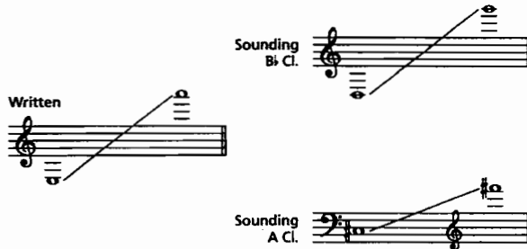

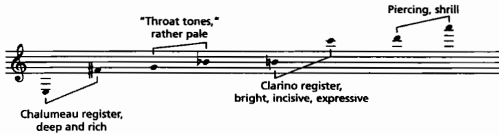

*เครดิต: Adler, Ch. 7, Examples 7-54 และ 7-55. ช่วงเสียงมีความเป็นเนื้อเดียวกันค่อนข้างสูง ผู้เรียบเรียงจำเป็นต้องรู้จัก chalumeau, break และ clarino*

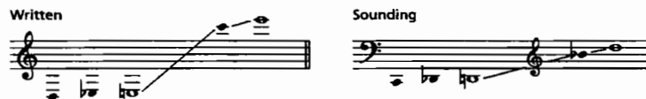

*เครดิต: Adler, Ch. 7, Example 7-72. ใช้คู่กับตาราง transposition เมื่อเขียนพาร์ต*

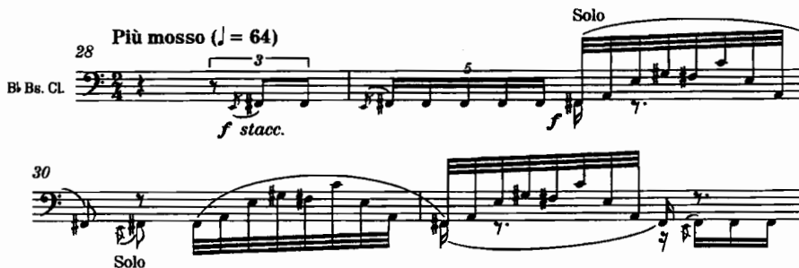

*เครดิต: Adler, Ch. 7, Example 7-76, Stravinsky, **Le Sacre du printemps**, Part I, “L’Adoration de la terre,” mm. 28–31*

Goss ในข้อเสนอแนะที่ 17–18 (ตามกลุ่มที่ 1–25 ในประมวลรายวิชา) เน้นเรื่อง octave melodies และการ blend ของคลาริเน็ต ส่วน *100 More* ข้อเสนอแนะที่ 6–7 เป็นแนวทางการอ่านสำหรับ transposition ของ A และ E♭ clarinet และข้อเสนอแนะที่ 21 ว่าด้วยการมอบหมาย auxiliary clarinet

### Bassoon

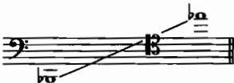

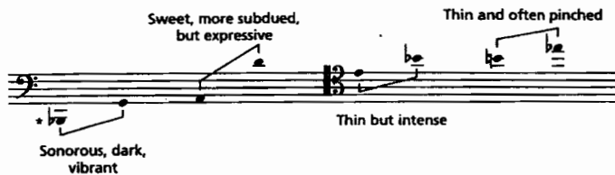

*เครดิต: Adler, Ch. 7, Examples 7-88 และ 7-89. ใช้คู่กับ Goss ข้อเสนอแนะที่ 21 (ลักษณะเฉพาะตัว) และข้อเสนอแนะที่ 24 / *100 More* ข้อเสนอแนะที่ 27 (การใช้งาน register สูง)*

### ตารางวินิจฉัย register อย่างย่อ

| เครื่อง | ความเสี่ยงที่พบบ่อยเมื่อเขียนผิดธรรมชาติ | คำถามตรวจ |
|---|---|---|
| Flute | phrase ยาวใน dynamic ดัง; ทำนองต่ำที่ถูกกลบ | ลมพอไหม และ register ตัด texture ได้จริงหรือไม่ |
| Oboe | *pp* ช่วงต่ำ; phrase ไม่มีที่พัก embouchure | ต้องการสีหนาหรือเสียง “honk” โดยไม่ตั้งใจหรือไม่ |
| Clarinet | ข้าม break เร็วใน tempo สูงโดยไม่จำเป็น | ทำนองนี้ควรอยู่ใน chalumeau หรือ clarino |
| Bassoon | high register ที่ไม่มั่นคงหรือไม่เหมาะบทบาท | ต้องการ character พิเศษหรือเพียงเบสที่อ่านง่าย |

## 5. `a2`, การซ้ำแนว และสีของกลุ่ม

### เขียนบน staff เดียว

Adler อธิบายว่าหากผู้บรรเลงคนที่ 1 และ 2 บรรเลง unison ต้องทำเครื่องหมาย `a2` กำกับไว้ (ผู้บรรเลงสามคนใช้ `a3`)

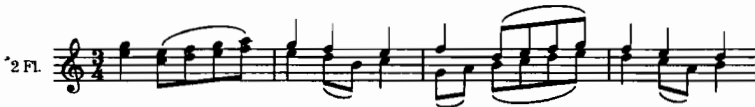

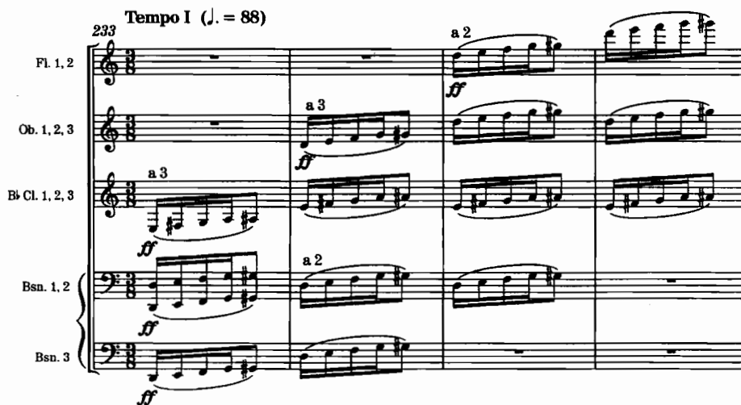

*เครดิต: Adler, Ch. 6, Example 6-17 และตัวอย่างต่อเนื่อง. ตรวจว่าพาร์ตไม่คลุมเครือว่าใครเล่น*

### Solo กับ unison `a2` มิใช่เพียงเรื่องความดัง

Adler ในบทที่ 8 อธิบายว่าเมื่อเครื่องดนตรีชนิดเดียวกันสองชิ้นบรรเลง unison ร่วมกัน จะเกิดการ **เปลี่ยนสีเสียง** เนื่องจากการจูนที่ไม่ตรงกันโดยสมบูรณ์ ซึ่งมีลักษณะคล้ายผลของมิวต์ที่เปลี่ยนสีเสียง มิใช่เพียงทำให้เสียงนุ่มลง การใช้ `a2` ในบทโซโลอาจลดทอนความคล่องตัวของ rubato หรือ expression ที่ผู้บรรเลงเพียงคนเดียวสามารถทำได้ดีกว่า จึงเหมาะสมกว่าเมื่อต้องการเพิ่มปริมาณเสียงในบท tutti

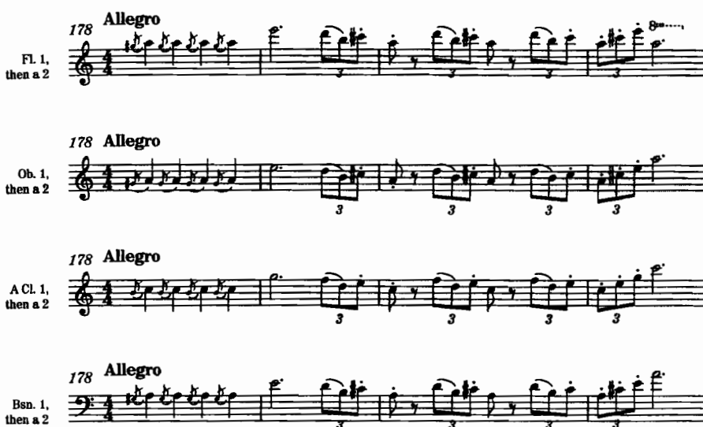

*เครดิต: Adler, Ch. 8, Example 8-7, Rossini, **Semiramide** Overture, mm. 178–181. เปรียบเทียบสี solo กับ doubled*

Adler ยังชี้ให้เห็นว่า **octave doubling** ในหลายกรณีให้เสียงที่โปร่งและทรงพลังกว่าการซ้อน unison ในระดับเสียงเดิม (เปรียบเทียบได้กับหลักการ registration ของออร์แกนแบบท่อ)

Goss ในข้อเสนอแนะที่ 3 เตือนให้พิจารณาผลของการเขียน `a2` unison อย่างรอบคอบก่อนตัดสินใจทุกครั้ง

### การผสมสีในกลุ่มและกับสาย

ให้พิจารณาตัวอย่าง Schubert *Unfinished* ที่ Adler นำเสนอทางเลือกการเรียบเรียงหลายรูปแบบ เช่น flute+oboe, flute+clarinet, oboe+bassoon เพื่อฟังว่าการจับคู่เครื่องดนตรีที่แตกต่างกันเปลี่ยนสีทำนองอย่างไร

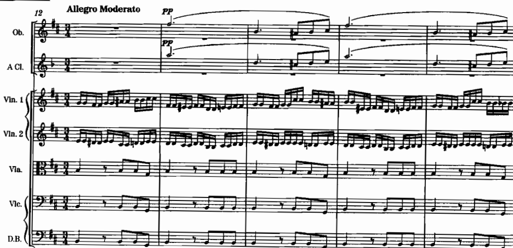

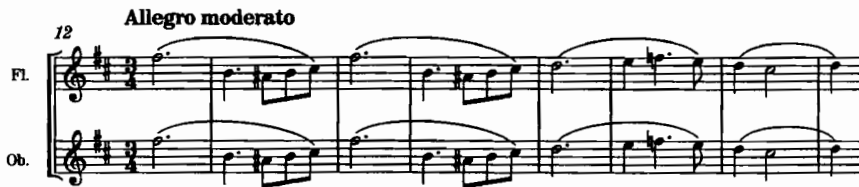

*เครดิต: Adler, Ch. 8, Example จาก Schubert, **Symphony No. 8**, first movement. ฟังคู่สี ไม่ใช่เพียงดูชื่อเครื่อง*

*เครดิต: Adler, Ch. 8, Examples 8-10 และ 8-11, Debussy, **Nocturnes**. สังเกตการใช้ลมเป็นสีตัดกับ texture รอบข้าง*

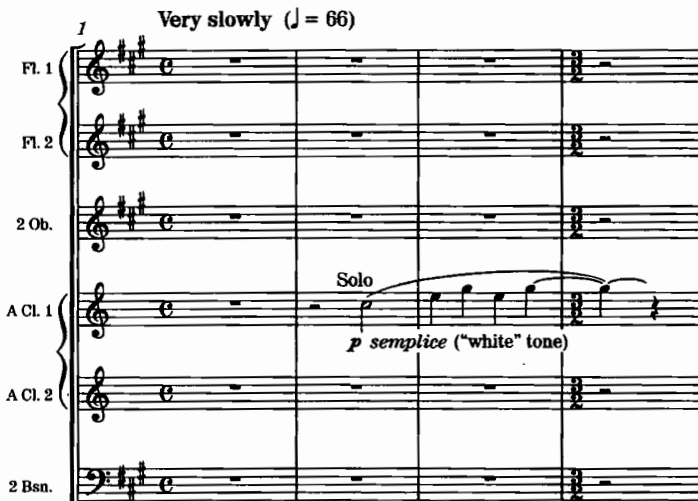

*เครดิต: Adler, Ch. 6, Example 6-5, Copland, **Appalachian Spring**, mm. 1–4. ดูความชัดของ transposition/score order ในบริบทจริง*

## 6. เครื่องสำรองและการเปลี่ยนเครื่อง

หลักเกณฑ์จาก source ที่นำมาใช้ในใบงานมีดังนี้

- ควรเลือกใช้ auxiliary เพราะ **register หรือสีเสียงที่เครื่องหลักไม่สามารถให้ได้ครบถ้วน** มิใช่เพราะต้องการเขียนให้ครบรายชื่อเครื่องดนตรี
- English horn เด่นในช่วงต่ำถึงกลาง alto flute เด่นในความอุดมของช่วงต่ำ และ piccolo เด่นในความสว่างของช่วงสูง
- ผู้บรรเลงที่ต้อง double เครื่องสำรองจำเป็นต้องมีเวลาสำหรับการเปลี่ยนเครื่อง
- ผู้บรรเลง double-reed อาจต้องใช้เวลาเปลี่ยน reed ระหว่าง passage ที่มีลักษณะแตกต่างกัน (Goss, *100 More*, ข้อเสนอแนะที่ 5)
- Goss ใน *100 More* ข้อเสนอแนะที่ 21 แนะนำให้ตรวจสอบการมอบหมาย auxiliary clarinet ว่าผู้บรรเลงคนใดถือเครื่องใดจริง

### แบบฝึก 3 — ตัดสินใจ auxiliary

ให้เลือกทำนองหนึ่งทำนอง แล้วบันทึกออกมาเป็นสามทางเลือก ดังนี้

1. ใช้ flute เพียงอย่างเดียว
2. ใช้ flute แล้วสลับเป็น piccolo
3. ใช้ alto flute ในช่วงเสียงต่ำ

พร้อมอธิบาย trade-off ในด้านลมหายใจ สีเสียง และเวลาที่ใช้ในการเปลี่ยนเครื่อง

## 7. ตัวอย่างสกอร์ที่ต้องอ่านคู่กับเสียง

| ประเด็น | ตัวอย่าง | สิ่งที่ต้องสังเกต |
|---|---|---|
| Transposition ในสกอร์ | Copland, *Appalachian Spring*, mm. 1–4 | written กับ sounding |
| Tonguing / slur | Beethoven, Symphony No. 8, I, mm. 1–4 | จุดลิ้นกับจุดลม |
| Triple tonguing | Mendelssohn, Symphony No. 4, I, mm. 1–6 | pattern ลิ้น |
| Flutter | Stravinsky, *Le Sacre*, “Cercles mystérieux…,” at 103 | notation และสี |
| Clarinet gliss. | Gershwin, *Rhapsody in Blue*, opening | ทิศขึ้น |
| Flute solo register | Debussy, *Prélude à “L’après-midi d’un faune,”* mm. 21–24 | ลมและสี |
| English horn solo | Berlioz, *Roman Carnival*, mm. 21–37 | บุคลิกช่วงต่ำ–กลาง |
| Bass clarinet | Stravinsky, *Le Sacre*, “L’Adoration de la terre,” mm. 28–31 | register และบทบาท |
| Solo vs a2 | Rossini, *Semiramide* Overture, mm. 178–181 | สีและความหนา |
| Woodwind color choir | Debussy, *Nocturnes*, “Nuages,” mm. 21–28; “Fêtes,” mm. 27–29 | ลมตัดกับแนวอื่น |
| Combination choices | Schubert, Symphony No. 8, I (Adler re-scorings) | คู่เครื่องกับสีทำนอง |

## 8. บทเพลงสำหรับ further study จาก source

| หัวข้อ | บทเพลง/ตัวอย่าง | สิ่งที่ต้องฟังหรืออ่าน | แหล่งและตำแหน่ง |
|---|---|---|---|
| Breath phrasing | Mozart, Adagio from Serenade “Gran Partita” (ที่ Goss อ้าง); Janáček *Mládi* (ที่ Goss อ้าง) | ทำเครื่องหมาย rest ที่เป็นวงจรหายใจ ไม่ใช่เพียงช่องว่าง | Goss, *100 Tips*, tip 1 |
| Transposition | Copland, *Appalachian Spring*, mm. 1–4 | เขียน concert pitch ควบคู่พาร์ตจริง | Adler, Ch. 6, Ex. 6-5 |
| Tonguing | Beethoven, Symphony No. 8, I, mm. 1–4; Mendelssohn, Symphony No. 4, I, mm. 1–6 | แยก single/double/triple tonguing จากสกอร์ | Adler, Ch. 6, Ex. 6-6, 6-10 |
| Flutter / gliss. | Stravinsky, *Le Sacre*, at 103; Gershwin, *Rhapsody in Blue*, opening | จด notation และผลต่อ gesture | Adler, Ch. 6, Ex. 6-13–6-14 |
| Flute poetry / solo | Debussy, *Prélude à “L’après-midi d’un faune,”* mm. 21–24; เปรียบ middle register ตาม Goss More tip 12 | ทำเครื่องหมายจุดหายใจและจุดสว่างของ register | Adler, Ch. 7, Ex. 7-6; Goss More tip 12 |
| English horn | Berlioz, *Roman Carnival*, mm. 21–37; Wagner, *Tristan und Isolde*, Act III, Scene 1, mm. 5–11; Sibelius, *The Swan of Tuonela*, mm. 18–32 | เปรียบสีต่ำของ EH กับโอโบ | Adler, Ch. 7, Ex. 7-45–7-47 |
| Clarinet registers | เลือก excerpt คลาริเน็ตจาก Adler Ch. 7 แล้วระบุ chalumeau/break/clarino | เขียนว่าทำนองข้าม break หรือไม่ | Adler, Ch. 7, Ex. 7-54–7-55 และตัวอย่างประกอบ |
| Bass clarinet color | Stravinsky, *Le Sacre*, mm. 28–31; Wagner, *Tristan*, Prelude to Act II, mm. 13–20 | ระบุหน้าที่ใน texture | Adler, Ch. 7, Ex. 7-75–7-76 |
| a2 vs solo | Rossini, *Semiramide* Overture, mm. 178–181 | ฟังความต่างของ overtone/สี ไม่ใช่เพียงความดัง | Adler, Ch. 8, Ex. 8-7–8-8 |
| Choir color | Debussy, *Nocturnes*, “Nuages,” mm. 21–28; “Fêtes,” mm. 27–29 | ชี้ว่าลมเป็น foreground หรือ color layer | Adler, Ch. 8, Ex. 8-10–8-11 |
| Combination laboratory | Schubert, Symphony No. 8, I — ทำนองเดิมในคู่เครื่องต่าง ๆ ตาม Adler | จัดอันดับคู่สีจากมืดไปสว่าง | Adler, Ch. 8, Ex. 8-2 ff. |

### แบบบันทึกการฟัง

1. ชื่อผลงานและตำแหน่งตาม source
2. เครื่อง/auxiliary ที่ใช้
3. written กับ sounding ตรงกันหรือต้องแปลง
4. จุดหายใจและจุดเสี่ยง register
5. หนึ่งการแก้ที่จะใช้ในงานส่งสัปดาห์นี้

## 9. กิจกรรมในชั้นเรียน 120 นาที

1. **นาทีที่ 0–20 — แนวคิดและการฟัง**: เปิดจากคำถาม “ลมเป็นวงจร” ฟังวลีที่มี rest ตามธรรมชาติ แล้วเปรียบเทียบกับวลีที่เบียดลมจนเกินความจำเป็น
2. **นาทีที่ 20–40 — วิเคราะห์สกอร์และเสียง**: แปลง transposition จาก Copland และ English horn solo แล้วตรวจสอบ concert score เทียบกับพาร์ต
3. **นาทีที่ 40–60 — สาธิต articulation และ special effects**: single/double/triple tonguing, flutter, clarinet gliss. โดยให้ผู้เรียนทำเครื่องหมายบนสกอร์ของตนเอง
4. **นาทีที่ 60–95 — เวิร์กชอปปรับแก้ท่อนลม**: แจกจ่ายหรือใช้ท่อนที่มีปัญหา (ลมยาวเกินไป, register ไม่สอดคล้องหน้าที่, `a2` ที่ไม่จำเป็น, transposition ผิดพลาด) แล้วปรับแก้เป็น concert score และ transposed parts
5. **นาทีที่ 95–110 — peer check**: ให้เพื่อนร่วมชั้นเป่าหรืออ่านพาร์ต ตรวจสอบจุดหายใจ เครื่องหมาย `a2` และ transposition
6. **นาทีที่ 110–120 — สรุปและเชื่อมโยงสู่สัปดาห์ที่ 5**: เปรียบเทียบปัญหาของเครื่องลมไม้กับประเด็น overtone, mute และ balance ของเครื่องทองเหลือง

### ผลลัพธ์ที่ควรได้เมื่อจบคาบ

- ฉบับปรับแก้ท่อนลมอย่างน้อย 1 ท่อน (ร่าง)
- concert sketch พร้อม transposed parts อย่างน้อย 2 เครื่อง
- บันทึกการฟัง 1 ชิ้น
- รายการปัญหาที่ยังค้างอยู่

## 10. ใบงานในชั้นเรียน

### ใบงาน A — แผนที่ transposition

| แนว | เครื่อง | Written | Sounding | ช่วงที่เสี่ยง | หมายเหตุ |
|---|---|---|---|---|---|
| 1 |  |  |  |  |  |
| 2 |  |  |  |  |  |
| 3 |  |  |  |  |  |

### ใบงาน B — ตรวจลมและ register

- phrase ยาวที่สุดกี่ห้อง / tempo เท่าไร
- จุดหายใจที่เสนอ
- register นี้ให้สีที่ต้องการหรือเพียง “พอเล่นได้”
- ต้องใช้ auxiliary หรือไม่
- ถ้าเป็น double reed ต้องเผื่อเวลาเปลี่ยน reed หรือไม่

### ใบงาน C — ตรวจ `a2` และการซ้ำแนว

| จุด | solo / a2 / octave | เหตุผลด้านสี | เหตุผลด้านปริมาณ | ตัดสินใจสุดท้าย |
|---|---|---|---|---|
|  |  |  |  |  |

### ใบงาน D — เพื่อนอ่านพาร์ต

1. ทราบหรือไม่ว่าบรรเลงคนเดียวหรือ `a2`
2. transposition อ่านแล้วได้ concert pitch ตรงกับสกอร์รวมหรือไม่
3. slur/tongue ชัดเจนหรือไม่
4. มีตำแหน่งหายใจเพียงพอหรือไม่
5. special effect มีคำอธิบายกำกับเพียงพอหรือไม่

## 11. งานศึกษาด้วยตนเอง 6 ชั่วโมง

- 1.5 ชั่วโมง — ฟังและอ่านสกอร์ตาม further study อย่างน้อย 4 ชิ้น
- 1.5 ชั่วโมง — ปรับแก้ท่อนเครื่องลมที่ไม่สอดคล้องกับธรรมชาติของเครื่องดนตรี
- 1 ชั่วโมง — จัดทำ concert score ให้สอดคล้องกับ transposed parts
- 1 ชั่วโมง — ตรวจสอบลม register และ `a2` auxiliary
- 1 ชั่วโมง — ปรับแก้ตาม peer feedback และเตรียมส่งงาน

หลักฐานที่ควรเก็บไว้มีดังนี้

- ท่อนเดิมก่อนแก้และฉบับหลังแก้
- concert score พร้อม transposed parts
- ตาราง transposition และจุดหายใจ
- บันทึกการฟัง
- คำถามที่ถามผู้บรรเลงเครื่องลมหรือผู้สอน

**งานส่งตามประมวลรายวิชา:** ปรับแก้ท่อนเครื่องลมที่ไม่สอดคล้องกับธรรมชาติของเครื่องดนตรี จัดส่งทั้งฉบับระดับเสียงจริงและพาร์ตที่ทดเสียงแล้ว

## 12. เกณฑ์ตรวจตนเองและจุดเชื่อมไปสัปดาห์ที่ 5

### ตรวจตนเอง

- [ ] concert pitch กับ written pitch สอดคล้องกันทุกแนว
- [ ] วลีมีวงจรหายใจรองรับ มิได้สมมติ circular breathing เป็นค่าเริ่มต้น
- [ ] register สอดคล้องกับหน้าที่ของแนว
- [ ] `a2` ถูกใช้เพราะต้องการสีเสียงหรือปริมาณ มิใช่เพราะลืมแยกพาร์ต
- [ ] auxiliary มีเหตุผลรองรับและมีเวลาสำหรับการเปลี่ยนเครื่อง
- [ ] special effects มี notation หรือคำอธิบายกำกับ
- [ ] ไม่มีการเพิ่มเกณฑ์คะแนนนอกเหนือจากประมวลรายวิชา

### เชื่อมสัปดาห์ที่ 5

สัปดาห์ที่ 5 จะเข้าสู่เนื้อหาเรื่อง **เครื่องลมทองเหลือง** ครอบคลุมประเด็น overtone series, valves/slides, registers, mutes, section balance และ climax

ควรเตรียมความพร้อมจากงานเครื่องลมไม้ในสัปดาห์นี้ ดังนี้

- เก็บท่อนที่เครื่องลมไม้ทำหน้าที่ melodic climax แล้วพิจารณาว่าเครื่องทองเหลืองจะแย่งบทบาทหรือรองรับแนวดังกล่าว
- สังเกตตำแหน่งที่ `a2` ของเครื่องลมไม้ทำให้สีเสียงขุ่นมัว แล้วเปรียบเทียบกับหลักการ mute และ balance ของเครื่องทองเหลือง
- ฝึกพิจารณา dynamic balance ข้ามกลุ่มเครื่องดนตรีก่อนเริ่มเขียน climax รวม

## แหล่งอ้างอิง

- Samuel Adler, *The Study of Orchestration*, 3rd ed., Ch. 6–8.
- Thomas Goss, *100 Orchestration Tips*, tips 1–25 (โดยเฉพาะ 1, 3, 17–18, 21, 24 ตามประเด็นที่ใช้ในสัปดาห์).
- Thomas Goss, *100 More Orchestration Tips*, tips 1, 5–7, 11–12, 14, 21, 27.
- Elaine Gould, *Behind Bars*, Part 2 Woodwind and Brass (transposition, notation conventions).

## Image credits

ภาพคัดจาก `Choice1_BuzzBooks` และคัดลอกไว้ที่ `Weekly content/images/`:

- `adler-ww-written-vs-concert-1.png`, `adler-ww-written-vs-concert-2.png`, `adler-ww-written-pitches.png`, `adler-ww-sounding-pitches.png`, `adler-copland-appalachian-spring-ww.png`, `adler-beethoven-sym8-tonguing.png`, `adler-double-tonguing.png`, `adler-mendelssohn-triple-tonguing.png`, `adler-stravinsky-flutter-tongue.png`, `adler-gershwin-rhapsody-clarinet-gliss.png`, `adler-ww-a2-one-staff.png`, `adler-ww-a2-marking.png` — Adler Ch. 6
- `adler-flute-range.png`, `adler-flute-registral-characteristics.png`, `adler-debussy-faune-flute-solo.png`, `adler-piccolo-range.png`, `adler-piccolo-registral.png`, `adler-oboe-range.png`, `adler-oboe-registral.png`, `adler-english-horn-range.png`, `adler-english-horn-registral.png`, `adler-berlioz-roman-carnival-eh.png`, `adler-clarinet-range.png`, `adler-clarinet-registral.png`, `adler-bass-clarinet-range.png`, `adler-stravinsky-sacre-bass-clarinet.png`, `adler-bassoon-range.png`, `adler-bassoon-registral.png` — Adler Ch. 7
- `adler-schubert-unfinished-ww-theme.png`, `adler-schubert-flute-oboe-double.png`, `adler-rossini-semiramide-solo-doubled.png`, `adler-debussy-nuages-ww-color.png`, `adler-debussy-fetes-ww.png` — Adler Ch. 8

เนื้อหานี้สรุปและเรียบเรียงใหม่จาก source ไม่เพิ่มข้อกำหนดคะแนนนอกประมวลรายวิชา
