# สัปดาห์ที่ 5 — เครื่องลมทองเหลือง: อนุกรมเสียง มิวต์ และสมดุลของกลุ่ม

## คำถามนำ

เครื่องลมทองเหลือง มิได้เป็นเพียง “กลุ่มเครื่องดนตรีที่เสียงดัง” หากแต่เป็นกลุ่มที่แต่ละเสียงผูกพันอยู่กับ **harmonic series** ของท่อ ความตึงของ embouchure ทิศทางของกระดิ่ง และอุปกรณ์เสริมอย่างมิวต์

เนื้อหาสัปดาห์นี้ฝึกออกแบบ **จุดไคลแมกซ์ด้วยกลุ่มเครื่องทองเหลือง** ควบคู่กับท่อนเดียวกันในระดับ dynamic เบา แล้วอธิบายเหตุผลด้านช่วงเสียงและมิวต์ มิใช่เพียงเปิด `fff` แล้วคาดหวังว่าเสียงจะยิ่งใหญ่โดยอัตโนมัติ

## ขอบเขตตามประมวลรายวิชา

- การเป่าทะลุช่วง (overblowing) และหลักอนุกรมเสียง
- วาล์วและสไลด์
- ช่วงเสียงและการผลิตเสียง/การใช้ลิ้น
- มิวต์และอุปกรณ์อื่น
- การซ้ำแนวภายในกลุ่ม
- การนำเสนอทำนอง จุดไคลแมกซ์ และสมดุลไดนามิกของกลุ่ม

งานส่ง: **ออกแบบจุดไคลแมกซ์ด้วยกลุ่มเครื่องทองเหลือง ควบคู่กับท่อนเดียวกันในไดนามิกเบา พร้อมอธิบายเหตุผลด้านช่วงเสียงและมิวต์**

## เมื่อจบสัปดาห์นี้ ผู้เรียนจะสามารถ

1. อธิบายความสัมพันธ์ระหว่าง pitch บนเครื่องทองเหลืองกับ harmonic series และเหตุผลที่บางโน้ตบน natural instrument ไม่สามารถบรรเลงได้
2. เลือก register ของ horn, trumpet, trombone, tuba ให้สอดคล้องกับหน้าที่ของแนว โดยอ้างอิง Adler และ Goss ข้อเสนอแนะที่ 26
3. เลือกชนิด mute (straight, cup, harmon ฯลฯ) ให้ตรงตามเป้าหมายด้านสีเสียง มิใช่เพียงเพื่อลดความดัง
4. ออกแบบ chord spacing และ doubling ของ brass ทั้งในระดับ dynamic เบาและดัง ตามหลักการของ Adler เรื่อง horn doubling
5. เรียบเรียงท่อน climax และฉบับเบาจากวัสดุเดียวกัน พร้อมเหตุผลด้าน register และ mute ประกอบ
6. ระบุความเสี่ยงด้าน balance ระหว่าง horns กับ heavy brass และระหว่างเครื่องทองเหลืองกับเครื่องสาย/ลมไม้

## คำศัพท์สำคัญ

| คำศัพท์ | ความหมายสั้น ๆ |
|---|---|
| Harmonic series / partials | ชุด overtones ที่เกิดจากความยาวท่อหนึ่งค่า |
| Valve / slide | เปลี่ยนความยาวท่อเพื่อย้าย series |
| Natural horn/trumpet | เครื่องที่ partials จำกัดตาม series |
| Heavy brass | กลุ่ม trumpet/trombone/tuba แยกจาก horns ในหลายบริบท balance |
| Straight / cup / harmon mute | ชนิด mute หลักที่เปลี่ยนสีและ projection |
| Stopped horn | มืออุดกระดิ่ง เปลี่ยนสี/pitch ตามเทคนิค |
| Pedal tone | partial ต่ำพิเศษ โดยเฉพาะ trombone/tuba |
| Horn 5ths | ระยะคู่ 5 ที่เป็นภาษาธรรมชาติของ natural horn writing |

## 1. อนุกรมเสียงเป็นแผนที่ มิใช่เพียงทฤษฎี

Adler เริ่มต้นเนื้อหาเครื่องทองเหลืองด้วย harmonic series บน C และแสดงให้เห็นโน้ตที่ไม่สามารถบรรเลงได้เมื่อ fundamental ถูกตรึงไว้คงที่

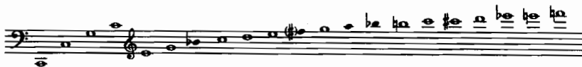

*เครดิต: Adler, Ch. 9, Example 9-2. ใช้ชี้ partial ที่ถี่ขึ้นในช่วงสูง*

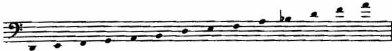

*เครดิต: Adler, Ch. 9, Example 9-3. อธิบายข้อจำกัดของ natural brass ก่อนพูดถึง valves/slides*

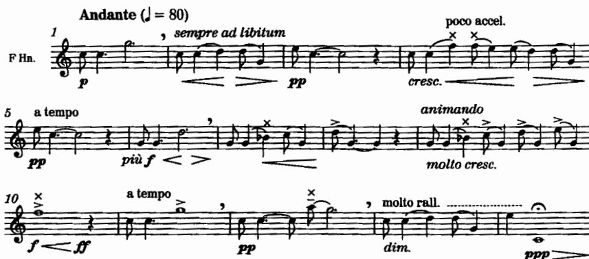

*เครดิต: Adler, Ch. 9, Example 9-4, Britten, **Serenade**, Prologue, mm. 1–14. ฟังภาษา partials ในงานจริง*

Goss ในข้อเสนอแนะที่ 26 เตือนว่าไม่ควรมองเครื่องทองเหลืองทุกชนิดเป็นเครื่องเดียวกันที่ต่างกันเพียงช่วงเสียง เนื่องจาก tuba, horn, trombone และ trumpet ล้วน **เอนเอียงไปทาง partials คนละแบบ** อันเป็นผลจากความแตกต่างของ bore และ mouthpiece

### วาล์วและสไลด์

- **Valves/pistons** ทำหน้าที่เปิดท่อเพิ่มเติมเพื่อย้าย series ลง
- **Slide trombone** เลือก position เพื่อเข้าสู่ series ใหม่ ซึ่ง Adler แสดงตำแหน่งการบรรเลงไว้อย่างละเอียด
- การ slur ระหว่าง partials เทียบกับการ articulation ข้าม valve หรือ slide ให้ความรู้สึกที่แตกต่างกัน (Goss ข้อเสนอแนะที่ 27 ในกลุ่ม 26–50)

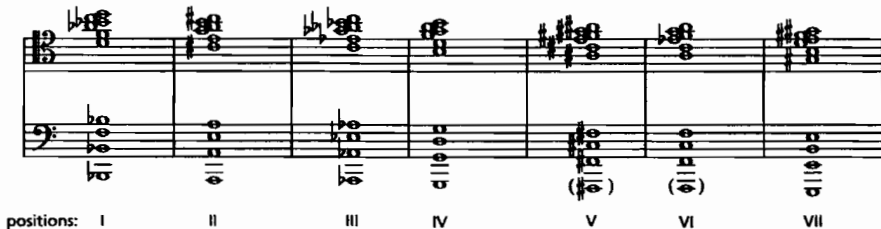

*เครดิต: Adler, Ch. 10, Example 10-68. ใช้เมื่อเขียน passage ที่สไลด์ต้องวิ่งเร็ว*

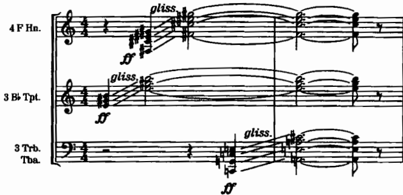

*เครดิต: Adler, Ch. 9, Example 9-15. แยก glissando ที่เป็นธรรมชาติของ trombone ออกจาก gesture ที่ “ฟอร์ม” บน valve brass; ดูเพิ่ม Goss More tip 47 (true vs faked trombone glissando)*

## 2. Register และบุคลิกของแต่ละเครื่อง

### Horn

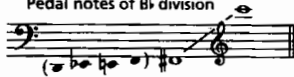

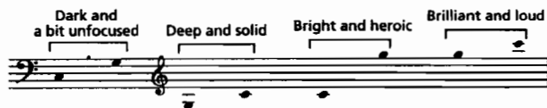

*เครดิต: Adler, Ch. 10, Examples 10-4 และ 10-5 (written pitches สำหรับ valve horn in F)*

- กระดิ่งที่หันไปด้านหลังทำให้ projection แตกต่างจาก heavy brass (Goss ข้อเสนอแนะที่ 29)
- ช่วงเสียงต่ำมีประเด็นเฉพาะที่ต้องพิจารณา (Goss, *100 More*, ข้อเสนอแนะที่ 36)
- การเขียนสามแนวหรือ unison สี่ horns ในจุด climax ต้องระมัดระวังความเสี่ยง cracking (Adler อ้างอิง Schuller เรื่อง unison horns พร้อมตัวอย่างจาก Strauss *Don Juan*)

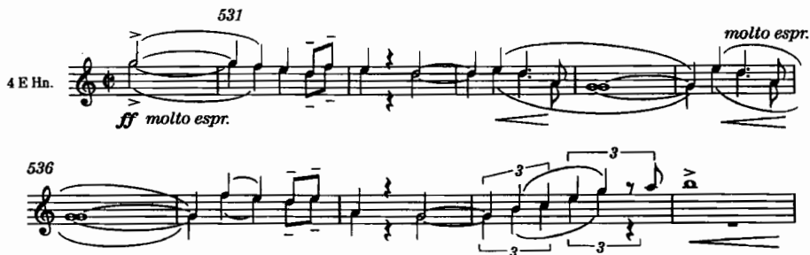

*เครดิต: Adler, Ch. 10, Example 10-12, R. Strauss, **Don Juan**, mm. 530–540*

### Trumpet

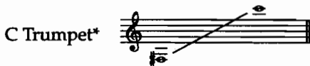

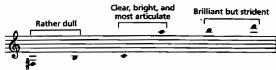

*เครดิต: Adler, Ch. 10, Examples 10-42/10-46 บริเวณ. ใช้คู่กับ Goss More tip 43 (B♭ vs C trumpet) และ tip 45 (key signatures)*

### Trombone

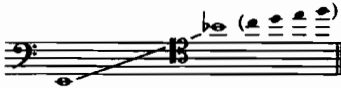

*เครดิต: Adler, Ch. 10, Example 10-66. tenor voice ที่หนาและ penetrative ตามที่ Goss tip 26 อธิบาย*

### Tuba

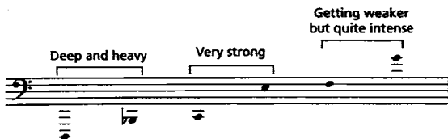

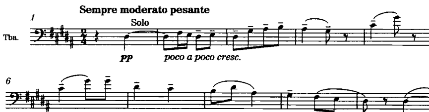

*เครดิต: Adler, Ch. 10, Examples 10-86 และ 10-87, Musorgsky-Ravel, **Pictures at an Exhibition**, “Bydlo,” mm. 1–10. ฟังความกว้างและน้ำหนักของ fundamental region*

Goss ใน *100 More* ข้อเสนอแนะที่ 51–55 ขยายความเรื่อง tuba models ความสัมพันธ์ระหว่าง tuba กับ trombone spectrum ของ muted tuba และเทคนิค legato ควรนำมาใช้เมื่องานส่งเกี่ยวข้องกับเบสทองเหลืองโดยตรง

### แบบฝึก 1 — register map

ให้เลือกคอร์ดสี่เสียง แล้วจัดวางออกมาเป็นสองรูปแบบ ดังนี้

1. ฉบับเบา (soft): กระจาย pitch ให้แต่ละเครื่องอยู่ใน register ที่ควบคุมได้ง่าย
2. ฉบับ climax: ยอมรับความตึงของ partials ในช่วงสูง แต่ต้องระบุความเสี่ยงที่อาจเกิดขึ้น

## 3. Mutes: การเปลี่ยนสีเสียงและ restraint มิใช่เพียงการลดความดัง

Adler นำเสนอชนิด mute หลัก (straight, cup, harmon/wa-wa, whispa, solotone, bucket) และเน้นย้ำว่า passage ที่ใช้มิวต์ยังคงดังได้ แต่คุณภาพเสียงจะถูกบีบหรือเปลี่ยนแปลงไปจากเดิม

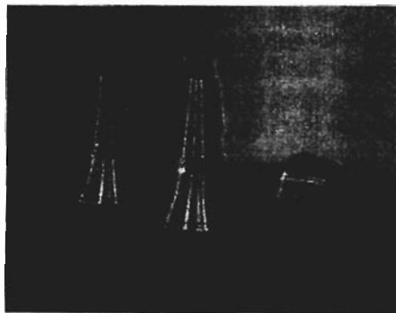

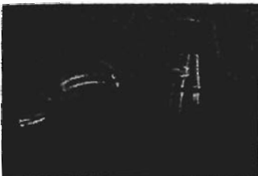

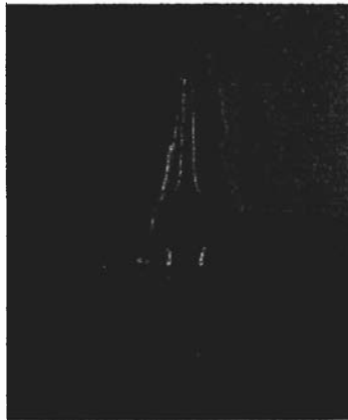

*เครดิต: Adler, Ch. 9, ส่วน mutes. ใช้เปรียบเทียบสี ไม่ท่องชื่ออย่างเดียว*

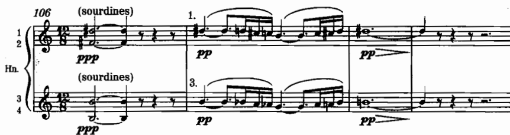

*เครดิต: Adler, Ch. 10, Example 10-22, Debussy, **Prélude à “L’après-midi d’un faune,”** mm. 106–109*

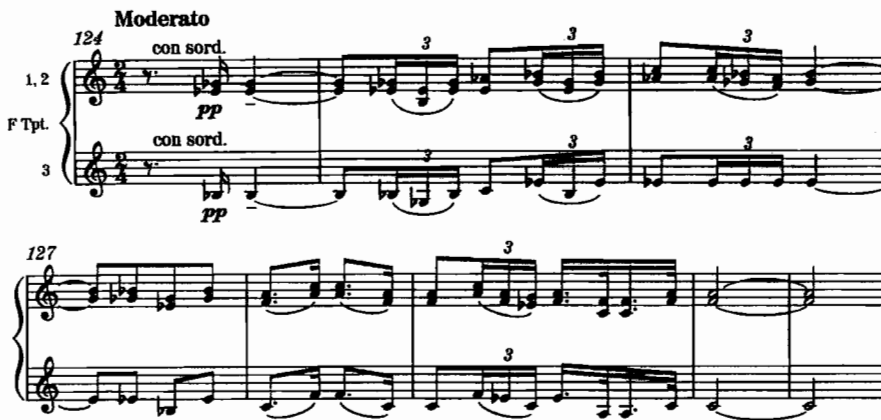

*เครดิต: Adler, Ch. 10, Example 10-51, Debussy, **Nocturnes**, “Fêtes,” mm. 124–131*

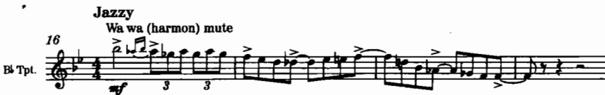

*เครดิต: Adler, Ch. 10, Example 10-52, Gershwin, **Rhapsody in Blue**, mm. 16–19*

หลักปฏิบัติมีดังนี้

- ควรเผื่อเวลาสำหรับการติดตั้งหรือถอดมิวต์ (โดยเฉพาะ tuba mute ซึ่ง Adler เตือนว่ามีขนาดใหญ่และเทอะทะ)
- ควรระบุชนิดของ mute เมื่อสีเสียงมีความสำคัญ คำสั่ง `con sordino` เพียงอย่างเดียวมักหมายถึง straight mute ในบริบทออร์เคสตราส่วนใหญ่ แต่งานเขียนแนว trumpet หรือ jazz-influenced อาจจำเป็นต้องระบุ cup หรือ harmon ให้ชัดเจน
- ฉบับเบาของงานส่งไม่จำเป็นต้องใช้มิวต์เสมอไป บางครั้งเสียง open ในระดับเบาที่ register กลางให้ผลลัพธ์ที่ดีกว่า muted ที่ดัง

## 4. สมดุลของกลุ่ม: doubling, horns เทียบกับ heavy brass, และ climax

### หลัก doubling จาก Adler บทที่ 11

- ที่ระดับ dynamic ไม่เกิน *mf* อาจให้แต่ละเครื่องถือ pitch คนละตัวได้
- ที่ระดับ dynamic ดังกว่า *mf* โดยทั่วไปควร double horns (สอง horn ต่อหนึ่ง pitch) เพื่อให้มีน้ำหนักใกล้เคียงกับ trumpet หรือ trombone หนึ่งตัว
- หลักเกณฑ์นี้ยืดหยุ่นตาม register (trumpet ในช่วงต่ำมีน้ำหนักไม่เท่ากับ trumpet ในช่วงสูง)

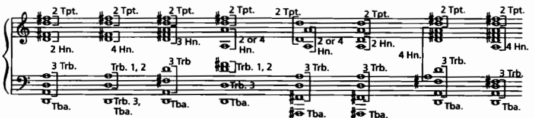

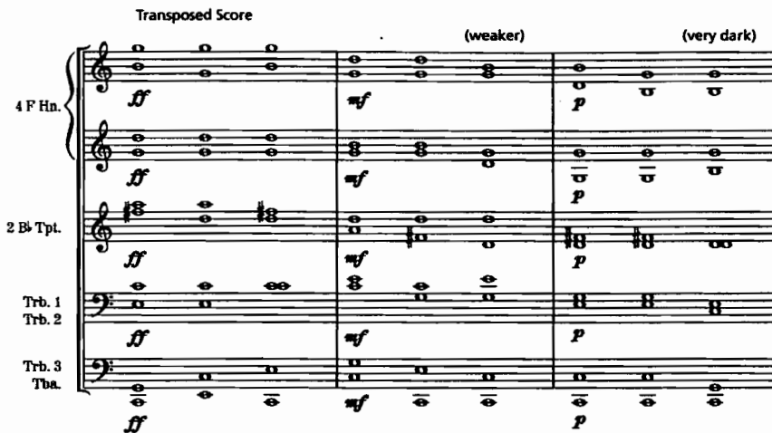

*เครดิต: Adler, Ch. 11, Examples 11-4 และ 11-5*

Goss ในข้อเสนอแนะที่ 29 เตือนว่าไม่ควรพึ่งพาสมการความดังที่ตายตัวเพียงอย่างเดียว แต่ควรพิจารณา **สีเสียง** และ “zero line” ของเครื่องสาย แล้วประเมินว่าเครื่องลมและเครื่องทองเหลืองเสริมหรือตัดกับแนวอื่น เนื่องจาก horns กับ heavy brass มีสนาม projection ที่แตกต่างกัน

Goss ในข้อเสนอแนะที่ 30 ชี้ว่าการจัดวางตำแหน่งนั่งของกลุ่มเครื่องดนตรี (section seating) มีผลต่อ blend และทิศทางของเสียง ควรใช้เป็นคำถามตรวจสอบเมื่อจุด climax ฟังดูไม่ชัดเจนใน playback

### ตัวอย่าง climax ใน repertoire

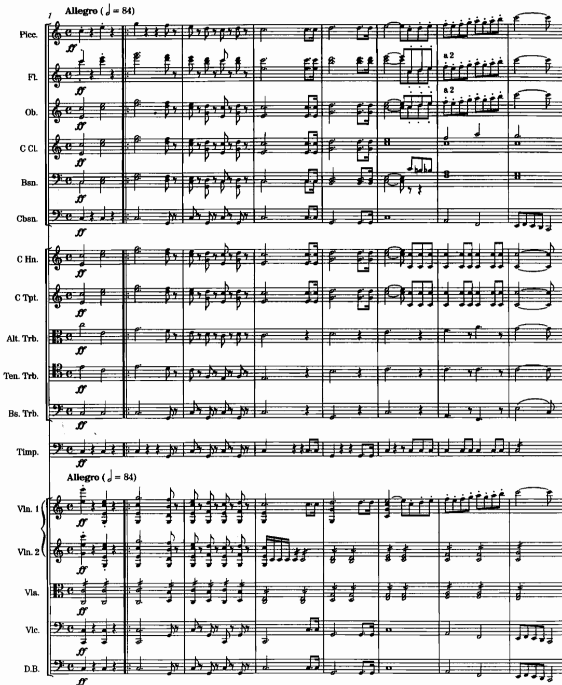

*เครดิต: Adler, Ch. 11, Example 11-3, Beethoven, **Symphony No. 5**, fourth movement, mm. 1–8. สังเกตบทบาท trombone หลังการ build-up*

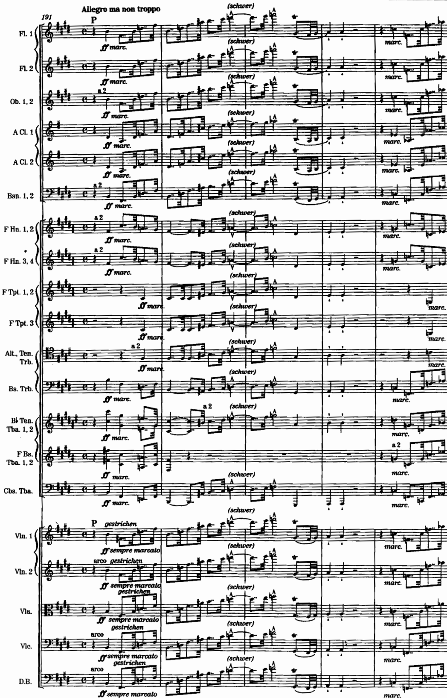

*เครดิต: Adler, Ch. 11, Example 11-7, Bruckner, **Symphony No. 7**, last movement, mm. 191–212. ดู unison/octave กับกลุ่มอื่นและการกระพริบของสี*

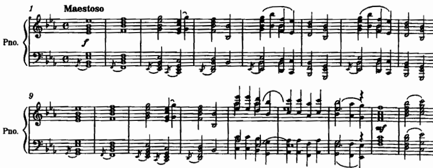

*เครดิต: Adler, Ch. 11, Example 11-9, Musorgsky-Ravel, **Pictures at an Exhibition**, “The Great Gate of Kiev,” mm. 1–17*

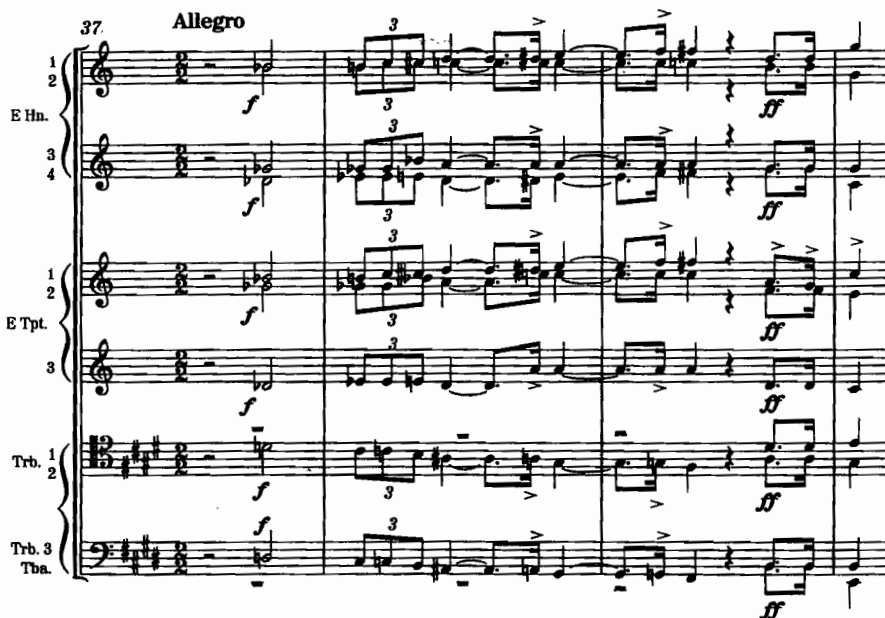

*เครดิต: Adler, Ch. 9, Example 9-1, R. Strauss, **Don Juan**, mm. 37–40*

### แบบฝึก 2 — soft / climax pair (แกนงานส่ง)

ให้ใช้วัสดุเดียวกันความยาว 8–16 ห้อง แล้วจัดทำสองฉบับ ดังนี้

**ฉบับ A — soft**

- dynamic เบา
- spacing เปิดหรือปิดอย่างมีเจตนา
- ใช้ mute หรือ open พร้อมเหตุผลรองรับ
- horns อาจถือ pitch คนละตัวได้

**ฉบับ B — climax**

- dynamic ดัง
- ตรวจสอบ horn doubling
- register ที่ partials มีความถี่สูงขึ้น
- ระบุจุดเสี่ยงต่อการ crack หรือความล้า

ให้เขียนคำอธิบายสั้น ๆ ไว้ใต้สกอร์ว่าเหตุใดฉบับ soft จึงมิใช่เพียง “ฉบับ climax ที่ลดความดังลง” และเหตุใดฉบับ climax จึงมิใช่เพียง “ฉบับ soft ที่เปิดดังขึ้น”

## 5. ตัวอย่างสกอร์ที่ต้องอ่านคู่เสียง

| ประเด็น | ตัวอย่าง | สังเกต |
|---|---|---|
| Harmonic series language | Britten, *Serenade*, Prologue, mm. 1–14 | partials |
| Horn lyric/climax | Strauss, *Don Juan*, mm. 530–540; Ravel, *Pavane*, mm. 1–11 (Adler) | register + risk |
| Muted color | Debussy, *Faune*, mm. 106–109; Debussy, *Fêtes*, mm. 124–131; Gershwin, *Rhapsody*, mm. 16–19 | mute type/effect |
| Tuba character | Musorgsky-Ravel, “Bydlo,” mm. 1–10 | weight of low brass |
| Tutti climax | Beethoven 5/IV, mm. 1–8; Bruckner 7 finale, mm. 191–212; Great Gate, mm. 1–17 | doubling & weight |
| Dynamic spacing | Adler Ex. 11-5 charts | soft vs loud layout |

## 6. บทเพลงสำหรับ further study จาก source

| หัวข้อ | บทเพลง/ตัวอย่าง | สิ่งที่ต้องฟังหรืออ่าน | แหล่ง |
|---|---|---|---|
| Partials / natural language | Britten, *Serenade*, Prologue, mm. 1–14; Bach, *Brandenburg* No. 2, I, mm. 28–30 | ทำเครื่องหมาย partials ที่ใช้ | Adler, Ch. 9, Ex. 9-4–9-5 |
| Horn solo color | Ravel, *Pavane pour une infante défunte*, mm. 1–11; Tchaikovsky, Symphony No. 5, II, mm. 8–16 | register กับ lyric line | Adler, Ch. 10 |
| Horn climax risk | Strauss, *Don Juan*, mm. 530–540 | จุดที่ unison horns ตึง | Adler, Ch. 10, Ex. 10-12 |
| Muted brass | Debussy, *Faune*, mm. 106–109; *Fêtes*, mm. 124–131; Gershwin, *Rhapsody*, mm. 16–19 | เปรียบ open/muted จาก recording | Adler, Ch. 10, Ex. 10-22, 10-51–10-52 |
| Trumpet fanfare/tongue | Mendelssohn, “Wedding March,” mm. 1–5; Verdi, *Aïda*, “Celesta Aïda,” mm. 1–13 | articulation กับ brilliance | Adler, Ch. 10 |
| Trombone/tuba weight | Beethoven 5/IV, mm. 1–8; “Bydlo,” mm. 1–10 | ใครถือ bass thrust | Adler, Ch. 10–11 |
| Massive brass climax | Bruckner 7 finale, mm. 191–212; Great Gate of Kiev, mm. 1–17 | doubling กับกลุ่มอื่น | Adler, Ch. 11, Ex. 11-7, 11-9 |
| Balance thinking | Goss tips 26, 29, 30 + แผนภาพ balance ใน tip 29 | เขียน zero line ของ excerpt หนึ่งชิ้น | Goss, *100 Tips* |
| Mute/tuba spectrum | Goss More tips 54–55; Adler muted tuba example | ผล mute ต่อ spectrum | Goss More; Adler Ch. 10 |

## 7. กิจกรรมในชั้นเรียน 120 นาที

1. **นาทีที่ 0–20** — ฟัง harmonic series และ Britten prologue พร้อมวาด partials ประกอบบนกระดาน
2. **นาทีที่ 20–40** — วิเคราะห์ mute excerpts (Debussy/Gershwin) และเปรียบเทียบสีเสียง
3. **นาทีที่ 40–60** — สาธิตและอภิปราย valves, slide positions, stopped horn, และการเปลี่ยน mute
4. **นาทีที่ 60–95** — เวิร์กชอปจัดทำ soft/climax pair
5. **นาทีที่ 95–110** — peer balance check: ตรวจว่าแนวใดดังเกินไป แนวใดหายไป และมีการ double ผิดชั้นเสียงหรือไม่
6. **นาทีที่ 110–120** — สรุปและเชื่อมโยงสู่สัปดาห์ที่ 6 (percussion/keyboard ช่วยเสริม attack และจุด climax อย่างไร)

## 8. ใบงาน

### ใบงาน A — partials และ register

| โน้ต | เครื่อง | partial โดยประมาณ | ความเสี่ยง | ทางเลือก |
|---|---|---|---|---|
|  |  |  |  |  |

### ใบงาน B — mute decision

| ห้อง | mute/open | ชนิด | เป้าหมายสี | เวลาใส่-ถอดพอไหม |
|---:|---|---|---|---|
|  |  |  |  |  |

### ใบงาน C — soft vs climax checklist

- [ ] ฉบับ soft มิใช่เพียงการลด dynamic ของฉบับ climax
- [ ] ฉบับ climax มีแผน horn doubling รองรับ
- [ ] bass brass มิได้อุดทะลุทุก pitch โดยไม่จำเป็น
- [ ] มีจุดพัก embouchure
- [ ] อธิบายเหตุผลด้าน register และ mute ไว้ครบถ้วน

### ใบงาน D — เพื่อนอ่านพาร์ต

1. ทราบหรือไม่ว่าใช้ mute ชนิดใด
2. transposition ของ horn/trumpet ชัดเจนหรือไม่
3. slide/gliss บรรเลงได้จริงหรือไม่
4. ฉบับ soft ยังคงมีทิศทางของวลีอยู่หรือไม่

## 9. งานศึกษาด้วยตนเอง 6 ชั่วโมง

- 1.5 ชั่วโมง — ฟังและอ่านสกอร์ตาม further study อย่างน้อย 4 ชิ้น
- 1.5 ชั่วโมง — เรียบเรียง soft และ climax pair
- 1 ชั่วโมง — ตรวจสอบ doubling/spacing
- 1 ชั่วโมง — ทดลอง mute ทางเลือกอื่น
- 1 ชั่วโมง — เขียนเหตุผลประกอบและเตรียมส่งงาน

หลักฐานที่ควรเก็บไว้: สองเวอร์ชันของงาน ตาราง mute/register บันทึกการฟัง และคำถามที่ถามผู้บรรเลงเครื่องทองเหลือง

**งานส่งตามประมวลรายวิชา:** ออกแบบจุดไคลแมกซ์ด้วยกลุ่มเครื่องทองเหลือง ควบคู่กับท่อนเดียวกันในไดนามิกเบา พร้อมอธิบายเหตุผลด้านช่วงเสียงและมิวต์

## 10. เกณฑ์ตรวจตนเองและจุดเชื่อมสัปดาห์ที่ 6

- [ ] มีทั้งฉบับ soft และฉบับ climax จากวัสดุเดียวกัน
- [ ] อธิบายเหตุผลด้าน register และ mute ไว้อย่างชัดเจน
- [ ] doubling สอดคล้องกับระดับ dynamic
- [ ] มิได้สมมติว่าเครื่องทองเหลืองที่ดังกว่าย่อมดีกว่าเสมอไป
- [ ] ไม่มีการเพิ่มเกณฑ์คะแนนใหม่นอกเหนือจากที่กำหนด

**เชื่อมสัปดาห์ที่ 6:** เครื่อง percussion และ keyboard จะเข้ามาช่วยเสริม attack, punctuation และ pitch support ให้เก็บรักษาจุด climax ของเครื่องทองเหลืองไว้ เพื่อพิจารณาว่า timpani, piano หรือ celesta ควรเสริมที่ตำแหน่งใดโดยไม่กลบแนวหลัก

## แหล่งอ้างอิง

- Samuel Adler, *The Study of Orchestration*, 3rd ed., Ch. 9–11
- Thomas Goss, *100 Orchestration Tips*, tips 26–50 (เน้น 26, 29, 30)
- Thomas Goss, *100 More Orchestration Tips*, tips 31, 36, 38, 41, 43, 45, 47, 49–55
- Elaine Gould, *Behind Bars*, Part 2 Woodwind and Brass

## Image credits

Adler Ch. 9–11 ภาพใน `Weekly content/images/`:

`adler-brass-harmonic-series-c.png`, `adler-brass-unplayable-notes.png`, `adler-britten-serenade-horn-natural.png`, `adler-brass-glissandi.png`, `adler-straight-mute.png`, `adler-cup-mute.png`, `adler-harmon-mute.png`, `adler-bucket-mute.png`, `adler-horn-range.png`, `adler-horn-registral.png`, `adler-trumpet-range.png`, `adler-trumpet-registral.png`, `adler-trombone-range.png`, `adler-trombone-positions.png`, `adler-tuba-registral.png`, `adler-mussorgsky-bydlo-tuba.png`, `adler-strauss-don-juan-horns.png`, `adler-strauss-don-juan-brass-intro.png`, `adler-debussy-faune-muted-horns.png`, `adler-debussy-fetes-muted-trumpet.png`, `adler-gershwin-rhapsody-muted-trumpet.png`, `adler-beethoven-sym5-brass-climax.png`, `adler-brass-usual-doublings.png`, `adler-brass-dynamic-doubling.png`, `adler-bruckner-sym7-brass-climax.png`, `adler-mussorgsky-ravel-great-gate.png`

เนื้อหาเรียบเรียงใหม่จาก source สถานะรอตรวจโดยผู้สอน
