# สัปดาห์ที่ 6 — เครื่องกระทบและคีย์บอร์ด: การบันทึกโน้ตและการวางผัง

## คำถามนำ

เครื่องกระทบมิได้เป็นเพียง “ชั้นเอฟเฟกต์ท้ายสกอร์” หากแต่เป็นกลุ่มเครื่องดนตรีที่ต้องออกแบบอย่างรอบคอบ ทั้ง **จำนวนผู้บรรเลง ไม้ตี เวลาเปลี่ยนเครื่อง และการบันทึกโน้ตที่ผู้อ่านเข้าใจได้ทันที**

งานส่งของสัปดาห์นี้คือแบบฝึกเทคนิคชิ้นที่ 3 ได้แก่ ท่อนเครื่องกระทบพร้อมผังการวางเครื่องและการมอบหมายผู้บรรเลงที่สามารถปฏิบัติได้จริง

## ขอบเขตตามประมวลรายวิชา

- จำนวนและการกระจายผู้บรรเลงเครื่องกระทบ
- หลักการบันทึกโน้ตเครื่องกระทบ
- ไม้ตีและอุปกรณ์ตี
- เครื่องระดับเสียงแน่นอนและไม่แน่นอน
- การตั้งเสียงและการเปลี่ยนเสียงทิมปานี
- เปียโน เชเลสตา และคีย์บอร์ดในวง
- การวางผังเครื่องกระทบในสกอร์เต็มและการจัดวางบนเวที

## เมื่อจบสัปดาห์นี้ ผู้เรียนจะสามารถ

1. เลือกรูปแบบ notation แบบ five-line หรือ single-line ให้เหมาะสมกับแต่ละเครื่อง
2. จำแนกเครื่อง pitched และ non-pitched และระบุไม้ตีที่ต้องการ
3. วางแผนการตั้งเสียง timpani และกำหนดจุดเปลี่ยนเสียง
4. มอบหมายเครื่องดนตรีให้ผู้บรรเลง 2–4 คน โดยเผื่อเวลาสำหรับการเปลี่ยนไม้หรือเปลี่ยนเครื่อง
5. วางตำแหน่ง timpani, percussion และ keyboard ในสกอร์ตามตรรกะที่อ่านได้ง่าย
6. จัดส่งแบบฝึกเทคนิคชิ้นที่ 3 พร้อมผังและ assignment ประกอบ

## คำศัพท์สำคัญ

| คำ | ความหมายสั้น |
|---|---|
| Pitched / non-pitched | มี/ไม่มี pitch ที่เขียนบน staff ห้าเส้นแบบทำนอง |
| Mallet / beater / stick | อุปกรณ์ตีที่เปลี่ยน attack และสี |
| l.v. | let vibrate |
| Dead stroke | กดไม้ค้างเพื่อหยุดก้อง |
| Pedal timpani | เปลี่ยน pitch ด้วยคันเหยียบ |
| Assignment | การมอบหมายเครื่องต่อผู้เล่น |
| Setup / stage plot | ผังวางเครื่องบนเวที |
| Celesta | คีย์บอร์ดเสียงระฆังโลหะ (Adler: ใช้ในออร์เคสตราเป็นสีพิเศษ) |

## 1. Notation มาก่อนรายชื่อเครื่อง

Adler จำแนก notation ออกเป็นอย่างน้อยสองรูปแบบหลัก ดังนี้

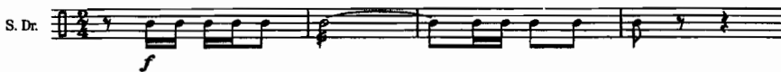

*เครดิต: Adler, Ch. 12, Example 12-1. ใช้กับ pitched percussion หรือเมื่อหลายเครื่องอยู่บน staff เดียวอย่างเป็นระบบ*

*เครดิต: Adler, Ch. 12, Example 12-2. ใช้กับ non-pitched เดี่ยวที่ต้องการความชัดของจังหวะ*

หลักเกณฑ์จาก Adler บทที่ 14 มีดังนี้

- ต้องติดป้ายชื่อเครื่องทั้งที่ต้นสกอร์และในพาร์ต
- หากผู้บรรเลงหนึ่งคนถือหลายเครื่อง ต้องมีเวลาเพียงพอสำหรับการเปลี่ยน stick
- หากใช้มือทั้งสองข้างถือ beater คนละชนิด ต้องเขียนให้สามารถปฏิบัติได้จริง

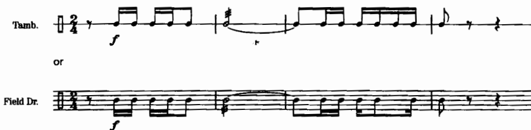

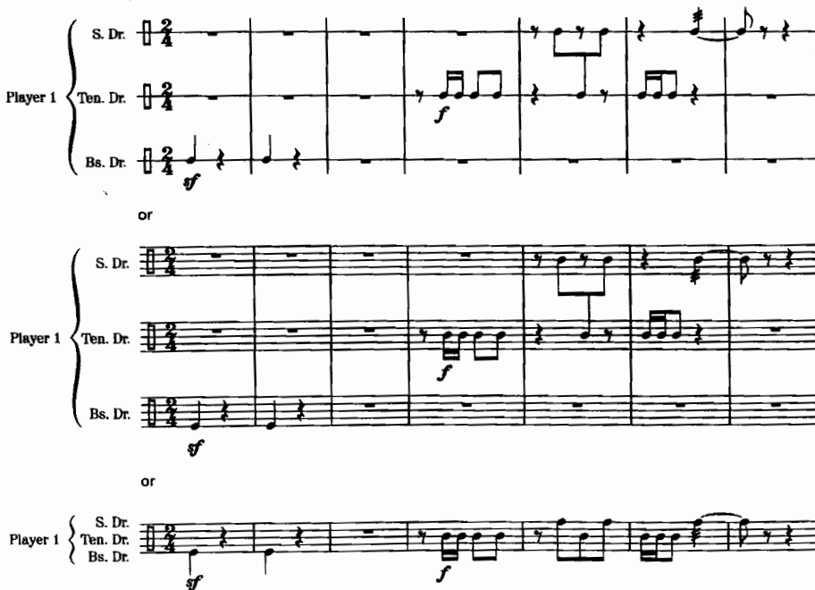

*เครดิต: Adler, Ch. 14, Examples 14-1 และ 14-2*

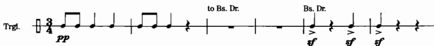

*เครดิต: Adler, Ch. 14, Example 14-4. ตรวจว่ามีเวลาเปลี่ยน stick ระหว่าง triangle กับ bass drum หรือ snare หรือไม่*

## 2. Pitched percussion ที่ใช้บ่อย

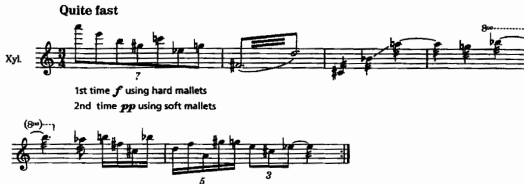

*เครดิต: Adler, Ch. 12, Example 12-4*

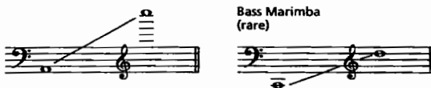

*เครดิต: Adler, Ch. 12, Example 12-5*

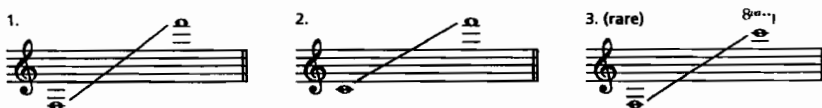

*เครดิต: Adler, Ch. 12, Example 12-7/12-8 บริเวณ. ระวัง motor, pedal, dead stroke*

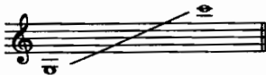

*เครดิต: Adler, Ch. 12, Example 12-11*

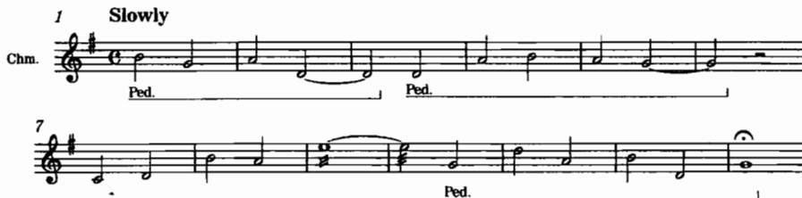

*เครดิต: Adler, Ch. 12, Example 12-14*

คำถามด้านหน้าที่ที่ต้องพิจารณาคือ เครื่องนี้ทำหน้าที่ให้ attack, sparkle, sustain หรือ pitch reinforcement

## 3. Timpani: pitch, roll, retune

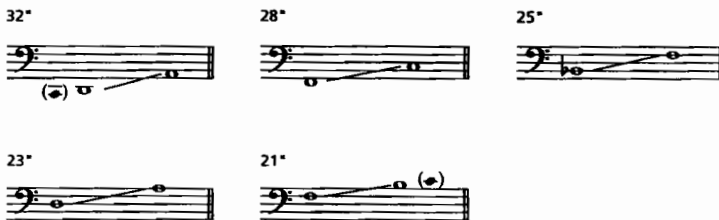

*เครดิต: Adler, Ch. 12, Example 12-24*

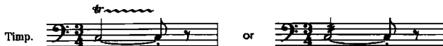

*เครดิต: Adler, Ch. 12, Example 12-25*

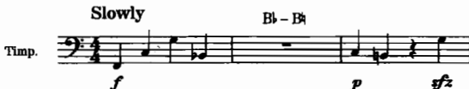

*เครดิต: Adler, Ch. 12, Example 12-29. ต้องระบุ pitch ใหม่และเวลาเปลี่ยน*

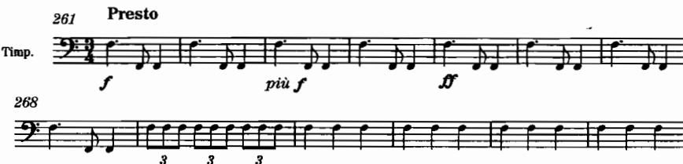

*เครดิต: Adler, Ch. 12, Example 12-30, Beethoven, **Symphony No. 9**, second movement, mm. 261–273*

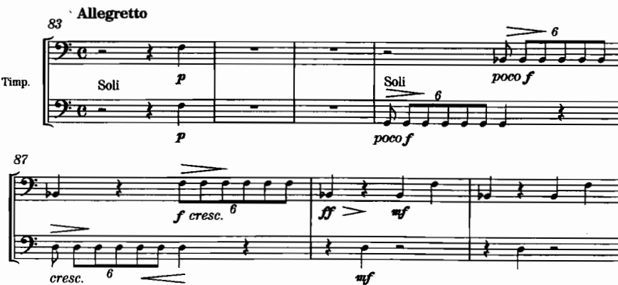

*เครดิต: Adler, Ch. 12, Example 12-31, Berlioz, **Symphonie fantastique**, fourth movement, mm. 83–89*

## 4. Keyboard ในวง: piano และ celesta

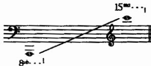

*เครดิต: Adler, Ch. 13, Example 13-1*

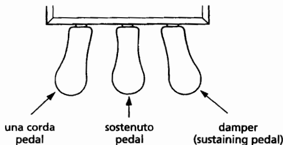

*เครดิต: Adler, Ch. 13, “The Three Piano Pedals”*

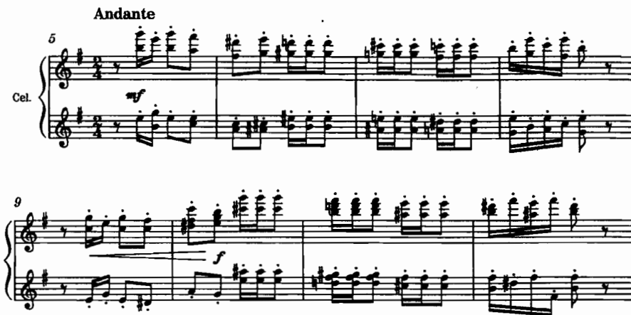

*เครดิต: Adler, Ch. 13, Example 13-6, Tchaikovsky, **The Nutcracker**, “Dance of the Sugar Plum Fairy,” mm. 5–12*

Adler จัดวาง percussion และ keyboard ไว้ระหว่างกลุ่มทองเหลืองกับกลุ่มเครื่องสาย โดยให้ timpani อยู่ในลำดับก่อน ผู้เรียบเรียงจำเป็นต้องรักษาความสม่ำเสมอของลำดับนี้ตลอดทั้งสกอร์

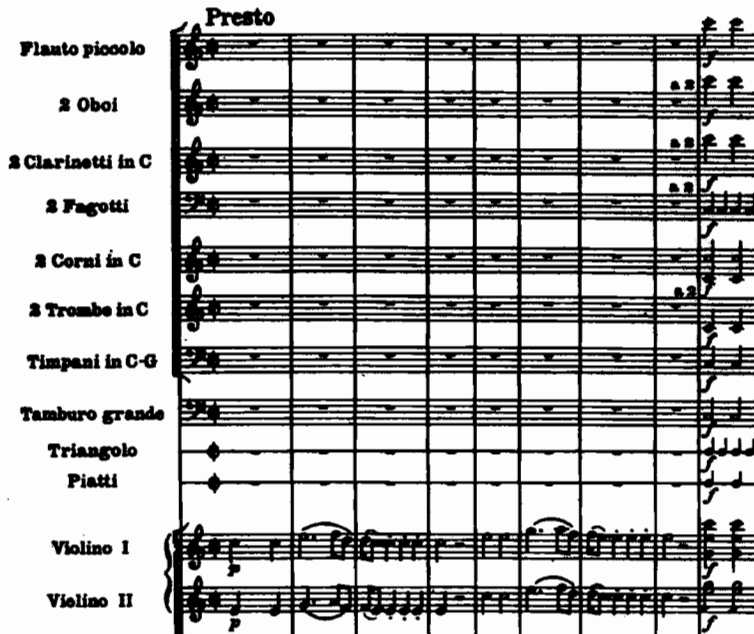

*เครดิต: Adler, Ch. 14, Example 14-7, Mozart, **Die Entführung aus dem Serail**, Overture, mm. 1–9. ดูการจัดกลุ่มเครื่องในสกอร์จริง*

## 5. ผังผู้เล่น: หัวใจของงานส่ง

| ผู้เล่น | เครื่องที่ถือ | ไม้ตี | จุดเปลี่ยน | เวลาพักที่มี |
|---|---|---|---|---|
| Perc 1 |  |  |  |  |
| Perc 2 |  |  |  |  |
| Perc 3 |  |  |  |  |
| Timpani |  |  | retune ที่ห้อง… |  |
| Keyboard | piano/celesta | — |  |  |

หลักเกณฑ์จาก Adler มีดังนี้

1. ห้ามสมมติว่าผู้บรรเลงคนเดียวสามารถถือทุกเครื่องได้
2. ต้องเผื่อเวลาสำหรับการเปลี่ยน stick ระหว่างเครื่องที่ต้องการไม้ต่างชนิดกัน
3. ต้องติดป้ายกำกับทุกครั้งที่มีการเปลี่ยนเครื่อง
4. หากต้องการ roll จำเป็นต้องมี stick ครบทั้งสองมือ

## 6. บทเพลง further study

| หัวข้อ | ตัวอย่าง | สิ่งที่ต้องทำ | แหล่ง |
|---|---|---|---|
| Notation clarity | Adler Ex. 12-1, 12-2, 14-1–14-4 | เปรียบ single-line กับ multi-instrument staff | Adler 12, 14 |
| Timpani drama | Beethoven 9/II, mm. 261–273; Berlioz *Fantastique* IV, mm. 83–89 | ทำเครื่องหมาย pitch/role | Adler 12 |
| Celesta color | Tchaikovsky, “Sugar Plum Fairy,” mm. 5–12 | ฟัง attack กับ sustain | Adler 13 |
| Large setup | Mozart, *Entführung* Overture, mm. 1–9 | วาด assignment สมมติ 3 คน | Adler 14 |
| Combined keyboards | รายการ additional passages ใน Adler 13 (Bartók *Music for Strings, Percussion and Celesta* ฯลฯ ตามที่ source ระบุ) | จดหน้าที่ piano/celesta/harp | Adler 13 |

## 7. กิจกรรมในชั้นเรียน 120 นาที

1. **นาทีที่ 0–20** — ฟังและเปรียบเทียบรูปแบบ notation ต่าง ๆ
2. **นาทีที่ 20–40** — วิเคราะห์การ retune ของ timpani จากตัวอย่างสกอร์
3. **นาทีที่ 40–60** — สาธิตไม้ตีและฝึกทำ assignment บนกระดาน
4. **นาทีที่ 60–95** — เวิร์กชอปแบบฝึกเทคนิคชิ้นที่ 3
5. **นาทีที่ 95–110** — peer check ตรวจสอบผังผู้บรรเลง
6. **นาทีที่ 110–120** — สรุปและเชื่อมโยงสู่สัปดาห์ที่ 7 (โครงสร้างก่อนพื้นผิว)

## 8. ใบงาน

**ใบงาน A** ตารางการมอบหมาย (assignment) · **ใบงาน B** ตรวจสอบการ retune ของ timpani · **ใบงาน C** ตรวจสอบหน้าสกอร์ของเครื่องกระทบ · **ใบงาน D** เพื่อนอ่านพาร์ต: ทราบหรือไม่ว่าถือเครื่องใด และเปลี่ยนไม้ ณ ตำแหน่งใด

## 9. งานศึกษาด้วยตนเอง 6 ชั่วโมง

1.5 ชั่วโมง ฟังและอ่านสกอร์ตาม further study · 2 ชั่วโมง เรียบเรียงท่อนเครื่องกระทบและ keyboard · 1 ชั่วโมง จัดทำผังและ assignment · 1 ชั่วโมง ตรวจสอบ notation และการ retune · 0.5 ชั่วโมง ปรับแก้ก่อนส่ง

**งานส่ง:** แบบฝึกเทคนิคชิ้นที่ 3 — ท่อนเครื่องกระทบพร้อมผังการวางเครื่องและการมอบหมายผู้บรรเลงที่สามารถปฏิบัติได้จริง

## 10. เชื่อมสัปดาห์ที่ 7

ให้เก็บรักษา texture ที่เครื่องกระทบทำหน้าที่ punctuation ไว้ เพื่อพิจารณาว่า “โครงสร้าง” ของวลีมีความชัดเจนแล้วหรือยังก่อนเพิ่มสีสันเข้าไป สัปดาห์ที่ 7 จะเน้นเรื่อง outline, reduction และ development chart ก่อนเริ่มส่งโครงงานที่ 1

## แหล่งอ้างอิง

- Adler, Ch. 12–14
- Gould, *Behind Bars*, Part 2 Percussion and Keyboard

## Image credits

`adler-perc-notation-fiveline.png`, `adler-perc-notation-singleline.png`, `adler-xylophone.png`, `adler-marimba-range.png`, `adler-vibraphone.png`, `adler-glockenspiel-range.png`, `adler-chimes.png`, `adler-timpani-ranges.png`, `adler-timpani-rolls.png`, `adler-timpani-tuning-changes.png`, `adler-beethoven-sym9-timpani.png`, `adler-berlioz-fantastique-timpani.png`, `adler-piano-range.png`, `adler-piano-pedals.png`, `adler-nutcracker-celesta.png`, `adler-perc-score-single.png`, `adler-perc-score-several.png`, `adler-perc-two-instruments-one-player.png`, `adler-mozart-seraglio-perc.png` — Adler Ch. 12–14

## เกณฑ์ตรวจตนเอง (เพิ่มเติม)

- [ ] หัวข้อและวันที่ตรงกับประมวลรายวิชา
- [ ] งานส่งตรงตามข้อกำหนดของประมวลรายวิชา ไม่มีเกณฑ์คะแนนใหม่เพิ่มเติม
- [ ] ภาพทุกไฟล์เปิดได้และมีเครดิตกำกับครบถ้วน
- [ ] มีรายการ further study อย่างน้อย 4 รายการจาก source
- [ ] มีใบงานและแผนการศึกษาด้วยตนเอง 6 ชั่วโมง
- [ ] มีจุดเชื่อมโยงไปยังสัปดาห์ถัดไป
- [ ] สถานะยังคงเป็น รอตรวจโดยผู้สอน
