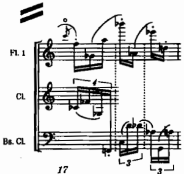
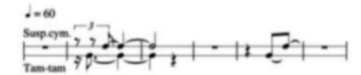

# สัปดาห์ที่ 8 — โครงงานสร้างสรรค์ที่ 1 (สอบกลางภาค)

## คำถามนำ

สัปดาห์นี้**มิใช่สัปดาห์ที่สอนเทคนิคใหม่** หากแต่เป็นสัปดาห์สำหรับนำเสนอและส่งโครงงานสร้างสรรค์ที่ 1 ตามข้อกำหนดของประมวลรายวิชา

## ขอบเขตตามประมวลรายวิชา

**ชื่องาน:** การเรียบเรียงเสียงเชิงสร้างสรรค์จากต้นแบบ

- ความยาว **1.5–2.5 นาที**
- เลือกกำลังวง: วงขนาดห้อง / ออร์เคสตรามาตรฐาน / วินด์แบนด์
- ต้องแสดงมุมมองทางศิลปะของตนเอง **มิใช่การถอดแบบตรงตัว**
- ตรงกับช่วงสอบกลางภาค 21–25 กันยายน 2569

## สิ่งที่ต้องส่ง (ยึดตามประมวลรายวิชาเท่านั้น)

1. โครงร่างและสกอร์ย่อ แสดงการวิเคราะห์ต้นแบบ
2. สกอร์เต็มในรูปแบบ PDF
3. พาร์ตที่แยกแล้วอย่างน้อย 2 พาร์ต ในรูปแบบ PDF
4. เสียงตัวอย่างหรือการบันทึกการอ่านโน้ต
5. คำชี้แจงเหตุผลความยาว 1 หน้า ครอบคลุมปัญหาทางดนตรีที่ตั้งใจแก้ไข ตลอดจนแหล่งที่มาและสถานะลิขสิทธิ์ของต้นแบบ

**การนำเสนอ:** คนละประมาณ 8–10 นาที รวมช่วงวิพากษ์

## สัดส่วนคะแนนที่เกี่ยวข้อง (จากประมวลรายวิชา)

- โครงงานสร้างสรรค์ที่ 1 = **25%**
- เกณฑ์การประเมินโครงงาน (ใช้ตามที่ประมวลรายวิชากำหนด มิได้สร้างขึ้นใหม่):
  - โครงสร้างและเจตนาทางศิลปะ 25%
  - การเรียบเรียงที่เหมาะสมกับเครื่องดนตรีและการแก้ไขปัญหา 25%
  - สกอร์และพาร์ต 20%
  - การฟัง การวิเคราะห์ และการอธิบาย 15%
  - การปรับปรุง การร่วมงาน และจรรยาบรรณ 15%

## เมื่อจบสัปดาห์นี้ ผู้เรียนจะสามารถ

1. จัดส่งเอกสารครบชุดตามรายการที่ประมวลรายวิชากำหนด
2. นำเสนอเจตนา โครงสร้าง และเหตุผลการเลือกสีเสียง ภายในเวลา 8–10 นาที
3. ตอบคำถามในช่วงวิพากษ์และบันทึกข้อเสนอแนะเพื่อนำไปพัฒนาต่อ
4. ระบุแหล่งที่มาและสถานะลิขสิทธิ์ของต้นแบบได้อย่างชัดเจน

## Checklist ก่อนขึ้นนำเสนอ

- [ ] ความยาว 1.5–2.5 นาที
- [ ] มิใช่ transcription ตรงตัว
- [ ] มี reduction/outline ประกอบ
- [ ] full score อ่านได้อย่างชัดเจน
- [ ] parts ครบอย่างน้อย 2 พาร์ต
- [ ] มี audio/demo ประกอบ
- [ ] มีหน้าเหตุผลและข้อมูลลิขสิทธิ์
- [ ] ตั้งชื่อไฟล์เป็นระบบและอัปโหลดตามที่รายวิชากำหนด

## กิจกรรมในชั้นเรียน 120 นาที

1. **นาทีที่ 0–10** — ชี้แจงลำดับการนำเสนอและกติกาการวิพากษ์ตามเกณฑ์ของประมวลรายวิชา
2. **นาทีที่ 10–110** — นำเสนอรายบุคคลคนละ 8–10 นาที (รวมช่วงวิพากษ์)
3. **นาทีที่ 110–120** — สรุปข้อสังเกตร่วมและปูทางสู่เนื้อหาครึ่งหลังของรายวิชา

*จำนวนผู้เรียนอาจทำให้ต้องปรับลำดับคิว แต่ห้ามแทนที่การนำเสนอด้วยการบรรยายเทคนิคใหม่*

## ใบงานในชั้นเรียน (สำหรับผู้ฟัง)

| ผู้นำเสนอ | เจตนาที่ได้ยิน | จุดแข็งด้านเครื่อง | จุดที่สกอร์/พาร์ตยังคลุมเครือ | คำถามหนึ่งข้อ |
|---|---|---|---|---|
|  |  |  |  |  |

## งานศึกษาด้วยตนเอง 6 ชั่วโมง (ช่วงนี้)

ช่วงเวลาส่วนใหญ่ใช้ก่อนเข้าชั้นเรียน ได้แก่ การซ้อมนำเสนอ ตรวจสอบไฟล์ ตรวจสอบสถานะลิขสิทธิ์ และซ้อมพูดให้อยู่ในเวลา 8–10 นาที
ส่วนหลังคาบเรียน ให้บันทึกข้อเสนอแนะที่ได้รับเพื่อนำไปใช้พัฒนางานในครึ่งหลังของรายวิชา (มิใช่การส่งงานเพิ่มเติมนอกเหนือจากที่ประมวลรายวิชากำหนด)

## ภาพประกอบ (อย่างน้อย 3 ภาพ — ใช้เป็นตัวช่วยตรวจสอบสกอร์ มิใช่เนื้อหาเทคนิคใหม่)

*เครดิต: Adler, Ch. 18, Example 18-1. ใช้ตรวจว่าสกอร์โครงงานอ่านชั้นเครื่องได้*

*เครดิต: Adler, Ch. 18, Example 18-1 continued*

*เครดิต: Elaine Gould, **Behind Bars**. ใช้เป็นมาตรฐานความสะอาดของหน้าสกอร์/พาร์ต*

## Further study / การเตรียมพูด

ไม่มีการเพิ่ม repertoire หรือเทคนิคใหม่ในสัปดาห์นี้ ให้ใช้ต้นแบบของตนเองและ reduction ที่จัดทำไว้จากสัปดาห์ที่ 7

| หัวข้อพูด | สิ่งที่ต้องชี้ในสกอร์ | หลักฐาน |
|---|---|---|
| ปัญหาที่ตั้งใจแก้ | ห้อง/ระบบที่แสดงการแก้ไข | หน้าเหตุผล |
| โครงสร้าง | outline/reduction | Ludwin process |
| การเลือกสีเสียง | 2–3 จุดตัดสินใจด้านเครื่องดนตรี | score + audio |
| ลิขสิทธิ์ของต้นแบบ | สถานะการใช้งาน | คำชี้แจง |

## เชื่อมสัปดาห์ที่ 9

หลังสอบกลางภาค เนื้อหาจะเข้าสู่ full orchestra ครอบคลุม unison/octaves, foreground–middleground–background ทั่วทั้งวง และ balance ให้นำข้อเสนอแนะที่ได้รับในสัปดาห์นี้ไปตั้งคำถามเกี่ยวกับ tutti และความสมดุลของวงต่อไป

## แหล่งอ้างอิง

- `MyCourseVille Syllabus Structure - 3503334.md` — ข้อกำหนดโครงงานที่ 1 และเกณฑ์คะแนน
- Adler Ch. 18 / Gould Part 3 — มาตรฐานสกอร์–พาร์ตที่ใช้ตรวจความพร้อม

## Image credits

`adler-score-layout-18-1a.png`, `adler-score-layout-18-1b.png` — Adler Ch. 18
`gould-score-sample-1.png` — Gould, *Behind Bars*

## เกณฑ์ตรวจตนเอง (เพิ่มเติม)

- [ ] หัวข้อและวันที่ตรงกับประมวลรายวิชา
- [ ] งานส่งตรงตามข้อกำหนดของประมวลรายวิชา ไม่มีเกณฑ์คะแนนใหม่เพิ่มเติม
- [ ] ภาพทุกไฟล์เปิดได้และมีเครดิตกำกับครบถ้วน
- [ ] มีรายการ further study อย่างน้อย 4 รายการจาก source
- [ ] มีใบงานและแผนการศึกษาด้วยตนเอง 6 ชั่วโมง
- [ ] มีจุดเชื่อมโยงไปยังสัปดาห์ถัดไป
- [ ] สถานะยังคงเป็น รอตรวจโดยผู้สอน
