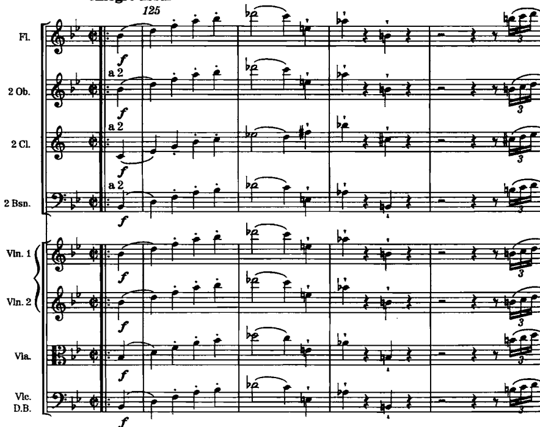
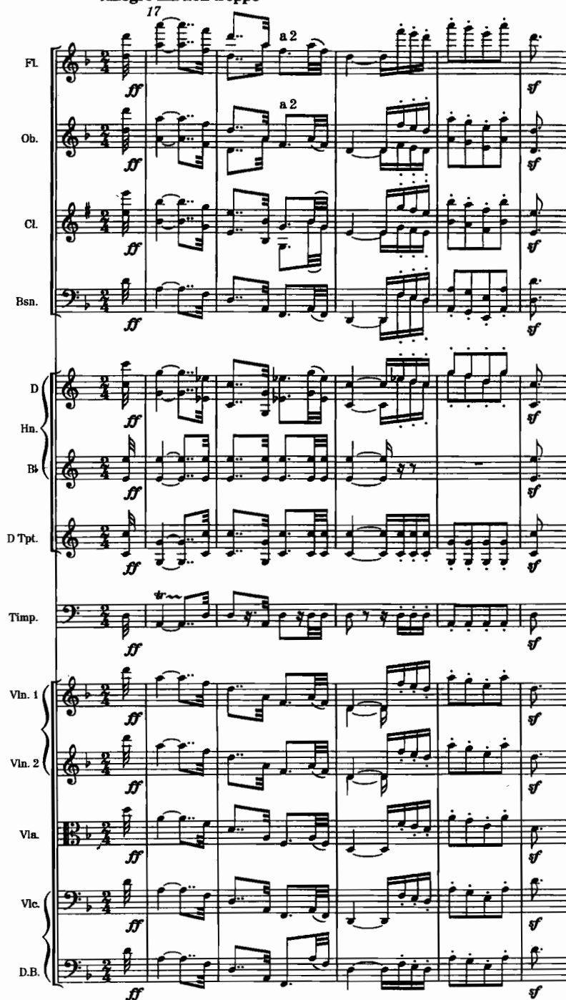
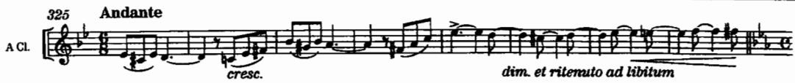
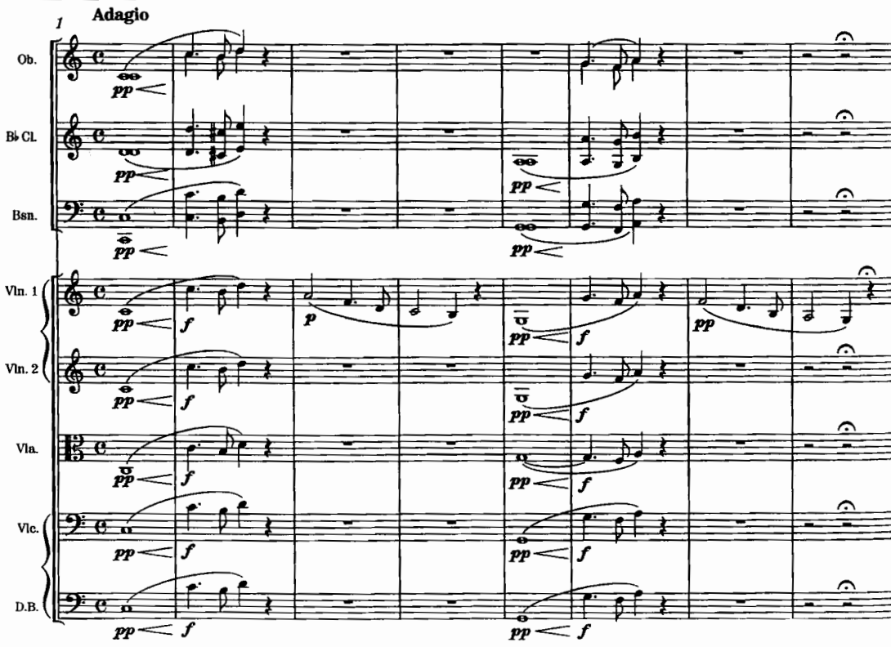
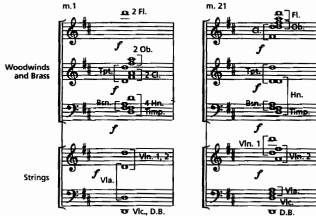
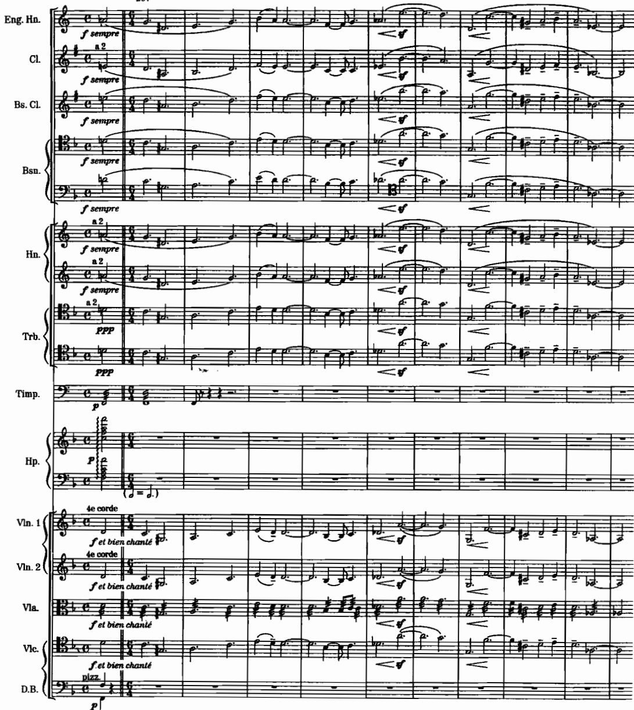

# สัปดาห์ที่ 9 — การเรียบเรียงสำหรับวงใหญ่ทั้งวง Tutti แนวเสียง และการสร้างสมดุลเสียง

## คำถามนำ

เมื่อวงดนตรีประกอบด้วยเครื่องสาย เครื่องลม เครื่องทองเหลือง เครื่องกระทบ และคีย์บอร์ดครบทุกกลุ่ม คำถามสำคัญมิใช่ “ใส่เครื่องดนตรีครบหรือยัง” หากแต่เป็น **ใครถือ foreground และความสมดุลของเสียงจะพังลงที่จุดใด**

## ขอบเขต

- ตุตติแบบ unison และ octave
- ระนาบหน้า–กลาง–หลังทั่วทั้งวง
- วิธีเรียบเรียงทำนองและลีลาหลักในหลายรูปแบบ
- สีสันพิเศษของวงดนตรี
- การทบทวนช่วงเสียงและสีของแต่ละเครื่องดนตรี
- สมดุลไดนามิกและการจัดที่นั่ง (Goss ข้อเสนอแนะที่ 29–30)

**งานส่ง:** แบบฝึกเทคนิคชิ้นที่ 4 — เรียบเรียงท่อนเดียวกันขึ้นใหม่ด้วยกลยุทธ์สีสันสองรูปแบบ พร้อมบันทึกการฟังเปรียบเทียบ

## ผลลัพธ์ที่วัดได้

1. เขียน unison/octave tutti โดยเข้าใจผลกระทบต่อความโปร่งหรือความหนาของเสียง
2. จัดทำแผนที่ระนาบ F/M/B ที่ครอบคลุมทุกกลุ่มเครื่องดนตรี
3. เรียบเรียงทำนองเดียวกันด้วยกลยุทธ์สีสันอย่างน้อยสองรูปแบบ
4. อธิบาย balance ด้วยหลักการ doubling และ projection มิใช่เพียงคำอธิบายว่า “ดังขึ้น”
5. บันทึกการฟังเปรียบเทียบทั้งสองฉบับได้

## คำศัพท์สำคัญ

ให้ใช้คำศัพท์จากประมวลรายวิชาและ source ของสัปดาห์นี้เป็นหลัก โดยเขียนคำจำกัดความสั้น ๆ ด้วยภาษาของตนเองลงในสมุดบันทึก และอ้างอิงเลขหน้าหรือข้อเสนอแนะจากหนังสือเมื่อทบทวน

## เนื้อหาหลัก

### Unison / octaves

Adler ในบทที่ 15 แสดงตัวอย่าง tutti และ chord spacing ในวงเต็ม โดย octave doubling มักให้เสียงที่โปร่งกว่าการซ้อน unison ที่หนาเกินไป ซึ่งสอดคล้องกับบทเรียนเครื่องลมและเครื่องทองเหลืองในสัปดาห์ก่อนหน้า

*เครดิต: Adler, Ch. 15, Example 15-3, Mozart, **Symphony No. 40**, fourth movement, mm. 125–132*

*เครดิต: Adler, Ch. 15, Example 15-5, Beethoven, **Symphony No. 9**, first movement, mm. 16–21*

### Foreground–middleground–background ทั้งวง

*เครดิต: Adler, Ch. 15, Example 15-7, Tchaikovsky, **Francesca da Rimini**, mm. 325–349. ชี้ solo กับ accompaniment color*

*เครดิต: Adler, Ch. 15, Example 15-8, Weber, **Der Freischütz**, Overture, mm. 1–19*

### Balance และการจัดที่นั่ง

Goss ในข้อเสนอแนะที่ 29–30 แนะนำให้พิจารณาสีเสียงและ “zero line” ของเครื่องสายเป็นหลัก เนื่องจากตำแหน่งที่นั่งและทิศทาง projection ของเครื่องทองเหลืองมีผลโดยตรงต่อสิ่งที่ผู้ฟังได้ยินจริง

*เครดิต: Adler, Ch. 15, Example 15-10, Beethoven, **Missa solemnis**, chords. ตรวจ spacing ของ tutti chord*

*เครดิต: Adler, Ch. 15, Example 15-1, d’Indy, **Istar**, mm. 206–216*

Ludwin ในหัวข้อ 3.1–3.3 นำเสนอมุมมองด้าน orchestration ช่วงเสียง และสีสันของแต่ละเครื่องดนตรี ซึ่งควรใช้เป็น checklist ทบทวนช่วงเสียงก่อนเริ่มเขียนงาน tutti

## Further study

| หัวข้อ | ตัวอย่าง | งานฟัง/อ่าน | แหล่ง |
|---|---|---|---|
| Tutti motion | Mozart 40/IV, mm. 125–132 | ใครเคลื่อน ใครค้ำ | Adler 15-3 |
| Opening complex | Beethoven 9/I, mm. 16–21 | ระนาบเริ่มต้น | Adler 15-5 |
| Melody+accomp | Francesca da Rimini, mm. 325–349 | สี accompaniment | Adler 15-7 |
| Dramatic tutti | Freischütz Overture, mm. 1–19 | build ของกลุ่ม | Adler 15-8 |
| Chord spacing | Missa solemnis chords | กระจาย pitch | Adler 15-10 |
| Balance theory | Goss 29–30 | เขียน zero line | Goss |

## กิจกรรมในชั้นเรียน 120 นาที

**นาทีที่ 0–20** แนวคิดเบื้องต้น · **นาทีที่ 20–40** วิเคราะห์ตัวอย่าง tutti · **นาทีที่ 40–60** สาธิตกลยุทธ์สีสันสองรูปแบบ · **นาทีที่ 60–100** เวิร์กชอปเรียบเรียงสองฉบับ · **นาทีที่ 100–120** วิจารณ์ผลงาน

## ใบงาน

ตารางระนาบ F/M/B ทั้งวง · ตารางเปรียบเทียบกลยุทธ์สี A/B · checklist ตรวจสอบ balance

## งานศึกษาด้วยตนเอง 6 ชั่วโมง

1.5 ชั่วโมง ฟังและอ่านสกอร์ · 2.5 ชั่วโมง เรียบเรียงสองฉบับ · 1 ชั่วโมง บันทึกการฟังเปรียบเทียบ · 1 ชั่วโมง ตรวจสอบช่วงเสียง

**งานส่ง:** แบบฝึกเทคนิคชิ้นที่ 4 — สองกลยุทธ์สีสันพร้อมบันทึกการฟัง

## เชื่อมสัปดาห์ที่ 10

สัปดาห์ที่ 10 จะเจาะลึกแนวทางของ Debussy และ Ravel ให้นำกลยุทธ์สีสันทั้งสองแบบที่ทำในสัปดาห์นี้ไปเปรียบเทียบกับหมวดหมู่ (categories) ที่ Ludwin นำเสนอ

## แหล่งอ้างอิง

Adler Ch. 15 · Ludwin 3.1–3.3 · Goss tips 29–30

## Image credits

`adler-mozart-sym40-tutti.png`, `adler-beethoven-sym9-opening.png`, `adler-tchaikovsky-francesca.png`, `adler-weber-freischutz-opening.png`, `adler-beethoven-missa-chords.png`, `adler-dindy-istar.png`

## เกณฑ์ตรวจตนเอง (เพิ่มเติม)

- [ ] หัวข้อและวันที่ตรงกับประมวลรายวิชา
- [ ] งานส่งตรงตามข้อกำหนดของประมวลรายวิชา ไม่มีเกณฑ์คะแนนใหม่เพิ่มเติม
- [ ] ภาพทุกไฟล์เปิดได้และมีเครดิตกำกับครบถ้วน
- [ ] มีรายการ further study อย่างน้อย 4 รายการจาก source
- [ ] มีใบงานและแผนการศึกษาด้วยตนเอง 6 ชั่วโมง
- [ ] มีจุดเชื่อมโยงไปยังสัปดาห์ถัดไป
- [ ] สถานะยังคงเป็น รอตรวจโดยผู้สอน
