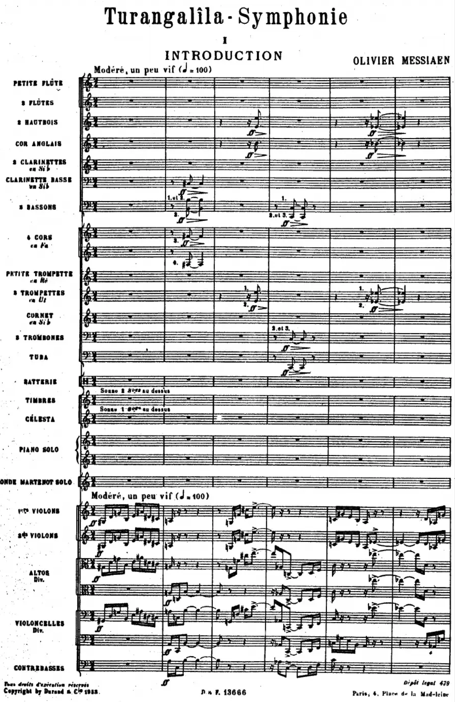
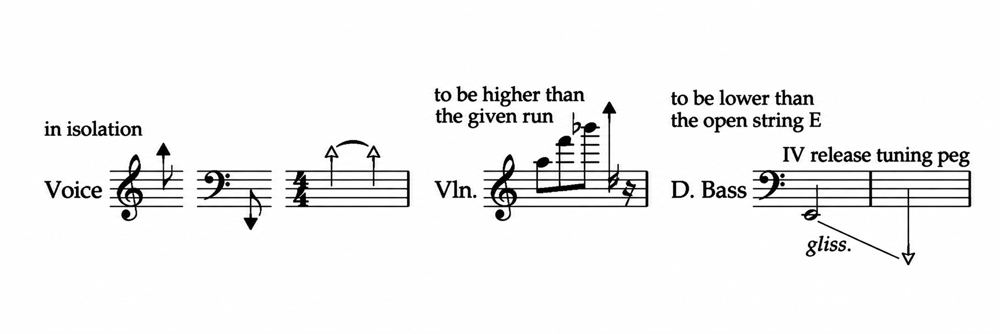
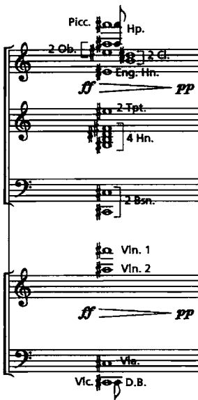

# สัปดาห์ที่ 1 — การเกริ่นนำและกระบวนการทำงานของนักเรียบเรียงเสียง

## คำถามนำ

เราจะเปลี่ยน “ความคิดทางดนตรี” ให้กลายเป็นเสียงของวงได้อย่างไร โดยไม่รีบลงรายละเอียดของสกอร์ก่อนที่เราจะรู้ว่าเพลงกำลังจะไปทางไหน

*ภาพนำเข้า: หน้าเริ่มต้นสกอร์ **Turangalîla-Symphonie**, “Introduction”, ของ Olivier Messiaen — ภาพที่ผู้ใช้จัดให้ ใช้เพื่อชวนสังเกตการจัดกลุ่มเครื่องดนตรีและลำดับชั้นของ full score ไม่ใช่ภาพประกอบที่ต้องท่องจำ*

## เมื่อจบสัปดาห์นี้ ผู้เรียนจะสามารถ

1. อธิบายความสัมพันธ์และความแตกต่างระหว่าง instrumentation, orchestration, arranging และ transcription ได้ด้วยภาษาของตนเอง
2. อธิบายว่าเหตุใดการฟัง สีสัน และเนื้อเสียงจึงเป็นส่วนหนึ่งของการวิเคราะห์ดนตรีสำหรับวง ไม่ใช่เพียงขั้นตอนตกแต่งตอนท้าย
3. วางลำดับกระบวนการทำงานจากแนวคิดหรือโมทีฟ ไปสู่โครงร่าง สกอร์ย่อ สกอร์เต็ม และเสียงตัวอย่างได้
4. เขียนโครงร่างผลงานหนึ่งชิ้นในระดับภาพรวม โดยระบุทิศทาง รูปแบบ โมทีฟ เนื้อเสียง และจุดเปลี่ยนสำคัญ
5. ตรวจความพร้อมเบื้องต้นของโน้ตและสกอร์ด้วยหลักความอ่านง่ายจาก Gould ก่อนส่งงานให้ผู้อื่นอ่าน

## จุดมุ่งหมายของรายในวิชาสัปดาห์นี้

สัปดาห์ที่ 1 เป็นการปรับจูน “ความเข้าใจเบื้องต้น” และ “วิธีทำงาน” ก่อนเข้าสู่การเรียนเทคนิคการเรียบเรียงเครื่องดนตรีแต่ละตระกูลในสัปดาห์ที่ 2–6 แล้วจึงนำกระบวนการนี้กลับมาใช้กับการย่อสกอร์ การพัฒนาบทเพลง และการเรียบเรียงสำหรับวงเต็มรูปแบบในสัปดาห์ถัดไป

| สิ่งที่เริ่มต้นในสัปดาห์ที่ 1 | จะถูกนำไปใช้ต่ออย่างไร |
|---|---|
| การฟังสีสันและเนื้อเสียง | วิเคราะห์บทประพันธ์และบันทึกการฟังตลอดภาคเรียน |
| การแยก instrumentation / arranging / orchestration / transcription | เลือกวิธีทำงานให้ตรงกับโจทย์ของโครงงาน |
| workflow และโครงร่าง | ใช้เป็นฐานของโครงงานสร้างสรรค์ที่ 1 และ 2 |
| สกอร์ย่อและ checklist ความอ่านง่าย | พัฒนาเป็นสกอร์เต็มและพาร์ตที่ส่งให้ผู้บรรเลงอ่านจริง |
| การระบุแหล่งที่มาและประวัติเวอร์ชัน | ใช้กับทุกงานส่ง รวมถึงการเปิดเผยการใช้เครื่องมือ AI |

## 1. วงออร์เคสตราไม่ใช่เพียงวงขนาดใหญ่ที่ประกอบไปด้วยเครื่องดนตรีจำนวนมาก

Adler เริ่มจากการมองวงออร์เคสตราเป็น “เครื่องดนตรีขนาดใหญ่” ที่ผู้เรียนต้องฝึกฟังและทำความเข้าใจจากประสบการณ์จริง การเรียนการเรียบเรียงเสียงดนตรีจึงไม่ได้จบที่การจด จำช่วงเสียงของเครื่องดนตรีหรือชื่อเทคนิคต่างๆ แต่ต้องพัฒนา “การรับรู้ การได้ยินภายใน” ให้จินตนาการได้ว่าเสียงที่เขียนบนกระดาษจะเกิดขึ้นอย่างไรเมื่อเครื่องดนตรีเล่นจริง

สีสันและเนื้อเสียงช่วยทำให้โครงสร้างและเนื้อหาของดนตรีชัดขึ้น การเลือกเครื่องดนตรี การผสมเสียง และการวางระยะของเสียงประสานจึงเป็นการตัดสินใจทางดนตรีตั้งแต่ต้น ไม่ใช่การเติมสีหลังจากแต่งเพลงเสร็จแล้ว

วงออร์เคสตราเองก็เปลี่ยนแปลงตามประวัติศาสตร์ จากกลุ่มเครื่องที่ยังไม่ตายตัว ไปสู่การจัดกลุ่มเครื่องสาย เครื่องลมไม้ เครื่องทองเหลือง และเครื่องกระทบที่มีบทบาทชัดเจนขึ้นเรื่อย ๆ ความรู้ทางประวัติศาสตร์ส่วนนี้ช่วยให้เราเห็นว่า “วงมาตรฐาน” เป็นผลจากการพัฒนาและการใช้งาน ไม่ใช่สูตรที่มีอยู่โดยธรรมชาติ

### เส้นเวลาแบบย่อจาก Adler

- ในยุคแรก นักประพันธ์มักระบุเพียงแนวเสียงหรือชนิดของกลุ่มเครื่องมากกว่าจะกำหนดเครื่องดนตรีทุกแนวอย่างละเอียด
- ตั้งแต่ราว ค.ศ. 1600 วงเริ่มพัฒนาในราชสำนักและโรงละคร หลายเมืองจึงมีขนาดและส่วนประกอบไม่เหมือนกัน
- ก่อนประมาณ ค.ศ. 1750 การพัฒนาเน้นการทำให้กลุ่มเครื่องและบทบาทของวงมีเสถียรภาพมากขึ้น โดยเครื่องสายเป็นแกนหลัก
- ในสมัย Haydn และ Mozart กลุ่มเครื่องสาย เครื่องลมไม้ และทองเหลืองเริ่มมีรูปแบบที่ผู้เรียนจำแนกได้ชัด ขณะที่เครื่องกระทบบางชนิดยังผูกกับบริบทของโอเปราและการใช้งานเฉพาะ
- หลังยุคคลาสสิก วงขยายทั้งจำนวนเครื่องและความซับซ้อนของสีสัน จนกลายเป็นวงขนาดใหญ่ในงานของ Berlioz, Mahler และ Stravinsky

ประเด็นของยุคสมัยที่เปลี่ยนผ่านนี้ ไม่ใช่การบ่งบอถึงชื่อคีตกวีที่เรารู้จัก แต่คือการเห็นว่า **รูปแบบวงที่เราคุ้นเคยเป็นผลของประวัติศาสตร์ การสร้างหรือพัฒนาเครื่องดนตรีให้ดีขึ้น การมีผู้เล่น และสถานที่แสดง** ดังนั้นการเลือกวงสำหรับการเรียบเรียงงานหนึ่งชิ้นต้องคิดถึงผลรวมของเสียงเครื่องดนตรีในองค์รวมและบริบทจริงด้วย

**หลักคิดสำหรับห้องเรียน:** ก่อนถามว่า “เครื่องดนตรีนี้เล่นโน้ตตัวนี้ได้ไหม” ให้ถามด้วยว่า “เสียงนี้มีหน้าที่อย่างไร และผู้ฟังควรได้ยินความสัมพันธ์ใด”

### ฝึก “การรับรู้ภายใน” ด้วยการฟังสามรอบ

Adler ให้ความสำคัญกับการฝึกฟังและการจินตนาการเสียงก่อนลงมือเขียน เราจะใช้การฟังสามรอบกับตัวอย่างเดียวกัน:

1. **รอบที่หนึ่ง — ฟังภาพรวม**: จดว่าดนตรีเริ่มต้น เปลี่ยนทิศทาง และไปถึงจุดสูงสุดตรงไหน โดยยังไม่พยายามตั้งชื่อเครื่องทุกชิ้น
2. **รอบที่สอง — ฟังสีสันและเนื้อเสียง**: ระบุว่าเสียงใดอยู่ด้านหน้า เสียงใดทำหน้าที่รองรับ และบริเวณใดเกิดจากการผสมหลายกลุ่มเครื่อง
3. **รอบที่สาม — ฟังพร้อมสกอร์หรือสกอร์ย่อ**: ตรวจว่าการจัดแนวเสียง ระยะห่าง และการเปลี่ยนกลุ่มเครื่องช่วยทำให้สิ่งที่ได้ยินชัดขึ้นอย่างไร

แบบบันทึกสั้น ๆ ควรตอบอย่างน้อย 4 คำถาม: “อะไรโดดเด่นที่สุด”, “อะไรทำให้เกิดความเปลี่ยนแปลง”, “ส่วนใดที่ยังฟังไม่ชัด”, และ “ถ้าต้องการเรียบเรียงใหม่จะรักษาปัจจัยอะไรไว้” การตอบแบบนี้ทำให้การฟังกลายเป็นหลักฐานของการตัดสินใจ ไม่ใช่ความรู้สึกกว้าง ๆ ที่ตรวจสอบไม่ได้

*ภาพ preview จากบทเครื่องสายของ ชวนสังเกตว่าขนาด รูปร่าง และช่วงเสียงของเครื่องในตระกูลเดียวกันส่งผลต่อสีสันอย่างไร รายละเอียดเชิงเทคนิคจะเรียนในสัปดาห์ที่ 2*

## 2. 4 คำที่ต้องใช้ให้แม่น

คำเหล่านี้มีพื้นที่ทับซ้อนกัน แต่ไม่ควรใช้แทนกันโดยไม่อธิบาย

| คำ                  | ความหมายที่ใช้ในรายวิชานี้                                                                                                                                                                             |
| ------------------- | ------------------------------------------------------------------------------------------------------------------------------------------------------------------------------------------------------ |
| **Instrumentation** | ความรู้เกี่ยวกับเครื่องดนตรี ลักษณะเสียง เทคนิค และเงื่อนไขที่ทำให้เครื่องดนตรีทำงานได้จริง เป็นฐานของการตัดสินใจทั้งหมด                                                                               |
| **Arranging**       | การนำแนวคิดหรือผลงานที่มีอยู่แล้วมาเรียบเรียงให้เหมาะกับชุดผู้บรรเลงที่กำหนด                                                                                                                           |
| **Orchestration**   | การเรียบเรียงเสียงเครื่องดนตรี สำหรับวงออร์เคสตรา เป็นงานที่ซับซ้อนขึ้นเพราะต้องจัดความสัมพันธ์ของหลายกลุ่มเครื่อง สีสัน และสมดุลของวง                                                                 |
| **Transcription**   | การนำบทเพลงหรือเนื้อหาจากเพลงต้นฉบับไปใช้กับเครื่องดนตรีอื่น โดยเปลี่ยนแปลงให้น้อยที่สุดเท่าที่บริบทจะยอมให้ได้ หากปรับโครงสร้างและพื้นผิวมากขึ้น จะเข้าใกล้การ adaptation มากกว่า transcription ตรง ๆ |

คำจำง่าย ๆ คือ **arranging บอกว่าเรานำสิ่งที่มีอยู่ไปจัดให้ใครเล่น, orchestration บอกว่าเราจัดมันให้เกิดชีวิตในวงอย่างไร, transcription เน้นการย้ายเนื้อหา, instrumentation ทำให้เรารู้ว่าการย้ายนั้นเป็นไปได้จริงหรือไม่**

### ทดลองแยกคำจากโจทย์เดียวกัน

สมมติว่ามีทำนองหนึ่งบรรทัดจากเปียโน:

1. ถ้าย้ายโน้ตเดิมไปให้ฟลูตเล่นโดยแทบไม่เปลี่ยนเนื้อหา นั่นเป็น **transcription**
2. ถ้านำทำนองเดิมไปกระจายให้เครื่องสายและเติมพื้นผิวใหม่ นั่นเป็น **arranging** หรือ **adaptation** ตามระดับการเปลี่ยนแปลง
3. ถ้าตัดสินใจให้กลุ่มเครื่องต่าง ๆ รับบทบาทในหลายมิติเป็นชั้นหน้า–กลาง–หลัง เพื่อสร้างเสียงของวง นั่นคือการคิดแบบ **orchestration**
4. การรู้ว่าช่วงเสียง การหายใจ การทดเสียง และเทคนิคของแต่ละเครื่องรองรับการตัดสินใจนั้นหรือไม่ คือความรู้ด้าน **instrumentation**

การจำแนกนี้ไม่ใช่การสร้างกำแพงระหว่างคำ แต่ช่วยให้ผู้เรียนระบุได้ว่าในแต่ละงานกำลัง “ย้าย”, “ปรับ”, หรือ “สร้างความสัมพันธ์ใหม่ระหว่างเสียง”

### คำถามตรวจสอบความเข้าใจ

- ถ้าผู้เรียบเรียงเปลี่ยนเครื่องดนตรี แต่ยังคงจังหวะและระดับเสียงเดิมไว้มากที่สุด งานนั้นใกล้กับ transcription หรือ adaptation เพราะเหตุใด
- ถ้าผลงานต้นฉบับเป็นเปียโน แต่ฉบับใหม่ออกแบบชั้นเสียงและการตอบโต้ของกลุ่มเครื่องขึ้นใหม่ งานนั้นยังเป็น transcription อยู่หรือไม่
- ความรู้ด้าน instrumentation ช่วยป้องกันปัญหาใดบ้างก่อนที่เราจะเริ่มเขียนสกอร์เต็ม
- การเรียบเรียงสำหรับวงขนาดห้องกับวงออร์เคสตรามีความรับผิดชอบร่วมกันเรื่องใด แม้จำนวนผู้เล่นจะต่างกัน

## 3. กระบวนการทำงาน: จากความคิดสู่สกอร์

Ludwin ย้ำว่าไม่มีขั้นตอนเดียวที่ถูกต้องสำหรับนักประพันธ์ทุกคน แต่เสนอ workflow ที่ใช้เป็นจุดเริ่มต้นได้:

1. **เริ่มจากการทดลองหรือการด้นสด** เพื่อค้นหาโมทีฟ จังหวะ หรือฮาร์โมนีที่มีศักยภาพ
2. **บันทึกแนวคิดทันที** ในโปรแกรมบันทึกโน้ตหรือบนกระดาษ เพื่อให้สามารถเปลี่ยนแปลงและพัฒนาวัตถุดิบได้
3. **เขียนโครงร่าง** เพื่อมองผลงานในระดับภาพรวม
4. **ทำสกอร์ย่อสองหรือสามบรรทัด** เพื่อทดสอบทิศทาง รูปแบบ และความต่อเนื่องของเพลง
5. **ขยายสกอร์ย่อเป็นสกอร์เต็ม** เมื่อแนวคิดและโครงสร้างเริ่มทำงานแล้ว
6. **ทำเสียงตัวอย่าง** ในขั้นที่จำเป็น เพื่อช่วยตรวจสอบความตั้งใจและเตรียมการสื่อสารกับผู้ร่วมงาน

ลำดับนี้ไม่ใช่กฎตายตัว แต่เป็นวิธีแยกปัญหาออกจากกัน: ปัญหาเรื่องแนวคิดและโครงสร้างควรเห็นได้ในสกอร์ย่อ ก่อนที่เราจะเสียเวลาแก้รายละเอียดของเครื่องดนตรีหลายสิบแนว

| ขั้น | คำถามตรวจงาน | หลักฐานที่ควรเหลือไว้ |
|---|---|---|
| แนวคิด / โมทีฟ | อะไรคือวัสดุที่ต้องการพัฒนา | บันทึกสั้นหรือไฟล์โน้ตฉบับแรก |
| โครงร่าง | เพลงกำลังไปไหนและกลับมาที่ใด | โครงร่างที่มีส่วน เริ่ม–พัฒนา–จบ |
| สกอร์ย่อ | แนวเสียงและรูปแบบทำงานโดยไม่พึ่งสีสันจำนวนมากหรือไม่ | สกอร์ย่อ 2–3 บรรทัดและเวอร์ชันที่แก้ไข |
| สกอร์เต็ม | เครื่องแต่ละกลุ่มทำหน้าที่ที่ได้ยินและเล่นได้จริงหรือไม่ | สกอร์เต็มพร้อมหมายเหตุการตัดสินใจ |
| เสียงตัวอย่าง / การอ่านโน้ต | สิ่งที่ได้ยินสอดคล้องกับสิ่งที่ตั้งใจหรือไม่ | เสียงตัวอย่างหรือบันทึกการอ่านโน้ต พร้อมข้อจำกัดที่ต้องตรวจต่อ |

## 4. โครงร่างคือแผนที่ที่อาจจะไม่จำเป็นต้องตายตัว

โครงร่างช่วยให้ผู้เขียนมองผลงานจากระยะไกล แทนการจมอยู่กับโน้ตทีละตัว โครงร่างไม่ต้องสมบูรณ์และเปลี่ยนแปลงได้ตลอดทาง แต่ควรตอบคำถามต่อไปนี้ให้ได้มากที่สุด:

- เรากำลังเล่าเรื่องหรือสร้างประสบการณ์อะไรให้ผู้ฟัง
- เพลงควรเริ่มต้นและจบอย่างไร
- จุดสูงสุดอยู่ตรงไหน
- มีโมทีฟใดบ้าง และจะนำเสนอในลำดับใด
- เครื่องดนตรีหรือกลุ่มเครื่องใดควรเป็นจุดสนใจ
- จะใช้ภาษาฮาร์โมนีและเนื้อเสียงแบบใด
- มีวัตถุดิบจากงานเดิมที่ต้องการนำกลับมาใช้หรือไม่
- ส่วนใดควรมีความแตกต่างของพื้นผิวหรือสีสัน
- ยังมีคำถามหรือความคิดสุ่มใดที่ควรเก็บไว้ก่อนตัดสินใจ

การเขียนโครงร่างจึงเป็นทั้งเครื่องมือสร้างสรรค์และเครื่องมือวินิจฉัย: ถ้าเรายังตอบไม่ได้ว่าเพลงกำลังมุ่งไปที่ใด ปัญหานั้นควรถูกแก้ในระดับภาพรวมก่อนลงมือแจกโน้ตเต็มวง

### แม่แบบโครงร่างสำหรับส่งท้ายสัปดาห์

| ส่วนของงาน            | ระยะเวลาโดยประมาณ | แนวคิด / โมทีฟ | สีสันหรือกลุ่มเครื่องที่ต้องการสำรวจ | คำถามที่ยังเปิดอยู่ |
| --------------------- | ----------------: | -------------- | ------------------------------------ | ------------------- |
| เริ่มเพลง             |                   |                |                                      |                     |
| พัฒนา / เปลี่ยนทิศทาง |                   |                |                                      |                     |
| จุดสูงสุด (climax)    |                   |                |                                      |                     |
| จบเพลง                |                   |                |                                      |                     |

ไม่ต้องเติมทุกช่องให้เสร็จสมบูรณ์ในครั้งเดียว ช่องว่างคือข้อมูลที่ช่วยบอกว่าควรฟัง อ่าน หรือทดลองอะไรต่อ

### ตัวอย่างระดับรายละเอียดที่เหมาะกับสัปดาห์แรก

ยังไม่ควรเขียนว่า “ไวโอลินเล่นโน้ตนี้ด้วยคันชักแบบใดในห้องที่ 37” หากโครงร่างยังไม่ได้บอกว่าห้องที่ 37 มีหน้าที่อะไร ควรเริ่มจากข้อความระดับนี้ก่อน:

> “ช่วงกลางลดความหนาแน่นลง เหลือแนวหลักหนึ่งแนวกับพื้นผิวโปร่ง เพื่อเตรียมการกลับมาของโมทีฟเปิดเรื่องในช่วงสูงสุด”

จากนั้นจึงค่อยเติมว่าแนวหลักอยู่ที่กลุ่มใด สีสันรองมาจากใคร และต้องทดสอบอะไรในสกอร์ย่อ ข้อความลักษณะนี้ทำให้โครงร่างยังเปิดพื้นที่ให้แก้ไขได้ โดยไม่ผูกมัดตัวเองกับคำตอบทางเทคนิคเร็วเกินไป

## 5. เรียบเรียงไปพร้อมกับการประพันธ์ หรือแยกขั้นตอนกัน

Goss เสนอให้ผู้เริ่มต้นแยกงานโครงสร้าง ฮาร์โมนี และการแก้ไขออกจากการเขียนสกอร์เต็ม เพราะการย่อสกอร์ (condense score) ทำให้เรากล้าตัดทิ้งหรือเขียนใหม่มากกว่า ขณะเดียวกัน การจดบันทึกความคิดเรื่องเครื่องดนตรีไว้ตั้งแต่ต้นก็ทำได้ นิสิตมีแนวคิดเรื่องการตีความสีสันเสียงที่มีความชัดเจน

ข้อสรุปสำหรับรายวิชานี้ไม่ใช่ “ต้องทำแบบใดแบบหนึ่ง” แต่คือ **ให้ระดับรายละเอียดของการเรียบเรียงเครื่องดนตรีสอดคล้องกับระดับความแม่นยำของเสียงให้ตรงกับแนวคิดของนิสิตมาที่สุด** การแก้โครงสร้างบนสกอร์แบบย่อก่อน แล้วค่อยเพิ่มความรับผิดชอบทางเทคนิคของวงทีละชั้น

Goss ยังชี้ให้เห็นว่าคำว่า **reduction**  มักจะใช้กันอย่างสับสน **reduction**  คือการย่อวงขนาดใหญ่ลงให้เหมาะกับเปียโนหรือผู้เล่นจำนวนน้อย ส่วน **expansion** คือการขยายแนวคิดหรือผลงานให้มีผู้บรรเลงหลายคนและมีความรับผิดชอบต่อการเล่นร่วมกันมากขึ้น งาน orchestration จึงไม่ใช่การ “ใส่เครื่องดนตรีให้ครบ” แต่เป็นการขยายความคิดให้เกิดเป็นประสบการณ์เสียงของวงดนตรีขนาดต่างๆ ได้อย่างสมบูรณ์

### กฎในการตัดสินใจในการเรียบเรียงเครื่องดนตรีสำหรับผู้เริ่มต้น

- ถ้ายังตอบไม่ได้ว่าโครงสร้างควรไปทางใด ให้กลับไปที่โครงร่าง
- ถ้าฮาร์โมนีหรือการเดินแนวยังไม่มั่นคง ให้แก้บนสกอร์แบบย่อ
- ถ้าสีสันเสียงเป็นหัวใจของแนวคิด ให้จดเครื่องดนตรีไว้ได้ แต่ยังไม่จำเป็นต้องเขียนทุกพาร์ต
- อย่าใช้จำนวนหน้าของสกอร์เต็มเป็นหลักฐานว่าแนวคิดพัฒนาแล้ว

## 6. หลักความอ่านง่ายก่อนส่งงาน

Gould เปิดภาค *Ground Rules* ด้วยหลักการพื้นฐานของการวางสัญลักษณ์บนสกอร์ เช่น ความสัมพันธ์ระหว่างขนาดบรรทัดห้าเส้นกับขนาดของสัญลักษณ์ การเริ่มต้นพาร์ตด้วยกุญแจเสียงที่เหมาะสม และการจัดวางที่ช่วยให้ผู้เล่นอ่านได้อย่างต่อเนื่อง

ในสัปดาห์แรกยังไม่ต้องจำกฎทุกข้อ ให้ใช้ checklist เบื้องต้นนี้กับงานของตนเอง:

- ผู้รับโน้ตรู้หรือไม่ว่าบรรทัดนี้เป็นของใคร
- กุญแจเสียงและระดับเสียงทำให้ผู้เล่นอ่านได้จริงหรือไม่
- การวางสัญลักษณ์ทำให้จังหวะและการแบ่งวลีเห็นได้ชัดหรือไม่
- ถ้าคนอื่นเปิดหน้านี้โดยไม่มีคำอธิบายจากผู้เขียน เขาจะรู้ว่าต้องเริ่มอ่านตรงไหนหรือไม่

*ตัวอย่างภาพจาก Elaine Gould, **Behind Bars**, Part 1 “General Conventions”. ใช้เพื่อย้ำว่ารายละเอียดเล็ก ๆ ของสัญลักษณ์มีผลต่อการอ่านจริง ภาพนี้เป็นตัวอย่างประกอบ ไม่ใช่รายการกฎทั้งหมดของภาคนี้*

### หลักเบื้องต้นที่ต้องจำ

1. ขนาดของสัญลักษณ์ต้องสัมพันธ์กับขนาดบรรทัดห้าเส้น เพื่อให้หน้าอ่านได้ทั้งบนกระดาษและในสภาพการเล่นจริง
2. กุญแจเสียงต้องวางให้ชัดและอยู่ในตำแหน่งที่ผู้เล่นคาดหมายได้
3. แต่ละพาร์ตควรเริ่มด้วยข้อมูลที่ทำให้ผู้เล่นรู้ว่าเสียงนี้เป็นของใครและต้องอ่านอย่างไร โดยข้อยกเว้นด้านเครื่องกระทบต้องดูตามระบบที่ใช้
4. ความชัดเจนของหน้ากระดาษเป็นส่วนหนึ่งของการสื่อสารทางดนตรี ไม่ใช่ขั้นตอนจัดรูปเล่มที่ทำหลังจาก “งานดนตรีเสร็จแล้ว”

## 7. การทดสอบวินิจฉัยและการทบทวน Orchestration I

การทดสอบในสัปดาห์นี้เป็นการวัดจุดเริ่มต้น ไม่ใช่การตัดสินว่าผู้เรียนเก่งหรือไม่เก่ง และไม่ควรใช้เพื่อคาดเดาผลการเรียนปลายภาค ผู้เรียนควรตอบจากความเข้าใจปัจจุบันและระบุจุดที่ยังไม่มั่นใจอย่างตรงไปตรงมา

หัวข้อที่ใช้ทบทวนร่วมกัน:

- ระบุความแตกต่างระหว่างการแต่ง การเรียบเรียง การถอดแบบ และการจัดเครื่องดนตรี
- อธิบายว่าทำไมสกอร์ย่อจึงช่วยให้ตรวจโครงสร้างและการเดินแนวได้เร็วกว่า full score
- เลือกหนึ่งแนวคิดดนตรีแล้วบอกว่าต้องการให้ผู้ฟังได้ยิน “หน้าที่” หรือ “สีสัน” อะไร
- ตรวจตัวอย่างหน้าสกอร์ว่าข้อมูลใดทำให้ผู้บรรเลงเริ่มอ่านได้ และข้อมูลใดทำให้ลังเล
- บันทึกเครื่องมือที่ใช้ได้จริง เช่น โปรแกรมบันทึกโน้ต การทำเสียงตัวอย่าง การส่งออก PDF และการจัดเก็บเวอร์ชัน

ผลจากการทดสอบใช้เพื่อจัดกลุ่มคำถามและกำหนดสิ่งที่ต้องทบทวน ไม่ใช่เพิ่มภาระงานที่มีคะแนน

## บทเพลงจากแหล่งอ้างอิงสำหรับศึกษาต่อ

รายการต่อไปนี้คัดจากบทเพลงและตัวอย่างที่ปรากฏในหนังสือต้นทางของสัปดาห์นี้ ใช้เป็น **การฟังพร้อมอ่านสกอร์** ไม่จำเป็นต้องฟังทั้งหมดในคาบแรก ให้เลือกอย่างน้อยหนึ่งรายการต่อหัวข้อ แล้วจดหลักฐานสั้น ๆ ว่าได้ยินการเปลี่ยนบทบาท สีสัน หรือความชัดเจนของโน้ตตรงไหน

| หัวข้อ                                                      | บทเพลง/ตัวอย่างใน source                                                                                                                                                                                         | แนวทางฟังหรืออ่านสกอร์                                                                                                                                                      | ลิงก์ YouTube สำหรับฟัง                                                                                                                                                                                                                                                                                                                                                                                                                         |
| ----------------------------------------------------------- | ---------------------------------------------------------------------------------------------------------------------------------------------------------------------------------------------------------------- | --------------------------------------------------------------------------------------------------------------------------------------------------------------------------- | ------------------------------------------------------------------------------------------------------------------------------------------------------------------------------------------------------------------------------------------------------------------------------------------------------------------------------------------------------------------------------------------------------------------------------------------------ |
| วงออร์เคสตราและประวัติศาสตร์                                | Claudio Monteverdi, *Combattimento* (1624); Handel, *Messiah* เทียบกับฉบับ reorchestration ของ Mozart                                                                                                            | ฟังว่าการกำหนดกลุ่มเครื่องและบริบทการแสดงเปลี่ยนบุคลิกของงานอย่างไร ก่อนจะถามว่า “วงมาตรฐาน” ควรมีเครื่องใดบ้าง                                                             | [Monteverdi — *Combattimento*](https://www.youtube.com/watch?v=LUYpo-DzZs4) [Handel — *Messiah* ฉบับดั้งเดิม (ค้นหา)](https://www.youtube.com/results?search_query=Handel%27s+Messiah+complete+performance+original+orchestra) [Mozart reorchestration](https://www.youtube.com/watch?v=z1gwAxTLQRs) *Source:* Adler, Part One, Ch. 1 |
| สีสัน เนื้อเสียง และหูภายใน                                 | Mozart, *Symphony No. 39*, second movement; Debussy, *La Mer*, second movement “Jeux de vagues”                                                                                                                  | รอบแรกฟังเส้นทางของเพลง รอบสองแยกแนวหลัก–แนวรอง–พื้นเสียง รอบสามเปิดสกอร์ดูการวาง register และการซ้อนเสียง                                                                  | [Mozart Sym. 39 II — ค้นหา](https://www.youtube.com/results?search_query=Mozart+Symphony+No.+39+second+movement) [Debussy — *La Mer* II](https://www.youtube.com/watch?v=3o8uUP0lS9c) *Source:* Ludwin, §1.4.4; Adler, Ch. 15, Ex. 15-17 |
| Instrumentation / arranging / orchestration / transcription | Mozart, *Piano Sonata in A major, K. 331*, third movement “Alla Turca”; Musorgsky–Ravel, *Pictures at an Exhibition*, “The Great Gate of Kiev”; Stravinsky, *J. S. Bach Chorale Variations on “Vom Himmel hoch”* | เปรียบเทียบสิ่งที่ย้ายตรงจากต้นฉบับกับสิ่งที่ต้องปรับ register, doubling, texture และ balance เพื่อให้เกิดเป็นเสียงวง                                                       | [Mozart K. 331 — “Alla Turca”](https://www.youtube.com/watch?v=MscO89GFPck) [Mussorgsky–Ravel — “Great Gate of Kiev”](https://www.youtube.com/watch?v=HDm2RZKl_oo) [Bach–Stravinsky — “Vom Himmel hoch”](https://www.youtube.com/watch?v=3kOHA7igjTo) *Source:* Adler, Ch. 8, Ex. 8-46; Ch. 11, Ex. 11-9, 11-20 |
| Workflow และ score reduction                                | Dvořák, *Symphony No. 8*, first movement; Mozart, *Symphony No. 39*, second movement                                                                                                                             | ทำสกอร์ย่อ 2–3 บรรทัดจากช่วงสั้น ๆ แล้วตรวจว่าจุดสูงสุด การเปลี่ยนพื้นผิว และแนวเบสยังอ่านออกหรือไม่เมื่อเอาสีสันออก                                                        | [Dvořák Sym. 8 — เริ่มฟัง movement I](https://www.youtube.com/watch?v=SOY6fao_cfU) [Mozart Sym. 39 II — ค้นหา](https://www.youtube.com/results?search_query=Mozart+Symphony+No.+39+second+movement) *Source:* Ludwin, §1.5.2; §1.4.4 |
| การเขียนโครงร่างและพัฒนาโมทีฟ                               | Norman Ludwin, *Oliver’s Tale* (ตัวอย่างโครงร่าง); W. A. Mozart, *Piano Sonata No. 9* (ชุดตัวอย่างการแปรและจัดเครื่อง)                                                                                           | อ่านจากตารางโครงร่างว่าแต่ละส่วนมี duration, motive, instrument และความรู้สึกอย่างไร แล้วติดตามว่าโมทีฟเดียวกันถูก transposition, fragmentation หรือเปลี่ยนผู้ถือแนวอย่างไร | [Ludwin — *Oliver’s Tale* (ค้นหา)](https://www.youtube.com/results?search_query=Norman+Ludwin+Oliver%27s+Tale) [Mozart Sonata No. 9](https://www.youtube.com/watch?v=LIpnk3rV_Wk) *Source:* Ludwin, §§1.2.2, 2.3.2 |
| เรียบเรียงระหว่างประพันธ์หรือหลังประพันธ์                   | Igor Stravinsky, *The Rite of Spring*; Gustav Holst, *The Planets*; Claude Debussy, *Prélude à “L’après-midi d’un faune”*                                                                                        | ฟังหรืออ่านโดยตั้งคำถามว่าอะไรถูกแก้ในสกอร์ย่อก่อน และอะไรเป็นสีสันที่เกิดขึ้นเมื่อขยายเป็นวงเต็ม                                                                           | [Stravinsky — *The Rite of Spring*](https://www.youtube.com/watch?v=rP42C-4zL3w) [Holst — *The Planets*: “Jupiter”](https://www.youtube.com/watch?v=Y8KuOANfJ1A) [Debussy — *Faune* (score video)](https://www.youtube.com/watch?v=2MX87eRuTkk) *Source:* Goss, *100 More Orchestration Tips*, Q9; Adler, Part One, Ch. 14 |
| ความอ่านง่ายและการสื่อสารกับผู้บรรเลง                       | Stravinsky, *L’Oiseau de feu*, *Chant du Rossignol*, *Jeu de Cartes*; Holst, *The Planets*; Mahler, *Symphony No. 8*                                                                                             | ตรวจ key signatures, clefs, rests, spacing และจุดเริ่มต้นของพาร์ตว่าอ่านได้เร็วหรือทำให้ผู้เล่นต้องเดา                                                                      | [Stravinsky — *Firebird* (score video)](https://www.youtube.com/watch?v=1XGl8UhV6xE) [*Chant du Rossignol* — ค้นหา](https://www.youtube.com/results?search_query=Stravinsky+Chant+du+Rossignol+full) [*Jeu de Cartes* — ค้นหา](https://www.youtube.com/results?search_query=Stravinsky+Jeu+de+Cartes+full) [Mahler Sym. 8](https://www.youtube.com/watch?v=nxf3xtH31jA) *Source:* Gould, Part 1 “Ground Rules” และ “Key signatures in non-tonal or polytonal music” |

ลิงก์เหล่านี้เป็น **แหล่งสำหรับฟังและดู score-video บน YouTube** ไม่ใช่แหล่งอ้างอิงเนื้อหาหลัก แหล่งอ้างอิงของแนวคิดยังคงเป็นหนังสือใน vault ตามที่ระบุท้ายแต่ละแถว ลิงก์ที่เขียนว่า “ค้นหา” ใช้เมื่อยังไม่พบวิดีโอที่ตรงกับชื่อผลงานอย่างน่าเชื่อถือ และควรตรวจว่า URL ยังใช้งานได้ก่อนเผยแพร่เว็บไซต์

### ตัวอย่างสกอร์จริงจาก source ใน vault

ในกรณีที่ vault มีภาพตัวอย่างจากหนังสือ เราจะแสดง **excerpt สั้น ๆ** ไว้ใต้รายการศึกษาต่อ เพื่อให้ผู้เรียนเปิดฟังพร้อมอ่านสกอร์ได้ทันที โดยยังคงเก็บชื่อบทและเลขตัวอย่างไว้สำหรับย้อนกลับไปอ่านบริบทเต็มในหนังสือ

Adler, *The Study of Orchestration*, 3rd ed., Part Two, Chapter 15, Example 15-17: Debussy, **La Mer**, second movement “Jeux de vagues,” 4 ห้องก่อนหมายเลข 29. ให้สังเกตการกระจายเสียงของคอร์ด การซ้ำโน้ตที่ระดับเสียงเดียวกัน และเส้นทางไดนามิกจาก **ff** ไป **pp** แล้วเทียบกับคำอธิบายในหนังสือ

**ข้อจำกัดของภาพจากแหล่งปัจจุบัน:** Adler Ch. 15 Ex. 15-17 มีภาพสกอร์ใน vault จึงแสดงได้ ส่วน Adler, Part One, Ch. 1 เป็นบทประวัติศาสตร์และคำอธิบายที่ไม่มีภาพสกอร์ตัวอย่างในไฟล์ vault; ภาพ **Turangalîla-Symphonie** ด้านบนจึงเป็นภาพนำเข้าแยกต่างหาก ไม่ควรอ้างว่าเป็นภาพจาก Ch. 1. สำหรับ Ludwin §1.4.4 ไฟล์ `book.md` มีข้อความ OCR ของตัวอย่าง Mozart, *Symphony No. 39*, second movement แต่ไม่มีไฟล์ภาพต้นฉบับ จึงยังไม่ควรสร้างภาพแทนหรืออ้างว่าเป็นสกอร์จากหนังสือจนกว่าจะมีหน้า scan/PDF ที่ตรวจสอบได้

ภาพสกอร์จากหนังสือที่มีลิขสิทธิ์ควรใช้เป็น excerpt สั้น ๆ พร้อมเครดิตเพื่อการเรียนการสอนภายใน หากเว็บไซต์จะเผยแพร่สาธารณะ ควรตรวจสิทธิ์การทำซ้ำหรือเปลี่ยนเป็นสกอร์ฉบับ public domain ที่อ้างอิงได้

### วิธีบันทึกการศึกษาต่อ

สำหรับเพลงที่เลือกหนึ่งชิ้น แนะนำให้ทำบันทึกหนึ่งหน้า ประกอบด้วยชื่อผลงานและ movement, ช่วงเวลาหรือหมายเลขห้องที่ฟัง, สิ่งที่ได้ยินหรือเห็นในสกอร์อย่างน้อยสามข้อ และข้อสังเกตหนึ่งข้อที่นำไปทดลองกับโครงร่างของตนเองได้ หาก source ให้เพียงชื่อคีตกวีหรือประเภทงานโดยไม่ระบุชื่อชิ้น ให้เขียนกำกับว่า “source ไม่ได้ระบุชื่อผลงาน” และอย่าเติมชื่อจากแหล่งอื่นโดยไม่อ้างอิง

## 8. ใบงานในชั้นเรียน

### ใบงาน A — แผนที่การฟัง

| จุดสังเกต | บันทึกของผู้เรียน |
|---|---|
| จุดเริ่มต้นของแนวคิด |  |
| โมทีฟหรือจังหวะที่ได้ยินซ้ำ |  |
| การเปลี่ยนสีสันครั้งแรก |  |
| จุดที่เกิดความหนาแน่นหรือความโปร่งชัดเจน |  |
| จุดสูงสุด |  |
| สิ่งที่กลับมาในตอนจบ |  |
| คำถามที่ต้องตรวจจากสกอร์ |  |

### ใบงาน B — ทดลองขยายแนวคิด

เลือกโมทีฟสั้น ๆ ของตนเอง แล้วทำบันทึกสองระดับ:

1. **ระดับโครงสร้าง**: โมทีฟจะปรากฏซ้ำ เปลี่ยน หรือถูกตัดทอนตรงไหน
2. **ระดับสีสัน**: ต้องการให้ใครเป็นผู้ถือแนวหลัก ใครเป็นผู้สนับสนุน และส่วนใดควรปล่อยให้เงียบ

ห้ามเริ่มจากการเติมเครื่องดนตรีให้ครบทุกกลุ่ม ให้เริ่มจากหน้าที่ของเสียง แล้วค่อยตรวจว่าการเลือกเครื่องนั้นสอดคล้องกับหน้าที่หรือไม่

### ใบงาน C — เพื่อนวิจารณ์โครงร่าง

ผู้วิจารณ์ตอบโดยอ้างอิงหลักฐานจากเอกสาร ไม่ใช้เพียงคำว่า “ชอบ” หรือ “ไม่ชอบ”:

- อ่านแล้วรู้หรือไม่ว่าเพลงกำลังมุ่งไปทางใด
- จุดสูงสุดหรือความเปลี่ยนแปลงมีหลักฐานอยู่ตรงไหน
- มีส่วนใดที่ใช้คำกว้างเกินไปจนยังนำไปทำงานต่อไม่ได้
- คำถามทางเทคนิคข้อใดควรแก้ด้วยการฟัง ข้อใดควรแก้ด้วยการอ่านสกอร์ และข้อใดควรทดลองกับผู้บรรเลง
- ข้อเสนอแนะหนึ่งข้อที่ควรนำไปทดลองในสกอร์ย่อคืออะไร

## 9. สิ่งที่ต้องรู้ตั้งแต่สัปดาห์แรก

### โครงงานสร้างสรรค์ที่ 1 — กลางภาค

ผู้เรียนจะเลือกบทเพลงต้นแบบสำหรับเปียโนหรือวงขนาดเล็ก แล้วสร้างงานเรียบเรียงใหม่ที่มีมุมมองทางศิลปะของตนเอง ความยาว 1.5–2.5 นาที เลือกกำลังวงจากวงขนาดห้อง วงออร์เคสตรามาตรฐาน หรือวินด์แบนด์ งานนี้ไม่ใช่การถอดแบบตรงตัว

สิ่งที่จะต้องเตรียมในระยะต่อไปคือโครงร่างและสกอร์ย่อ สกอร์เต็ม PDF พาร์ตอย่างน้อย 2 พาร์ต เสียงตัวอย่างหรือการบันทึกการอ่านโน้ต และคำชี้แจงเหตุผลกับแหล่งที่มาของต้นแบบ

### โครงงานสร้างสรรค์ที่ 2 — ปลายภาค

ผู้เรียนจะพัฒนาผลงานประพันธ์หรือเรียบเรียงต้นฉบับความยาว 2–4 นาที โดยต้องแสดงแนวคิดด้านโครงสร้างและสีสันอย่างชัดเจน และมีหลักฐานการปรับปรุงจากข้อเสนอแนะในสัปดาห์ที่ 14

ชิ้นงานปลายภาคจะต้องมีโครงร่างและสกอร์ย่อ สกอร์เต็มและไฟล์ต้นฉบับ ชุดพาร์ตครบตามกำลังวง เสียงตัวอย่างหรือการอ่านโน้ต ประวัติการแก้ไข คำชี้แจงแหล่งที่มาและจรรยาบรรณ และการสะท้อนผลเทียบกับ CLO

### มาตรฐานร่วมของงานส่ง

- ส่ง PDF และไฟล์ต้นฉบับเมื่อกำหนด พร้อมไฟล์เสียงหรือบันทึกการอ่านโน้ตตามประเภทงาน
- ตั้งชื่อไฟล์เป็น `รหัสนิสิต_ชื่องาน_เวอร์ชัน` และใช้เลขเวอร์ชันต่อเนื่อง
- ระบุแหล่งที่มาของดนตรีที่นำมาดัดแปลง ขออนุญาตเมื่อจำเป็น และให้เครดิตผู้ร่วมงานหรือผู้บรรเลง
- เปิดเผยการใช้เครื่องมือช่วยสร้างสรรค์ รวมถึง AI ในคำชี้แจงที่แนบกับผลงาน
- หากมีปัญหาด้านกำลังวงหรือการเข้าถึงผู้เล่น ให้แจ้งผู้สอนตั้งแต่สัปดาห์แรกเพื่อปรับโจทย์ให้ทำได้จริง

## กิจกรรมในชั้นเรียน 120 นาที

1. **0–20 นาที — ปฐมนิเทศและทดสอบวินิจฉัย**: ทบทวนพื้นฐานจาก Orchestration I, แนะนำวงจรการทำงานของรายวิชา, และชี้แจงการเปิดเผยการใช้เครื่องมือ AI ตามนโยบายของผู้สอน
2. **20–40 นาที — ฟังและวิเคราะห์แนวคิด**: จาก Adler ระบุว่าองค์ประกอบใดของวงทำให้สีสันและเนื้อเสียงมีผลต่อโครงสร้าง ไม่ใช่เพียงการประดับเสียง
3. **40–60 นาที — แยกคำศัพท์และบทบาทของผู้เรียบเรียง**: ใช้ตัวอย่างสั้น ๆ จำแนก arranging, orchestration, transcription และ instrumentation
4. **60–80 นาที — สาธิต workflow**: แปลงโมทีฟหนึ่งชุดเป็นบันทึกสั้น ๆ → โครงร่าง → สกอร์ย่อ โดยหยุดตรวจปัญหาในแต่ละระดับ
5. **80–110 นาที — เวิร์กชอปเขียนโครงร่าง**: ผู้เรียนใช้แบบฟอร์มคำถามของ Ludwin เขียนโครงร่างผลงานหรือข้อความดนตรีของตนเองหนึ่งหน้า
6. **110–120 นาที — แลกเปลี่ยนและสรุป**: เพื่อนอ่านโครงร่างโดยตอบสองคำถาม: “รู้หรือไม่ว่าเพลงกำลังมุ่งไปไหน” และ “จุดใดควรแก้ก่อนลงสกอร์เต็ม”

### ผลลัพธ์ที่ควรได้เมื่อจบคาบ

- ผู้สอนรู้จุดเริ่มต้นของผู้เรียนแต่ละคนจากแบบทดสอบวินิจฉัย
- ผู้เรียนมีโครงร่างฉบับแรกที่สามารถแก้ไขต่อได้ ไม่ใช่เพียงไอเดียที่ยังไม่มีทิศทาง
- ผู้เรียนรู้ว่าตลอดภาคเรียนจะต้องเก็บหลักฐานการตัดสินใจและการปรับปรุงอย่างไร
- ผู้เรียนรู้มาตรฐานไฟล์ แหล่งที่มา จรรยาบรรณ และช่องทางแจ้งปัญหาก่อนเริ่มทำโครงงานจริง

## การบ้านสัปดาห์ที่ 1 — การรับรู้ภายใน: จากต้นฉบับสู่การเรียบเรียง

### โจทย์หลัก

ให้เลือกฟังและเปรียบเทียบอย่างน้อย **สองเวอร์ชันของ *Pictures at an Exhibition*** โดยต้องมีคู่บังคับคือ

1. **ต้นฉบับเปียโนของ Modest Mussorgsky** — ใช้การบรรเลงของ Yunchan Lim เป็นจุดตั้งต้น
2. **ฉบับออร์เคสตราของ Maurice Ravel** — ใช้ B&H Study Score Video เพื่อฟังพร้อมติดตามสกอร์

จากนั้นเลือกเวอร์ชันเรียบเรียงอื่นอีกอย่างน้อยหนึ่งเวอร์ชัน เช่น Tushmalov, Patrick Roszell, Michael Sweeney, กีตาร์ควอเต็ต หรือการเรียบเรียงสำหรับวงทองเหลือง เพื่อทดสอบว่าเมื่อเปลี่ยน ensemble แล้ว “หน้าที่ของเสียง” เปลี่ยนไปอย่างไร

งานนี้ไม่ได้ถามว่าเวอร์ชันใด “ดี” หรือ “ไม่ดี” แต่ถามว่า **ผู้เรียบเรียงทำอะไรกับวัตถุดิบเดิม และทำให้เราได้ยินผลลัพธ์นั้นอย่างไร** ให้ใช้หลักฐานจากเวลาในวิดีโอ หมายเลขห้อง ช่วงเสียง การเลือกเครื่องดนตรี การวางแนว การซ้ำเสียง การแบ่ง texture ไดนามิก และ articulation แทนคำตัดสินกว้าง ๆ

### แบบฟอร์มสำหรับนักศึกษา

กรอกและส่งรายงานผ่าน [แบบฟอร์มรายงานการบ้าน Week 1](https://docs.google.com/document/d/1TYDU7wYRDczHurk0AOx_pJxH_aw1kah6/edit?usp=sharing&ouid=107465945006421010320&rtpof=true&sd=true) โดยใช้หัวข้อและคำถามในเอกสารเป็นโครงสร้างหลักของงาน หากต้องการเขียนฉบับร่างก่อน ให้ดาวน์โหลดแบบฟอร์ม Word [week1-homework-report-form.docx](week1-homework-report-form.docx) แล้วคัดลอกคำตอบกลับไปยังเอกสาร Google Docs ก่อนส่ง

### ชุดวิดีโอสำหรับการบ้าน

ภาพด้านล่างเป็น thumbnail ที่กดเพื่อเปิด YouTube ได้โดยตรง เว็บไซต์สามารถใช้รูปแบบเดียวกันนี้เป็น video card ได้ โดยไม่ต้องแสดง URL ยาว ๆ บนหน้าเว็บ

#### 1) ต้นฉบับเปียโน — ใช้สร้าง การได้ยินจากภายใน (Inner hearing)

*Yunchan Lim — ต้นฉบับเปียโนของ Mussorgsky ใช้ฟังโครงร่าง จังหวะ น้ำหนักของคอร์ด และสีสันที่ยังไม่ได้ถูกกำหนดด้วยวงออร์เคสตรา*

#### 2) ฉบับออร์เคสตรา Ravel — ฟังพร้อมอ่านสกอร์

*B&H Study Score Video Series — ฉบับออร์เคสตราโดย Maurice Ravel ใช้ติดตามว่าทำนองเดียวกันถูกแจกให้กลุ่มเครื่องใด เปลี่ยน register อย่างไร และสร้างจุดเด่นใหม่ตรงไหน*

#### 3) เพลย์ลิสต์แยกท่อน

*ใช้เลือก passage สั้น ๆ และจด timestamp ให้ตรงกับตอนที่วิเคราะห์ ไม่จำเป็นต้องวิเคราะห์ทั้งชุด*

#### 4) เวอร์ชันออร์เคสตราและ arrangement อื่น

*Mussorgsky–Tushmalov — ใช้เปรียบเทียบการตัดสินใจของผู้เรียบเรียงออร์เคสตราคนอื่นกับ Ravel*

*Patrick Roszell — ใช้สังเกตการย่อหรือปรับเนื้อหาให้เหมาะกับ ensemble ใหม่*

*Kazuhito Yamashita — ใช้เปรียบเทียบการย้ายสีสันของวงกลับมาอยู่ในเครื่องเดี่ยว*

*Michael Sweeney — ใช้สังเกตการจัดระดับความยากและการแบ่งบทบาทในวงสำหรับผู้เรียนหรือวงชุมชน*

*กีตาร์ควอเต็ต — ใช้เปรียบเทียบการกระจายแนวเสียงใน ensemble ขนาดเล็ก*

หากเลือกเวอร์ชัน **The Great Gate of Kiev สำหรับ brass quintet** ให้ค้นจากชื่อผลงานใน YouTube แล้วแนบ URL ที่ใช้จริงในรายงาน เนื่องจากโจทย์นี้ยังไม่ได้รับลิงก์วิดีโอต้นฉบับมาโดยตรง

### คำถามที่ต้องตอบในรายงาน

#### A. การรับรู้ภายในและการได้ยิน

- ก่อนเปิดเวอร์ชันออร์เคสตรา เมื่ออ่านหรือฟังต้นฉบับเปียโน เราจินตนาการว่าแนวหลัก แนวรอง เบส และจุดสูงสุดของเพลงอยู่ตรงไหน
- เมื่อได้ยิน Ravel หรือผู้เรียบเรียงคนอื่น สิ่งใดตรงกับหูภายใน และสิ่งใดทำให้ต้องปรับความคาดหมาย
- สีสันที่เกิดขึ้นมาจากเครื่องดนตรีใด register ใด หรือการผสมกลุ่มใด ไม่ใช่เพียงคำว่า “ฟังดูใหญ่ขึ้น”

#### B. การเปรียบเทียบต้นฉบับกับฉบับเรียบเรียง

เลือกอย่างน้อย **สอง passage** และบันทึกชื่อท่อน หมายเลขห้อง หรือ timestamp ให้ตรวจสอบย้อนกลับได้ จากนั้นอธิบาย:

- ผู้เรียบเรียงรักษาอะไรไว้เหมือนเดิม: melody, rhythm, harmony, form หรือ gesture
- ผู้เรียบเรียงเปลี่ยนอะไร: instrumentation, register, doubling, texture, articulation, dynamics, voicing หรือการแบ่งวลี
- การเปลี่ยนนั้นทำให้หน้าที่ของเสียงหรือจุดสนใจของผู้ฟังเปลี่ยนไปอย่างไร
- ส่วนใดใกล้กับ **transcription**, ส่วนใดเป็น **arranging**, และส่วนใดเป็นการออกแบบ **orchestration** ใหม่ ให้เหตุผลจากหลักฐาน ไม่ใช่จากชื่อเรียกอย่างเดียว

#### C. วิจารณ์ด้วยหลักฐานทางเทคนิค

รายงานต้องมีอย่างน้อยสามข้อที่ระบุหลักฐานเฉพาะ เช่น:

- ทรัมเป็ตใช้ช่วงเสียงใดใน passage นี้ อยู่ในบทบาทนำ เสริม หรือสร้างจุดสว่างของคอร์ด
- เครื่องสายใช้ unison, octave doubling, divisi, tremolo หรือ pizzicato เพื่อเปลี่ยนพลังและ texture อย่างไร
- เครื่องลมไม้ทำหน้าที่เป็น melody, countermelody, color layer หรือการเชื่อมเสียงระหว่างกลุ่มใด
- การวางเบสและการเว้นช่องว่างระหว่าง register ทำให้คอร์ดชัดหรือขุ่นอย่างไร
- จุดไดนามิก การเน้นจังหวะ หรือ articulation ใดทำให้เรารับรู้ “ภาพ” ของเพลงต่างจากต้นฉบับเปียโน

ห้ามเขียนเพียงว่า “เวอร์ชันนี้ดีกว่า” หรือ “เวอร์ชันนี้ไม่ดี” ให้เขียนว่า **ใครเล่นอะไร ที่ไหน ในช่วงใด และผลที่เกิดกับการได้ยินคืออะไร**

#### D. ตรวจงานด้วยเครื่องดนตรีเอกของตนเอง

ถ้าคิดไม่ออกว่าจะวิจารณ์ passage อย่างไร ให้เลือกเครื่องดนตรีเอกของตนเอง แล้วตรวจจากสกอร์จริงหรือ score-video ว่า:

- ผู้เรียบเรียงเขียนแนวของเครื่องนั้นอย่างไร และใช้ register ใด
- แนวนั้นเล่นได้จริงหรือไม่ มีปัญหาเรื่องลมหายใจ การคันชัก การเปลี่ยนสาย การ articulation หรือความเร็วหรือไม่
- เครื่องนั้นได้ยินชัดเพราะอยู่ใน register ที่เหมาะสม หรือเพราะถูก doubling/spacing โดยเครื่องอื่น
- ถ้าเป็นงานของเราเอง จะคงแนวเดิม แก้ช่วงเสียง เปลี่ยน articulation ย้ายให้เครื่องอื่น หรือปรับ balance อย่างไร

### รูปแบบการส่ง

ส่งรายงานประมาณ **2–3 หน้า** หรือความยาวใกล้เคียงกัน โดยมี:

1. รายชื่อเวอร์ชันและลิงก์ที่ใช้จริง
2. ตารางเปรียบเทียบอย่างน้อยสอง passage
3. การวิเคราะห์การรับรู้ภายในและการได้ยิน
4. หลักฐานทางเทคนิคอย่างน้อยสามข้อ พร้อมห้องหรือ timestamp
5. ข้อเสนอการแก้ไขหนึ่งข้อสำหรับแนวเครื่องดนตรีเอกของตนเอง
6. ย่อหน้าสรุปว่าแนวคิดใดจากการเรียบเรียงนี้นำไปทดลองกับงานของตนเองได้

ไม่จำเป็นต้องคัดลอกสกอร์เต็มลงในรายงาน ให้ใช้ thumbnail, timestamp, หมายเลขห้อง และการอ้างอิงสกอร์แทน เพื่อให้ผู้อ่านตรวจสอบ passage ได้โดยไม่ทำซ้ำเนื้อหาที่มีลิขสิทธิ์

**รูปแบบชื่อไฟล์:** `รหัสนิสิต_week1_pictures-comparison_v01.pdf`

## งานศึกษาด้วยตนเอง

ส่ง **โครงร่างหนึ่งหน้า** ของแนวคิดดนตรีหรือผลงานที่จะนำไปพัฒนาในรายวิชา โดยมีอย่างน้อย:

- จุดเริ่มต้น จุดเปลี่ยน และจุดจบ
- โมทีฟหรือวัตถุดิบหลัก
- กลุ่มเครื่องหรือสีสันที่ต้องการสำรวจ
- จุดสูงสุดหรือความเปลี่ยนแปลงที่ผู้ฟังควรรับรู้
- คำถามทางเทคนิคอย่างน้อยหนึ่งข้อที่ต้องค้นคว้าต่อ

แนะนำให้แนบไฟล์ฉบับแรกและไฟล์ที่แก้ไขแล้วไว้ด้วยกัน เพื่อเริ่มสร้างประวัติการทำงานตั้งแต่สัปดาห์แรก

ยังไม่ต้องส่งสกอร์เต็ม งานชิ้นนี้ใช้เพื่อเปิดปัญหาให้เห็นเร็วและใช้เป็นฐานพูดคุยในสัปดาห์ถัดไป

### การจัดเวลาศึกษาด้วยตนเอง

เวลาศึกษาด้วยตนเอง 6 ชั่วโมงต่อสัปดาห์ควรแบ่งตามลักษณะงานจริงของผู้เรียน ไม่จำเป็นต้องแบ่งเท่ากันทุกคน แต่ควรมีหลักฐานจากอย่างน้อยสี่กิจกรรม:

- ฟังและอ่านสกอร์เพื่อสร้างคลังเสียงและภาพรวมของวง
- เขียนหรือแก้โครงร่างและสกอร์ย่อ
- ฝึกการบันทึกโน้ตและตรวจความอ่านง่าย
- บันทึกคำถาม ข้อเสนอแนะ และการเปลี่ยนแปลงของเวอร์ชัน

หากใช้เสียงตัวอย่างจากโปรแกรม ให้จดไว้ด้วยว่าเสียงนั้นช่วยตอบคำถามอะไร และมีเรื่องใดที่ยังต้องตรวจจากสกอร์หรือผู้บรรเลงจริง

## 10. คำถามอภิปรายท้ายสัปดาห์

1. วงออร์เคสตราเป็น “เครื่องดนตรีขนาดใหญ่” ในความหมายใด และคำเปรียบเทียบนี้ช่วยให้เราทำงานต่างจากการแจกโน้ตทีละแนวอย่างไร
2. สีสันหรือเนื้อเสียงเคยทำให้เราเข้าใจรูปแบบของเพลงชัดขึ้นหรือไม่ อธิบายจากการฟังที่บันทึกไว้
3. มีสถานการณ์ใดที่การเรียบเรียงระหว่างประพันธ์เป็นประโยชน์ และมีสถานการณ์ใดที่การแยกงานออกเป็นสกอร์ย่อก่อนเหมาะกว่า
4. ถ้าโครงร่างยังไม่บอกว่าจุดสูงสุดอยู่ที่ใด เราควรแก้ไขที่ระดับใดก่อน
5. เหตุใดความอ่านง่ายของพาร์ตจึงเป็นส่วนหนึ่งของความเป็นมืออาชีพ ไม่ใช่เพียงการตกแต่งเอกสาร
6. การใช้เสียงตัวอย่างจากโปรแกรมช่วยให้เราได้ยินอะไร และไม่ควรใช้แทนการตรวจสอบอะไร

## สิ่งที่ต้องเตรียมสำหรับสัปดาห์ที่ 2

- นำโครงร่างหนึ่งหน้าที่แก้ไขจากข้อเสนอแนะของเพื่อน
- เลือกส่วนสั้น ๆ ของงานที่ต้องการพัฒนาเป็นสกอร์ย่อ
- ระบุว่าต้องการสำรวจเครื่องสายหรือสีสันของเครื่องสายด้านใด โดยยังไม่ต้องลงรายละเอียดเทคนิคทั้งหมด
- เตรียมคำถามเรื่องโครงสร้าง การตั้งเสียง ช่วงเสียง หรือคันชักที่ต้องการตรวจในสัปดาห์ถัดไป
- เก็บไฟล์ต้นฉบับและเวอร์ชันล่าสุดไว้ในโฟลเดอร์เดียวกันตามรูปแบบการตั้งชื่อที่รายวิชากำหนด

## แหล่งอ้างอิงที่ใช้ในสัปดาห์นี้

- Samuel Adler, *The Study of Orchestration*, 3rd ed., Part One, Chapter 1: “The Orchestra—Yesterday and Today”.
- Norman Ludwin, *Music for the Movies: The Hollywood Sound* (v.2), §§1.1 “Work Flow and Process” และ 1.2 “Writing an Outline”.
- Thomas Goss, *100 Orchestration Tips* (2nd ed.), Q10 “Orchestration vs Arranging”.
- Thomas Goss, *100 More Orchestration Tips*, Q9 “Is it better to orchestrate as you compose or after you compose?”.
- Elaine Gould, *Behind Bars*, Part 1 “General Conventions” → “Ground Rules”.
