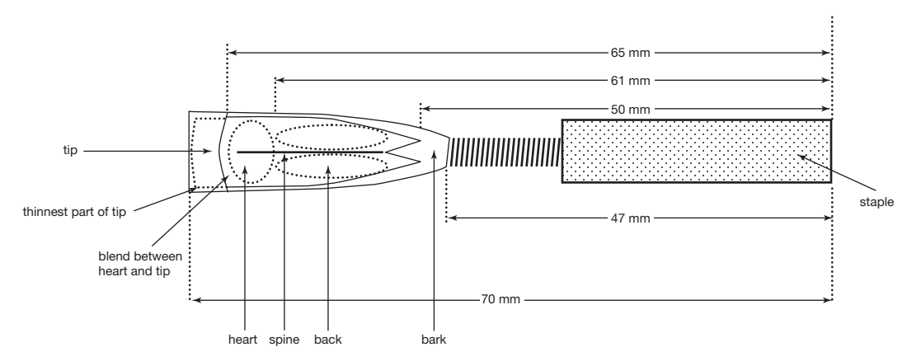

# สัปดาห์ที่ 10 — ลิ้นคู่: โอโบและบาสซูน รูปปาก ลิ้น และการสอนสัปดาห์แรก

**วันเรียน:** 5 ต.ค. 2026 · **ส่งงาน:** 10 ต.ค. 2026 ภายใน 23:59 · ช่องทางตามที่ผู้สอนประกาศ

สัปดาห์นี้รวม **โอโบและบาสซูน** เพราะปัญหาการสอนระยะแรกที่ร่วมกันคือ **reed** ไม่ใช่เพียงรูปปาก เราจะแยกให้ชัดว่าอะไรคือ **สิ่งที่หนังสือกล่าว** และอะไรคือ **คำถามหรือตัวอย่างของครู** รวมถึง **การถ่ายโอน** ไปยังเครื่อง single-reed หรือ brass

---

> *วันนี้เราไม่ได้มาประกวดว่ารีดใครดีที่สุด แต่จะฝึกอธิบายว่า embouchure ของลิ้นคู่ตั้งบนการรองรับ reed ด้วยริมฝีปากจากรอบทิศทางโดยไม่กัด และว่าสัปดาห์แรกของผู้เริ่มต้นมักเป็นสัปดาห์ของรีดพอ ๆ กับการเล่น เราจะใช้หลักจาก Colwell & Hewitt บท Oboe และ Bassoon แล้วแต่ละคนจะออกแบบ micro-teach หรือบันทึกการสอนเรื่องรีด พร้อม transfer note เมื่อจบคาบ คุณจะระบุได้ว่าอะไรยืมข้ามโอโบ–บาสซูนได้ และอะไรอยู่นอกขอบเขตครูทั่วไปที่ไม่ได้ทำรีดเป็นประจำ*

---

## ครูตัดสินใจเรื่องใดบ้างเมื่อผู้เรียน “เป่าไม่ออก” บนลิ้นคู่?

เมื่อได้ยินเสียงไม่ตอบ เราแยก **“รีด / embouchure / ลม”** อย่างไร โดยยังไม่สรุปว่าผู้เรียน “ไม่เก่ง”?

**หลังคาบนี้ คุณจะทำได้ 3 อย่าง**
1. อธิบายหลัก embouchure และความสัมพันธ์กับ reed ของลิ้นคู่จากหนังสือ  
2. ระบุความเป็นจริงของรีดสำหรับผู้เริ่มต้นที่หนังสือรองรับ (การเลือก การแช่ การปรับเบื้องต้น การมีรีดสำรอง)  
3. เขียนแผน micro-teach หรือ teaching note เรื่องรีด/เสียงแรก + transfer note โดยไม่วินิจฉัยสุขภาพ

---

## ตัวอย่างกรณีศึกษา

> **ตัวอย่างเดินเรื่อง (ครูสมมติให้ — ไม่ใช่ข้ออ้างจากหนังสือ):**  
> **ภู** เป็นนักเรียนโอโบสัปดาห์ที่ 2 ครูได้ยินเสียงเล็ก แน่น และภูบอกว่า “เป่าแล้วเมื่อยปากเร็ว”  
> ครูคนหนึ่งพูดว่า “ต้องฝึกยาวขึ้นทุกวัน”  
> ครูอีกคนถามว่า “รีดแข็งเกินไปหรือเปล่า ภูม้วนริมฝีปากมากเกินไปหรือกัด และเรามีรีดสำรองให้เทียบหรือยัง”  
> ทั้งสองคนเห็นเหตุการณ์เดียวกัน แต่จุดตรวจแรกต่างกัน

คุณไม่ต้องเล่นโอโบเหมือนภู ใช้วิธีคิดชุดเดียวกัน: **ตรวจรีดและรูปปากก่อนโทษผู้เรียน · สังเกตก่อนปรับมีด · ขอบเขตก่อนรับประกันรีด**

**สองเครื่องมือของสัปดาห์นี้ทำงานคู่กัน:** W10-A บอก **หลัก embouchure/reed ของลิ้นคู่** · W10-B บอก **ความเป็นจริงของรีดในสัปดาห์แรกและการถ่ายโอน**

---

## เครื่องมือที่ 1: หลัก embouchure และ reed ของลิ้นคู่ (W10-A)

ถ้าไม่มีกรอบนี้ ครูจะสั่ง “เม้มปากให้แน่น” แล้วได้เสียงแน่นหรือไม่มีเสียง

### สืบค้นข้อมูลมาจากไหน?

| ชั้น | มาจากไหน | หมายเหตุ |
|---|---|---|
| **สิ่งที่หนังสือกล่าว** | Colwell & Hewitt — Chapter 12 (The Oboe); Chapter 14 (The Bassoon) ส่วน embouchure | ล็อกเป็น SOURCE CLAIM |
| **ตัวอย่างภูและลำดับชั้น** | ออกแบบโดยรายวิชา | ไม่ใช่ข้อความจากหนังสือ |

> **สิ่งที่หนังสือกล่าว (SOURCE CLAIM · W10-A · เลือกหลักที่ล็อกใช้ในชั้น):**  
> **โอโบ (Ch. 12)**  
> 1. โฟกัสความสัมพันธ์ระหว่าง embouchure กับ reed: ม้วนริมฝีปากทั้งบนและล่างเข้าเล็กน้อยเป็นเบาะรอง reed; ปิดริมฝีปากรอบ reed ด้วยแรงเท่ากันจากทุกทิศทาง  
> 2. ผู้เล่นควรรู้สึกว่า **ถือ reed ไว้ด้วยริมฝีปากที่ปิดสนิท** ไม่ใช่แรงจากการ “กัด” (biting)  
> 3. ฟันเป็นโครงของ embouchure ต้องแยกออก; **ไม่มีการกัดขึ้น** ใน embouchure ปกติ; ขากรรไกรล่างและฟันล่างลดห่างจาก reed; การควบคุมมาจากริมฝีปาก  
> 4. หลีกเลี่ยง “smile pucker” หรือ “crocodile face”; มุมปากดันเข้าหา reed  
> 5. ปริมาณ reed ในปากขึ้นกับเทสซิทูรา: ใส่ลึกขึ้นสำหรับเรจิสเตอร์สูง ถอนออกเล็กน้อยสำหรับเสียงต่ำ  
> 6. embouchure ที่แน่นเกินไปจะบีบเสียง ตัด partial ต่ำ หรือทำให้ pitch หลักสูง  
> 7. ผู้เริ่มต้นมักมีปัญหา: ม้วนริมฝีปากมากเกินไป / น้อยเกินไป (แบบคลาริเน็ต) / ริมฝีปากบนสั้นแล้ววางบน reed ไกลเกินไป  
>
> **บาสซูน (Ch. 14)**  
> 8. ดึงริมฝีปากคลุมฟันทั้งบนและล่างให้เป็นเบาะหนา; ฟันแยกเพื่อหลีกเลี่ยงการกัด; ริมฝีปากรองรับ reed  
> 9. แรงควรมุ่งเข้าสู่ศูนย์กลางของริมฝีปาก; แรงสูงสุดอยู่ที่ขอบ reed มากกว่าด้านแบน เพื่อกัน reed หุบ  
> 10. ข้อผิดพลาดที่พบบ่อย: ใส่ reed น้อยเกินไป และวางริมฝีปากบนบน reed ไม่พอ; ริมฝีปากบนควรอยู่บน reed เกือบถึงลวด  
> 11. รอยยิ้ม (smile) ทำให้โทนบาสซูนลมมาก แข็ง และมีจมูก เพราะเบาะและแรงควบคุมที่ริมฝีปากไม่พอ  
> 12. embouchure เปลี่ยนตามเรจิสเตอร์และไดนามิก (คล้ายโอโบ): เรจิสเตอร์ต่ำใช้ริมฝีปากน้อยลง; เมื่อ pitch สูงขึ้นให้ม้วนริมฝีปากเข้ามากขึ้น

**อ่านสิ่งที่หนังสือกล่าวแบบภาษาง่าย:** ลิ้นคู่ใช้ริมฝีปากเป็นเบาะรอบ reed จากทุกด้าน — **ไม่กัด** — และปริมาณ reed ในปากเปลี่ยนตามช่วงเสียง

| จุดตรวจ | โอโบ (หนังสือ) | บาสซูน (หนังสือ) |
|---|---|---|
| ริมฝีปาก | ม้วนทั้งคู่เป็นเบาะ | คลุมฟันทั้งคู่ เบาะหนา |
| แรง | รอบทิศ เท่ากัน ไม่กัด | เข้าศูนย์กลาง ไม่กัด |
| ปริมาณ reed | ประมาณ 1/3–1/2 ของส่วนไม้ (ทดลอง) | ล่างประมาณ 1/4 นิ้ว; บนเกือบถึงลวด |
| ข้อผิดพลาดคลาสสิก | ม้วนมาก/น้อย; ยิ้ม | รีดน้อย; ริมฝีปากบนน้อย; ยิ้ม |

**ตัวอย่างการสอน** — *ตัวอย่าง/คำแนะนำของครู — ไม่ใช่ข้ออ้างจากหนังสือ*

- ถามภูว่า “ตอนนี้รู้สึกแรงที่ริมฝีปากหรือที่ฟัน?”  
- ให้ลองถอน reed ออกเล็กน้อยแล้วฟัง pitch และสีเสียง เทียบรอบก่อน  
- ยังไม่สั่ง “กัดให้แน่นขึ้น” เมื่อเสียงไม่ตอบ

> **คำถามของครู (ใช้ทั้งชั้น):** เมื่อผู้เรียนลิ้นคู่ได้เสียงเล็กและแน่น คุณจะตรวจ reed ก่อน หรือสั่งให้เม้มแน่นขึ้นก่อน?

> 📌 คำถามของครูเป็นของรายวิชา ไม่ใช่ประโยคคำสั่งจากหนังสือ

**กลับมาที่ภู:** สมมติฐานแรกที่ควรทดสอบคือ **รีดแข็ง + แรงจากฟัน** ไม่ใช่ “ขยันไม่พอ”

---

## เครื่องมือที่ 2: ความเป็นจริงของรีดในสัปดาห์แรก (W10-B)

### ส่วนนี้คืออะไร

แม้ embouchure ถูก ถ้า reed ไม่พร้อม ผู้เริ่มต้นจะได้ยินหลักฐานผิดและสร้างนิสัยชดเชย

### สืบค้นข้อมูลมาจากไหน?

| ชั้น | มาจากไหน | หมายเหตุ |
|---|---|---|
| **สิ่งที่หนังสือกล่าว** | Colwell & Hewitt — Chapter 12 (Reeds); Chapter 14 (Reeds / related embouchure–reed notes) | ล็อกเฉพาะที่หนังสือรองรับ |
| **ลำดับชั้นเรียนและขอบเขตครูทั่วไป** | ออกแบบโดยรายวิชา + นโยบายขอบเขตความสามารถ | ติดป้าย teacher decision |

> **สิ่งที่หนังสือกล่าว (SOURCE CLAIM · W10-B · เฉพาะที่หนังสือรองรับ):**  
> 1. **ความสำคัญของรีด (Ch. 12):** แม้ผู้เล่นโอโบที่ยอดเยี่ยมก็จะฟังดูแย่หากไม่มีรีดดี; การเรียนรู้เครื่องรวมถึงการเรียนรู้การทำรีดที่ใช้งานได้; ครูต้องทำรีดหรือซื้อให้ผู้เริ่มต้น  
> 2. **รีดซื้อสำเร็จรูป (Ch. 12):** ประหยัดเวลา แต่รีดทุกอันต้องปรับ; รีดโอโบที่ซื้อมักแข็งเกินไปสำหรับการเล่นปกติ และต้องปรับเล็กน้อย  
> 3. **รีดในอุดมคติ (Ch. 12):** สมดุล ตอบสนองทั้งดัง–เบา สูง–ต่ำ staccato–legato ด้วยความพยายามน้อย; ควบคุม pitch โทน และไดนามิกได้โดยจัดการ embouchure น้อยที่สุด  
> 4. **มีรีดหลายอัน (Ch. 12):** ผู้เล่นควรมีรีดพร้อมเล่นหลายอัน; ไม่ควรเล่นรีดเดียวจนหมดสภาพ เพราะ embouchure จะชดเชยและเกิดนิสัยไม่ดี; สัญญาณว่ารีดใกล้หมดอายุ ได้แก่ ตอบสนองลด pitch ไม่เสถียร ควบคุมยาก  
> 5. **การแช่และ crow (Ch. 12):** การ crow ช่วยประเมินรีด — ใส่รีดชื้นเข้าปาก ปิดริมฝีปากถึงเชือก เป่า; ควรตอบทันทีและมีเสียงประมาณ C อย่างน้อยสองอ็อกเทฟ  
> 6. **รีดใหม่แข็ง (Ch. 12):** รีดใหม่มักแข็ง; ผู้เริ่มต้นอาจลองรีดอ่อนกว่าเพื่อให้มีเสียงทันที แต่โทนและอินโทเนชันจะเสีย; เมื่อ embouchure แข็งแรงขึ้นควรย้ายไปรีดแข็งขึ้น  
> 7. **บาสซูน–รีดและ pitch (Ch. 14):** รีดเป็นปัจจัยใหญ่ของ pitch; กฎทั่วไป: รีดแข็งทำให้ pitch สูง รีดอ่อนทำให้ต่ำ; รีดเก่าแช่น้ำจนอิ่มตัวมักต่ำ  
> 8. **บาสซูน–ลม (อิง Ch. 10 ที่เชื่อมกับ family):** ในกลุ่มเครื่องลมไม้ โอโบใช้ปริมาณอากาศน้อยที่สุด ในขณะที่บาสซูนและคลาริเน็ตใช้มาก — ครูต้องไม่คาดหวัง “ลมแบบเดียวกัน” ข้ามเครื่อง

**อ่านสิ่งที่หนังสือกล่าวแบบภาษาง่าย:** สัปดาห์แรกของลิ้นคู่มักเป็นสัปดาห์ของรีด — ครูต้องจัดการรีดสำรองและการปรับเบื้องต้น ไม่ใช่ปล่อยให้ผู้เรียนชดเชยด้วยการกัด

### สิ่งที่รายวิชา **ไม่** อ้างเป็น SOURCE CLAIM

- ขั้นตอนมีดละเอียดทุกแบบจนเป็นคอร์สทำรีดเต็มรูปแบบใน 5 นาที  
- การรับประกันว่าครูทุกคนต้องทำรีดเป็น  
- การวินิจฉัยโรคจากแรงดันในศีรษะ (หนังสือ Ch. 12 ปฏิเสธ urban myth บางข้อ และชี้ไปที่ strain มือขวาเป็นประเด็นสุขภาพหลักของโอโบ)

> **ขอบเขตครู (teacher decision + Ch. 12 health):**  
> ครูทั่วไปควรรู้จุดตรวจรีดเบื้องต้นและเมื่อใดต้องพึ่ง specialist/reed maker; หากมีอาการปวดมือ คอ หรืออื่น ๆ ให้ส่งต่อบุคลากรสุขภาพ — ไม่วินิจฉัย

*เครดิต: Colwell & Hewitt, The Teaching of Instrumental Music, Figure 12–7 Illustration of an Oboe Reed; source vault image; ใช้เพื่อการเรียนการสอน*

### ลำดับ micro-teach ที่รายวิชาแนะนำ (3–5 นาที)

**โครงลำดับเป็นของรายวิชา** ผูกกับ SOURCE CLAIM:

1. ตรวจว่ารีดชื้นและเปิดพอ (W10-B)  
2. ตั้ง embouchure แบบไม่กัด — ถามจุดแรงที่ริมฝีปาก (W10-A)  
3. เสียงยาว 1 pitch ในช่วงกลาง ฟังโทนและเสถียรภาพ  
4. เปลี่ยนตัวแปรเดียว: ปริมาณ reed ในปาก **หรือ** รีดสำรองอันที่สอง  
5. บันทึกหลักฐานก่อน–หลัง + ระบุว่าขั้นต่อไปต้องมี specialist หรือไม่

### Transfer note (teacher transfer)

| จากลิ้นคู่ | ยืมไปเครื่องอื่นได้ | ต้องเปลี่ยน |
|---|---|---|
| ไม่กัด / แรงจากริมฝีปาก | เตือน biting บน single reed | single reed มี mouthpiece เป็นโครง |
| รีดกำหนดเพดานเสียง | ตรวจอุปกรณ์ก่อนโทษผู้เรียน | ฟลูต/brass ไม่มี reed |
| มีอุปกรณ์สำรอง | มี mouthpiece/reed/สำรอง | ชนิดการสึกต่างกัน |

**กฎภาษาที่ใช้ทั้งคาบ**
- “ฉันได้ยินเสียงแน่น/เบา/ไม่ตอบ…” ก่อน “ฉันคิดว่ารีด…”  
- แยก **สมมติฐานรีด** กับ **สมมติฐาน embouchure**  
- ไม่สัญญาว่า “รีดนี้ดีแน่นอน” หากยังไม่ได้ฟังตลอดช่วงเสียง  

### ตารางช่วยเขียน (ใช้ส่งงาน)

| ขั้น | ทำอะไร | ตัวอย่างภาษา | ตัวอย่างของภู |
|---|---|---|---|
| **O** | สิ่งที่ได้ยิน/เห็น | “เสียงเล็ก หมดแรงปากใน 30 วินาที” | “pitch สูงเมื่อเป่าดังขึ้น” |
| **ตัวแปร** | รีดหรือ embouchure อย่างใดอย่างหนึ่ง | “เปลี่ยนไปรีดสำรอง” | “ถอน reed ออกเล็กน้อย” |
| **E** | หลักฐานเทียบ | “รอบ 2 ตอบเร็วขึ้น” | “เสียงไม่แน่นเท่า dig เดิม” |
| **ขอบเขต** | สิ่งที่ครูทั่วไปทำ/ไม่ทำ | “ส่งต่อผู้เชี่ยวชาญรีด” | “ไม่วินิจฉัยปวดมือ” |
| **Transfer** | ยืม/เปลี่ยน | “ยืมหลักไม่กัด” | “บนคลาริเน็ตต้องดู ligature” |

---

## งานของนิสิต งานที่ 10

**ชื่องาน:** Micro-teach หรือ reed teaching note · 3–5 นาทีเทียบเท่า · + transfer note  

> **ไม่ให้คะแนน** ความสวยของโทนหรือฝีมือทำรีด — วัด **ลำดับการสอน ภาษา และเหตุผลการถ่ายโอน**  
> **ทางเลือก:** สาธิตส่วนตัวกับผู้สอน หรือส่งเสียง/วิดีโอแทนในชั้น

### ทำตามขั้นตอนนี้

1. เลือกบทบาท: **โอโบ/บาสซูน in focus** หรือ **ผู้สังเกต**  
2. เขียนสถานการณ์ผู้เริ่มต้น 1 ข้อ (เสียงไม่ตอบ / แน่น / แบน / หมดแรงเร็ว)  
3. ลำดับ 3–5 ขั้นอิง `W10-A` และ `W10-B`  
4. ระบุตัวแปรเดียว (รีดสำรอง **หรือ** ปริมาณ reed ในปาก **หรือ** แรงมุมปาก)  
5. ภาษาครู 2–3 ประโยคแบบไม่ตัดสินคน  
6. Transfer note: ยืม 1 + เปลี่ยน 1  
7. ขอบเขต: เมื่อใดต้องพึ่ง reed specialist / สุขภาพ  
8. อ้าง `W10-A · W10-B`

### โครงเอกสารส่ง

| ส่วน | สิ่งที่ต้องมี |
|---|---|
| สถานการณ์ | เครื่อง + อาการที่สังเกตได้ |
| ลำดับสอน | 3–5 ขั้น |
| หลักฐาน | ก่อน–หลัง 1 ตัวแปร |
| Transfer | teacher transfer |
| ขอบเขต | specialist / สุขภาพ |
| รหัส | W10-A · W10-B |

---

## ตัวอย่างข้อความ — ของภู

> **O —** ภูเล่น A ในสาย เสียงเล็กและแน่น หลัง 30 วินาทีภูผ่อนปากและ pitch สูงขึ้นเมื่อพยายามเป่าดัง  
> **ลำดับ —** (1) ตรวจรีดชื้นและมีรีดสำรอง (W10-B) (2) ถามจุดแรงริมฝีปากกับฟัน (W10-A) (3) ถอน reed เล็กน้อย ฟังรอบ 2 (4) หากยังแข็งมาก เปลี่ยนรีดอ่อนกว่าชั่วคราวและบันทึกผลต่อโทน  
> **Transfer —** *teacher transfer:* ยืมหลัก “มีอุปกรณ์สำรองและไม่ให้ embouchure ชดเชยอุปกรณ์เสีย” ไปคลาริเน็ตได้ แต่การ crow และการม้วนริมฝีปากทั้งคู่ไม่ย้ายตรง ๆ  
> **รหัส:** W10-A · W10-B

---

## ถ้าคุณเป็นครูของภู

*คำแนะนำของครู — ไม่ใช่ข้ออ้างจากหนังสือ*

1. อย่าเริ่มด้วย “ขยันกว่านี้”  
2. ตรวจรีดและแรงกัดก่อน  
3. เปลี่ยนทีละอย่าง  
4. รู้ว่าเมื่อใดต้องหยุดขูดรีดในชั้นและนัด specialist  
5. ปวดมือ/คอ → ส่งต่อ ไม่วินิจฉัย

### Peer feedback

- สังเกต 1 ข้อ: ลำดับแยกรีดกับปากชัดหรือไม่  
- คำถาม 1 ข้อ: ถ้ามีรีดอันเดียวในห้อง คุณจะปรับแผนอย่างไร

---

## แผนการสอน 120 นาที (วันเรียน 5 ต.ค. 2026 · specialist)

| เวลา | กิจกรรม | หลักฐานในชั้น |
| --- | --- | --- |
| **0:00–0:10** | Retrieval จาก W9: เครื่องมาหาผู้เล่น · ปริมาณ vs ความเร็วลม · ขอบเขตสุขภาพ | บัตรคำตอบ |
| **0:10–0:40** | Foundational lecture: W10-A โอโบ+บาสซูนร่วม (ไม่กัด, เบาะริมฝีปาก, แรงรอบทิศ) | ตารางเปรียบเทียบ |
| **0:40–1:10** | Guided demo: embouchure + reed check (เน้นโอโบตาม roster; แทรกบาสซูน); ผู้สอนบรรยายการตัดสินใจ | observation note |
| **1:10–1:20** | พัก | — |
| **1:20–1:50** | Micro-teach / reed note workshop + annotate | ร่าง P10 |
| **1:50–2:00** | Transfer note → single reed สัปดาห์หน้า | บัตรสะท้อนคิด |

**Instructor action:** เชิญ specialist ลิ้นคู่หรือผู้ทำรีดช่วยช่วง demo หากผู้สอนหลักไม่ได้ทำรีดเป็นประจำ — ช่วง lecture หลักยังใช้หนังสือร่วมได้

---

## สิ่งที่ส่ง · กำหนดส่ง · เกณฑ์คะแนน

| รายการ | รายละเอียด |
|---|---|
| แผน micro-teach หรือ reed teaching note | 1–2 หน้า |
| Transfer note | ยืม 1 + เปลี่ยน 1 |
| รหัส | `W10-A · W10-B` |
| **วันส่ง** | **10 ต.ค. 2026 ภายใน 23:59** |

### เกณฑ์การให้คะแนน (100)

| ด้าน | คะแนน |
|---|---|
| ลำดับสอนที่แยกรีด / embouchure / ลม | 35 |
| ภาษา O→I และการไม่โทษผู้เรียนก่อนตรวจอุปกรณ์ | 30 |
| Transfer + ขอบเขต specialist/สุขภาพ | 25 |
| ความชัดและรหัสแหล่งความรู้ | 10 |

> ไม่ให้คะแนนความสวยของโทนหรือฝีมือขูดรีด

### งานศึกษาด้วยตนเอง (~6 ชม.)

1. อ่าน Chapter 12 — Embouchure, Tone Quality, Reeds, Health Issues  
2. อ่าน Chapter 14 — Embouchure, Reeds (และ intonation ที่เกี่ยวกับรีด)  
3. เปรียบเทียบจุดร่วม “ไม่กัด / เบาะริมฝีปาก / รีดสำรอง”  
4. ทำ P10 ส่งภายใน 10 ต.ค. 2026 23:59  

**ตรวจตนเองก่อนส่ง**
- [ ] มี SOURCE จากทั้งโอโบและ/หรือบาสซูนตามบทบาท  
- [ ] ไม่แนะนำการกัด  
- [ ] มีแผนรีดสำรองหรือขอบเขตเมื่อรีดไม่พร้อม  
- [ ] มี transfer ติดป้าย  
- [ ] ไม่วินิจฉัยทางการแพทย์  

---

## อภิธานศัพท์

| ศัพท์ | ความหมายสั้น |
|---|---|
| Double reed | ลิ้นคู่ — ใบไม้อ้อสองใบสั่นเป็น tone generator |
| Crow | เสียงทดสอบรีดโอโบโดยเป่ารีดเปล่า |
| Biting | การใช้ฟัน/ขากรรไกรบีบแทนแรงริมฝีปาก |
| Cushion | เบาะริมฝีปากที่รอง reed |
| Staple | ท่อโลหะของรีดโอโบ |
| Bocal | ท่อโลหะโค้งของบาสซูน |
| Scraping | การขูดปรับรีด |
| Transfer | การถ่ายโอนหลักการข้ามเครื่อง |

---

## เชื่อมไปสัปดาห์ถัดไป

สัปดาห์ที่ 11 จะเข้า **ลิ้นเดี่ยว (คลาริเน็ตและแซกโซโฟน)** — ยังมี reed แต่มี mouthpiece และระบบ overblow ต่างกัน (twelfth กับ octave)

---

## References

- Colwell & Hewitt, *The Teaching of Instrumental Music* — Chapter 12 (The Oboe); Chapter 14 (The Bassoon); Chapter 10 (ปริมาณอากาศเปรียบเทียบเครื่องลม — ใช้ประกอบ)

## Image credits

- oboe-reed.png — Colwell & Hewitt, Figure 12–7 Illustration of an Oboe Reed; source vault image; ใช้เพื่อการเรียนการสอน
