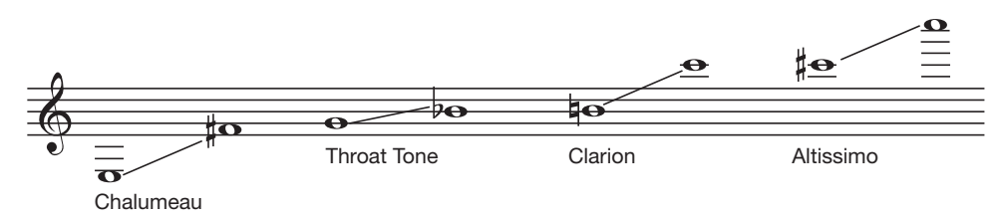

# สัปดาห์ที่ 11 — ลิ้นเดี่ยว: คลาริเน็ตและแซกโซโฟน รูปปาก ช่วงเสียง และอินโทเนชัน

**วันเรียน:** 12 ต.ค. 2026 · **ส่งงาน:** 17 ต.ค. 2026 ภายใน 23:59 · ช่องทางตามที่ผู้สอนประกาศ

สัปดาห์นี้เป็น specialist week ที่ใหญ่ที่สุดตาม roster (คลาริเน็ต + แซกโซโฟน) เราจะฟัง **register และ intonation** ผ่านหลัก embouchure ร่วมของลิ้นเดี่ยว แล้วแยกจุดที่หนังสือบอกว่า **คลาริเน็ต overblow ที่ twelfth** ในขณะที่ **แซกโซโฟน overblow ที่ octave** อย่างชัดเจน

---

> *วันนี้เราไม่ได้มาประกาศว่าใครเสียงไพเราะกว่า แต่จะฝึกเปลี่ยนคำว่า “เสียงดี” ให้เป็นสิ่งที่สังเกตได้: squeak, biting, เรจิสเตอร์ไม่เสถียร, pitch สูงเมื่อเบา เราจะใช้ Colwell & Hewitt บท Clarinet และ Saxophone แล้วออกแบบ micro-teach ที่รู้ตัวเมื่อโมเดลในชั้นเอนไปทางคลาริเน็ต — ต้องพูดการตัดสินใจของแซกโซโฟนออกมาดัง ๆ*

---

## ครูตัดสินใจเรื่องใดบ้างเมื่อได้ยิน squeak หรือเรจิสเตอร์หลุด?

เมื่อได้ยินปัญหาเดียวกัน เราแยก **embouchure · reed · การปิดโฮล · อะคูสติกของเครื่อง** อย่างไร?

**หลังคาบนี้ คุณจะทำได้ 3 อย่าง**
1. อธิบายหลัก embouchure และข้อผิดพลาดร่วมของลิ้นเดี่ยวจากหนังสือ  
2. เปรียบเทียบคลาริเน็ตกับแซกโซโฟนในจุดที่หนังสือรองรับ (overblow, embouchure, แนวโน้ม pitch)  
3. เขียน micro-teach + transfer note ที่ “sax-aware” แม้สาธิตหลักจะเป็นคลาริเน็ต

---

## ตัวอย่างกรณีศึกษา

> **ตัวอย่างเดินเรื่อง (ครูสมมติให้ — ไม่ใช่ข้ออ้างจากหนังสือ):**  
> **เนย** เล่นคลาริเน็ตปีแรก ขึ้นข้าม break แล้ว squeak ซ้ำ  
> **ไตเติ้ล** เล่นอัลโตแซกโซโฟน ได้เสียงบางในเรจิสเตอร์ต่ำและ pitch สูงเมื่อเล่นเบา  
> ครูคนหนึ่งใช้คำสั่งชุดเดียวกับทั้งคู่: “เม้มแน่นขึ้น แล้ว dig แรง ๆ”  
> ครูอีกคนแยกสมมติฐาน: เนยอาจมี mouthpiece ในปากมากไปหรือกัด; ไตเติ้ลอาจ embouchure แน่นแบบคลาริเน็ตหรือลมไม่พอ — และระบบ register key ต่างกัน  
> เหตุการณ์สองเครื่องไม่ใช่ปัญหาเดียวกัน

**สองเครื่องมือ:** W11-A = หลักลิ้นเดี่ยวและ faults ร่วม · W11-B = จุดต่างคลาริเน็ต–แซกที่หนังสือรองรับ

---

## เครื่องมือที่ 1: Embouchure ลิ้นเดี่ยวและ faults ร่วม (W11-A)

### สืบค้นข้อมูลมาจากไหน?

| ชั้น | มาจากไหน | หมายเหตุ |
|---|---|---|
| **สิ่งที่หนังสือกล่าว** | Colwell & Hewitt — Chapter 13 (Clarinet); Chapter 15 (Saxophone) ส่วน embouchure / tone / faults | SOURCE CLAIM |
| **โครงสอนร่วม** | รายวิชา | ไม่ใช่ชื่อบทในหนังสือ |

> **สิ่งที่หนังสือกล่าว (SOURCE CLAIM · W11-A · เลือกหลักที่ล็อกใช้ในชั้น):**  
> **คลาริเน็ต (Ch. 13)**  
> 1. นำเครื่องมาที่ปาก ไม่ก้มหัวไปหา mouthpiece; แนว *Head up, horn down*  
> 2. มุมเครื่องประมาณ 30 องศาจากลำตัว (ปรับตามรูปปาก/ฟัน); ริมฝีปากล่างห่างจากปลาย reed ประมาณ 3/4 นิ้ว ริมฝีปากบนประมาณ 1/2 นิ้ว  
> 3. มุมปากปิดรอบ mouthpiece ให้เกาะแน่นรอบทิศ; **ไม่คิดแบบยิ้มกว้าง**  
> 4. คางชี้ลง (pointed chin) สำคัญกับผู้เริ่มต้น; ถ้าคางไม่ลง เรจิสเตอร์สูงจะจูนยาก เรจิสเตอร์ต่ำเสียการพาเสียง และแก้มโป่งได้ง่าย  
> 5. แรงหลักบน reed มาจากริมฝีปากและมุมปาก ไม่ใช่การกัดของฟันบน  
> 6. **Squeaks** มักมาจาก (1) ใส่ mouthpiece ในปากมากเกินไป หรือ (2) embouchure แน่นเกินไป / กัด / แรงขากรรไกรมาก; ยังอาจมาจาก reed แตก นิ้วปิดโฮลไม่สนิท เครื่องรั่ว หรือ mouthpiece คุณภาพต่ำ  
> 7. เปลี่ยน embouchure น้อยที่สุดข้ามเรจิสเตอร์; ฝึก harmonics ช่วย  
>
> **แซกโซโฟน (Ch. 15)**  
> 8. เริ่มจาก mouthpiece อย่างเดียวได้เพื่อโฟกัส embouchure  
> 9. ม้วนริมฝีปากล่าง; ฟันบนวางบน mouthpiece ประมาณครึ่งนิ้วจากปลาย (อัลโต); ปิดริมฝีปากและมุมปากเข้าหา mouthpiece จากทุกทิศ  
> 10. **หลีกเลี่ยง biting**; ใช้แรงขากรรไกรล่างน้อยที่สุดที่จำเป็น; ดันเครื่องขึ้น–ออกด้วยมือ (นิ้วหัวแม่มือขวา) ให้อิงฟันบน  
> 11. โทนบาง/จมูก = mouthpiece น้อยเกินไป; เสียงดังและควบคุมยาก = มากเกินไป  
> 12. ตรวจ embouchure ด้วย pitch บน mouthpiece เปล่า: อัลโตที่ถูกต้องใกล้ A=440; สูงเกินไปมักเกาะแน่น (มักจากฟันล่าง); ต่ำเกินไปมัก embouchure ยังไม่พัฒนาหรือลมไม่พอ  
> 13. โทนแซกที่ไม่ดีมักมาจาก embouchure แบบคลาริเน็ต — คลายความตึงริมฝีปากและตรวจแรงดึงในแนวนอนที่มุมปาก  
> 14. ลิ้นทำหน้าที่เป็น valve ดึงออกให้ reed สั่น — ไม่ได้ตี reed เพื่อเริ่มเสียง

**อ่านแบบภาษาง่าย:** ลิ้นเดี่ยวใช้ mouthpiece + reed; แรงควรมาจากริมฝีปากรอบทิศ — **squeak และ biting เป็นสัญญาณสอน** ไม่ใช่ป้ายผู้เรียน

| Fault ที่สังเกตได้ | สมมติฐานแรกจากหนังสือ | สิ่งที่ยังไม่สรุป |
|---|---|---|
| Squeak ตอนขึ้นสูง | mouthpiece มาก / กัด / โฮลไม่สนิท | “ไม่มีพรสวรรค์” |
| เสียงบาง | mouthpiece น้อย / ลมน้อย / รีด | “เครื่องพัง” โดยไม่ตรวจ |
| แก้มโป่ง | คางไม่ลง / แรงรอบปากไม่พอ | โรค |
| โทนแซกแน่นเหมือนคลาริเน็ต | embouchure ย้ายเครื่องมาผิด | โทษผู้เรียน |

**ตัวอย่างการสอน** — *ของครู ไม่ใช่หนังสือ*

- ให้นบยอธิบายว่า squeak เกิดตอนนิ้วหรือตอนโจมตีเสียง  
- ให้ไตเติ้ลเป่า mouthpiece เปล่าแล้วฟัง pitch เทียบ A  
- ห้ามใช้คำว่า “เสียงแย่” — ใช้ “squeak ที่ B เมื่อกด register key”

---

## เครื่องมือที่ 2: คลาริเน็ตกับแซกโซโฟนต่างกันตรงไหน (W11-B)

### สืบค้นข้อมูลมาจากไหน?

| ชั้น | มาจากไหน | หมายเหตุ |
|---|---|---|
| **สิ่งที่หนังสือกล่าว** | Ch. 10 (woodwind acoustics); Ch. 13 (registers/intonation); Ch. 15 (range/intonation/overblow) | ตรวจ overblow twelfth vs octave จากหนังสือแล้ว |
| **Sax-aware teaching moves** | รายวิชา (teacher transfer) | ต้องติดป้าย |

> **สิ่งที่หนังสือกล่าว (SOURCE CLAIM · W11-B · ตรวจแล้วในหนังสือ):**  
> 1. **กฎร่วมของ woodwind และข้อยกเว้น (Ch. 10):** เครื่องลมไม้ส่วนใหญ่ overblow อ็อกเทฟสำหรับเรจิสเตอร์สอง — **ยกเว้นคลาริเน็ต**; คลาริเน็ตเป็น cylindrical ที่แท้จริงใน family นี้ และ **overblow ที่ twelfth** (ข้าม partial คู่)  
> 2. **แซกโซโฟน (Ch. 10):** ใช้ reed เดี่ยวเหมือนคลาริเน็ตแต่เป็น conical ชัดเจน จึง **overblow อ็อกเทฟ** ด้วย octave key ที่เปิด vent บน neck  
> 3. **คลาริเน็ตมีสี่เรจิสเตอร์ (Ch. 13):** chalumeau, throat-tone, clarion, altissimo (Figure 13–1)  
> 4. **Register key ของคลาริเน็ต (Ch. 13):** ไม่ใช่ octave key; การออกแบบให้ register/speaker ใช้ร่วมกันสร้างข้อจำกัดจูนในbuilt-in  
> 5. **แนวโน้ม pitch คลาริเน็ต (Ch. 13):** เรจิสเตอร์ต่ำและ throat โน้มสูง เรจิสเตอร์บนโน้มต่ำ — **ตรงข้ามฟลูต**; เล่นเบาโดยไม่ปรับมักสูง เล่นดังมักต่ำ (ตรงข้ามฟลูต)  
> 6. **โทนคลาริเน็ต (Ch. 13):** ได้ลักษณะเฉพาะจาก partial คี่; ความเร็วลมกำหนดความเข้มของโทน  
> 7. **แซกโซโฟนอินโทเนชัน (Ch. 15):** ปรับ mouthpiece บน neck เป็นการจูนพื้นฐาน; โดยทั่วไปผู้เล่นจะโน้ม **flat เมื่อดัง** และ **sharp เมื่อเบา** หากไม่ฟังและควบคุม; อ็อกเทฟล่างของอัลโตมักสูง อ็อกเทฟบนมักต่ำ โดยเฉพาะเมื่อ embouchure และลมยังไม่พร้อม  
> 8. **ตรวจอ็อกเทฟบนแซก (Ch. 15):** ถ้ากด octave key แล้วทั้งสองอ็อกเทฟตอบ แสดง embouchure ใกล้ถูกต้อง; ถ้ามีแต่บน = แน่นเกินไปหรือ mouthpiece น้อย; ถ้ามีแต่ล่าง = หลวมเกินไปหรือ mouthpiece มาก  
> 9. **แซกง่ายที่จะเกิดเสียงแรก แต่ยากที่จะเล่นได้ดี (Ch. 15):** ครูต้องไม่ละเลยเพราะ “เป่าง่าย”

*เครดิต: Colwell & Hewitt, Figure 13–1 The Four Registers of the B-Clarinet; source vault image; ใช้เพื่อการเรียนการสอน*

### ตารางเปรียบเทียบที่ใช้ในชั้น (อิงหนังสือ)

| ประเด็น | คลาริเน็ต | แซกโซโฟน |
|---|---|---|
| รูปท่อ (Ch. 10) | cylindrical (ข้อยกเว้น) | conical ชัดเจน |
| Overblow | **twelfth** | **octave** |
| กุญแจเรจิสเตอร์ | register/speaker (ไม่ใช่ octave) | octave key บน neck |
| เรจิสเตอร์ที่สอนฟัง | 4 เรจิสเตอร์ + break | อ็อกเทฟ + altissimo ภายหลัง |
| แนวโน้มดัง–เบา (ย่อ) | เบา→สูง, ดัง→ต่ำ (Ch. 13) | ดัง→ต่ำ, เบา→สูง ได้บ่อย (Ch. 15) |
| First-lesson ร่วม | mouthpiece+reed, ไม่กัด | mouthpiece เปล่า + pitch check |

### Sax-aware rule ของรายวิชา (teacher transfer — ไม่ใช่ประโยคหนังสือ)

เพราะ roster เอียงคลาริเน็ต ทุก micro-teach ในชั้นนี้ต้องมีอย่างน้อย 1 ประโยคที่บอกว่า:

> “ถ้าผู้เรียนเป็นแซกโซโฟน จุดนี้จะเปลี่ยนเป็น … เพราะ overblow/มุมเครื่อง/การจูน mouthpiece ต่างกัน”

**กลับมาที่เนยและไตเติ้ล**

- เนย: ทดสอบปริมาณ mouthpiece และการกัดก่อนโทษนิ้วอย่างเดียว  
- ไตเติ้ล: ทดสอบ pitch บน mouthpiece เปล่าและลม ก่อนลอกคำสั่งจากคลาริเน็ต

**กฎภาษา**
- ระบุเครื่องก่อนสรุป fault  
- ใช้ชื่อเรจิสเตอร์ตามหนังสือเมื่อพูดคลาริเน็ต  
- แยก “built-in tendency” กับ “นิสัยผู้เล่น”

---

## งานของนิสิต งานที่ 11

**ชื่องาน:** Micro-teach ลิ้นเดี่ยว · ฟัง register/intonation · + transfer note (sax-aware)

> ไม่ให้คะแนนความไพเราะ — วัดลำดับ ภาษา และความตระหนักข้ามเครื่อง  
> สาธิตส่วนตัวหรือไฟล์เสียงได้คะแนนเท่ากัน

### ขั้นตอน

1. เลือกเครื่องโฟกัส: คลาริเน็ตหรือแซกโซโฟน  
2. เลือกปัญหาที่สังเกตได้ 1 ข้อ (squeak / break / pitch เบา–ดัง / โทนบาง)  
3. ลำดับ 3–5 ขั้นอิง `W11-A` และ `W11-B`  
4. ใส่ **ประโยค sax-aware หรือ clarinet-aware** อย่างน้อย 1 ประโยค (teacher transfer)  
5. ตัวแปรเดียวก่อน–หลัง  
6. Transfer ไปเครื่องของตน  
7. ขอบเขต: ไม่วินิจฉัยฟัน/ปวด; ส่งต่อเมื่อจำเป็น  
8. รหัส `W11-A · W11-B`

### โครงส่ง

| ส่วน | ต้องมี |
|---|---|
| สถานการณ์ | เครื่อง + อาการ |
| ลำดับ | 3–5 ขั้น |
| Cross-instrument sentence | 1+ |
| หลักฐาน | ก่อน–หลัง |
| Transfer | ยืม/เปลี่ยน |
| รหัส | W11-A · W11-B |

---

## ตัวอย่างข้อความ — เนย (คลาริเน็ต) แบบ sax-aware

> **O —** เนย squeak เมื่อขึ้นจาก throat ไป clarion ตรง B หลังกด register key 2 ใน 3 ครั้ง  
> **ลำดับ —** (1) ตรวจนิ้วปิดโฮล (2) ถามแรงที่ฟันล่าง (W11-A) (3) ลด mouthpiece เข้าปากเล็กน้อย แล้วฟังรอบ 2 (4) ยังไม่เร่งเพลงเร็ว  
> **Sax-aware —** *teacher transfer:* ถ้าเป็นแซก การข้ามเรจิสเตอร์ใช้ octave ไม่ใช่ twelfth และการตรวจเบื้องต้นที่ mouthpiece เปล่า (A≈440) จะมีประโยชน์กว่าการพูดเรื่อง chalumeau/clarion ตรง ๆ  
> **รหัส:** W11-A · W11-B

---

## ถ้าคุณเป็นครูของเนยและไตเติ้ล

1. อย่าใช้คำสั่งชุดเดียวข้ามเครื่อง  
2. ตั้งชื่อสิ่งที่ได้ยินก่อน  
3. แยก biting จาก reed จาก leak  
4. พูดจุด overblow ให้ผู้สังเกตได้ยิน  
5. ประเมินที่เหตุผลการสอน ไม่ที่โทนสวย

### Peer feedback

- สังเกต: มีประโยคข้ามเครื่องหรือไม่  
- คำถาม: ถ้าตัดคำว่า “แน่นขึ้น” คุณจะให้ฟังอะไรแทน

---

## แผนการสอน 120 นาที (12 ต.ค. 2026 · specialist)

| เวลา | กิจกรรม | หลักฐานในชั้น |
| --- | --- | --- |
| **0:00–0:10** | Retrieval: ไม่กัดบน double reed; รีดสำรอง; twelfth vs octave (ทาย) | บัตรคำตอบ |
| **0:10–0:40** | Lecture: W11-A faults ร่วม + W11-B ตารางคลาริเน็ต/แซก | ตารางเปรียบเทียบ |
| **0:40–1:10** | Demo: คลาริเน็ต break + แซก mouthpiece pitch/octave check; บรรยายการตัดสินใจ | observation |
| **1:10–1:20** | พัก | — |
| **1:20–1:50** | Micro-teach (คลาริเน็ต+แซก) / ผู้สังเกต annotate แบบ sax-aware | ร่าง P11 |
| **1:50–2:00** | Transfer → เปิดบล็อก brass สัปดาห์หน้า | บัตรสะท้อนคิด |

**Instructor action:** ให้แซกโซโฟน 1 คนใน roster ได้เวลา demo ชัดเจน หรือให้ผู้สอนสาธิตแซกเอง — ห้ามเหลือเพียง “ให้แซกเดาจากคลาริเน็ต”

---

## สิ่งที่ส่ง · กำหนดส่ง · เกณฑ์คะแนน

| รายการ | รายละเอียด |
|---|---|
| แผน micro-teach | 1–2 หน้า |
| ประโยคข้ามเครื่อง | อย่างน้อย 1 |
| Transfer note | ยืม/เปลี่ยน |
| **วันส่ง** | **17 ต.ค. 2026 ภายใน 23:59** |
| รหัส | `W11-A · W11-B` |

### เกณฑ์ (100)

| ด้าน | คะแนน |
|---|---|
| ลำดับสอนและจุดฟัง register/intonation | 35 |
| ภาษา faults จากหนังสือ (squeak/biting ฯลฯ) | 30 |
| ความต่างคลาริเน็ต–แซก + transfer | 25 |
| ความชัดและรหัส | 10 |

### งานศึกษาด้วยตนเอง (~6 ชม.)

1. Chapter 13 — Embouchure, Intonation, Tone, Reeds (ตามที่เกี่ยวกับงาน)  
2. Chapter 15 — Embouchure, Range, Intonation, Tone  
3. Chapter 10 — ย่อหน้า woodwinds เรื่อง overblow octave vs twelfth  
4. ทำ P11 ส่ง 17 ต.ค. 2026 23:59  

**ตรวจตนเอง**
- [ ] ไม่สับสน twelfth กับ octave  
- [ ] มี O ก่อน I  
- [ ] มีประโยค sax-aware/clarinet-aware  
- [ ] ไม่วินิจฉัยสุขภาพ  

---

## อภิธานศัพท์

| ศัพท์ | ความหมายสั้น |
|---|---|
| Single reed | ลิ้นเดี่ยวบน mouthpiece |
| Break | จุดเปลี่ยนเรจิสเตอร์ |
| Chalumeau / Clarion / Altissimo | เรจิสเตอร์คลาริเน็ต |
| Register key / Octave key | กุญแจเรจิสเตอร์ (คลาริเน็ต) / อ็อกเทฟ (แซก) |
| Twelfth | ช่วง overblow ของคลาริเน็ต |
| Biting | กัด reed/mouthpiece |
| Ligature | ตัวรัด reed |
| Sax-aware | การสอนที่พูดจุดต่างของแซกออกมาชัด |

---

## เชื่อมไปสัปดาห์ถัดไป

สัปดาห์ที่ 12 เปิดบล็อก **brass** ด้วยหลักร่วมของทองเหลือง +ทรัมเป็ต — ลิ้นจะหายไป เหลือ lips เป็น tone generator และประเด็นแรงกด mouthpiece กับลม

---

## References

- Colwell & Hewitt — Chapter 10 (Woodwinds acoustics); Chapter 13 (The Clarinet); Chapter 15 (The Saxophone)

## Image credits

- clarinet-registers.png — Colwell & Hewitt, Figure 13–1 The Four Registers of the B-Clarinet; source vault image; ใช้เพื่อการเรียนการสอน
