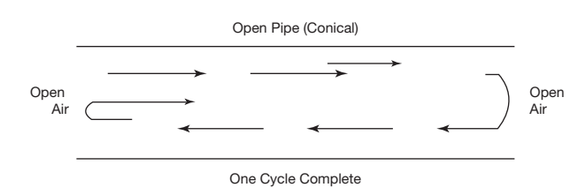

# สัปดาห์ที่ 12 — การสอนเครื่องทองเหลือง: หลักการสอนร่วมของเครื่องทองเหลืองและทรัมเป็ตเบื้องต้น

**วันเรียน:** 19 ต.ค. 2026 · **ส่งงาน:** 24 ต.ค. 2026 ภายใน 23:59 · ช่องทางตามที่ผู้สอนประกาศ

สัปดาห์นี้ **เปิดบล็อก brass** (ไม่ใช่สัปดาห์ articulation/fingering ทั่วไปตาม stub เดิม) โดยเริ่มจากหลักร่วมใน Colwell & Hewitt Chapter 16 แล้วลงทรัมเป็ต Chapter 17 Articulation ยังพูดได้ในฐานะหัวข้อรองหากโยงกับ books ได้ แต่แกนหลักคือ **embouchure ร่วม · ลม · แรงกด mouthpiece · first tone**

---

> *วันนี้เราไม่ได้มาแข่งใครเป่าสูงสุด แต่จะฝึกเปิดบทเรียน brass อย่างปลอดภัย: lips เป็น tone generator ร่วมของทุกเครื่องทองเหลือง แรงกด mouthpiece มากเกินไปเป็นศัตรูของความทนทานและเรจิสเตอร์สูง และคำสั่งของครูสามารถดึงความสนใจเข้าไปในกล้ามเนื้อ (internal) หรือออกไปที่เสียง (external) เราจะใช้หลักจากหนังสือเป็น SOURCE แล้วใช้ Gebrian เป็น **teacher prompt** ที่ติดป้ายชัดว่าไม่ใช่ข้อความในบท brass*

---

## ครูตัดสินใจเรื่องใดบ้างเมื่อผู้เริ่มต้น “กดปากเป่าแรง” เพื่อให้มีเสียง?

เมื่อได้ยินเสียงบาง แตก หรือสูงไม่สุด เราแยก **ลม · แรงกด · embouchure · partial** อย่างไร?

**หลังคาบนี้ คุณจะทำได้ 3 อย่าง**
1. อธิบายหลักร่วมของ brass จากหนังสือ (เริ่มต้น embouchure แรงกด ลม)  
2. ระบุ early faults ของทรัมเป็ตที่หนังสือรองรับ โดยเฉพาะแรงกดแทนลม  
3. เขียน micro-teach ที่มี **อย่างน้อย 1 คำสั่ง external-focus** ที่เขียนใหม่จาก internal-focus พร้อมติดป้ายแหล่ง

---

## ตัวอย่างกรณีศึกษา

> **ตัวอย่างเดินเรื่อง (ครูสมมติให้ — ไม่ใช่ข้ออ้างจากหนังสือ):**  
> **ไตน์** เริ่มทรัมเป็ตสัปดาห์ที่ 3 ต้องการเล่นโน้ตสูงในเพลงวง ครูเห็นว่าไตน์ดันปากเป่าเข้าปากแรง ไหล่ยก และเสียงกลางบาง  
> ครูคนหนึ่งพูดว่า “ดันปากให้แน่นแล้วกดแรงขึ้น”  
> ครูอีกคนพูดว่า “ลองส่งลมผ่านเสียงให้ยาว แล้วฟังว่าโทนกลางหนาขึ้นไหม — ลดแรงที่มือซ้ายที่จับเครื่อง”  
> คำสั่งแรกดึงความสนใจเข้ากล้ามเนื้อและแรงกด คำสั่งที่สองดึงไปที่ลมและเสียง

**สองเครื่องมือ:** W12-A = หลักร่วม brass · W12-B = ทรัมเป็ต early faults + external-focus rewrite (teacher prompt)

---

## เครื่องมือที่ 1: หลักร่วมของ brass (W12-A)

### สืบค้นข้อมูลมาจากไหน?

| ชั้น | มาจากไหน | หมายเหตุ |
|---|---|---|
| **สิ่งที่หนังสือกล่าว** | Colwell & Hewitt — Chapter 16 (Principles for Brass) | SOURCE CLAIM |
| **ตัวอย่างไตน์** | รายวิชา | ไม่ใช่หนังสือ |

> **สิ่งที่หนังสือกล่าว (SOURCE CLAIM · W12-A · เลือกหลักที่ล็อกใช้ในชั้น):**  
> 1. **Tone generator (Ch. 16 เปิดบท):** เครื่องทองเหลืองสร้างเสียงจากคอลัมน์อากาศในท่อที่ถูก lips ขับให้สั่น; pitch อิง overtone series และมีวาล์ว/สไลด์เติมโครมาติก  
> 2. **ความสนใจสำคัญกว่า “คัดสรรร่างกาย” อย่างเดียว (Starting the Beginner):** แม้มีรายการตรวจร่างกาย แต่ **ความสนใจในเครื่อง** เป็นตัวทำนายความสำเร็จหลัก; เด็กจะเปลี่ยนอยู่เสมอ  
> 3. **เริ่ม buzz / เสียงแรก:** ชื้นริมฝีปาก ฟันแยก ทำเสียง motorboat แล้วเพิ่มความเร็วด้วยการกระชับมุมปาก; วาง mouthpiece เบา ๆ แรงเท่าที่กันลมรั่ว; หรือตั้งริมฝีปากแนว “em” กระชับมุมปาก แล้วเป่าจนมีเสียง — **อย่าดึง mouthpiece กระแทกริมฝีปาก**  
> 4. **แรงกดมากเกินไป:** เป็นนิสัยไม่ดีที่พบบ่อยและเป็นเหตุหลักของปัญหาเรจิสเตอร์สูง; มักเป็นอาการของ embouchure ที่ยังไม่พัฒนาหรือลมไม่รองรับ  
> 5. **Embouchure ร่วม:** ริมฝีปากแตะกัน ฟันแยกเล็กน้อยเหมือน “em”; มุมปากกระชับ (คางแบน); ศูนย์กลางริมฝีปากพอสั่นได้; หลีกเลี่ยงยิ้มสุดหรือเม้มสุดเพียงอย่างเดียว  
> 6. **จัดกลาง mouthpiece** ทั้งแนวนอนและแนวตั้งให้มากที่สุด; แนวลมไม่ควรพุ่งขึ้นหรือลงมากเกินไป  
> 7. **Embouchure faults:** แรงกด mouthpiece มากเกินไปเป็น fault ทำลายที่สุด — กระทบโทน ความยืดหยุ่น ความทนทาน และเรนจ์; แรงควรถือเป็นเพียง enough to seal; ผู้เล่นควรรู้สึกว่า **ลมผลัก mouthpiece ออกจากริมฝีปาก** มากกว่าดันริมฝีปากเข้า mouthpiece  
> 8. **อากาศในแก้ม / ยิ้ม:** ทำให้ศูนย์กลางยืดและมุมปากทำงานไม่ได้  
> 9. **Long tones และ lip slurs:** จำเป็นต่อลม embouchure และการประสาน; ปัญหา slur ขึ้นมักเกี่ยวกับลมไม่สม่ำเสมอ ความเร็วลมไม่พอ หรือมุมปากไม่กระชับ  
> 10. **Articulation (รอง):** ลิ้นใช้เริ่มเสียง ไม่ควรใช้ลิ้นปิดท้ายเสียงเป็นนิสัย; หยุดเสียงส่วนใหญ่ด้วยการหยุดลม

**อ่านแบบภาษาง่าย:** brass ทั้ง family ใช้ lips + ลม; แรงกดปากเป่ามากคือทางลัดที่แพง — สอนลมและมุมปากก่อนสอน “กดแรงขึ้น”

| จุดร่วม | สิ่งที่ครูฟัง/ดู | คำถามสอน |
|---|---|---|
| First sound | มี buzz/pitch หรือมีแต่ลม | ลมหรือแรงกดเป็นตัวสร้างเสียง? |
| Pressure | มือซ้ายขาว รอยปากแดงเร็ว | seal อย่างเดียวหรือกดเกิน? |
| Air vs pitch | ดังขึ้นแต่สูงไม่ขึ้น | สับสนปริมาณกับความเร็วลมหรือไม่? (โยง Ch. 10) |
| Tension | ไหล่ คอ ขากรรไกร | จุดตึงอยู่นอก embouchure หรือไม่? |

**ตัวอย่างการสอน** — *ของครู*

- ให้ไตน์เล่น long tone กลางช่วง ฟังความหนาของโทน ก่อนขอโน้ตสูง  
- ขอให้วางปากเป่าใหม่ทุกครั้งหลังหยุดยาว  
- ยังไม่ใช้คำว่า “กด octaves ด้วยมือ”

---

## เครื่องมือที่ 2: ทรัมเป็ต early faults และคำสั่ง external-focus (W12-B)

### สืบค้นข้อมูลมาจากไหน?

| ชั้น | มาจากไหน | หมายเหตุ |
|---|---|---|
| **สิ่งที่หนังสือกล่าว** | Chapter 17 (Trumpet/Cornet) + จุด pressure จาก Ch. 16 | SOURCE CLAIM |
| **External vs internal focus** | Gebrian / Module 1 Week 4 นำมาใช้ใหม่ | **Teacher prompt — ไม่ใช่ SOURCE ของบท brass** |

> **สิ่งที่หนังสือกล่าว (SOURCE CLAIM · W12-B · ทรัมเป็ต/แรงกด):**  
> 1. หลักหลายอย่างของทรัมเป็ตซ้ำกับ Ch. 16 และไม่ทวนทั้งหมดใน Ch. 17  
> 2. **ถือเครื่อง:** มือซ้าย elevators น้ำหนัก; มือขวาคล้าย “C” บนวาล์ว **ไม่ช่วยพยุงเครื่อง**; **ไม่ควรใช้ finger hook/ring เป็นนิสัย** เพราะอาจนำไปสู่แรงกด embouchure มากเกินไป และลดความทนทาน/เรนจ์  
> 3. **เริ่ม embouchure:** แนว “em” แล้วยกเครื่องสู่ริมฝีปากผ่อนคลาย แล้ว “pooh”; กระชับมุมปากและ buzz  
> 4. หากเริ่มยาก: buzz ปากเปล่า / mouthpiece อย่างเดียว; buzz ปากเปล่าช่วยผู้ที่แก้มโป่ง  
> 5. **โทน (Ch. 17):** โทนดีพึ่งภาพในใจของเสียง การฟัง และการประเมิน; **แรงกด mouthpiece มากเกินไปมักใช้ชดเชยลมหรือ embouchure ที่ยังไม่พร้อม**  
> 6. ต้องการเสียงที่โฟกัส กลาง หนาจากลมสม่ำเสมอ และผ่อนคลายไม่บังคับ  
> 7. Long tones มีประโยชน์; ฝึกทุกไดนามิก  
> 8. (รอง) Articulation และ fingering มีในบท แต่ **ไม่ใช่แกน micro-teach สัปดาห์นี้** เว้นแต่โยงกับการเริ่มเสียงโดยไม่ปิดท้ายด้วยลิ้น

**อ่านแบบภาษาง่าย:** บนทรัมเป็ต แรงที่มือและปากเป่าแทนลมจะได้เสียงสั้นอายุ — สอนลมและการฟังโทนกลางก่อนเรนจ์

### External-focus rewrite (teacher prompt — ติดป้ายชัด)

จาก Module 1 / Gebrian: คำสั่งที่ชี้ไปที่ **ผลที่เสียงหรืองานภายนอก** มักช่วยการเคลื่อนไหวได้ดีกว่าคำสั่งที่ชี้ไปที่กล้ามเนื้อภายใน  
**ข้อความนี้ไม่ได้อยู่ใน Colwell บท brass** — ใช้เป็นเครื่องมือภาษาครูเท่านั้น

| Internal-focus (หลีกในงานนี้) | External-focus rewrite (ใช้ในงาน) | โยง SOURCE อะไรได้ |
|---|---|---|
| “กระชับมุมปากให้แน่นเข้าไปอีก” | “ส่งลมให้เสียงกลางหนาขึ้นจนเต็มห้องซ้อม” | ลม/โทน Ch. 16–17 |
| “กดปากเป่าให้แนบแรง ๆ” | “ใช้แรงแค่พอไม่ให้ลมรั่ว แล้วฟังว่า buzz ยาวขึ้นไหม” | pressure fault Ch. 16 |
| “ดันลิ้นแรง ๆ ที่ฟัน” | “ให้เสียงเริ่มสะอาดเหมือนไฟติด แล้วปล่อยลมยาวต่อ” | articulation เริ่มเสียง Ch. 16 |
| “อย่าเกร็งไหล่” (ยังชี้ร่างกาย) | “ให้เสียงลอยออกไปด้านหน้าเครื่องโดยไม่ขาดตอน” | tension → tone |

> **กฎงาน P12:** ต้องมีอย่างน้อย 1 คู่ internal → external และอธิบายว่าทำไม external ยังสอนเป้าหมายเดิมได้

*เครดิต: Colwell & Hewitt, Figure 10–4 Illustration of the Standing Wave of Most Wind Instruments; source vault image; ใช้เพื่อการเรียนการสอน*

**กฎภาษา**
- แยก SOURCE หนังสือ กับ teacher prompt (Gebrian)  
- ไม่วินิจฉัยฟัน/occlusion เชิงการแพทย์; หนังสือพูดแนวทางทั่วไปและให้ระวัง — หากสงสัยส่งต่อ  
- ประเมินที่คำสั่งและการลำดับ ไม่ที่ high note สำเร็จ

---

## งานของนิสิต งานที่ 12

**ชื่องาน:** Micro-teach brass/trumpet 3–5 นาที · ≥1 external-focus rewrite · + transfer note

> ไม่ให้คะแนนความดัง เรนจ์ หรือความไพเราะ  
> สาธิตส่วนตัวหรือไฟล์เสียงได้

### ขั้นตอน

1. บทบาท: ทรัมเป็ต in focus หรือผู้สังเกต brass/ไม่อื่น  
2. เป้าหมาย first-lesson ที่สังเกตได้ (เช่น long tone กลางช่วงโดยลดแรงกด)  
3. ลำดับ 3–5 ขั้นอิง `W12-A` และ `W12-B`  
4. เขียน **internal cue 1 อัน** แล้ว **rewrite เป็น external 1 อัน** (ติดป้าย Gebrian/teacher prompt)  
5. ตัวแปรเดียวก่อน–หลัง (เช่น แรงมือซ้าย หรือทิศคำสั่ง)  
6. Transfer ไปเครื่องตน (woodwind → brass หรือ brass → brass อื่น)  
7. ขอบเขตสุขภาพ 1 ประโยค  
8. รหัส `W12-A · W12-B` (+ ป้าย external-focus prompt)

### โครงส่ง

| ส่วน | ต้องมี |
|---|---|
| เป้าหมาย | สังเกตได้ |
| ลำดับ | 3–5 ขั้น |
| Internal → External | อย่างน้อย 1 คู่ |
| หลักฐาน | ก่อน–หลัง |
| Transfer | ยืม/เปลี่ยน |
| รหัส | W12-A · W12-B |

---

## ตัวอย่างข้อความ — ของไตน์

> **เป้าหมาย —** ไตน์เล่น long tone second-line G ยาว 3 วินาที โดยมือซ้ายไม่ดันเครื่องเข้าปากจนเสียงบาง  
> **ลำดับ —** (1) วางริมฝีปากแนว em ยกเครื่องมาหาปาก (W12-A) (2) long tone ฟังความหนา (W12-B) (3) ลดแรงมือซ้าย เหลือแค่ seal (W12-A) (4) ฟังรอบ 2  
> **Internal (หลีก):** “กระชับมุมปากและกดปากเป่าแรงขึ้น”  
> **External (ใช้):** “ส่งลมให้เสียง G หนาและนิ่งจนจบ 3 วินาที โดยไม่ให้เสียงบางตอนท้าย” — *teacher prompt จากกรอบ external focus (Gebrian/Module 1) ไม่ใช่ประโยค Colwell*  
> **Transfer —** จากคลาริเน็ต: ยืมหลักเครื่องมาหาผู้เล่นได้ แต่ tone generator เป็น lips ไม่ใช่ reed; แรงกด mouthpiece เป็น fault หลักใหม่  
> **รหัส:** W12-A · W12-B

---

## ถ้าคุณเป็นครูของไตน์

1. อย่าแลก high note ด้วยแรงกด  
2. ตั้ง long tone และลมก่อนเรนจ์  
3. เขียนคำสั่งใหม่ให้อยู่ที่เสียง  
4. finger hook ไม่ใช่ “octave key”  
5. ปวดปาก/ฟัน → พักและส่งต่อ

### Peer feedback

- สังเกต: คำสั่งชี้ไปที่เสียงหรือกล้ามเนื้อ  
- คำถาม: ถ้าผู้เรียนยังไม่มีเสียง จะ external-focus อย่างไรโดยไม่คลุมเครือ

---

## แผนการสอน 120 นาที (19 ต.ค. 2026 · specialist)

| เวลา | กิจกรรม | หลักฐานในชั้น |
| --- | --- | --- |
| **0:00–0:10** | Retrieval: twelfth vs octave; biting; ขอบเขตสุขภาพ | บัตรคำตอบ |
| **0:10–0:40** | Lecture: W12-A หลักร่วม brass (pressure, embouchure, air) | ตาราง faults |
| **0:40–1:10** | Demo ทรัมเป็ต first tone / mouthpiece buzz / long tone; บรรยายการตัดสินใจ; แสดงตัวอย่าง internal→external | observation |
| **1:10–1:20** | พัก | — |
| **1:20–1:50** | Micro-teach workshop (trumpet focus) + rewrite cues | ร่าง P12 |
| **1:50–2:00** | Transfer note → horn สัปดาห์ถัดไป (partial ถี่ขึ้น) | บัตรสะท้อนคิด |

**Instructor action:** หากผู้สอนหลักเป็น woodwind ให้เชิญ trumpet specialist ช่วง demo; lecture หลักร่วม Ch. 16 ยังสอนทั้ง cohort ได้

---

## สิ่งที่ส่ง · กำหนดส่ง · เกณฑ์คะแนน

| รายการ | รายละเอียด |
|---|---|
| แผน micro-teach | 1–2 หน้า |
| Internal→External ≥1 | ติดป้าย teacher prompt |
| Transfer note | ยืม/เปลี่ยน |
| **วันส่ง** | **24 ต.ค. 2026 ภายใน 23:59** |
| รหัส | `W12-A · W12-B` |

### เกณฑ์ (100)

| ด้าน | คะแนน |
|---|---|
| ลำดับ first brass lesson (ลม/แรงกด/โทน) | 35 |
| External-focus rewrite ที่ยังสอนเป้าเดิม | 30 |
| Transfer + ขอบเขตสุขภาพ | 25 |
| ความชัดและแยก SOURCE/prompt | 10 |

### งานศึกษาด้วยตนเอง (~6 ชม.)

1. Chapter 16 — Starting the Beginner, Embouchure, Faults, Endurance (ย่อ), Articulations (ย่อ)  
2. Chapter 17 — Holding, Embouchure, Tone Quality  
3. ทบทวน external vs internal focus จาก Module 1 แล้วฝึก rewrite 3 คู่  
4. ส่ง P12 ภายใน 24 ต.ค. 2026 23:59  

**ตรวจตนเอง**
- [ ] ไม่ใช้แรงกดเป็นคำตอบหลักของ high range  
- [ ] แยก Gebrian prompt จาก Colwell SOURCE  
- [ ] มี long-tone หรือ first-sound logic  
- [ ] ไม่วินิจฉัยทางการแพทย์  

---

## อภิธานศัพท์

| ศัพท์ | ความหมายสั้น |
|---|---|
| Brass embouchure | รูปปากร่วมของเครื่องทองเหลือง |
| Mouthpiece pressure | แรงกดปากเป่าต่อริมฝีปาก |
| Buzz | การสั่นของริมฝีปาก/ mouthpiece |
| Partial / overtone series | ชุดเสียงฮาร์มอนิกที่เป็นฐาน pitch ทองเหลือง |
| Lip slur | เปลี่ยน pitch ใน series เดียวด้วย embouchure/ลม |
| Internal focus | ความสนใจที่กล้ามเนื้อ/ร่างกาย |
| External focus | ความสนใจที่เสียงหรือผลภายนอก |
| Finger hook | ห่วงนิ้วก้อยทรัมเป็ต — ไม่ควรใช้เป็นนิสัยพยุง/ดัน |

---

## เชื่อมไปสัปดาห์ถัดไป

ต่อไปจะเข้า **horn** ซึ่ง partial ถี่กว่าและมีมือในกระดิ่งเป็นตัวแปร tone/intonation — หลัก Ch. 16 ยังใช้ แต่จุด first-pitch by ear จะเด่นขึ้น

---

## References

- Colwell & Hewitt — Chapter 16 (Principles for Brass); Chapter 17 (The Trumpet and Cornet); Chapter 10 (air quantity vs speed — ใช้ประกอบ)
- Gebrian / Module 1 Week 4 — external vs internal focus (**teacher prompt เท่านั้น** ในสัปดาห์นี้)

## Image credits

- standing-wave.png — Colwell & Hewitt, Figure 10–4 Illustration of the Standing Wave of Most Wind Instruments; source vault image; ใช้เพื่อการเรียนการสอน
