# บทที่ 2: การศึกษาด้านการสอนและการเรียนรู้ดนตรี

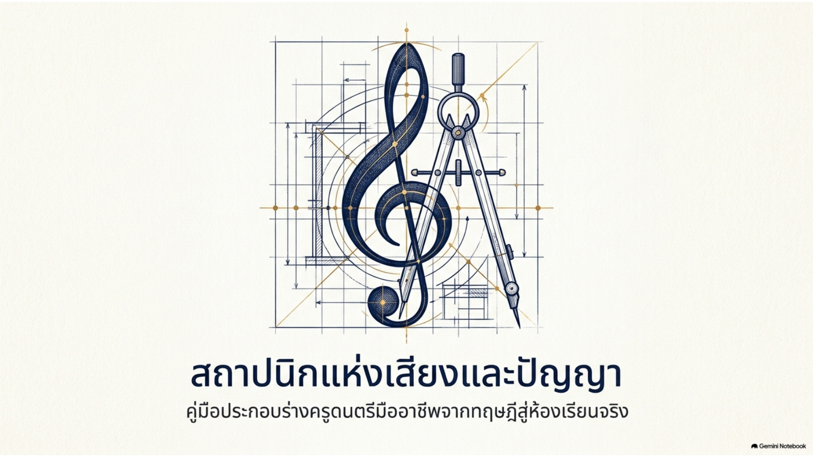

*ภาพประกอบ 2.2 สถาปนิกแห่งเสียงและปัญญา: คู่มือประกอบร่างครูดนตรีมืออาชีพจากทฤษฎีสู่ห้องเรียนจริง — ที่มา: The Music Educator’s Blueprint, สไลด์ 1*

## บทนำ: ธรรมชาติของการเรียนรู้และการสอน

*การเรียนรู้* สามารถนิยามได้ว่าเป็นกิจกรรมหรือกระบวนการในการได้มาซึ่งความเข้าใจ ความรู้ ทักษะ ค่านิยม หรือทัศนคติใหม่ ๆ โดยการศึกษา การฝึกฝน การได้รับการสอน หรือการประสบเหตุการณ์บางอย่าง[2] การเรียนรู้เกี่ยวข้องกับสิ่งที่นักเรียนทำ ไม่ใช่สิ่งที่เราในฐานะครูทำ *นักเรียนเรียนรู้ด้วยวิธีที่แตกต่างกัน* ดังที่ปรากฏใน "รูปแบบการเรียนรู้" (learning styles) ต่าง ๆ[3] การเรียนรู้อาจเป็นแบบผิวเผินหรือแบบลึกซึ้งก็ได้[4] หากความรู้ถูกจดจำเพียงอย่างเดียว มักจะลืมไปในไม่ช้า แต่หากผู้เรียนสามารถเชื่อมโยงความรู้ใหม่เข้ากับแนวคิดที่ตนเข้าใจอยู่แล้ว การเรียนรู้นั้นย่อมมีแนวโน้มถูกจดจำและนำไปใช้ได้มากกว่า บางคนมีแรงจูงใจในการเรียนรู้เพราะต้องการปฏิบัติหน้าที่ได้ดีขึ้น หรือเพราะจะได้รับรางวัลจากความสำเร็จของตน[5] การเรียนรู้อาจเป็นทางการ กล่าวคือ การเข้าร่วมหลักสูตรที่วางแผนไว้อย่างเป็นระบบในโรงเรียนหรือวิทยาลัย หรืออาจเป็นแบบไม่เป็นทางการ ซึ่งเราเรียนรู้จากประสบการณ์ในชีวิตประจำวัน สิ่งต่าง ๆ ที่เกิดขึ้นกับเราทำให้เราเปลี่ยนแปลงวิธีคิดและวิธีปฏิบัติ แน่นอนว่าการเรียนรู้ดำเนินต่อเนื่องตลอดชีวิต อย่างน้อยก็ในเชิงไม่เป็นทางการ[6]

ในระดับที่สูงขึ้น การศึกษาหรืองานวิจัยเชิงวิชาการด้านการสอนและการเรียนรู้ (Scholarship of Teaching and Learning: SOTL) มักถูกนิยามว่าเป็นการสืบค้นอย่างเป็นระบบเกี่ยวกับการเรียนรู้ของผู้เรียน เพื่อพัฒนาแนวทางการสอนโดยการเผยแพร่ผลการสืบค้นดังกล่าวต่อสาธารณะ[7] SOTL จำเป็นต้องอาศัยแนวปฏิบัติดั้งเดิมหลายประการ เช่น การประเมินชั้นเรียนและหลักสูตร การวิจัยเชิงปฏิบัติการ (action research)[8] การปฏิบัติอย่างมีการสะท้อนคิด (reflective practice) การประเมินการสอนโดยเพื่อนร่วมวิชาชีพ (peer review of teaching) การวิจัยด้านการศึกษาแบบดั้งเดิม และความพยายามในการพัฒนาคณาจารย์เพื่อเสริมสร้างการสอนและการเรียนรู้

> **ภาพนำทางของบทเรียน:** ใช้ภาพนี้เชื่อมโยงแนวคิดหลักของบท ได้แก่ การเรียนรู้เชิงลึก การเรียนรู้ทั้งในและนอกระบบ โดเมนทักษะ–ความรู้–จิตพิสัย รากฐานทางปรัชญาและจิตวิทยา ตลอดจนการเชื่อมทฤษฎีสู่การปฏิบัติและการสะท้อนคิดของครูดนตรี

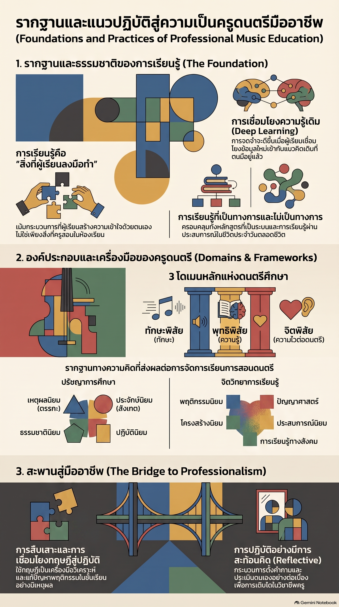

*ภาพประกอบ 2.1 รากฐานและแนวปฏิบัติสู่ความเป็นครูดนตรีมืออาชีพ — ที่มา: ภาพประกอบที่จัดเตรียมสำหรับรายวิชานี้*

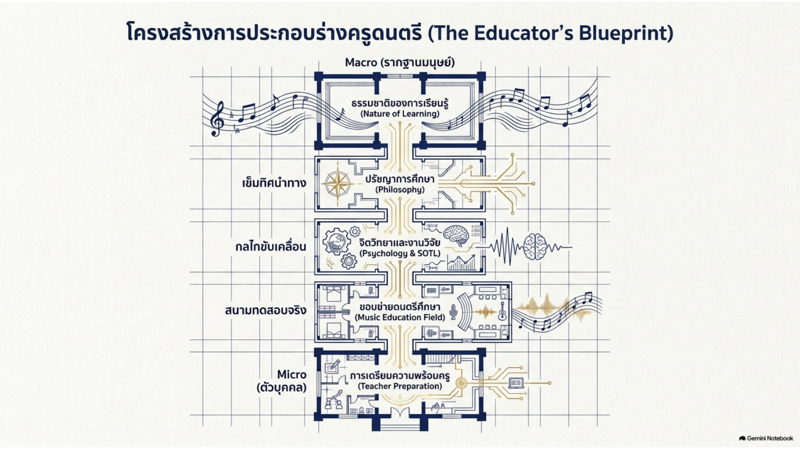

*ภาพประกอบ 2.3 โครงสร้างการประกอบร่างครูดนตรี (The Educator’s Blueprint) — ที่มา: The Music Educator’s Blueprint, สไลด์ 2*

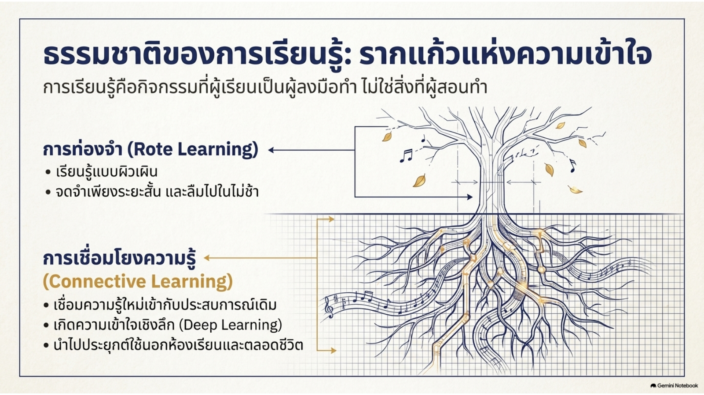

*ภาพประกอบ 2.4 ธรรมชาติของการเรียนรู้: รากแก้วแห่งความเข้าใจ — ที่มา: The Music Educator’s Blueprint, สไลด์ 3*

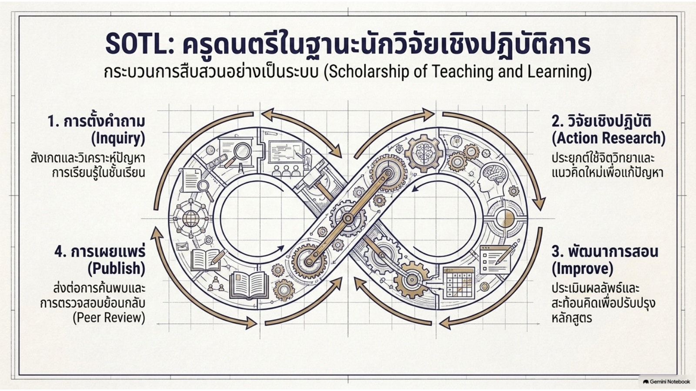

*ภาพประกอบ 2.5 SOTL: ครูดนตรีในฐานะนักวิจัยเชิงปฏิบัติการ — ที่มา: The Music Educator’s Blueprint, สไลด์ 7*

## วัตถุประสงค์การเรียนรู้

1. องค์ประกอบใดบ้างของปรัชญาการศึกษาและปรัชญาการศึกษาดนตรีที่ส่งผลต่อการสอนและการเรียนรู้ดนตรี
2. จิตวิทยาได้มีอิทธิพลต่อวงการการศึกษาและดนตรีศึกษาในลักษณะใด
3. หลักการ องค์ประกอบ และด้านต่าง ๆ ของดนตรีศึกษาในศตวรรษที่ 20 และ 21 มีอะไรบ้าง
4. การนำการสืบค้นอย่างเป็นระบบมาประยุกต์ใช้และนำทฤษฎีไปปฏิบัติในการสอนและการเรียนรู้ดนตรีมีข้อดีอย่างไร

## ปรัชญาการศึกษา

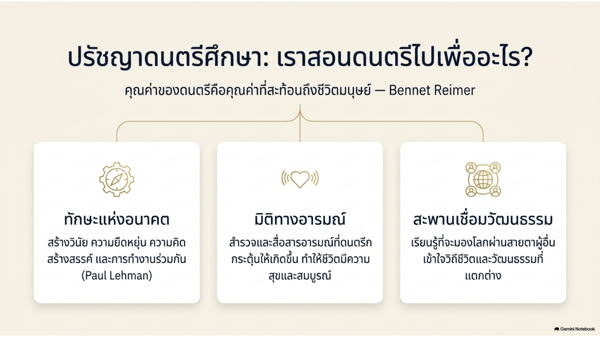

*ภาพประกอบ 2.6 ปรัชญาดนตรีศึกษา: เราสอนดนตรีไปเพื่ออะไร — ที่มา: The Music Educator’s Blueprint, สไลด์ 4*

*ปรัชญาการศึกษา* (philosophy of education) คือ การศึกษาเกี่ยวกับจุดประสงค์ กระบวนการ ลักษณะ และอุดมคติของการศึกษา ซึ่งอาจอยู่ในบริบทของการศึกษาในฐานะสถาบันทางสังคม หรือในเชิงกว้างขึ้นคือกระบวนการเติบโตเชิงอัตถิภาวะของมนุษย์ (existential growth) กล่าวคือ ความเข้าใจของเราต่อโลกจะถูกเปลี่ยนแปลงอย่างต่อเนื่อง ไม่ว่าจะจากข้อเท็จจริง ประเพณีทางสังคม ประสบการณ์ที่พบเจอ หรือแม้แต่อารมณ์ของตนเอง[9]

วัตถุประสงค์พื้นฐานที่เสนอไว้สำหรับการศึกษาในสถาบัน ได้แก่

1. การดำรงอยู่ของสังคมพลเมือง (civil society) ขึ้นอยู่กับการศึกษาเยาวชนให้กลายเป็นพลเมืองที่มีความรับผิดชอบ มีเหตุผล และมีความคิดสร้างสรรค์
2. ความก้าวหน้าในทุกด้านทางปฏิบัติขึ้นอยู่กับศักยภาพที่โรงเรียนสามารถปลูกฝังได้ ซึ่งช่วยส่งเสริมการเติบโตและเจริญรุ่งเรืองของบุคคล สังคม และแม้แต่มนุษยชาติในอนาคต
3. การพัฒนาส่วนบุคคลและความสามารถในการบรรลุเป้าหมายของตนเอง อาจขึ้นอยู่กับการเตรียมความพร้อมในวัยเด็กอย่างเพียงพอ ดังนั้น การศึกษาจึงอาจมุ่งสร้างรากฐานที่มั่นคง เพื่อให้บุคคลสามารถบรรลุความสำเร็จส่วนตนได้[9]

ปรัชญาการศึกษาดนตรี (philosophy of music education) หมายถึง คุณค่าของดนตรี คุณค่าของการสอนดนตรี และวิธีการนำคุณค่าเหล่านั้นมาประยุกต์ใช้ในห้องเรียนดนตรีอย่างเป็นรูปธรรม[10] เบนเน็ตต์ ไรเมอร์ (Bennett Reimer) นักปรัชญาการศึกษาดนตรีผู้มีชื่อเสียง เขียนไว้เกี่ยวกับคุณค่าของการศึกษาปรัชญาการศึกษาดนตรีว่า “ในระดับที่เราสามารถนำเสนอคำอธิบายที่น่าเชื่อถือเกี่ยวกับธรรมชาติของศิลปะดนตรีและคุณค่าของดนตรีในชีวิตของผู้คนได้ ในระดับนั้นเราย่อมสามารถนำเสนอภาพที่น่าเชื่อถือเกี่ยวกับธรรมชาติของการศึกษาดนตรีและคุณค่าของมันต่อชีวิตมนุษย์ได้เช่นกัน”[11]

พอล เลห์แมน (Paul Lehman, 2002) อดีตประธาน *สมาคมนักการศึกษาดนตรีแห่งชาติ* (Music Educators National Conference: MENC — องค์กรนี้ได้เปลี่ยนชื่อเป็น National Association for Music Education หรือ NAfME ในปี ค.ศ. 2011) กล่าวว่า การศึกษาดนตรีมีความสำคัญไม่เพียงเพราะช่วยให้ผู้เรียนได้รับทักษะที่นำไปใช้ในตลาดแรงงานได้ เช่น ความคิดสร้างสรรค์ วินัย ความยืดหยุ่น และความสามารถในการทำงานร่วมกับผู้อื่น แต่ยังเพราะดนตรีช่วยทำให้ชีวิตมีความสุขมากขึ้นอีกด้วย การศึกษาดนตรีมีความสำคัญอย่างยิ่ง เพราะเป็นวิธีที่ดีในการดึงดูดผู้เรียนที่หลากหลาย ในท้ายที่สุด บทบาทของครูดนตรีคือการส่งเสริมการเรียนรู้และการอภิปราย และเตรียมความพร้อมให้นักเรียนกลายเป็นสมาชิกที่มีคุณค่าของสังคม ผ่านดนตรี ครูดนตรีจะกระตุ้นให้นักเรียนเข้าร่วมกิจกรรมที่ต้องใช้ความคิดสร้างสรรค์ วินัย ความยืดหยุ่น และการทำงานร่วมกับผู้อื่น นอกจากนี้ ครูยังต้องช่วยให้นักเรียนสำรวจอารมณ์ที่ดนตรีประเภทต่าง ๆ กระตุ้นให้เกิดขึ้น และช่วยให้พวกเขาเรียนรู้ที่จะสื่อสารความรู้สึกและเหตุผลของตนเอง สุดท้าย ครูต้องให้ความรู้แก่นักเรียนเกี่ยวกับวัฒนธรรมอื่น ๆ เพื่อให้พวกเขาเรียนรู้ที่จะมองโลกผ่านสายตาของผู้อื่น และสามารถเห็นคุณค่าของวิธีคิดและวิถีชีวิตที่แตกต่างกันได้[12]

การแสวงหาความรู้เชิงปรัชญาได้พัฒนาขึ้นตลอดประวัติศาสตร์ โดยเฉพาะในประเด็นพื้นฐานของดนตรีศึกษา ได้แก่ การตัดสินใจและการกระทำของครูดนตรีในการสอนและเรียนรู้ดนตรี ความเข้าใจอย่างครอบคลุม เป็นระบบ และสม่ำเสมอต่อการตัดสินใจและการกระทำดังกล่าว ตลอดจนธรรมชาติของโลกที่เราอาศัยอยู่ มุมมองเหล่านี้เติบโตขึ้นจากหลักการและแนวทางที่แตกต่างกัน เช่น เหตุผลนิยม (rationalism) ประจักษ์นิยม (empiricism) ธรรมชาตินิยม (naturalism) และปฏิบัตินิยม (pragmatist belief systems)[13] ทฤษฎีเหตุผลนิยม ซึ่งมักเรียกว่าอุดมคตินิยม (idealism) ยึดถือตรรกะเป็นพื้นฐานในการเข้าใจโลก ส่วนทฤษฎีประจักษ์นิยมได้มาจากการสังเกตการณ์ แนวคิดสำคัญแขนงหนึ่งของมุมมองเชิงประจักษ์นิยมคือ ธรรมชาตินิยม (Naturalism) ซึ่งเชื่อในความมีอยู่จริงของโลกธรรมชาติ ในขณะที่ปฏิบัตินิยมกำหนดความหมายของแนวคิดใด ๆ ด้วยการนำไปปฏิบัติจริงในโลกที่เป็นวัตถุวิสัย ผลลัพธ์ที่เกิดขึ้นจากสถานการณ์นั้นพิสูจน์ว่าแนวคิดนั้นเป็นเช่นใด นั่นคือความหมายของแนวคิดนั้น

เพื่อสรุปความแตกต่างระหว่างสำนักปรัชญาทั้งสี่ให้ชัดเจนยิ่งขึ้น อาจสรุปได้ดังตาราง (ตารางสรุปโดยผู้เรียบเรียง อ้างอิงจากเนื้อหาข้างต้น):

| สำนักปรัชญา | หลักการพื้นฐาน | นัยต่อการจัดการเรียนการสอนดนตรี |
|---|---|---|
| เหตุผลนิยม / อุดมคตินิยม (Rationalism / Idealism) | ยึดตรรกะเป็นพื้นฐานของความเข้าใจโลก | เน้นความถูกต้องของทฤษฎีดนตรีและโครงสร้างที่เป็นเหตุเป็นผล |
| ประจักษ์นิยม (Empiricism) | ความรู้ได้มาจากการสังเกตการณ์ | เน้นการฟังและการสังเกตพฤติกรรมทางดนตรีที่วัดผลได้ |
| ธรรมชาตินิยม (Naturalism) | เชื่อในความมีอยู่จริงของโลกธรรมชาติ (แขนงหนึ่งของประจักษ์นิยม) | การจัดการเรียนการสอนคำนึงถึงพัฒนาการตามธรรมชาติของผู้เรียน |
| ปฏิบัตินิยม (Pragmatism) | ความหมายของแนวคิดกำหนดโดยผลจากการนำไปปฏิบัติจริง | เน้นวิธีการที่ตรวจสอบได้ การประเมินผลที่แม่นยำ และการสร้างทักษะเป็นขั้นตอน |

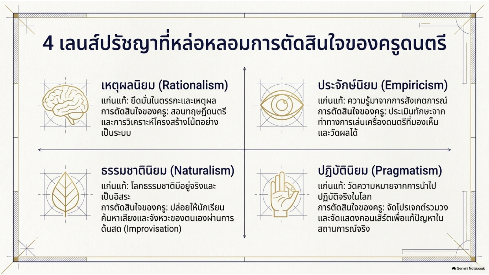

*ภาพประกอบ 2.7 สี่เลนส์ปรัชญาที่หล่อหลอมการตัดสินใจของครูดนตรี — ที่มา: The Music Educator’s Blueprint, สไลด์ 5*

## จิตวิทยาการศึกษาส่งเสริมการสอนและการเรียนรู้

นักจิตวิทยาที่ทำงานในสาขาการศึกษาศึกษาว่ามนุษย์เรียนรู้และจดจำความรู้ได้อย่างไร[14] พวกเขาศึกษาผู้เรียนและบริบทของการเรียนรู้ ทั้งภายในและนอกห้องเรียนแบบดั้งเดิม และประเมินว่าปัจจัยต่าง ๆ เช่น อายุ วัฒนธรรม เพศ และสภาพแวดล้อมทางกายภาพและสังคม มีอิทธิพลต่อการเรียนรู้ของมนุษย์อย่างไร พวกเขาใช้ทฤษฎีและแนวปฏิบัติทางการศึกษาที่อิงจากงานวิจัยล่าสุดเกี่ยวกับพัฒนาการของมนุษย์ เพื่อทำความเข้าใจด้านอารมณ์ สติปัญญา และสังคมของการเรียนรู้ของมนุษย์[15] พวกเขานำวิทยาศาสตร์จิตวิทยามาประยุกต์ใช้เพื่อปรับปรุงกระบวนการเรียนรู้และส่งเสริมความสำเร็จทางการศึกษาให้กับนักเรียนทุกคน

จิตวิทยาการศึกษาสามารถมีอิทธิพลต่อโปรแกรมการเรียนการสอน หลักสูตร และการพัฒนาบทเรียน ตลอดจนแนวทางการบริหารจัดการชั้นเรียน แม้ศาสตร์จิตวิทยาการศึกษาจะประกอบด้วยทฤษฎีจำนวนมาก แต่ผู้เชี่ยวชาญหลายท่านระบุว่ามีสำนักความคิดหลักห้าแนวทาง ได้แก่

1. **พฤติกรรมนิยม (Behaviorism)** — เน้นการตอบสนองและการปรับพฤติกรรมผ่านแรงเสริม
2. **ปัญญานิยม (Cognitivism)** — ให้ความสำคัญกับกระบวนการจดจำและการจัดระเบียบความรู้ในสมอง
3. **โครงสร้างนิยม (Constructivism)** — ผู้เรียนสร้างความหมายและความเข้าใจด้วยตนเอง
4. **ทฤษฎีการเรียนรู้จากประสบการณ์ (Experientialism)** — เน้นการเรียนรู้ผ่านการลงมือปฏิบัติและประสบการณ์ตรง
5. **ทฤษฎีการเรียนรู้ทางสังคม (Social Learning Theories)** — เน้นการเรียนรู้ผ่านปฏิสัมพันธ์และบริบททางสังคม

ทั้งห้าแนวทางนี้[15] เป็นกรอบที่นักจิตวิทยาการศึกษาใช้ประยุกต์ทฤษฎีพัฒนาการของมนุษย์เพื่อเข้าใจการเรียนรู้ของแต่ละบุคคลและใช้เป็นข้อมูลสำหรับกระบวนการจัดการเรียนการสอน นักจิตวิทยาในสาขานี้ศึกษาวิธีการเรียนรู้ของมนุษย์ในบริบทที่หลากหลาย เพื่อระบุแนวทางและกลยุทธ์ที่จะทำให้การเรียนรู้มีประสิทธิภาพมากขึ้น[14]

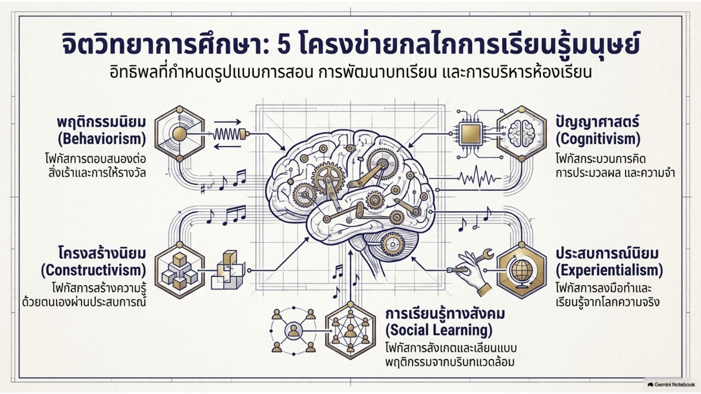

*ภาพประกอบ 2.8 จิตวิทยาการศึกษา: ห้าโครงข่ายกลไกการเรียนรู้มนุษย์ — ที่มา: The Music Educator’s Blueprint, สไลด์ 6*

## ทฤษฎีและการวิจัยด้านการศึกษา

ทฤษฎีการศึกษามุ่งรู้ เข้าใจ และกำหนดแนวปฏิบัติด้านการศึกษา ทฤษฎีการศึกษาครอบคลุมหลายด้าน เช่น ศาสตร์การสอน (pedagogy) หลักสูตร กลยุทธ์การสอน การเรียนรู้ ตลอดจนนโยบาย การจัดองค์กร และภาวะผู้นำทางการศึกษา ความคิดทางการศึกษาได้รับอิทธิพลจากหลายศาสตร์ เช่น ประวัติศาสตร์ ปรัชญา สังคมวิทยา และจิตวิทยา ความคิดทางการศึกษาเกี่ยวข้องกับ “การพิจารณาอย่างสะท้อนคิดต่อประเด็นและปัญหาด้านการศึกษาจากมุมมองของศาสตร์ต่าง ๆ” ปรัชญาหรือทฤษฎีการศึกษาอาจใช้ผลลัพธ์จากการคิดเชิงปรัชญาและการตรวจสอบข้อเท็จจริงเกี่ยวกับมนุษย์และจิตวิทยาการเรียนรู้ แต่ไม่ว่ากรณีใด ทฤษฎีเหล่านี้ย่อมเสนอความเห็นว่าการศึกษาควรเป็นอย่างไร ควรปลูกฝังอุปนิสัยใด เพราะเหตุใดจึงควรปลูกฝังสิ่งนั้น ควรปลูกฝังอย่างไรและแก่ผู้ใด และควรอยู่ในรูปแบบใด

นักจิตวิทยาหรือนักวิจัยด้านการศึกษาที่เริ่มต้นจากความเข้าใจว่ามนุษย์เป็นส่วนหนึ่งของอาณาจักรสัตว์ อาจพยายามอธิบายการเรียนรู้ของมนุษย์ในลักษณะเดียวกับที่ใช้อธิบายการเรียนรู้ของสัตว์ ทฤษฎีการเรียนรู้ที่หลากหลายเกิดขึ้นจากการที่นักวิจัยแต่ละคนเข้าถึงปรากฏการณ์การเรียนรู้จากทิศทางและข้อสันนิษฐานที่ต่างกัน ด้วยเหตุนี้จึงมีทฤษฎีการเรียนรู้หลากหลายกว่าประเภทของการเรียนรู้เสียอีก นักทฤษฎีไม่ได้เห็นพ้องกันทั้งหมดว่าการเรียนรู้คืออะไรหรือเกิดขึ้นอย่างไร แม้พวกเขาอาจมีความเห็นต่างกันในแนวคิด แบบจำลอง หรือสมมติฐานเกี่ยวกับเงื่อนไขของการเรียนรู้ แต่โดยทั่วไปพวกเขาก็มีแนวคิดดี ๆ หลายประการที่จะช่วยให้ท่านคิดเกี่ยวกับการเรียนรู้ได้ ท้ายที่สุดแล้ว ท่านเองที่จะต้องเป็นผู้ทำความเข้าใจให้ดีที่สุดว่าจะส่งเสริมการเรียนรู้ของมนุษย์อย่างไร เพื่อที่จะเป็นครูดนตรีที่มีประสิทธิภาพ

## การศึกษาดนตรี

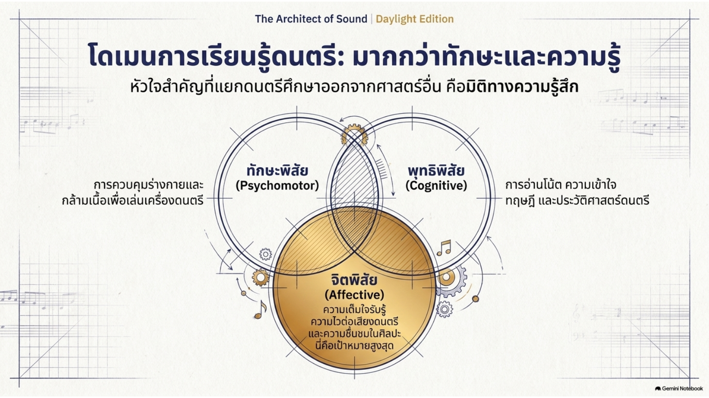

*ภาพประกอบ 2.9 โดเมนการเรียนรู้ดนตรี: มากกว่าทักษะและความรู้ — ที่มา: The Music Educator’s Blueprint, สไลด์ 8*

หลังจากวางรากฐานด้านปรัชญาและจิตวิทยาการศึกษาแล้ว หัวข้อต่อไปนี้จะพิจารณาการศึกษาดนตรีในฐานะสาขาวิชาโดยเฉพาะ

การศึกษาดนตรีเป็นสาขาวิชาที่มุ่งเน้นการสอนและการประยุกต์ใช้ดนตรีในห้องเรียน การศึกษาดนตรีเกี่ยวข้องกับการเรียนรู้ในทุกโดเมน ได้แก่ ทักษะพิสัย (psychomotor domain) ซึ่งเกี่ยวข้องกับการพัฒนาทักษะ พุทธิพิสัย (cognitive domain) ซึ่งเกี่ยวข้องกับการได้มาซึ่งความรู้ และโดยเฉพาะอย่างยิ่ง จิตพิสัย (affective domain) ซึ่งหมายถึงความเต็มใจของผู้เรียนในการรับรู้ ซึมซับ และถ่ายทอดสิ่งที่ได้เรียนรู้ รวมถึงการซาบซึ้งในดนตรีและความไวต่อสุนทรียะทางเสียง การฝึกฝนด้านดนตรีตั้งแต่ระดับก่อนประถมศึกษาจนถึงระดับอุดมศึกษาเป็นเรื่องปกติ เนื่องจากการมีส่วนร่วมกับดนตรีถือเป็นองค์ประกอบพื้นฐานของพฤติกรรมและวัฒนธรรมมนุษย์ วัฒนธรรมต่าง ๆ ทั่วโลกมีแนวทางการศึกษาดนตรีที่แตกต่างกัน ซึ่งส่วนใหญ่เป็นผลจากประวัติศาสตร์และการเมืองที่แตกต่างกัน ความสามารถในการสร้างสรรค์อันเป็นสิ่งที่แฝงอยู่ในตัวดนตรีนั้น ถือเป็นลักษณะเฉพาะของมนุษย์อย่างแท้จริง

ดนตรีถูกจัดให้เป็นวิชาการในโรงเรียนทั่วโลก เช่นในกรีซ เยอรมนี สโลวีเนีย สเปน อินเดีย และแอฟริกา รายการนี้ไม่ได้ครอบคลุมทุกประเทศ เพราะดนตรีถือเป็นความจำเป็นทางวัฒนธรรมในหลายประเทศทั่วโลก แม้ *สมาคมแห่งชาติเพื่อการศึกษาดนตรี* (National Association for Music Education: NAfME — ชื่อปัจจุบันของ MENC ที่กล่าวถึงข้างต้น) ในสหรัฐอเมริกาจะกำหนดแผนการดำเนินงานให้ดนตรีและศิลปะเป็นวิชาแกนหลักในระดับชาติ แต่การปฏิบัติตามการปรับปรุงกฎหมาย "Every Child Achieves Act" (ร่างกฎหมายฉบับวุฒิสภาที่ท้ายที่สุดประกาศใช้เป็นกฎหมายในชื่อ Every Student Succeeds Act หรือ ESSA ค.ศ. 2015) ยังคงแตกต่างกันไปในแต่ละรัฐ ณ ปี ค.ศ. 2014 มี 41 รัฐที่มีข้อกำหนดด้านการศึกษาศิลปะในทุกระดับชั้น และ 27 จาก 50 รัฐในสหรัฐอเมริกาถือว่าศิลปะเป็นวิชาแกนหลัก

ครูดนตรีได้รับการฝึกอบรมเพื่อประกอบอาชีพครูดนตรีระดับประถมศึกษาหรือมัธยมศึกษา และผู้อำนวยการวงดนตรีในโรงเรียน ในสหรัฐอเมริกา วิทยาลัยครูที่มีหลักสูตรปริญญาตรี 4 ปี พัฒนามาจากโรงเรียนปกติ (Normal Schools ก่อตั้งครั้งแรกในปี ค.ศ. 1839) และมีการบรรจุดนตรีไว้ในหลักสูตรด้วย หลังปี ค.ศ. 1865 ปฏิบัตินิยม (pragmatism) และแนวคิดเชิงวิทยาศาสตร์ในการสร้างทักษะอย่างเป็นขั้นตอน การประเมินผลที่แม่นยำ การสอบ วิธีการสอนอย่างเป็นระบบ และวิธีการทางวิทยาศาสตร์ ได้รับความนิยมอย่างมากในวงการศึกษา การตอบสนองของครูดนตรีแสดงให้เห็นว่าดนตรีสามารถศึกษาได้อย่างเป็นวิทยาศาสตร์ โดยใช้วิธีการที่หลากหลาย ตำราเรียนที่เป็นระบบและชุดดนตรีที่จัดระดับความยากง่าย รวมถึงสื่อการสอนสำหรับครู เป้าหมายเชิงวิทยาศาสตร์และปฏิบัตินิยมทางการศึกษาในศตวรรษที่ 19 ส่งผลอย่างลึกซึ้งต่อพัฒนาการของการศึกษาดนตรีในโรงเรียน

การศึกษาดนตรีเป็นสาขางานวิจัยที่นักวิชาการดำเนินงานวิจัยต้นฉบับ (original research) เกี่ยวกับวิธีการสอนและเรียนรู้ดนตรี นักวิชาการด้านการศึกษาดนตรีตีพิมพ์ผลงานวิจัยในวารสารที่ผ่านการตรวจสอบโดยผู้ทรงคุณวุฒิ และสอนนักศึกษาระดับปริญญาตรีและบัณฑิตศึกษาสาขาการศึกษาดนตรีในคณะศึกษาศาสตร์หรือวิทยาลัยดนตรีของมหาวิทยาลัย ซึ่งนักศึกษาเหล่านี้กำลังได้รับการฝึกอบรมเพื่อเป็นครูดนตรี ภาควิชาการศึกษาดนตรีในมหาวิทยาลัยของอเมริกาเหนือและยุโรปยังสนับสนุนงานวิจัยข้ามศาสตร์ในด้านต่าง ๆ เช่น จิตวิทยาดนตรี (music psychology) ประวัติศาสตร์นิพนธ์การศึกษาดนตรี (music education historiography) มานุษยดุริยางควิทยาเชิงการศึกษา (educational ethnomusicology) สังคมวิทยาการศึกษาดนตรี (sociology of music education) และปรัชญาการศึกษาดนตรี (philosophy of music education)

ในช่วงปลายศตวรรษที่ 20 และต้นศตวรรษที่ 21 มิติทางสังคมของการสอนและการเรียนรู้ดนตรีได้เข้ามามีบทบาทเด่นชัดขึ้น สิ่งนี้ปรากฏในรูปของการศึกษาดนตรีเชิงปฏิบัตินิยม (praxial music education) ทฤษฎีวิพากษ์ (critical theory) และทฤษฎีสตรีนิยม (feminist theory) ด้วยความสนใจใหม่ในมิติทางสังคมของการศึกษาดนตรี นักวิชาการได้วิเคราะห์ประเด็นสำคัญ เช่น ดนตรีกับเชื้อชาติ เพศสภาพ ชนชั้น การเป็นส่วนหนึ่งของสถาบัน และความยั่งยืน

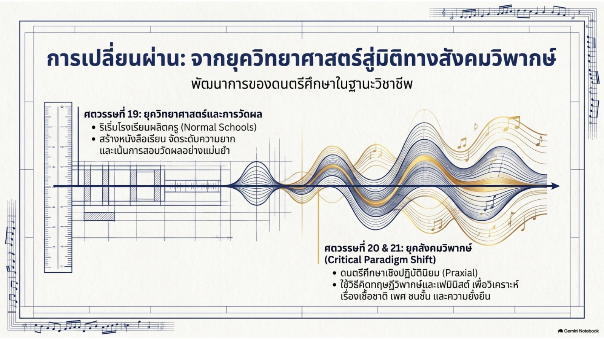

*ภาพประกอบ 2.10 การเปลี่ยนผ่านจากยุควิทยาศาสตร์สู่มิติทางสังคมวิพากษ์ — ที่มา: The Music Educator’s Blueprint, สไลด์ 9*

## การเรียนรู้เชิงสืบเสาะ

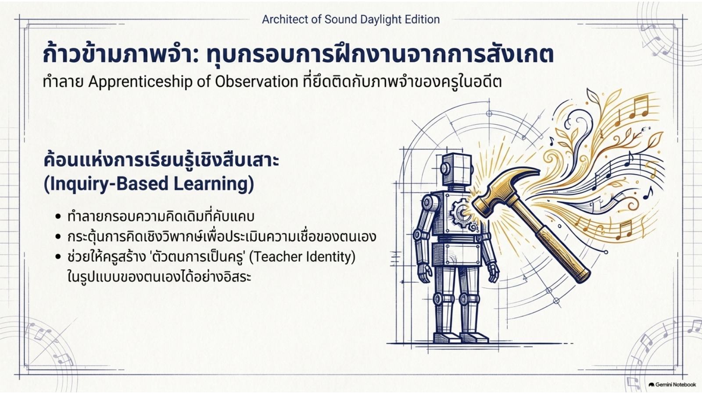

*ภาพประกอบ 2.11 ก้าวข้ามภาพจำ: การเรียนรู้เชิงสืบเสาะ (Inquiry-Based Learning) — ที่มา: The Music Educator’s Blueprint, สไลด์ 10*

เมื่อเข้าใจภาพรวมของสาขาการศึกษาดนตรีแล้ว หัวข้อนี้จะกล่าวถึงแนวทางหนึ่งที่มีความสำคัญเป็นพิเศษในการเตรียมความพร้อมครู นั่นคือการเรียนรู้เชิงสืบเสาะ

หลักฐานที่เพิ่มขึ้นทั้งในด้านการศึกษาทั่วไปและด้านการศึกษาดนตรี ชี้ให้เห็นถึงความสำคัญของการสืบเสาะ (inquiry) ในฐานะส่วนหนึ่งของกระบวนการเตรียมความพร้อมครู นักศึกษาฝึกสอน เช่นเดียวกับประชากรทั่วไป มักสร้างมุมมองเกี่ยวกับการสอนของตนเองผ่าน "การฝึกฝนจากการสังเกต" (apprenticeship of observation) (Lortie, 1975) นักศึกษาปริญญาตรีด้านการศึกษาดนตรีจำนวนมากเริ่มต้นเส้นทางการศึกษาครูด้วยภาพลักษณ์ของ "การสอนที่ดี" ในใจ ซึ่งได้รับอิทธิพลจากครูผู้สอนวงดนตรี วงประสานเสียง หรือผู้อำนวยการวงออร์เคสตราในโรงเรียนมัธยมของตนเอง (Dolloff, 1999; Teachout, 1997)

เมื่อพิจารณาถึงความซับซ้อน พลวัต และภารกิจหลากหลายที่ประกอบกันเป็นงานของครูดนตรี ความจำเป็นในการศึกษาเชิงสืบเสาะในฐานะส่วนหนึ่งของการเตรียมความพร้อมครูสามารถช่วยพัฒนามุมมองที่กว้างขึ้นเกี่ยวกับการสอน ส่งเสริมทัศนคติที่มุ่งเน้นการวิจัย และมีอิทธิพลต่อวิธีที่นักศึกษาฝึกสอนสร้างอัตลักษณ์และจินตนาการถึงงานของตนเอง (Kruse & Taylor, 2012; Price, 2001) กิจกรรมดังกล่าวยังตอบสนองความจำเป็นในการให้โอกาสแก่นักศึกษาฝึกสอนได้สะท้อนคิดและประเมินความเชื่อของตนเองตลอดหลักสูตรการศึกษาครู และสร้างแนวคิดเฉพาะตัวเกี่ยวกับสิ่งที่ถือเป็น "การสอนที่ดี" (Schmidt, 1998; Zeichner, 1999) งานวิจัยสนับสนุนแนวปฏิบัติของการศึกษาเชิงสืบเสาะในระดับปริญญาตรี ซึ่งช่วยให้ครูมือใหม่ด้านดนตรีพัฒนาฐานความรู้ที่ประกอบด้วยเนื้อหาวิชา ศาสตร์การสอน อุปนิสัย และความเข้าใจตนเอง (Grossman et al., 2000) ไปสู่การคิดที่ซับซ้อนยิ่งขึ้นเกี่ยวกับการสอน (Hammerness, Darling-Hammond, & Shulman, 2002)

การเชื่อมโยงทฤษฎีกับการปฏิบัติเป็นวิธีการหลักที่ผู้จัดการศึกษาครูใช้เพื่อช่วยให้นักศึกษาเชื่อมโยงหลักการสอนและการเรียนรู้เข้ากับชีวิตจริง ซึ่งพวกเขาสามารถนำไปประยุกต์ใช้และผสานความรู้ ทักษะ ทฤษฎี และประสบการณ์เข้าด้วยกันได้ ชูลแมน (Shulman, 1992) เน้นย้ำว่าหลักสูตรการศึกษาครูควรเชื่อมโยงแนวคิดทางทฤษฎีเข้ากับสถานการณ์การสอนในโลกแห่งความเป็นจริง ไฮต์ซแมน (Heitzman, 2008) กล่าวว่านี่คือศาสตร์การสอน (pedagogy) ที่เสนอกลยุทธ์และโอกาสหลายประการให้ว่าที่ครูได้เข้าใจเหตุการณ์ที่เกิดขึ้นภายในโรงเรียนและห้องเรียน ซึ่งช่วยให้นักศึกษาฝึกสอนสามารถวิเคราะห์และคิดอย่างมีวิจารณญาณ เพื่อให้สามารถตัดสินใจแก้ปัญหาที่อาจเกิดขึ้นในห้องเรียนได้

ชิง (Ching, 2014) พบจากการวิเคราะห์กิจกรรมในห้องเรียนว่านักศึกษาฝึกสอนสามารถนำทฤษฎีและแบบจำลองทางจิตวิทยา พฤติกรรม ศาสตร์การสอน และการบริหารจัดการชั้นเรียน มาใช้แก้ปัญหาในกรณีศึกษาชั้นเรียนได้ นัยสำคัญของการวิเคราะห์นี้แสดงให้เห็นว่านักศึกษาฝึกสอนสามารถนำทฤษฎีไปประยุกต์ใช้แก้ปัญหาพฤติกรรมในห้องเรียน และด้วยเหตุนี้จึงช่วยฝึกฝนให้พวกเขาตัดสินใจได้ด้วยตนเองเมื่อเผชิญปัญหาในห้องเรียน นักศึกษาฝึกสอนรายงานว่า “งานที่ได้รับมอบหมาย [ในชั้นเรียน] ช่วยเสริมสร้างความพร้อมทางจิตใจของเราสำหรับวันข้างหน้าที่เราจะต้องเผชิญกับนักเรียนลักษณะนี้ อย่างน้อยเราก็มีแนวคิดพื้นฐานเกี่ยวกับพวกเขาอยู่บ้าง เราจะไม่รู้สึกประหม่าเมื่อต้องเผชิญหน้ากับพวกเขา”

ขณะประเมินทัศนคติของนักศึกษาฝึกสอนที่มีต่อการบริหารจัดการชั้นเรียนและพฤติกรรม ผู้เข้าร่วมคนหนึ่งกล่าวว่า

> ฉันได้เรียนรู้วิธีที่เหมาะสมในการแก้ปัญหาระเบียบวินัยและปัญหาต่าง ๆ ในชั้นเรียน ก่อนหน้านี้ฉันไม่มั่นใจเมื่อต้องจัดการกับชั้นเรียน ฉันไม่ได้วางกฎเกณฑ์และขั้นตอนไว้ก่อนเข้าชั้นเรียน และใจดีกับนักเรียนมากเกินไป จนทำให้ชั้นเรียนควบคุมไม่ได้ ฉันรู้สึกผิดหวังกับตัวเองมาก เพราะพบว่าการจัดการชั้นเรียนไม่ใช่เรื่องง่ายอย่างที่คนอื่นคิด จากการวิเคราะห์[หลักการ]การบริหารจัดการพฤติกรรมในชั้นเรียน ฉันได้เรียนรู้ว่าเราในฐานะครูจำเป็นต้องแสดงความหนักแน่นเมื่อเผชิญหน้ากับนักเรียนตั้งแต่แรกเริ่ม ฉันตระหนักถึงความสำคัญของการบังคับใช้กฎเกณฑ์และขั้นตอนกับนักเรียน และแน่นอนว่ารวมถึงการบรรลุข้อตกลงร่วมกับพวกเขาด้วย

ผ่านกระบวนการเชิงสืบเสาะที่เชื่อมโยงทฤษฎีกับการปฏิบัติ ครูก่อนประจำการและครูประจำการสามารถพัฒนาความเข้าใจที่ดีขึ้นต่อองค์ประกอบสำคัญของความซับซ้อนเชิงแนวคิด ใช้แนวคิดที่ได้รับมาในการให้เหตุผลและการอนุมาน และนำความรู้เชิงแนวคิดไปประยุกต์ใช้อย่างยืดหยุ่นในสถานการณ์ใหม่ ๆ กระบวนการนี้ช่วยให้นักศึกษาฝึกสอนได้คิดเกี่ยวกับปัญหาทางการศึกษา รวบรวมข้อมูล นำข้อมูลหรือทฤษฎีมาประยุกต์ใช้ และสร้างแนวทางแก้ปัญหาเชิงสร้างสรรค์เพื่อนำไปสู่การปฏิบัติ

ผู้สอนในสาขาวิชาชีพหรือด้านบริการต่าง ๆ มักปรารถนาให้นักศึกษาของตนไม่เพียงเรียนรู้ทฤษฎีและเข้าใจว่าเหตุใดทฤษฎีจึงสำคัญ แต่ยังต้องเรียนรู้วิธีนำกรอบแนวคิดเชิงทฤษฎีไปใช้ในทางปฏิบัติด้วย เรามักได้ยินเรื่องเล่าเชิงประสบการณ์ของนักศึกษาฝึกงานที่ไม่สามารถเปลี่ยนผ่านจากทฤษฎีสู่การปฏิบัติได้อย่างมั่นใจและมีประสิทธิภาพอยู่บ่อยครั้ง บางทีความยากลำบากในการเปลี่ยนผ่านจากทฤษฎีไปสู่การปฏิบัตินี้อาจเกิดขึ้นได้ อย่างน้อยในบางส่วน จากการที่ครูไม่สามารถผสานทั้งทฤษฎีและปฏิบัติไว้ในรายวิชาเดียวกันของหลักสูตรได้ในลักษณะที่เกี่ยวข้องและมีความหมายต่อนักศึกษา การผสานเช่นนี้ช่วยให้นักศึกษาเชื่อมโยงคุณค่าเชิงปฏิบัติของการเรียนรู้แนวคิดเชิงทฤษฎีได้ใกล้ชิดยิ่งขึ้น

เป็นสิ่งจำเป็นอย่างยิ่งที่นักศึกษาในหลักสูตรวิชาชีพจะต้องสามารถนำสิ่งที่ได้เรียนรู้ในชั้นเรียนไปปฏิบัติจริงได้ ดังที่ Hutchings (1990) เขียนไว้ว่า “สิ่งที่เป็นเดิมพันคือความสามารถในการปฏิบัติงาน คือการนำสิ่งที่ตนรู้ไปใช้ปฏิบัติจริง (p. 1)”

## การปฏิบัติอย่างมีการสะท้อนคิด

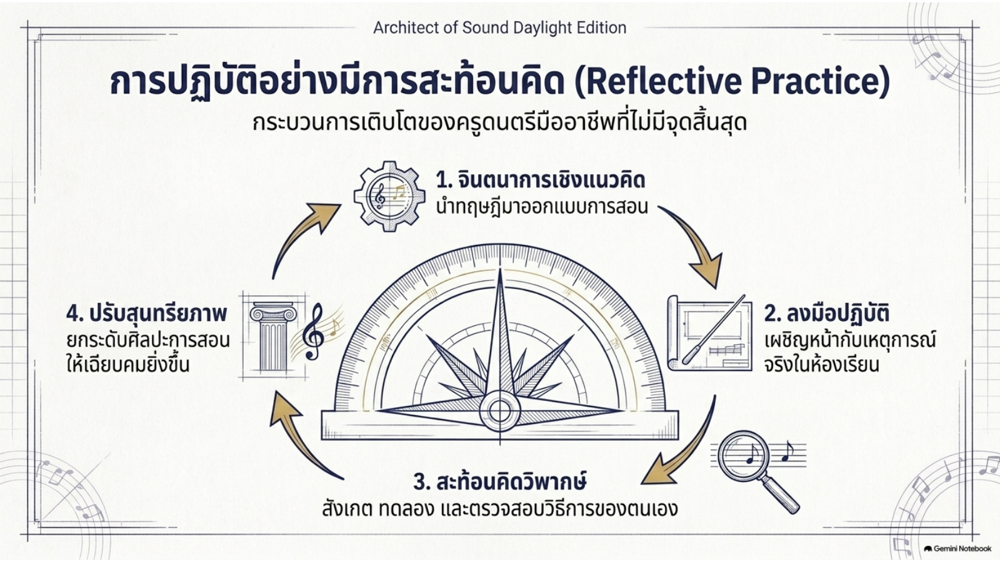

*ภาพประกอบ 2.12 การปฏิบัติอย่างมีการสะท้อนคิด (Reflective Practice) — ที่มา: The Music Educator’s Blueprint, สไลด์ 12*

การปฏิบัติอย่างมีการสะท้อนคิด (reflective practice) ถูกสร้างกรอบแนวคิดขึ้นในเบื้องต้น และถูกนำกลับมาทบทวนอีกครั้งในบทสรุปของการศึกษาเรื่องจิตวิทยาของการสอนและการเรียนรู้ดนตรี ในฐานะกระบวนการต่อเนื่องเพื่อการเติบโตและพัฒนาตนเองในฐานะครูดนตรี ในขณะที่อ่านแต่ละบท ท่านควรสะท้อนคิดเกี่ยวกับเนื้อหาที่อ่าน ค้นคว้าข้อมูลเพิ่มเติมจากการค้นคว้าของตนเอง ตั้งคำถามของตนเอง และรวบรวมหลักฐานสนับสนุนเพื่อตอบคำถามเหล่านั้นผ่านคำอธิบายโดยอาศัยหลักฐานที่รวบรวมมา

การเรียนรู้ของท่านเกี่ยวข้องกับการสังเกต การพัฒนาวิธีการทดลองและตรวจสอบของตนเอง และการเชื่อมโยงคำอธิบายความรู้ที่ได้รับผ่านการคิดอย่างมีวิจารณญาณและการวิเคราะห์ การศึกษาเรื่องการสอนและการเรียนรู้ดนตรีของท่านควรรวมถึงงานภาคสนาม กรณีศึกษา การตรวจสอบ โครงการเดี่ยวและกลุ่ม โครงการวิจัย และควรส่งเสริมให้ท่านแสดงผลการเรียนรู้ผ่านสื่อที่หลากหลาย ผ่านการอภิปรายในชั้นเรียน การทำงานร่วมกับเพื่อนร่วมชั้น และการสังเกตอย่างตั้งใจในชั้นเรียนอื่น ๆ ของวิทยาลัยและประสบการณ์ภาคปฏิบัติในโรงเรียน ท่านอาจได้รับความเข้าใจเชิงลึกเกี่ยวกับการสอนและการเรียนรู้ดนตรีในบริบทจริง

## การนำทฤษฎีไปสู่การปฏิบัติ

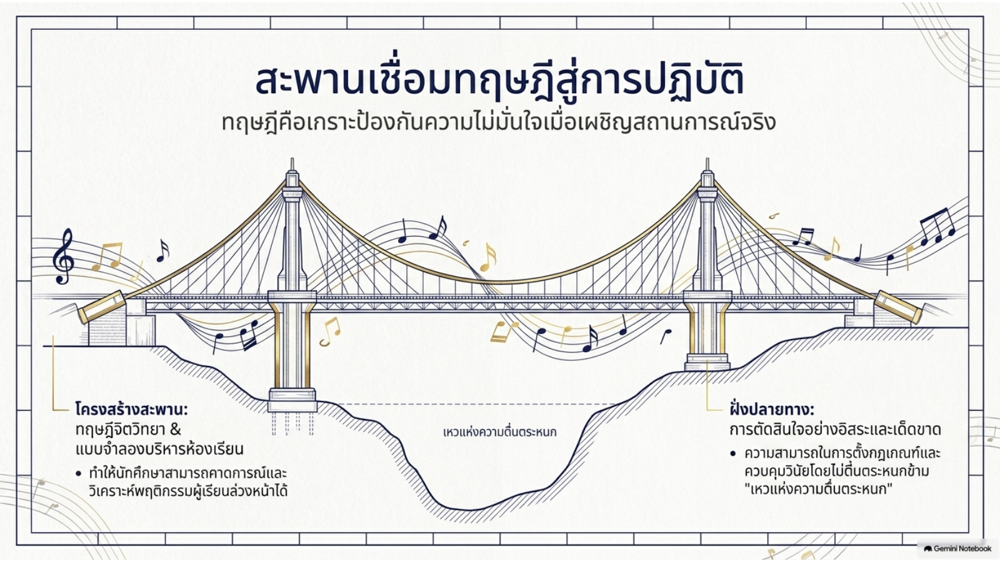

*ภาพประกอบ 2.13 สะพานเชื่อมทฤษฎีสู่การปฏิบัติ — ที่มา: The Music Educator’s Blueprint, สไลด์ 11*

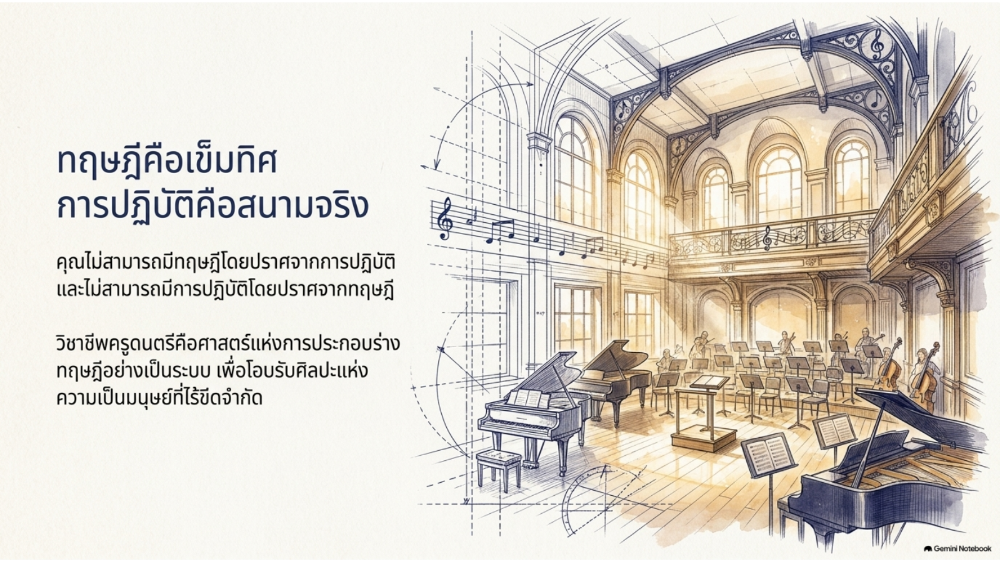

*ภาพประกอบ 2.14 ทฤษฎีคือเข็มทิศ การปฏิบัติคือสนามจริง — ที่มา: The Music Educator’s Blueprint, สไลด์ 14*

เราควรยอมรับว่าการเรียนรู้คือการประสานกันระหว่างทฤษฎีและการปฏิบัติ (McLean, 2021) ทฤษฎีสามารถนำไปใช้ในทางปฏิบัติได้ เพราะการตั้งชื่อแนวคิดช่วยให้เกิดการไตร่ตรอง การอภิปราย และการจดจำแง่มุมเฉพาะของประสบการณ์ (Vygotsky, 1978) ในฐานะครูดนตรี เป็นสิ่งพื้นฐานที่เราต้องเชื่อมโยงแนวคิดหรือทฤษฎีเข้ากับสิ่งที่เป็นรูปธรรมและมีความหมาย เราสามารถสร้างหรือแสดงความสัมพันธ์ระหว่างทฤษฎีกับสิ่งที่เราเคยได้รับการสอนหรือเคยประสบมาก่อน ด้วยการสร้างความสัมพันธ์กับเนื้อหาหรือหลักการของทฤษฎี การเรียนรู้ของเราจึงมีความหมายมากยิ่งขึ้น

เป็นสิ่งสำคัญที่ต้องเข้าใจว่ามีความสมดุลระหว่างทฤษฎีและการปฏิบัติ ท่านไม่สามารถมีทฤษฎีโดยปราศจากการปฏิบัติ และไม่สามารถมีการปฏิบัติโดยปราศจากทฤษฎีได้ มีคำนิยามของ "ทฤษฎี" อยู่หลายแบบในบริบทนี้ แต่คำนิยามที่ดีที่สุดพบได้ในพจนานุกรม Merriam-Webster ซึ่งระบุว่าทฤษฎีคือ “ความเชื่อ นโยบาย หรือขั้นตอนที่เสนอขึ้นหรือถูกปฏิบัติตามในฐานะพื้นฐานของการกระทำ” ดังนั้น หากท่านไม่นำความเชื่อ นโยบาย หรือขั้นตอนที่ได้เรียนรู้ไปปฏิบัติจริง ทฤษฎีนั้นย่อมไร้ความหมาย

ตลอดการใช้ตำราเล่มนี้ ท่านจำเป็นต้องใช้สิ่งที่ได้เรียนรู้เป็นแนวทาง เมื่อท่านนำทฤษฎี แนวคิด หลักการ และขั้นตอนต่าง ๆ ไปปฏิบัติจริง ท่านจะพัฒนาความสามารถในการให้เหตุผล และกลายเป็นผู้ตัดสินใจและผู้คิดวิเคราะห์ที่ดีขึ้นในฐานะครูดนตรี เมื่อท่านสามารถให้คุณค่าในระดับนี้แก่สิ่งที่กำลังเรียนรู้ ท่านก็ยิ่งมีแนวโน้มที่จะทุ่มเทความพยายามให้สิ่งนั้นถูกเรียนรู้อย่างแท้จริง

เราเรียนรู้อยู่เสมอ แม้ในรูปแบบที่ไม่เป็นทางการ ความสามารถของเราในการเข้าใจและนำสิ่งที่เราอ่าน สังเกต ได้ยิน และกระทำ ไปปรับใช้ในทางปฏิบัติ ช่วยให้เราเติบโตในฐานะปัจเจกบุคคลและฝึกฝนทักษะใหม่ ๆ เพื่อใช้ประโยชน์จากความรู้ ทักษะ และความไวรับรู้เหล่านี้ให้ได้ดีที่สุด เราจำเป็นต้องนำทฤษฎีและแนวคิดเหล่านี้ไปปฏิบัติจริง

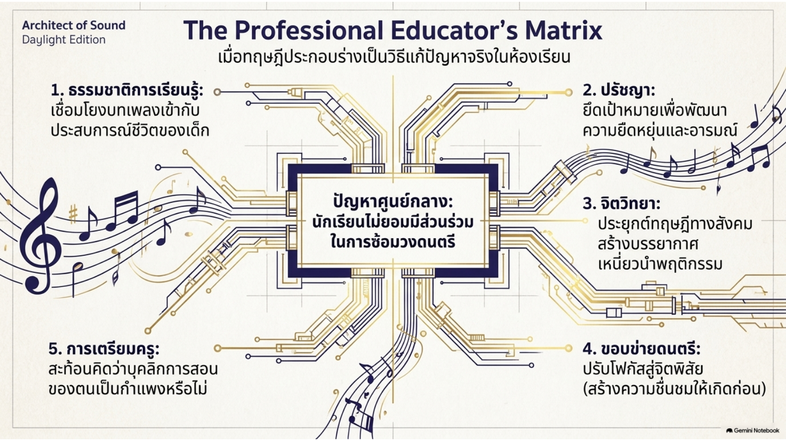

*ภาพประกอบ 2.15 The Professional Educator’s Matrix: การประยุกต์กรอบแนวคิดเพื่อแก้ปัญหาในห้องเรียน — ที่มา: The Music Educator’s Blueprint, สไลด์ 13*

## คำถามท้ายบท

1. อธิบายการสอนและการเรียนรู้ ลักษณะ หลักการ และระบบของการสอนและการเรียนรู้ดนตรีมีอะไรบ้าง
2. เขียนบทความความยาวหนึ่งหน้า บรรยายปรัชญาการศึกษาของตนเอง จากนั้นเขียนบทความอีกหนึ่งหน้าเพื่อบรรยายปรัชญาการศึกษาดนตรีของตนเอง
3. จิตวิทยา งานวิจัย และทฤษฎีการศึกษาส่งผลต่อการศึกษาดนตรีอย่างไร อธิบายถึงอิทธิพลที่แต่ละด้านมีต่อวงการการศึกษาดนตรี
4. อธิบายองค์ประกอบ ด้าน และหลักการต่าง ๆ ของการศึกษาดนตรีที่ส่งผลต่อการสอนและการเรียนรู้ดนตรีในสังคมยุคปัจจุบัน อภิปรายถึงแนวทางที่การศึกษาดนตรีเป็นวิชาการที่มีความสำคัญในหลักสูตรโรงเรียน
5. อธิบายการศึกษาดนตรี กล่าวถึงโดเมนการเรียนรู้ที่รวมอยู่ในสาขาวิชานี้ วิธีที่แนวคิดนี้ถูกตีความในแต่ละประเทศ และบทบาทของครูดนตรีในวิชาชีพการศึกษาดนตรี
6. อภิปรายถึงความสำคัญของการเรียนรู้เชิงสืบเสาะ (inquiry-based learning) ในการเตรียมตัวของท่านในฐานะครูดนตรี ขณะที่ท่านเตรียมพร้อมสอนในห้องเรียนดนตรียุคปัจจุบัน ยกตัวอย่างการเรียนรู้เชิงสืบเสาะจากรายวิชานี้และรายวิชาอื่น ๆ ที่อาจช่วยเสริมความพร้อมของท่านในฐานะผู้สอนดนตรี
7. อภิปรายถึงความสำคัญของกระบวนการเชื่อมโยงทฤษฎีกับการปฏิบัติในการเตรียมตัวของท่านในฐานะครูดนตรี ขณะที่ท่านเตรียมพร้อมสอนในห้องเรียนดนตรี การค้นพบความสัมพันธ์เหล่านี้สามารถสนับสนุนความเข้าใจของท่านเกี่ยวกับกิจกรรมการเรียนรู้ที่เกิดขึ้นในห้องเรียนดนตรียุคปัจจุบันได้อย่างไร
8. กระบวนการเชิงสืบเสาะที่เชื่อมโยงทฤษฎีกับการปฏิบัติสามารถเสริมพลังให้นักศึกษาฝึกสอนในการเตรียมตัวสอนในห้องเรียนดนตรีได้อย่างไร กระบวนการนี้ใช้วิธีการและกลยุทธ์ใดในการเตรียมความพร้อมครูดนตรีในอนาคต
9. อธิบายการปฏิบัติอย่างมีการสะท้อนคิด (reflective practice) ในบริบทของการสอนและการเรียนรู้ดนตรี วิธีการหรือกลยุทธ์เฉพาะใดของการปฏิบัติอย่างมีการสะท้อนคิดที่ท่านสามารถนำมาใช้ขณะอ่านหนังสือเล่มนี้
10. อธิบายกลยุทธ์ วิธีการ และเทคนิคเฉพาะที่ท่านสามารถใช้เพื่อเสริมสร้างการเติบโตทางวิชาชีพของตนเองในการศึกษาเรื่องการสอนและการเรียนรู้ดนตรี อภิปรายว่ากิจกรรมในชั้นเรียนบางอย่างอาจช่วยเสริมความเข้าใจของท่านเกี่ยวกับศาสตร์การสอน (pedagogy) และการสอนดนตรีได้อย่างไร

## เชิงอรรถและเอกสารอ้างอิง

1. Christensen, C. R., Garvin, D. A., & Sweet, A. (Eds.). (1991). *Education for judgment: The artistry of discussion leadership.* Cambridge, MA: Harvard Business School. Stellenbosch University. (2021). *Teaching, learning, assessment, curriculum and pedagogy*. Stellenbosch University Center for Teaching and Learning (South Africa). Retrieved July 27, 2021, from [http://www.sun.ac.za/english/learning-teaching/ctl/t-l-resources/curriculum-t-l-assessment](http://www.sun.ac.za)
2. Merriam-Webster. (2021). *Learning*. Retrieved July 27, 2021, from [https://www.merriam-webster.com/dictionary/learning](https://www.merriam-webster.com). Gross, R. (2012). *Psychology: The science of mind and behaviour* (6th ed.), Hachette, England: Hodder Education.
3. Harris, D., & Bell, C. (1986). *Evaluating and assessing for learning* (pp. 118–126). London, England: Kogan Page.
4. Pedler, M. (1974). Learning in management education. *Journal of European Training, 3*(3), 182–195.
5. Handy, C. B. (1976). *Understanding organizations* (pp. 31–47). Harmondsworth, England: Penguin.
6. Prozesky, D. (2000). Teaching and learning. *Community Eye Health, 13*(34), 30–31. Retrieved July 27, 2021, from [https://www.ncbi.nlm.nih.gov/pmc/articles/PMC1764819/](https://www.ncbi.nlm.nih.gov)
7. Hutchings, P., & Shulman, L. (1999). The scholarship of teaching: New elaborations, new developments. *Change: The Magazine of Higher Learning*, 31(5), 10–15.
8. Sappington, N., Baker, P., Gardner, D., & Pacha, J. (2010). A signature pedagogy for leadership education: Preparing principals through participatory action research. *Planning and Changing*, 41(3/4), 249–273. Zambo, D. (2010). Action research as signature pedagogy in an education doctorate program: The reality and hope. *Innovative Higher Education*, 36(4), 261–271. Jacobsen, D., Eaton, S., Brown, B., Simmons, M., & McDermott, M. (2018). Action research for graduate program improvements: A response to curriculum mapping and review. *Canadian Journal of Higher Education*, 48(1), 82–98. Retrieved July 27, 2021, from <https://journals.sfu.ca/cjhe/index.php/cjhe/article/view/188048>
9. Psychology Wikia. (2021). *Philosophy of education*. Retrieved July 28, 2021, from [https://psychology.wikia.org/wiki/Philosophy\_of\_education](https://psychology.wikia.org/wiki/Philosophy_of_education)
10. Barba, M. E. (2017). *Philosophy of Music Education*. Honors Theses and Capstones. 322. Retrieved from <https://scholars.unh.edu/cgi/viewcontent.cgi?article=1326&context=honors>
11. Reimer, B. (1970). *A philosophy of music education* (p. 1). Englewood Cliffs, NJ: Prentice-Hall.
12. Lehman, P. (2002). A personal perspective. *Music Educators Journal*, 88(5), 47–51.
13. Abeles, H., Hoffer, C., & Klotman, R. (1984). Philosophical foundations of music education. In *Foundations of music education* (pp. 41–60). New York, NY: Schirmer Books.
14. American Psychological Association. (2017). *Educational psychology promotes teaching and learning*. Retrieved July 28, 2021, from <https://www.apa.org/education-career/guide/subfields/teaching-learning>
15. Psychology.org. (2021). *Introduction to educational psychology theory*. Retrieved July 28, 2021, from <https://www.psychology.org/resources/educational-psychology-theories/>

> **หมายเหตุเรื่องเลขบท:** "บทที่ 2" ในที่นี้หมายถึงลำดับบทอ่านของรายวิชานี้ (ตรงกับสัปดาห์ที่ 2) เนื้อหาต้นฉบับเป็น **Chapter 1** ของหนังสือ *The Psychology of Teaching and Learning Music*
