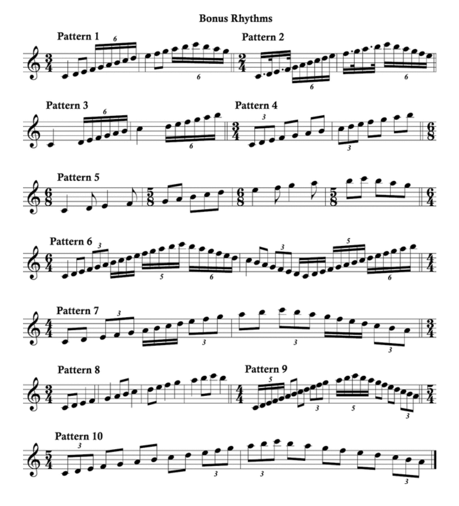

# สัปดาห์ที่ 4 — วิทยาศาสตร์การฝึกซ้อม: ฝึกเป็นการแก้ปัญหา ไม่ใช่การเล่นผ่าน

**วันเรียน:** 24 ส.ค. 2026 · **ส่งงาน:** 29 ส.ค. 2026 ภายใน 23:59 · ช่องทางตามที่ผู้สอนประกาศ

สัปดาห์นี้เราฝึก **มองการซ้อมเป็นการแก้ปัญหา** ตั้งสมมติฐาน ทดลองตัวแปรเดียว และใช้ **การพัก / microbreaks / spaced practice** อย่างมีเหตุผล เราจะแยกให้ชัดว่าอะไรคือ **สิ่งที่หนังสือกล่าว** และอะไรคือ **คำถามหรือตัวอย่างของครู**

---

> *วันนี้เราไม่ได้มา “ซ้อมนานขึ้น” เพื่อให้รู้สึกขยัน แต่จะฝึกหาจุดปัญหา ตั้งสมมติฐาน ทดลองวิธีแก้หนึ่งอย่าง แล้วบันทึกว่าเส้นทางใดถูกเสริมแรง (correct pathway) จากนั้นออกแบบช่วงพักสั้นและช่วงพักระหว่างรอบให้สมองได้ทำงานต่อ เมื่อจบคาบ คุณจะไม่เพียงพูดว่า “ซ้อมแล้ว” แต่จะอธิบายได้ว่าปัญหาอยู่ตรงไหน ทดลองอะไร และจะจัดเวลาซ้อมรอบถัดไปอย่างไร*

---

## ครูตัดสินใจเรื่องใดบ้างเมื่อผู้เรียนบอกว่า “ซ้อมแล้ว แต่ไม่ดีขึ้น”?

เมื่อเห็นการซ้อม เราแยก **“การเล่นผ่าน”** ออกจาก **“การแก้ปัญหา”** ได้อย่างไร?

**หลังคาบนี้ คุณจะทำได้ 3 อย่าง**
1. ระบุ problem spot หนึ่งจุดและตั้งสมมติฐานที่ทดลองได้  
2. ออกแบบการทดลองตัวแปรเดียว พร้อมบันทึก correct pathway  
3. วางแผน microbreak หรือ spaced practice สั้น ๆ ที่อ้างรหัสแหล่งความรู้ได้

---

## ตัวอย่างกรณีศึกษา

ก่อนเรียนคำศัพท์ ให้เริ่มจากสถานการณ์ที่นักดนตรีพบได้จริง เราจะกลับมาที่ภูมิทุกขั้นของบทเรียน

> **ตัวอย่างเดินเรื่อง (ครูสมมติให้ — ไม่ใช่ข้ออ้างจากหนังสือ):**  
> **ภูมิ** เป่าแซกโซโฟน เลือกท่อน 2 ห้องที่ผิดจังหวะซ้ำที่ห้องที่สอง  
> เขามักเล่นทั้งประโยคเพลงช้า ๆ หลายรอบ แล้วเริ่มใหม่เมื่อผิด  
> ครูชวนให้เปลี่ยนวิธี: ระบุจุดผิดให้ชัด → สมมติฐานว่า “รีบนับห้องสอง” → ทดลองตัวแปรเดียว “ปรบจังหวะเปล่า 4 ครั้งก่อนเป่า” → ทำถูกติดต่อกันตามกฎที่ตั้งไว้  
> จากนั้นภูมิแทรก **microbreak** 10 วินาทีระหว่างชุดทำซ้ำ และไม่ซ้อมท่อนคล้ายกันติดกันทันที

คุณไม่ต้องเป่าแซกเหมือนภูมิ เลือกท่อนและเครื่องของ **คุณเอง** ได้ แต่ใช้วิธีคิดชุดเดียวกัน

**สองเครื่องมือของสัปดาห์นี้ทำงานคู่กัน:** การฝึกแบบแก้ปัญหาบอกว่าจะ **หาและทดลองแก้อย่างไร** · การพัก/ spaced practice บอกว่าจะ **จัดเวลาอย่างไรให้การเรียนรู้ติด**

---

## เครื่องมือที่ 1: Good practicing = problem solving

ถ้าไม่มีกรอบนี้ ภูมิจะเล่นผ่านช้า ๆ ซ้ำ ๆ — รู้สึกว่าซ้อมแล้วแต่สมองเสริมเส้นทางผิด

**ที่มา:** Molly Gebrian, *Learn Faster, Perform Better* — Chapter 1 “Good Practicing and How It Changes the Brain” (และแนว correct pathway ในบทต้น)

> **สิ่งที่หนังสือกล่าว (SOURCE CLAIM · W4-A):** **Good practicing is problem solving.** การซ้อมที่ดีโฟกัสจุดอ่อน ไม่ใช่จุดแข็ง และไม่มีสูตรเดียวใช้ได้ทุกเพลง ภาพรวมของ good practicing คือ: **identify problem spots → hypothesize solutions → try out those solutions → solidify the solution that works best → move on to the next issue** หนังสือเตือนว่าการเล่นผ่าน (playing through) ไม่ใช่การซ้อม และอธิบายด้วยภาพเปรียบ pathway ในหิมะว่าสิ่งที่ทำซ้ำจะถูกเสริมแรง — จึงต้องเสริม **correct pathway** มากกว่า incorrect pathway (เช่น ตั้งเป้าทำถูก “ติดต่อกัน” / in a row เพื่อไม่ให้รอบผิดถูกนับเท่า ๆ กัน)

**อ่านสิ่งที่หนังสือกล่าวแบบภาษาง่าย:** ซ้อม = หาปัญหา + ทดลองแก้ + ทำถูกให้ชัดและบ่อยกว่าทำผิด — ไม่ใช่เล่นทั้งเพลงวนไป

| ขั้น | หมายถึงอะไร | คำถามที่ช่วยทำงาน |
|---|---|---|
| **Identify** | ชี้จุดผิดให้แคบลง | ผิดตรงโน้ต/จังหวะ/ห้องไหน? |
| **Hypothesize** | เดาเหตุที่ทดลองได้ | ถ้าเปลี่ยน X อาจดีขึ้นเพราะ… |
| **Try** | ทดลองวิธีแก้ | เปลี่ยนตัวแปรเดียวรอบนี้คืออะไร? |
| **Solidify** | ทำถูกซ้ำให้เส้นทางชัด | ทำถูกติดกันกี่ครั้งตามกติกาที่ตั้ง? |
| **Move on** | ไปปัญหาถัดไปเมื่อมั่นคงพอ | จุดนี้ “นิ่ง” พอจะพักหรือสลับหรือยัง? |

*เครดิต: Molly Gebrian, Learn Faster, Perform Better, Appendix D Bonus Rhythms ใน source vault; ใช้เพื่อการเรียนการสอน*

**ตัวอย่างการสอนเครื่องลม** — *ตัวอย่าง/คำแนะนำของครู — ไม่ใช่ข้ออ้างจากหนังสือ*

- **Problem spot:** ห้อง 2 จังหวะ 3–4 ของท่อน 2 ห้อง  
- **สมมติฐาน:** รีบเข้าห้อง 2 เพราะนับในใจไม่ครบ  
- **ตัวแปรเดียว:** ปรบจังหวะเปล่าก่อนเป่า — ไม่เปลี่ยนความเร็วพร้อมกัน  
- **Correct pathway note:** บันทึกว่า “รอบถูกติด 3 ครั้งหลัง microbreak” ไม่ใช่ “รู้สึกดีขึ้น”  

> **คำถามของครู (ใช้ทั้งชั้น):** ในท่อนที่คุณ “ติด” ตอนนี้ คุณกำลัง **แก้ปัญหา** หรือกำลัง **เล่นผ่านช้า ๆ**?

> 📌 “คำถามของครู” เป็นคำถามสังเกตของรายวิชา **ไม่ใช่** คำสั่งเทคนิคจากหนังสือ บทนี้ **ไม่ได้** ระบุ embouchure หรือเทคนิคเฉพาะเครื่องลม

**กลับมาที่ภูมิ:** ปัญหาไม่ใช่ “ทั้งเพลงไม่ดี” แต่เป็นจุดจังหวะห้อง 2 — เมื่อแคบลง การทดลองจึงทำได้และวัดได้

**สิ่งที่หนังสือไม่ได้กล่าว (non-claim):** หนังสือไม่ได้สั่งว่าเครื่องลมทุกชนิดต้องใช้จำนวนครั้งซ้ำเท่ากันทุกคน และไม่ได้ให้โปรโตคอลการเป่าเฉพาะเครื่อง

---

## เครื่องมือที่ 2: Microbreaks และการจัดเวลาแบบ spaced practice

### ส่วนนี้คืออะไร

แม้จะแก้จุดปัญหาถูกวิธีแล้ว ขั้นต่อไปคือ **จัดเวลา** เพราะสมองเรียนรู้จากช่วงพักด้วย ไม่ใช่จากบล็อกยาวอย่างเดียว

### สืบค้นข้อมูลมาจากไหน?

| ชั้น | มาจากไหน | หมายเหตุ |
|---|---|---|
| **สิ่งที่หนังสือกล่าว** | Gebrian — บทเรื่อง breaks / microbreaks / spaced practice (เช่น “Take More Breaks”, spaced practice calendars) | ล็อกเป็น SOURCE CLAIM ด้านล่าง — ห้ามแต่งเพิ่ม |
| **โครง log และตัวอย่างภูมิ** | ออกแบบโดยรายวิชา | ใช้สอนและเขียนงาน — **ไม่ใช่** ข้อความจากหนังสือ |

> **สิ่งที่หนังสือกล่าว (SOURCE CLAIM · W4-B):** การเอา **breaks** เข้าไปในการซ้อมมีประสิทธิภาพกว่าการซ้อมก้อนยาวติดกัน (massed) — หลัก spaced practice ได้รับการยอมรับในวงวิทยาศาสตร์การเรียนรู้ หนังสืออธิบาย **microbreaks** จากงานวิจัยที่ให้ฝึกประมาณ **10 วินาที** แล้วพัก **10 วินาที** (นั่งเฉย ๆ) สลับหลายรอบ และชี้ว่าสมองยัง “ฝึกต่อ” ในช่วงพัก หลักที่เกี่ยวข้อง: เมื่อทักษะใหม่ ช่วงพักควรสั้นกว่าและกลับมาทบทวนในวันเดียวกันได้หลายครั้ง; เมื่อมั่นคงขึ้น ค่อยเว้นพักยาวขึ้น (expanding / spaced schedules)

**อ่านสิ่งที่หนังสือกล่าวแบบภาษาง่าย:** พักไม่ใช่ขี้เกียจ — พักสั้นที่วางแผนไว้เป็นส่วนของการเรียนรู้

### Problem solving กับการจัดเวลาทำงานร่วมกันอย่างไร

- **W4-A** บอกว่าเราจะ **แก้จุดปัญหาอย่างไร**  
- **W4-B** บอกว่าเราจะ **กระจายเวลาและแทรกพัก** อย่างไร  

ถ้าแก้ปัญหาแต่ไม่พัก อาจล้าและเสริม pathway ผิด  
ถ้าพักโดยไม่มีเป้าหมาย อาจแค่หยุดโดยไม่เรียนรู้

### โครงเขียนงาน: Spot / Hypothesis / Trial / Pathway / Break

รายวิชาใช้โครงนี้ **เป็นชื่อย่อที่รายวิชาสร้างขึ้น**

- **Spot:** จุดปัญหาที่แคบ  
- **Hypothesis:** สมมติฐาน  
- **Trial:** ทดลองตัวแปรเดียว  
- **Pathway:** บันทึก correct / incorrect  
- **Break:** microbreak หรือ spaced plan สั้น ๆ  

### ติดตามภูมิ: จากจุดผิดสู่ log

1. **Spot** — “ห้อง 2 จังหวะ 3–4 ผิดทุกครั้งเมื่อเล่นเต็มประโยคเพลง”  
2. **Hypothesis** — “ฉันคิดว่านับไม่ครบก่อนเข้าห้อง 2”  
3. **Trial** — เปลี่ยนตัวแปรเดียว: ปรบจังหวะเปล่า 4 ครั้งก่อนเป่า  
4. **Pathway** — ทำถูกติดกันตามกติกาที่ตั้ง; ถ้ารอบผิด เริ่มนับใหม่  
5. **Break** — ระหว่างชุด: พัก 10 วินาที; ไม่สลับไปท่อนคล้ายกันทันทีโดยไม่ตั้งใจ  

**กฎภาษาที่ใช้ทั้งคาบ**
- ขึ้นต้นด้วย **“จุดปัญหาของฉันคือ…”**  
- ตามด้วย **“ฉันจะทดลองเพียง…”**  
- **ความรู้สึก** = ล้า/มั่นใจ · **หลักฐาน** = จำนวนรอบถูก/ผิดและจุดที่ได้ยิน  

### ตารางช่วยเขียน (ใช้ส่งงาน)

| ขั้น | ทำอะไร | ตัวอย่างภาษา (ทั่วไป) | ตัวอย่างของภูมิ |
|---|---|---|---|
| **Spot** | ระบุตำแหน่งแคบ | “ห้อง X จังหวะ Y” | “ห้อง 2 จังหวะ 3–4” |
| **Hypothesis** | สมมติฐานทดลองได้ | “ถ้า… อาจ…” | “ถ้านับครบก่อนเข้า อาจไม่รีบ” |
| **Trial** | ตัวแปรเดียว | “เปลี่ยนเพียง…” | “ปรบจังหวะเปล่าก่อนเป่า” |
| **Pathway** | บันทึกรอบถูก/ผิด | “ถูกติด n / ผิดแล้วเริ่มใหม่” | “ถูกติด 3 หลังพัก 10 วิ” |
| **Break** | micro / spaced | “พัก… กลับมาเมื่อ…” | “10s on / 10s off × หลายรอบ” |

> 📌 Spot / Hypothesis / Trial / Pathway / Break = **โครงของรายวิชา**

---

## งานของนิสิต งานที่ 4

**ชื่องาน:** Practice experiment log — 1 จุด · 1 สมมติฐาน · 1 ตัวแปร  
ทุกคนทำโครงเดียวกัน ความต่างมาจาก **จุดปัญหา + เครื่องของคุณ**

เขียน **บันทึกการทดลองซ้อม 1 รอบ** (ประมาณ 1 หน้า หรือ 350–500 คำ + ตารางสั้น) ไม่ใช่คลิปสาธารณะ และไม่ใช่ TikTok

> **ไม่ให้คะแนน** ความไพเราะหรือจำนวนชั่วโมงซ้อมรวม — วัด **คุณภาพการทดลองและการบันทึกเหตุผล**

### ทำตามขั้นตอนนี้

1. **เลือก problem spot 1 จุด** ที่แคบพอ (ไม่ใช่ทั้งเพลง)  
2. **เขียน Hypothesis 1 ข้อ** ที่ทดลองได้ภายใน session เดียว  
3. **ออกแบบ Trial ตัวแปรเดียว** — เปลี่ยนอย่างเดียวเท่านั้น  
4. **บันทึก Pathway** — รอบถูก/ผิด และกติกา “ติดกัน” ที่คุณใช้ (อธิบายเหตุผล; ปรับจำนวนให้เหมาะกับผู้เรียนและสุขภาพ)  
5. **แทรก Break plan** — microbreak และ/หรือ spaced กลับมาทบทวนอย่างน้อย 1 รอบในวัน/ช่วงถัดไป  
6. **เขียน 3–5 ประโยค** สรุปว่าอะไรได้ผล อะไรยังไม่รู้  
7. **อ้างรหัส:** แก้ปัญหา/ pathway → `W4-A` · พัก/ spaced → `W4-B`

### โครง log

| ส่วน | สิ่งที่ต้องมี |
|---|---|
| 1. บริบท | เครื่อง / ท่อน / เวลาที่ใช้จริง |
| 2. Spot | จุดปัญหาแคบ |
| 3. Hypothesis | สมมติฐาน 1 ข้อ |
| 4. Trial | ตัวแปรเดียว + ขั้นตอน |
| 5. Pathway | บันทึกรอบถูก/ผิด |
| 6. Break | microbreak / spaced plan |
| 7. สรุป | ผล + คำถามค้าง |
| 8. รหัส | `W4-A · W4-B` |

**การส่งงาน:** PDF/DOCX หรือข้อความในฟอร์มตามที่ผู้สอนประกาศ — ไฟล์เสียงประกอบ **ไม่บังคับ** แต่ถ้ามีให้เก็บแบบส่วนตัว

---

## ตัวอย่างข้อความ — ของภูมิ

> **ตัวอย่างของภูมิ (อ้าง W4-A, W4-B)**  
> *ตัวอย่าง/คำแนะนำของครู — ไม่ใช่ข้ออ้างจากหนังสือ*

> **Spot —** แซกโซโฟน ท่อน 2 ห้อง ผิดจังหวะห้อง 2 จังหวะ 3–4 ทุกครั้งเมื่อเล่นเต็มประโยคเพลง  
>
> **Hypothesis —** ฉันคิดว่าฉันรีบเข้าห้อง 2 เพราะนับในใจไม่ครบ  
>
> **Trial —** เปลี่ยนตัวแปรเดียว: ปรบจังหวะเปล่า 4 ครั้ง แล้วค่อยเป่าท่อนเดิม ความเร็วเท่าเดิม  
>
> **Pathway —** ก่อนทดลอง: ผิด 4 จาก 5 · หลังทดลอง: ถูกติดกัน 3 ครั้ง (ถ้าผิดครั้งที่ 2 เริ่มนับใหม่) — ฉันตีความว่า correct pathway ถูกเสริมมากกว่า  
>
> **Break —** ระหว่างชุดทำ 3 รอบถูก แล้วพัก 10 วินาที นั่งเฉย ๆ แล้วทำอีกชุด · เย็นวันเดียวกันกลับมาทบทวนจุดเดิม 1 รอบสั้น (spaced ในวัน)  
>
> **สรุป —** การปรบก่อนเป่าช่วยใน session นี้ ยังไม่รู้ว่าจะคงเมื่อเล่นทั้งเพลง  
>
> **รหัส:** W4-A · W4-B

---

## ถ้าคุณเป็นครูของภูมิ

*ตัวอย่างการสอนของครู — เป็นคำแนะนำของครู ไม่ใช่ข้ออ้างจากหนังสือ*

อย่าเพิ่งพูดว่า “ซ้อมเยอะกว่านี้”

1. ถาม — *“จุดที่ผิดซ้ำอยู่ห้องไหน?”*  
2. ขอสมมติฐานหนึ่งข้อที่ไม่โทษตัวตน (“ฉันไม่เก่ง”)  
3. ตกลงตัวแปรเดียว  
4. ตั้งกติการอบถูกติดกันที่ทำได้จริง  
5. แทรกพักสั้น แล้วให้ภูมิเป็นคนบอกว่าได้อะไรจากหลักฐาน

### ข้อเสนอแนะจากเพื่อน (peer feedback) ในชั้น

- **สังเกต 1 ข้อ:** “ฉันเห็นว่า Spot ของคุณแคบพอตรง…”  
- **คำถามเพื่อพัฒนา 1 ข้อ:** “ถ้าตัวแปรเดียวล้มเหลว สมมติฐานสำรองของคุณคืออะไร?”

---

## แผนการสอน 120 นาที (วันเรียน 24 ส.ค.)

| เวลา | กิจกรรม | หลักฐานในชั้น |
| --- | --- | --- |
| **0–15** | Retrieval จาก W3 (เป้า–หลักฐาน) → เล่าตัวอย่างภูมิ → นิยาม good practicing (W4-A) | ระบุ Spot 1 จุด |
| **15–35** | อ่าน SOURCE CLAIM W4-A + ดูภาพ Appendix D เป็นสื่อช่วยแยกจังหวะ | ตาราง Identify–Hypothesize |
| **35–55** | อ่าน SOURCE CLAIM W4-B: microbreaks / spaced | แผนพัก 1 บรรทัด |
| **55–85** | ทดลองบนเครื่องตน: Trial ตัวแปรเดียว + บันทึก Pathway | trial record |
| **85–105** | ร่าง log P4 + peer feedback | ร่าง log |
| **105–120** | บัตรสะท้อนคิด: “รอบนี้ฉันเสริม pathway ใด” | บัตรสะท้อนคิด |

---

## สิ่งที่ส่ง · กำหนดส่ง · เกณฑ์คะแนน

| รายการ | รายละเอียด |
|---|---|
| Practice experiment log | Spot + Hypothesis + Trial + Pathway + Break + สรุป |
| รหัสแหล่งความรู้ | `W4-A` · `W4-B` |
| **วันส่ง** | **29 ส.ค. 2026 ภายใน 23:59** |
| **ช่องทาง** | ตามที่ผู้สอนประกาศ |

กติกา: นับวันถัดจากวันเรียนเป็นวันที่ 1 ส่งภายใน 23:59 ของวันที่ 5

### เกณฑ์การให้คะแนน (100)

| ด้าน | คะแนน |
|---|---|
| **Problem spot + hypothesis** — แคบ ทดลองได้ ไม่โทษตัวตนแทนสาเหตุ | 25 |
| **One-variable trial** — เปลี่ยนจริงเพียงหนึ่งอย่างและอธิบายได้ | 30 |
| **Correct-pathway note** — บันทึกรอบถูก/ผิดหรือกติกาเสริมเส้นทางถูก | 25 |
| **Break / spaced plan + รหัส** — มีแผนพักที่อิง W4-B และอ้างรหัสครบ | 20 |

> จำนวนชั่วโมงซ้อมรวมและความไพเราะ **ไม่ใช่** คะแนนหลัก

### งานศึกษาด้วยตนเอง (~6 ชม.)

1. อ่าน Gebrian — Good Practicing / problem solving และ correct pathway  
2. อ่าน Gebrian — breaks, microbreaks, spaced practice (และ Appendix B ตามความสนใจ)  
3. ทำ P4 ให้ครบ แล้วส่งภายใน 29 ส.ค. 2026 23:59  

**ตรวจตนเองก่อนส่ง**
- [ ] มี Spot ที่แคบกว่า “ทั้งเพลง”  
- [ ] มี Hypothesis 1 ข้อ  
- [ ] Trial เปลี่ยนตัวแปรเดียว  
- [ ] มีบันทึก Pathway (ถูก/ผิดหรือกติกาติดกัน)  
- [ ] มี Break / spaced plan  
- [ ] อ้าง `W4-A` และ `W4-B`  
- [ ] ไม่โพสต์สาธารณะบังคับ และไม่เติมเทคนิคเครื่องที่หนังสือไม่ได้กล่าว  

---

## อภิธานศัพท์ (อ้างอิงท้ายหน้า)

| ศัพท์ | ความหมายสั้น |
|---|---|
| Problem solving (in practice) | การซ้อมแบบหาปัญหาและทดลองแก้ |
| Problem spot | จุดปัญหาที่แคบลง |
| Hypothesis | สมมติฐานที่ทดลองได้ |
| Correct pathway | เส้นทางประสาท/นิสัยที่ถูกต้องซึ่งถูกเสริมแรง |
| Incorrect pathway | เส้นทางผิดที่ถูกเสริมเมื่อทำผิดซ้ำ |
| Microbreak | พักสั้นมากระหว่างชุดฝึก (เช่น 10s/10s ในงานวิจัยที่อ้าง) |
| Spaced practice | กระจายการฝึกและพัก แทนการก้อนเดียว |
| Massed practice | ฝึกยาวติดกันโดยแทบไม่พัก |
| Overlearning | ทำถูกเพิ่มหลังทำถูกครั้งแรกเพื่อให้ติด |
| Practice log | บันทึกปัญหา วิธีแก้ และผล |

---

## เชื่อมไปสัปดาห์ถัดไป

หลังส่งงาน จะทบทวนว่าทุกคนทดลองตัวแปรเดียวและวางพักได้จริงหรือไม่ แล้วจึงไปหัวข้อสัปดาห์ที่ 5: ความสนใจ ข้อมูลป้อนกลับ และสุขภาวะของผู้เรียน — เมื่อใดควรให้ feedback และเมื่อใดให้ผู้เรียนตรวจตนเองก่อน

---

## References

- Molly Gebrian, *Learn Faster, Perform Better* — Chapter 1 Good Practicing and How It Changes the Brain (problem solving; correct pathway)
- Molly Gebrian, *Learn Faster, Perform Better* — sections on breaks, microbreaks, and spaced practice; Appendix D Bonus Rhythms (image credit)

## Image credits

- `images/practice-rhythms.png` — Molly Gebrian, *Learn Faster, Perform Better*, Appendix D Bonus Rhythms ใน source vault; ใช้เพื่อการเรียนการสอน
