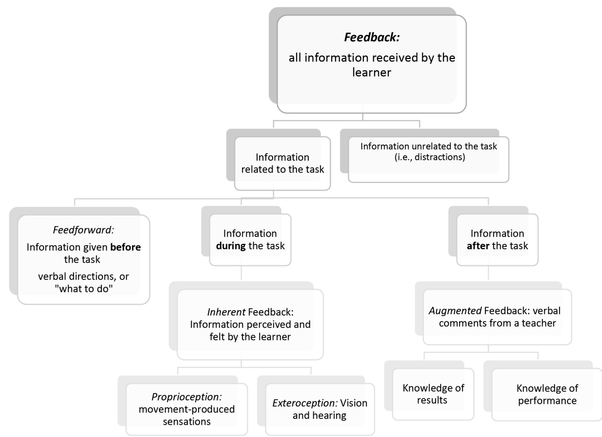

# สัปดาห์ที่ 5 — ข้อมูลป้อนกลับที่ให้ผู้เรียนคิดก่อน: inherent · augmented · จังหวะเวลา

**วันเรียน:** 31 ส.ค. 2026 · **ส่งงาน:** 5 ก.ย. 2026 ภายใน 23:59 · ช่องทางตามที่ผู้สอนประกาศ

สัปดาห์นี้เราฝึก **แยก feedback ที่ผู้เรียนรับรู้เอง** ออกจาก **feedback จากครู** แล้วออกแบบจังหวะเวลาให้ผู้เรียน self-check ก่อน เราจะแยกให้ชัดว่าอะไรคือ **สิ่งที่หนังสือกล่าว** และอะไรคือ **คำถาม นโยบาย หรือตัวอย่างของครู**

---

> *วันนี้เราไม่ได้มา “พูดแก้ให้ครบทุกประโยคเพลง” แต่จะฝึกเห็นว่าผู้เรียนรับข้อมูลจากร่างกาย เสียง และสายตาอยู่แล้ว ครูเป็นเพียงแหล่งข้อมูลเสริม และจังหวะที่ครูพูดเร็วเกินไปอาจขวางการประมวลผลของตัวผู้เรียน เมื่อจบคาบ คุณจะออกแบบโปรโตคอลสั้นได้ว่าเมื่อใดเงียบ เมื่อใดถาม “รู้สึก/ได้ยินอะไร” และเมื่อใดจึงให้คำแนะนำ — พร้อมระบุขอบเขตความสามารถของครูอย่างชัดเจน*

---

## ครูตัดสินใจเรื่องใดบ้างเมื่อผู้เรียนเล่นจบหนึ่งท่อน?

หลังผู้เรียนเล่นจบ เราแยก **“สิ่งที่ผู้เรียนรับรู้เอง”** ออกจาก **“สิ่งที่ครูจะเติม”** ได้อย่างไร?

**หลังคาบนี้ คุณจะทำได้ 3 อย่าง**
1. แยก inherent feedback กับ augmented feedback ในสถานการณ์สอนจริงหรือสมมติ  
2. ออกแบบช่วงว่างสั้นให้ผู้เรียน self-check ก่อนรับ feedback จากครู  
3. เขียนโปรโตคอล feedback หรือบันทึก two-take พร้อมขอบเขต referral ที่ติดป้ายชัดว่าเป็นนโยบายรายวิชา

---

## ตัวอย่างกรณีศึกษา

ก่อนเรียนคำศัพท์ ให้เริ่มจากสถานการณ์ที่ครูดนตรีพบได้จริง เราจะกลับมาที่ฟ้าทุกขั้นของบทเรียน

> **ตัวอย่างเดินเรื่อง (ครูสมมติให้ — ไม่ใช่ข้ออ้างจากหนังสือ):**  
> **ฟ้า** เป็นครูสอนฟลูต ผู้เรียนเล่นท่อน 4 ห้องจบ ฟ้ามักพูดทันทีว่า “ลมไม่พอ ลองใหม่”  
> ผู้เรียนพยักหน้าแล้วเล่นใหม่ แต่บอกไม่ได้ว่าตนเองได้ยินหรือรู้สึกอะไร  
> ฟ้าทดลองโปรโตคอลใหม่: (1) เงียบ 3–5 วินาที (2) ถาม “ได้ยิน/รู้สึกอะไร” (3) ให้ผู้เรียนอัด Take 2 หลัง self-check (4) ครูจึงให้ augmented feedback หนึ่งจุด  
> หากผู้เรียนบ่นเจ็บข้อมือเรื้อรัง ฟ้า**ไม่**วินิจฉัยเอง แต่ใช้ประโยคอ้างอิงนโยบาย referral ของรายวิชา

คุณไม่ต้องสอนฟลูตเหมือนฟ้า เลือกเครื่องและสถานการณ์ของ **คุณเอง** ได้ แต่ใช้วิธีคิดชุดเดียวกัน

**สองเครื่องมือของสัปดาห์นี้ทำงานคู่กัน:** การแบ่งชนิด feedback บอกว่าข้อมูลมาจากไหน · จังหวะเวลาบอกว่าจะ **ให้เมื่อใด** และให้ผู้เรียนคิดก่อนหรือไม่

---

## เครื่องมือที่ 1: Inherent feedback กับ Augmented feedback

ถ้าไม่มีกรอบนี้ ฟ้าจะมองว่า “มีแต่คำพูดของครู” — มองไม่เห็นข้อมูลที่ผู้เรียนมีอยู่แล้ว

**ที่มา:** Lynn Helding, *The Musician’s Mind* — Chapter 4 ส่วน Feedback / Divisions of feedback (Figure 4.1)

*เครดิต: Lynn Helding, The Musician’s Mind, Figure 4.1 Divisions of feedback; adapted from Lynn Maxfield; source vault image; ใช้เพื่อการเรียนการสอน*

> **สิ่งที่หนังสือกล่าว (SOURCE CLAIM · W5-A):** Feedback คือข้อมูลใด ๆ ที่มีให้ผู้เรียน แต่ถูกแบ่งเป็นชั้นย่อยจำนวนมาก (ดู Figure 4.1) การแบ่งสำคัญอันดับแรกคือ **inherent feedback** (สิ่งที่ผู้เรียนรับรู้และรู้สึกเอง) กับ **augmented feedback** (ข้อมูลจากภายนอก เช่น ครู หรือเครื่องบันทึก) Inherent feedback ประกอบด้วยข้อมูลในร่างกาย (proprioception) และข้อมูลจากภายนอกที่ระบบรับสัมผัสรับเอง (exteroception เช่น เสียงที่ได้ยิน การมอง) Augmented feedback เป็นข้อมูล “เพิ่ม” ที่ผู้สอนควบคุมได้ว่าจะให้หรือไม่ ให้เมื่อใด และให้รูปแบบใด — และในงาน motor learning ถูกมองว่าสำคัญมากรองจากการฝึกเอง

**อ่านสิ่งที่หนังสือกล่าวแบบภาษาง่าย:** ผู้เรียนไม่ได้ว่างเปล่าหลังเล่นจบ — เขากำลังได้ยินและรู้สึกอยู่แล้ว ครูควรรู้ว่ากำลัง “เติม” อะไรเข้าไป

| ชนิด | หมายถึงอะไร | ตัวอย่างในห้องซ้อม (ทั่วไป) |
|---|---|---|
| **Inherent** | ข้อมูลที่ผู้เรียนรับเอง | ได้ยินเสียงตนเอง รู้สึกนิ้ว/ลม/ท่า |
| **Augmented** | ข้อมูลจากภายนอกที่ครู/สื่อให้ | คำพูดครู วิดีโอรีวิว คอมเมนต์เพื่อนในชั้น |
| **Proprioception** | รู้สึกจากการเคลื่อนไหว | รู้สึกแรงกด ตำแหน่งมือ ความตึง |
| **Exteroception** | รับจากภายนอกผ่านประสาทสัมผัส | เสียงในอากาศ ภาพในกระจก |

**ตัวอย่างการสอนเครื่องลม** — *ตัวอย่าง/คำแนะนำของครู — ไม่ใช่ข้ออ้างจากหนังสือ*

- หลัง Take 1: ถาม inherent ก่อน — “ท้ายประโยคเพลง คุณได้ยินอะไร?”  
- แล้วค่อย augmented — “ฉันได้ยินว่า… ตรงวินาที…”  
- หลีกเลี่ยงการพูดทับขณะผู้เรียนยังประมวลผล inherent อยู่  

> **คำถามของครู (ใช้ทั้งชั้น):** ใน 10 วินาทีหลังผู้เรียนเล่นจบ คุณมักให้ augmented เร็วเกินไปหรือปล่อย inherent ทำงาน?

> 📌 บทของ Helding **ไม่ได้** สั่งเทคนิค embouchure เฉพาะเครื่อง และภาพ Figure 4.1 เป็นแผนที่ชนิด feedback ไม่ใช่ใบสั่งเทคนิคเครื่องลม

**กลับมาที่ฟ้า:** ปัญหาไม่ใช่แค่ “คำแนะนำถูกหรือผิด” แต่เป็นจังหวะที่คำแนะนำเข้าไปก่อนที่ผู้เรียนจะอ่าน inherent ของตนเอง

**สิ่งที่หนังสือไม่ได้กล่าว (non-claim):** Helding ไม่ได้ให้สคริปต์ภาษาไทยสำเร็จรูป และไม่ได้กำหนดวินาทีเงียบมาตรฐานเดียวทุกวัย

---

## เครื่องมือที่ 2: จังหวะเวลาของ feedback และการ self-check ก่อนครู

### ส่วนนี้คืออะไร

เมื่อแยกชนิด feedback ได้แล้ว ขั้นต่อไปคือตัดสินใจ **เมื่อใด** จะให้ และจะให้ผู้เรียนประเมินตนเองก่อนหรือไม่

### สืบค้นข้อมูลมาจากไหน?

| ชั้น | มาจากไหน | หมายเหตุ |
|---|---|---|
| **สิ่งที่หนังสือกล่าว (จังหวะ/ empty delay)** | Helding, *The Musician’s Mind* — concurrent vs terminal; instantaneous / immediate / delayed | ล็อกใน SOURCE CLAIM |
| **สิ่งที่หนังสือกล่าว (self-evaluate ก่อน)** | Gebrian, *Learn Faster, Perform Better* — “The role of feedback” | ล็อกใน SOURCE CLAIM |
| **นโยบาย referral** | **นโยบายที่รายวิชาสร้าง** — ติดป้ายชัด ไม่ใช่ข้ออ้างจากหนังสือเล่มใดเล่มหนึ่ง | ใช้เพื่อสุขภาวะและความปลอดภัย |

> **สิ่งที่หนังสือกล่าว (SOURCE CLAIM · W5-B):**  
> **(1) Helding:** Concurrent augmented feedback (พูด/ส่งสัญญาณขณะผู้เรียนกำลังเล่น) ควรใช้อย่างระมัดระวัง เพราะอาจขวางการรับ inherent feedback ของผู้เรียน และสอดคล้องกับ guidance hypothesis ที่ช่วย performance ระยะสั้นแต่ฉุด learning ระยะยาวได้ Instantaneous feedback (พูดทันทีโดยไม่มีช่องว่าง) ให้ผลคล้ายกันเพราะไม่เหลือที่ให้ผู้เรียนคิด Terminal feedback หลังเล่นจบ โดยเฉพาะ **immediate หลังหน่วงว่างสั้น** (ว่างจริง ไม่มีสิ่งรบกวน) สนับสนุนการเรียนรู้ — อ้างแนวคิดว่า learning ดีขึ้นเมื่อประมวล **inherent ก่อน** แล้วจึงรับ **augmented** (เช่น ถาม “How did that feel?”)  
> **(2) Gebrian:** ผู้เรียนที่ได้รับ immediate feedback ทำได้แย่กว่าในการทดสอบเมื่อเทียบกับผู้เรียนที่ถูกขอให้ **self-evaluate ก่อน** รับ feedback — การให้ทันทีอาจไม่ให้โอกาสพัฒนา error detection และทำให้พึ่งครู

**อ่านสิ่งที่หนังสือกล่าวแบบภาษาง่าย:** อย่ารีบพูดทันทีทุกครั้ง — ให้ผู้เรียนฟังตนเองก่อน แล้วค่อยเติมคำของครู

### สองเครื่องมือทำงานร่วมกันอย่างไร

- **W5-A** บอกว่าข้อมูลมาจาก **inherent หรือ augmented**  
- **W5-B** บอกว่าจะ **จัดลำดับเวลา** อย่างไรให้ inherent ทำงานก่อน  

ถ้ามีแค่ชนิดโดยไม่มีจังหวะ ครูอาจรู้คำศัพท์แต่ยังพูดทับ  
ถ้ามีแค่ “เงียบก่อน” โดยไม่รู้ชนิด ครูอาจเงียบแบบไม่มีเป้าหมาย

### โครงเขียนงาน: Self-check → Teacher note → Boundary

รายวิชาใช้โครงนี้ **เป็นชื่อย่อของรายวิชา**

- **Self-check:** ผู้เรียนเขียน/พูด inherent ก่อน  
- **Teacher note:** augmented หนึ่งจุด หลังช่วงว่าง  
- **Boundary:** สิ่งที่ครูไม่วินิจฉัย และเมื่อใดต้อง referral  

### ติดตามฟ้า: two-take ก่อนคำครู

1. **Take 1** — เล่นท่อน 4 ห้อง  
2. **Empty pause** — เงียบสั้น ๆ  
3. **Self-check** — ผู้เรียนพูด “ฉันได้ยิน… / ฉันรู้สึก…”  
4. **Take 2** — ปรับตาม self-check หนึ่งอย่าง  
5. **Augmented** — ครูเติมหนึ่งจุดที่ยังไม่ได้ยิน  
6. **Boundary** — ถ้ามีอาการเจ็บเรื้อรัง/หายใจลำบาก/ทุกข์ทางอารมณ์รุนแรง → อ้างนโยบาย referral ไม่ให้คำวินิจฉัย

### นโยบายขอบเขตความสามารถของครู (teacher-created · ติดป้ายชัด)

> **นโยบายรายวิชา (ไม่ใช่ข้ออ้างจาก Gebrian/Helding):**  
> ครูดนตรี **ไม่** มีคุณสมบัติวินิจฉัยหรือรักษาการบาดเจ็บ ภาวะการหายใจ ปวดเรื้อรัง focal dystonia ความผิดปกติของขากรรไกร ความวิตกกังวลทางคลินิก หรือปัญหาทางการแพทย์/จิตเวช  
> หากพบอาการเจ็บต่อเนื่อง หายใจลำบาก ชา สงสัยบาดเจ็บ หรือทุกข์อย่างมีนัยสำคัญ ให้ **ส่งต่อ** ผู้เชี่ยวชาญที่เหมาะสม  
> ในงาน P5 ให้นักศึกษา **เขียนประโยค referral 1 ประโยค** ที่ใช้ได้จริงในบทบาทครู โดยไม่แอบอ้างว่ามาจากหนังสือ

**กฎภาษาที่ใช้ทั้งคาบ**
- ผู้เรียนขึ้นก่อนด้วย **“ฉันได้ยิน/รู้สึก…”**  
- ครูตามด้วย **“ฉันได้ยิน/เห็น… (หลักฐาน)”** แล้วค่อยคำแนะนำ  
- **วินิจฉัยทางการแพทย์** = นอกขอบเขต · **สังเกตเพื่อส่งต่อ** = ในขอบเขตครู  

### ตารางช่วยเขียน (ใช้ส่งงาน)

| ขั้น | ทำอะไร | ตัวอย่างภาษา | ตัวอย่างของฟ้า |
|---|---|---|---|
| **Inherent** | บันทึกสิ่งที่ผู้เรียนรับเอง | “ฉันได้ยินท้ายประโยคเพลงเบาลง” | ผู้เรียน: “ท้ายห้อง 4 เสียงสั้น” |
| **Pause** | ว่างสั้นก่อนพูด | เงียบ 3–5 วิ | ฟ้าไม่พูดทับ |
| **Self-check** | ถามก่อนสอน | “รู้สึก/ได้ยินอะไร?” | ได้คำตอบจากผู้เรียนก่อน |
| **Augmented** | เติมหนึ่งจุด | “ฉันได้ยินว่า…” | ชี้จุดเดียวหลัง Take 2 |
| **Boundary** | referral ถ้าเข้าข่าย | “ครูส่งต่อเมื่อ…” | ประโยคนโยบาย 1 ประโยค |

---

## งานของนิสิต งานที่ 5

**ชื่องาน:** Feedback protocol annotation หรือ two-take self-check  
เลือก **อย่างใดอย่างหนึ่ง** (หรือรวมสั้น ๆ ได้ถ้าชัด)

**ตัวเลือก A — Protocol annotation:** เขียนโปรโตคอล feedback 1 หน้า สำหรับบทเรียนสั้น 1 ท่อน  
**ตัวเลือก B — Two-take self-check:** บันทึก Take 1 → self-check เขียน → Take 2 → แล้วจึงรับ/จำลอง teacher feedback (เก็บไฟล์ส่วนตัวได้ ไม่โพสต์สาธารณะ)

> **ไม่ให้คะแนน** น้ำเสียงที่ไพเราะหรือความสุภาพแบบผิวเผิน — วัด **ลำดับ inherent → self-check → augmented** และ **ขอบเขต referral**

### ทำตามขั้นตอนนี้

1. **เลือกท่อน 4–8 ห้อง** หรือสถานการณ์สอนสั้น  
2. **ระบุ inherent ที่คาดว่าผู้เรียนจะมี** อย่างน้อย 2 รายการ  
3. **ออกแบบช่วงว่าง + คำถาม self-check** 1–2 คำถาม  
4. **จำกัด augmented เหลือ 1 จุดหลัก** หลัง self-check (และหลัง Take 2 ถ้าเลือก B)  
5. **เขียนประโยค referral / ขอบเขต** 1 ประโยค ติดป้ายว่าเป็นนโยบายรายวิชา  
6. **อ้างรหัส:** ชนิด feedback → `W5-A` · จังหวะ/self-check → `W5-B`

### โครงที่ส่ง

| ส่วน | สิ่งที่ต้องมี |
|---|---|
| 1. บริบท | เครื่อง / ท่อน / ใครเป็นผู้เล่น |
| 2. แผนที่ feedback | inherent vs augmented |
| 3. ลำดับเวลา | pause → self-check → (Take 2) → teacher |
| 4. สคริปต์สั้น | คำถาม 1–2 + feedback ครู 1 จุด |
| 5. Boundary | ประโยค referral |
| 6. รหัส | `W5-A · W5-B` |

**การส่งงาน:** PDF/DOCX และ/หรือลิงก์ไฟล์เสียงแบบส่วนตัวตามที่ผู้สอนประกาศ

---

## ตัวอย่างข้อความ — ของฟ้า

> **ตัวอย่างของฟ้า (อ้าง W5-A, W5-B)**  
> *ตัวอย่าง/คำแนะนำของครู — ไม่ใช่ข้ออ้างจากหนังสือ*

> **บริบท —** ฟลูต ท่อนช้า 4 ห้อง ผู้เรียนปีแรก  
>
> **Inherent ที่คาดหวัง —** (1) ได้ยินความยาวโน้ตท้าย (2) รู้สึกการส่งลม  
>
> **ลำดับ —** Take 1 → เงียบ ~4 วิ → ถาม “ท้ายประโยคเพลง คุณได้ยินอะไร?” → ให้ผู้เรียนตั้งตัวแปรเดียวจากคำตอบตนเอง → Take 2 → ครู: “ฉันได้ยินว่าห้อง 4 สั้นกว่าห้อง 2; ลองฟังความยาวให้เท่ากัน” (augmented หนึ่งจุด)  
>
> **Boundary (นโยบายรายวิชา) —** “หากมีอาการเจ็บขณะเล่นต่อเนื่องหรือชา ครูจะหยุดการทดลองเทคนิคและแนะนำให้ปรึกษาผู้เชี่ยวชาญด้านสุขภาพที่เหมาะสม ครูไม่วินิจฉัยอาการ”  
>
> **รหัส:** W5-A · W5-B

---

## ถ้าคุณเป็นครูของฟ้า

*ตัวอย่างการสอนของครู — เป็นคำแนะนำของครู ไม่ใช่ข้ออ้างจากหนังสือ*

อย่าเพิ่งพูดว่า “คุณพูดมากไป”

1. ดูนาฬิกาในใจ 3–5 วินาทีหลังผู้เรียนเล่นจบ  
2. ถาม inherent ก่อนทุกครั้งในรอบสาธิต  
3. จำกัดคำครูเหลือหนึ่งจุดหลัก  
4. แยก “ได้ยิน” กับ “ควรทำ”  
5. ทบทวนประโยค referral ให้พร้อมใช้โดยไม่ตื่นตระหนก

### ข้อเสนอแนะจากเพื่อน (peer feedback) ในชั้น

- **สังเกต 1 ข้อ:** “ฉันเห็นว่าคุณให้ self-check ก่อนตรง…”  
- **คำถามเพื่อพัฒนา 1 ข้อ:** “ถ้าผู้เรียนตอบไม่ได้ คุณจะถาม inherent แบบแคบลงอย่างไรโดยยังไม่ป้อนคำตอบ?”

---

## แผนการสอน 120 นาที (วันเรียน 31 ส.ค.)

| เวลา | กิจกรรม | หลักฐานในชั้น |
| --- | --- | --- |
| **0–15** | Retrieval จาก W4 (problem solving) → เล่าตัวอย่างฟ้า → เปิด Figure 4.1 | ระบุ inherent 2 ข้อ |
| **15–35** | อ่าน SOURCE CLAIM W5-A แผนที่ feedback | ตาราง inherent/augmented |
| **35–55** | อ่าน SOURCE CLAIM W5-B + ทดลองเงียบสั้นในคู่ | บันทึก pause + คำถาม |
| **55–85** | เวิร์กชอป two-take หรือร่าง protocol | ร่าง P5 |
| **85–105** | Peer feedback + ตรวจ boundary/referral | ข้อเสนอแนะจากเพื่อน |
| **105–120** | บัตรสะท้อนคิด: “ครั้งหน้าฉันจะพูดช้าลงตรงไหน” | บัตรสะท้อนคิด |

---

## สิ่งที่ส่ง · กำหนดส่ง · เกณฑ์คะแนน

| รายการ | รายละเอียด |
|---|---|
| Protocol หรือ two-take note | ลำดับ inherent → self-check → augmented |
| Boundary | ประโยค referral ติดป้ายนโยบายรายวิชา |
| รหัสแหล่งความรู้ | `W5-A` · `W5-B` |
| **วันส่ง** | **5 ก.ย. 2026 ภายใน 23:59** |
| **ช่องทาง** | ตามที่ผู้สอนประกาศ |

กติกา: นับวันถัดจากวันเรียนเป็นวันที่ 1 ส่งภายใน 23:59 ของวันที่ 5

### เกณฑ์การให้คะแนน (100)

| ด้าน | คะแนน |
|---|---|
| **แยก inherent / augmented** — ใช้ศัพท์และตัวอย่างได้สอดคล้อง W5-A | 30 |
| **ลำดับเวลา + self-check** — มีช่วงว่างและให้ผู้เรียนประเมินก่อนครู (W5-B) | 35 |
| **Augmented กระชับ** — หนึ่งจุดหลัก อิงหลักฐานที่ได้ยิน/เห็น | 20 |
| **Boundary + รหัส** — มีประโยค referral ที่ติดป้ายชัด และอ้าง `W5-A` `W5-B` | 15 |

> ความสุภาพของน้ำเสียงเป็นข้อเสนอแนะ — คะแนนหลักคือ **เหตุผลและลำดับ feedback**

### งานศึกษาด้วยตนเอง (~6 ชม.)

1. อ่าน Helding, *The Musician’s Mind* — Feedback divisions (inherent/augmented; Figure 4.1) และจังหวะ concurrent/terminal  
2. อ่าน Gebrian — “The role of feedback” (self-evaluate ก่อน immediate feedback)  
3. ทำ P5 ให้ครบ แล้วส่งภายใน 5 ก.ย. 2026 23:59  

**ตรวจตนเองก่อนส่ง**
- [ ] แยก inherent กับ augmented ชัด  
- [ ] มี self-check ก่อน teacher feedback  
- [ ] augmented ไม่ทะลักหลายจุดในรอบเดียว  
- [ ] มีประโยค referral ติดป้ายว่าเป็นนโยบายรายวิชา  
- [ ] อ้าง `W5-A` และ `W5-B`  
- [ ] ไม่โพสต์สาธารณะบังคับ และไม่วินิจฉัยทางการแพทย์  

---

## อภิธานศัพท์ (อ้างอิงท้ายหน้า)

| ศัพท์ | ความหมายสั้น |
|---|---|
| Inherent feedback | ข้อมูลที่ผู้เรียนรับรู้/รู้สึกเอง |
| Augmented feedback | ข้อมูลเสริมจากครูหรือแหล่งภายนอก |
| Proprioception | รู้สึกจากการเคลื่อนไหวของร่างกาย |
| Exteroception | รับข้อมูลจากภายนอกผ่านประสาทสัมผัส |
| Concurrent feedback | feedback ขณะกำลังเล่น |
| Terminal feedback | feedback หลังเล่นจบ |
| Immediate (short delay) | ให้หลังว่างสั้น ๆ |
| Self-check / self-evaluate | ผู้เรียนประเมินตนเองก่อนรับคำครู |
| Guidance hypothesis | การชี้นำมากไปอาจช่วยชั่วคราวแต่ฉุดการเรียนรู้ระยะยาว |
| Referral / scope of competence | ส่งต่อเมื่อเกินขอบเขตครู (นโยบายรายวิชา) |

---

## เชื่อมไปสัปดาห์ถัดไป

หลังส่งงาน จะทบทวนว่าทุกคนให้ self-check ก่อนและระบุขอบเขต referral ได้จริงหรือไม่ แล้วจึงไปหัวข้อสัปดาห์ที่ 6: นักดนตรีเรียนรู้ด้วยการฟัง — audiation และ sound-before-symbol

---

## References

- Lynn Helding, *The Musician’s Mind* — Chapter 4 Feedback (inherent vs augmented; Figure 4.1; concurrent/terminal timing; inherent processing before augmented)
- Molly Gebrian, *Learn Faster, Perform Better* — “The role of feedback” (self-evaluate before teacher feedback)
- **Course policy (not a book claim):** teacher scope of competence and referral thresholds for pain, injury, breathing difficulty, or significant distress

## Image credits

- `images/feedback-map.png` — Lynn Helding, *The Musician’s Mind*, Figure 4.1 Divisions of feedback; adapted from Lynn Maxfield; source vault image; ใช้เพื่อการเรียนการสอน
