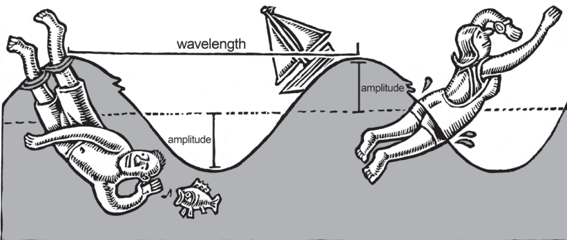

# สัปดาห์ที่ 6 — นักดนตรีเรียนรู้ด้วยการฟัง: Audiation และ Sound-before-symbol

**วันเรียน:** 7 ก.ย. 2026 · **ส่งงาน:** 12 ก.ย. 2026 ภายใน 23:59 · ช่องทางตามที่ผู้สอนประกาศ

สัปดาห์นี้เราฝึก **จัดลำดับการสอนจากเสียงไปสู่สัญลักษณ์** โดยแยกให้ชัดว่าอะไรคือ **สิ่งที่หนังสือกล่าว** และอะไรคือ **คำถามหรือตัวอย่างของครู** เราจะใช้ audiation กับ Whole–Part–Whole และ Gordon’s Skill Learning Sequence เป็นเครื่องมือตัดสินใจ ไม่ใช่ป้ายติดผู้เรียน

---

> *วันนี้เราไม่ได้มา “ติดโน้ตให้เร็วที่สุด” แต่จะฝึกคิดแบบครูที่ถามก่อนว่าผู้เรียนได้ยินและเข้าใจเสียงในใจหรือยัง เราจะใช้ **audiation** เป็นเป้าหมายของการฟังในใจอย่างมีความเข้าใจ ใช้ **Whole–Part–Whole** เพื่อวางบริบทก่อนแยก pattern แล้วใช้ **Skill Learning Sequence** จัดขั้นจาก Aural/Oral ไปทางสัญลักษณ์ เมื่อจบคาบ คุณจะไม่เพียงพูดว่า “เด็กอ่านโน้ตไม่เก่ง” แต่จะอธิบายได้ว่าควรให้ฟัง เลียนแบบ ติดฉลาก หรือเชื่อมสัญลักษณ์ตอนไหน และเงื่อนไขใดที่ทำให้ต้องเปลี่ยนลำดับ*

---

## ครูตัดสินใจเรื่องใดบ้างเมื่อจะ “สอน pattern”?

เมื่อเห็นผู้เรียนเล่นผิดหรืออ่านไม่ออก เราแยก **“สิ่งที่ได้ยิน/ทำได้จริง”** ออกจาก **“สิ่งที่เรารีบสรุปว่าเป็นปัญหาเรื่องโน้ต”** ได้อย่างไร?

**หลังคาบนี้ คุณจะทำได้ 3 อย่าง**
1. อธิบาย audiation และบทบาทของ context ต่อการฟัง pattern  
2. สาธิตหรือออกแบบ Whole–Part–Whole อย่างสั้น ๆ ให้เห็นภาพรวม–ส่วนย่อย–ภาพรวม  
3. เขียนสคริปต์จัดลำดับ 4 ห้อง จาก Aural/Oral ไปทาง Symbolic Association พร้อมระบุจุดที่อาจต้องเปลี่ยนลำดับ

---

## ตัวอย่างกรณีศึกษา

ก่อนเรียนคำศัพท์ ให้เริ่มจากสถานการณ์ที่ครูดนตรีพบได้จริง เราจะกลับมาที่มิ้นในทุกขั้นของบทเรียน

> **ตัวอย่างเดินเรื่อง (ครูสมมติให้ — ไม่ใช่ข้ออ้างจากหนังสือ):**  
> **มิ้น** เป็นนักเรียนคลาริเน็ตปีแรก ครูให้เล่นจังหวะ 4 ห้องจากแบบฝึกหัด  
> ครูคนหนึ่งเปิดโน้ตทันที ชี้จังหวะที่ผิด แล้วให้เล่นซ้ำจากห้อง 1  
> ครูอีกคนยังไม่เปิดโน้ต แต่ร้อง pattern ด้วยพยางค์กลาง (เช่น “bah”) ให้มิ้นเลียนแบบ แล้วถามว่า “ก่อนเล่น เธอได้ยิน pattern นี้ในใจหรือยัง”  
> ทั้งสองคนเห็นเหตุการณ์เดียวกัน แต่ลำดับการสอนต่างกัน: หนึ่งเริ่มที่สัญลักษณ์ อีกหนึ่งเริ่มที่เสียง

คุณไม่ต้องสอนคลาริเน็ตเหมือนมิ้น เลือกเครื่อง pattern และสถานการณ์ของ **คุณเอง** ได้ แต่ใช้วิธีคิดชุดเดียวกัน

**สองเครื่องมือของสัปดาห์นี้ทำงานคู่กัน:** audiation + context บอกว่าจะ **ฟังอะไรในใจก่อน** · Whole–Part–Whole + Skill Learning Sequence บอกว่าจะ **เรียงขั้นสอนอย่างไร**

---

## เครื่องมือที่ 1: Audiation และบริบท (context)

ถ้าไม่มีกรอบนี้ ครูจะพูดได้แค่ “เด็กฟังไม่เป็น” — เลือกจุดเริ่มสอนไม่ถูก

**ที่มา:** Andy Mullen, *How to Teach the Language of Music* — Introduction / Types and Stages of Audiation / Whole–Part–Whole (ส่วน context)

> **สิ่งที่หนังสือกล่าว (SOURCE CLAIM · W6-A):** เป้าหมายหลักของ Music Learning Theory คือพัฒนาความเข้าใจทางดนตรีผ่าน **audiation** เพื่อให้ผู้เรียนคิดทางดนตรีได้อย่างอิสระ การ “ได้ยิน” ดนตรีในใจอย่างเดียวไม่พอ — จะ audiate อย่างแท้จริงได้ ต้อง **เข้าใจ** ความคิดทางดนตรีนั้น หนังสือเปรียบว่าเราเรียนดนตรีคล้ายเรียนภาษา: เมื่อมีคำศัพท์ทางดนตรีแล้ว จึงสมเหตุสมผลที่จะเรียน **อ่าน** สิ่งที่ **คิดได้แล้ว** และ **Whole แรก** ในแนว Whole–Part–Whole คือ **context** (tonality หรือ meter) — ไม่สอน pattern เพลง หรือ etude นอกบริบท ตัวอย่าง: โน้ต G แล้ว E บนเปียโนคือ minor third ลง แต่ถ้าไม่มี tonal context ผู้เรียนจะตีความเองได้หลายแบบ (เช่น C major, E minor, A7 ใน D ฯลฯ)

**อ่านสิ่งที่หนังสือกล่าวแบบภาษาง่าย:** ฟังในใจอย่างเข้าใจ ≠ แค่ “นึกเสียง” · ก่อนสอน pattern ต้องให้บริบท tonal หรือ meter · สัญลักษณ์มาทีหลังสิ่งที่คิด/ฟังได้แล้ว

| คำ | หมายถึงอะไรโดยย่อ | คำถามที่ครูมักใช้สังเกต |
|---|---|---|
| **Audiation** | ได้ยินและเข้าใจดนตรีในใจ | ผู้เรียน “คิด” pattern นี้ได้ก่อนเล่นหรือยัง? |
| **Context** | บริบท tonal (เช่น major/minor) หรือ meter (เช่น duple/triple) | ตอนนี้กำลังอยู่ใน tonality/meter ใด? |
| **Sound-before-symbol** | เสียงและการทำก่อนสัญลักษณ์ (หลักที่รายวิชาใช้เรียกแนวคิด sound → symbol) | เปิดโน้ตตอนไหน — หลังได้ยินและทำได้แล้วหรือยัง? |
| **Pattern** | หน่วยสั้น ๆ ทาง tonal หรือ rhythm ที่สอนเป็น “คำ” ทางดนตรี | pattern นี้คุ้นหรือใหม่? สอนเดี่ยวหรือในเพลง? |

**ตัวอย่างการสอนเครื่องลม** — *ตัวอย่าง/คำแนะนำของครู — ไม่ใช่ข้ออ้างจากหนังสือ*

- ให้มิ้น **ร้อง/ปรบ** pattern 4 ห้องก่อนเป่าเครื่อง  
- ตั้ง context ด้วยเพลงหรือ drone สั้น ๆ ก่อน echo pattern  
- ถาม “ได้ยิน resting tone / ชีพจรใหญ่ในใจไหม” ก่อนชี้โน้ต  

> **คำถามของครู (ใช้ทั้งชั้น):** เมื่อคุณสอน pattern 4 ห้อง คุณเริ่มจากอะไรก่อน — เปิดโน้ต, สาธิตด้วยเครื่อง, หรือให้ผู้เรียนฟังและเลียนแบบในบริบท?

> 📌 “คำถามของครู” เป็นคำถามสังเกตของรายวิชา **ไม่ใช่** คำสั่งเทคนิค embouchure/reed จากหนังสือ Mullen

**กลับมาที่มิ้น:** ครูคนที่สองกำลังทำงานกับ **audiation + context** เพราะต้องการให้มิ้นได้ยิน pattern ในใจก่อน แล้วจึงไปสัญลักษณ์ — ไม่ใช่แค่ “แก้โน้ตทีละตัว”

### ภาพประกอบ (ตัวอย่างถ่ายทอด — ไม่ใช่ข้ออ้างของ Gordon)

*เครดิต: Music, Math, and Mind, Figure 1.1 Waves at the beach ในบท The Parameters of Sound; source vault image · **ใช้เป็นตัวอย่างถ่ายทอดการมองเสียงเท่านั้น ไม่ได้อ้างว่าเป็นหลักฐานของ audiation ใน MLT***

---

## เครื่องมือที่ 2: Whole–Part–Whole และ Gordon’s Skill Learning Sequence

### ส่วนนี้คืออะไร

เมื่อรู้แล้วว่าต้องมี context และ audiation ขั้นต่อไปคือ **เรียงลำดับทักษะ** ว่าผู้เรียนควรฟัง เลียนแบบ ติดฉลาก แยกบริบท อ่านสัญลักษณ์ หรืออนุมานเมื่อไหร่

### สืบค้นข้อมูลมาจากไหน?

| ชั้น | มาจากไหน | หมายเหตุ |
|---|---|---|
| **สิ่งที่หนังสือกล่าว** | Mullen, *How to Teach the Language of Music* — Whole–Part–Whole; Gordon’s Skill Learning Sequence | ล็อกเป็น SOURCE CLAIM ด้านล่าง — ห้ามแต่งเพิ่ม |
| **โครงเขียนและตัวอย่างมิ้น** | ออกแบบโดยรายวิชา (คำถาม/ตัวอย่างของครู) | ใช้สอนและเขียนงาน — **ไม่ใช่** ข้อความจากหนังสือ |

> **สิ่งที่หนังสือกล่าว (SOURCE CLAIM · W6-B):** การเรียนรู้ที่ดีเกิดแบบ **Whole–Part–Whole**: Whole = ภาพใหญ่ (exposure ต่อ tonalities/meters หลายแบบ); Part = pattern เฉพาะใน context; Whole หลัง = pattern นั้นเริ่มมีความหมายในดนตรีที่กว้างขึ้น ในห้องเรียนแนว MLT ส่วน Parts คือ pattern ใน Learning Sequence Activities ส่วน whole ทั้งสองฝั่งเกิดใน Classroom Activities (เพลง เกม ฯลฯ)  
> **Skill Learning Sequence** แบ่งเป็นสองประเภทใหญ่: **Discrimination learning** (สอนชัด จำแนกสิ่งที่คุ้น — ใช้ familiar patterns) และ **Inference learning** (ชี้นำให้ผู้เรียนสอนตนเอง อนุมานสิ่งที่ไม่คุ้นจากสิ่งที่คุ้น)  
> ขั้น Discrimination โดยสรุป: **Aural/Oral** (พื้นฐานสุด ฟังและเลียนแบบ พยางค์กลาง เคลื่อนไหว) → **Verbal Association** (ติดฉลากเสียงด้วย solfege/syllable) → **Partial Synthesis** (แยก context เช่น major/minor, duple/triple) → **Symbolic Association** (อ่านระดับ “คำ” — pattern ที่เคยสอนที่ VA) → **Composite Synthesis** (อ่านระดับ “ประโยค” อย่างเข้าใจ)  
> ขั้น Inference รวม **Generalization**, **Creativity/Improvisation**, และ **Theoretical Understanding** (เหตุผล/“ไวยากรณ์” ของดนตรี — ข้อมูลเทคนิคเช่น ชื่อเส้น ชื่อโน้ต ชนิด cadence ฯลฯ อยู่ระดับนี้)

**อ่านสิ่งที่หนังสือกล่าวแบบภาษาง่าย:** ภาพรวม → แยก pattern ในบริบท → กลับภาพรวม · ฟัง/ทำก่อน · ติดฉลาก · ค่อยอ่าน · ทฤษฎี/“ทำไม” อยู่ท้ายลำดับ ไม่ใช่จุดเริ่มของผู้เริ่มต้น

### Audiation กับลำดับทักษะทำงานร่วมกันอย่างไร

- **W6-A** บอกว่าเราจะ **ฟังและเข้าใจอะไรในใจ** และทำไมต้องมี context  
- **W6-B** บอกว่าเราจะ **เรียงขั้นจากเสียงไปสัญลักษณ์** อย่างไร  

ถ้ามีแค่ “ต้องฟังก่อน” โดยไม่มีลำดับ ครูจะวน echo โดยไม่รู้ว่าเมื่อไหร่ควรติดฉลากหรือเปิดโน้ต  
ถ้ามีแค่เปิดโน้ตเร็ว โดยไม่ตรวจ audiation ครูจะแก้ที่สัญลักษณ์ทั้งที่ปัญหาอยู่ที่เสียงในใจ

### โครงเขียนงาน: Stage / Script / Switch

รายวิชาใช้โครง 3 ส่วนนี้ **เป็นชื่อย่อที่รายวิชาสร้างขึ้น ไม่ใช่ชื่อบทในหนังสือ**

- **Stage = ขั้นในลำดับ:** ระบุว่ากำลังอยู่ที่ A/O, VA, หรือกำลังมุ่ง SA ฯลฯ  
- **Script = คำพูดและการกระทำจริง:** เขียนว่าครูพูดอะไร ผู้เรียนทำอะไร  
- **Switch = เงื่อนไขเปลี่ยนลำดับ:** ระบุ 1 เงื่อนไขที่ทำให้ต้องถอยหรือข้ามขั้น (เช่น ยัง echo ไม่ได้ → อย่าเพิ่งเปิดโน้ต)

### ติดตามมิ้น: จากเสียงสู่สัญลักษณ์

1. **Stage A/O** — ครูตั้ง meter (duple) แล้ว chant pattern 4 ห้องด้วย “bah”; มิ้น echo ทั้ง pattern  
2. **ตรวจ audiation** — ขอให้มิ้น “ได้ยินในใจ” 1 รอบ แล้วปรบโดยไม่เป่าเครื่อง  
3. **Stage VA (สั้น)** — ติดฉลากจังหวะด้วย rhythm syllable ที่ชั้นใช้ (ตามที่ครูกำหนดในคาบ)  
4. **Stage มุ่ง SA** — เปิด notation ของ **pattern เดิมที่คุ้นแล้ว** ไม่ใช่ pattern ใหม่ทั้งหมด  
5. **Switch** — ถ้ามิ้นยัง echo ไม่ครบ อย่าเพิ่งเปิดโน้ต; กลับ A/O และลดความยาว pattern

**กฎภาษาที่ใช้ทั้งคาบ**
- ขึ้นต้นด้วย **“ฉันได้ยิน / ฉันเห็นผู้เรียนทำ…”** ก่อน  
- ค่อยตามด้วย **“ถ้าใช้ลำดับ … ฉันจะ…”**  
- **สมมติฐาน** = สิ่งในหัวเรา · **หลักฐาน** = สิ่งที่เปิดฟัง/ถาม/ให้ทำตามได้  

### ตารางช่วยเขียน (ใช้ส่งงาน)

| ขั้น | ทำอะไร | ตัวอย่างภาษา (ทั่วไป) | ตัวอย่างของมิ้น |
|---|---|---|---|
| **Stage** | ระบุขั้น A/O → … → สัญลักษณ์ | “เริ่ม A/O แล้วค่อย VA” | “A/O echo → ปรบในใจ → เปิดโน้ต pattern เดิม” |
| **Script** | คำพูด + การกระทำจริง | “ครู: ฟัง… แล้วตาม” | “bah-bah-bah-bah… มิ้นตาม → ปรบเปล่า → ชี้โน้ต” |
| **Switch** | เงื่อนไข 1 ข้อที่ทำให้เปลี่ยนลำดับ | “ถ้า echo ไม่ได้ → ถอย” | “ถ้าปรบผิดซ้ำ 3 ครั้ง → อย่าเปิดโน้ต” |

> 📌 Stage / Script / Switch = **โครงของรายวิชา** — ไม่ได้อ้างว่า Mullen ตั้งชื่อนี้ไว้

---

## งานของนิสิต งานที่ 6

**ชื่องาน:** Sequencing script: จาก Aural/Oral สู่สัญลักษณ์ · pattern 4 ห้อง · สูงสุด 1 หน้า  
ทุกคนทำโครงเดียวกัน ความต่างมาจาก **pattern + เครื่อง/บริบทของคุณ** ไม่ใช่จากใบงานคนละชุด

เขียนเอกสารสั้น **สูงสุด 1 หน้า** ที่แสดงคำพูดและการกระทำจริงในการพาผู้เริ่มต้นจาก Aural/Oral ไปทาง Symbolic Association

> **ไม่ให้คะแนน** ความสวยของภาษาหรือความถูกต้องของ “การวินิจฉัยผู้เรียนจริง” — วัด **วิธีคิดเชิงการสอนและการจัดลำดับ**  
> **ไม่ต้องโพสต์สาธารณะ** ส่งตามช่องทางที่ผู้สอนประกาศเท่านั้น

### ทำตามขั้นตอนนี้

1. **เลือก tonal หรือ rhythm pattern ยาว 4 ห้อง** (หรือเทียบเท่า 4 ห้อง) ที่เหมาะกับผู้เริ่มต้นบนเครื่องของคุณ  
2. **ระบุ context** — tonality หรือ meter ที่จะตั้งก่อนสอน pattern (อ้าง W6-A)  
3. **เขียนสคริปต์เป็นขั้น** อย่างน้อย: Aural/Oral → (Verbal Association สั้น ๆ ได้) → จุดเข้าสู่สัญลักษณ์ (Symbolic Association)  
4. **ทำเครื่องหมายจุดเปลี่ยนขั้น** (transition) ให้เห็นชัด  
5. **ระบุเงื่อนไข 1 ข้อ** ที่ทำให้ต้องเปลี่ยนลำดับ (เช่น ยังเลียนแบบไม่ได้ / context ยังไม่ชัด)  
6. **อ้างรหัสแหล่งความรู้:** audiation/context → `W6-A` · Whole–Part–Whole / Skill Learning Sequence → `W6-B`

### โครงเอกสาร 1 หน้า

| ส่วน | สิ่งที่ต้องมี |
|---|---|
| 1. Pattern + context | 4 ห้อง; tonality หรือ meter |
| 2. Stage map | ลำดับขั้นสั้น ๆ |
| 3. Script | คำพูด/การกระทำจริงทีละขั้น |
| 4. Switch | เงื่อนไขเปลี่ยนลำดับ 1 ข้อ |
| 5. รหัส | `W6-A · W6-B` |

**การส่งงาน:** ส่งไฟล์ PDF/DOCX หรือข้อความในฟอร์มตามช่องทางที่ผู้สอนประกาศก่อนวันส่ง

---

## ตัวอย่างข้อความ — ของมิ้น

อ่านก่อนเขียนของตนเอง เพื่อเห็นว่า “ดี” หน้าตาแบบไหน: **context ชัด · script ทำตามได้ · switch ใช้ได้จริง**

> **ตัวอย่างของมิ้น (อ้าง W6-A, W6-B)**  
> *ตัวอย่าง/คำแนะนำของครู — ไม่ใช่ข้ออ้างจากหนังสือ*

> **Pattern + context —** rhythm pattern 4 ห้องใน **duple meter** (ยังไม่เปิดโน้ต)  
>
> **Stage map —** Whole (ตั้ง duple + เพลงสั้น) → Part: A/O echo → ตรวจ audiation (ปรบในใจ) → VA ติดฉลากจังหวะสั้น ๆ → มุ่ง SA เปิด notation ของ pattern เดิม  
>
> **Script —** (1) ครู: “ฟังชีพจรใหญ่–เล็ก… นี่คือ duple” แล้ว chant “bah” 4 ห้อง (2) มิ้น echo ทั้ง pattern 2 รอบ (3) ครู: “ได้ยินในใจ 1 รอบ แล้วปรบโดยไม่เป่า” (4) ติดฉลากจังหวะตามที่ชั้นตกลง (5) เปิดโน้ต: “นี่คือ pattern เดิมที่เธอทำแล้ว — ชี้จุดที่ตรงกับเสียง”  
>
> **Switch —** ถ้ามิ้น echo ไม่ครบหรือปรบผิดซ้ำ 3 ครั้ง → **ไม่เปิดโน้ต**; ลดเหลือ 2 ห้อง และกลับ A/O  
>
> **รหัส:** W6-A · W6-B

---

## ถ้าคุณเป็นครูของมิ้น

*ตัวอย่างการสอนของครู — เป็นคำแนะนำของครู ไม่ใช่ข้ออ้างจากหนังสือ*

อย่าเพิ่งพูดว่า “อ่านโน้ตไม่เป็น / ไม่มีพรสวรรค์จังหวะ”

1. บอกสิ่งที่ได้ยิน — *“ฉันได้ยินว่าห้อง 3–4 ยังไม่ตรงกับ pattern ที่ฉันให้”*  
2. ตรวจ audiation ก่อนเปิดโน้ต — ปรบ/ร้องเปล่า 1 รอบ  
3. คง context (meter/tonality) ไว้ตลอดตอนสอน Part  
4. เปิดสัญลักษณ์เมื่อ pattern **คุ้นจากเสียงแล้ว**  
5. จด Switch ที่ยังไม่รู้ แทนการตำหนิผู้เรียน

### ข้อเสนอแนะจากเพื่อน (peer feedback) ในชั้น

เพื่อน 2 คนอ่านสคริปต์ของคุณ แล้วพูดแบบนี้ (ไม่ใช้ “ดี/ไม่ดี”):

- **สังเกต 1 ข้อ:** “ฉันเห็นว่าคุณแยก A/O กับจุดเปิดโน้ตชัดตรง…”  
- **คำถามเพื่อพัฒนา 1 ข้อ:** “ถ้าผู้เรียนทำ VA ได้แล้ว แต่ SA ยังสะดุด คุณจะถอยไปขั้นไหน?”

---

## แผนการสอน 120 นาที (วันเรียน 7 ก.ย.)

| เวลา | กิจกรรม | หลักฐานในชั้น |
| --- | --- | --- |
| **0–15** | Retrieval จากสัปดาห์ก่อน → เล่าตัวอย่างมิ้น → ถาม “เริ่มที่เสียงหรือสัญลักษณ์?” | เลือกคำตอบ + เหตุผลสั้น |
| **15–35** | อ่าน/ฟัง SOURCE CLAIM W6-A (audiation + context) ทดลอง G–E แบบมี/ไม่มี context | บันทึก observation |
| **35–55** | อ่าน W6-B: Whole–Part–Whole + Discrimination/Inference + ขั้น A/O→SA | ตารางขั้นสั้น |
| **55–85** | ร่าง P6: Stage → Script → Switch (pattern 4 ห้อง) | ร่าง 1 หน้า |
| **85–105** | Peer feedback: ลำดับเสียง→สัญลักษณ์ชัดหรือไม่; Switch ใช้ได้จริงหรือไม่ | ข้อเสนอแนะจากเพื่อน |
| **105–120** | บัตรสะท้อนคิด: “จุดที่ฉันมักรีบเปิดโน้ต และขั้นที่ฉันมักข้าม” | บัตรสะท้อนคิด |

---

## สิ่งที่ส่ง · กำหนดส่ง · เกณฑ์คะแนน

| รายการ | รายละเอียด |
|---|---|
| เอกสารสูงสุด 1 หน้า | pattern 4 ห้อง + context + script ลำดับขั้น + switch |
| รหัสแหล่งความรู้ | ระบุ `W6-A` และ `W6-B` |
| **วันส่ง** | **12 ก.ย. 2026 ภายใน 23:59** |
| **ช่องทาง** | ตามที่ผู้สอนประกาศ |

กติกา: นับวันถัดจากวันเรียนเป็นวันที่ 1 ส่งภายใน 23:59 ของวันที่ 5

### เกณฑ์การให้คะแนน (100)

| ด้าน | คะแนน |
|---|---|
| **Context + audiation (W6-A)** — ระบุบริบทและเหตุผลว่าทำไมต้องมีเสียง/ความเข้าใจในใจก่อนสัญลักษณ์ | 30 |
| **ลำดับขั้น (W6-B)** — สคริปต์จาก A/O ไปทางสัญลักษณ์ สอดคล้อง Skill Learning Sequence | 35 |
| **Switch + ภาษา** — เงื่อนไขเปลี่ยนลำดับใช้ได้; แยก observation จากสมมติฐาน; อ้างรหัส | 25 |
| **ขอบเขต** — ไม่เกิน 1 หน้า; ไม่เติมเทคนิคเฉพาะเครื่องที่ source ตอนนี้ไม่ได้กล่าว | 10 |

> ความถูกต้องของ “การวินิจฉัยผู้เรียนจริง” **ไม่ใช่** คะแนนหลัก — วิชานี้วัดวิธีคิดเชิงการสอน

### งานศึกษาด้วยตนเอง (~6 ชม.)

1. อ่าน Mullen, *How to Teach the Language of Music* — Introduction, Types and Stages of Audiation, Whole–Part–Whole  
2. อ่านส่วน Gordon’s Skill Learning Sequence (Discrimination / Inference และขั้น A/O ถึง SA/CS โดยสังเขป)  
3. ทำ P6 ให้ครบ แล้วส่งภายใน 12 ก.ย. 2026 23:59  

**ตรวจตนเองก่อนส่ง**
- [ ] มี pattern 4 ห้องและ context (tonality หรือ meter)  
- [ ] มีสคริปต์เริ่มที่ Aural/Oral ก่อนสัญลักษณ์  
- [ ] ทำเครื่องหมายจุดเปลี่ยนขั้น  
- [ ] มี Switch = เงื่อนไขเปลี่ยนลำดับ 1 ข้อ  
- [ ] อ้าง `W6-A` และ `W6-B`  
- [ ] ไม่เกิน 1 หน้า; ไม่โพสต์สาธารณะ  

---

## อภิธานศัพท์ (อ้างอิงท้ายหน้า)

| ศัพท์ | ความหมายสั้น |
|---|---|
| Audiation | ได้ยินและเข้าใจดนตรีในใจ |
| Context | บริบท tonality หรือ meter |
| Whole–Part–Whole | ภาพรวม → ส่วนย่อย (pattern) → ภาพรวม |
| Discrimination learning | เรียนรู้แบบสอนชัดเพื่อแยกแยะสิ่งที่คุ้น |
| Inference learning | เรียนรู้แบบชี้นำให้ผู้เรียนอนุมาน/สอนตนเอง |
| Aural/Oral (A/O) | ฟังและเลียนแบบ; พยางค์กลาง; พื้นฐานสุด |
| Verbal Association (VA) | ติดฉลากเสียงด้วย solfege/syllable |
| Symbolic Association (SA) | อ่าน/เขียน pattern ที่คุ้นแล้วในระดับ “คำ” |
| Sound-before-symbol | หลักจัดลำดับเสียงและการทำก่อนสัญลักษณ์ (ภาษารายวิชา) |
| Pattern | หน่วย tonal หรือ rhythm สั้น ๆ ที่สอนเป็นคำศัพท์ทางดนตรี |

---

## เชื่อมไปสัปดาห์ถัดไป

หลังส่งงาน จะทบทวนว่าทุกคนแยกลำดับเสียง→สัญลักษณ์และเงื่อนไขเปลี่ยนลำดับได้จริงหรือไม่ แล้วจึงไปหัวข้อสัปดาห์ที่ 7: การสอนบทเรียนเดี่ยวแบบ Simultaneous Learning และการเชื่อม ingredients จากท่อนเพลงสั้น

---

## References

- Andy Mullen, *How to Teach the Language of Music* — Introduction; Types and Stages of Audiation; Whole–Part–Whole; Gordon’s Skill Learning Sequence (Discrimination and Inference levels)
- *Music, Math, and Mind* — Figure 1.1 (Waves at the beach) ใช้เป็นภาพถ่ายทอดเรื่องพารามิเตอร์ของเสียงเท่านั้น ไม่ใช่ข้ออ้างของ Gordon/MLT

## Image credits

- sound-waves.png — Music, Math, and Mind, Figure 1.1 Waves at the beach; **transfer example only, not a Gordon/MLT claim**
