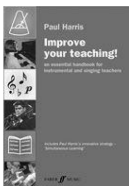

# สัปดาห์ที่ 7 — การสอนบทเรียนเดี่ยว: Simultaneous Learning และการปรับตามผู้เรียน

**วันเรียน:** 14 ก.ย. 2026 · **ส่งงาน:** 19 ก.ย. 2026 ภายใน 23:59 · ช่องทางตามที่ผู้สอนประกาศ

สัปดาห์นี้เราฝึก **ออกแบบบทเรียนเดี่ยวที่เชื่อมหลายด้านจากท่อนเพลงเดียว** โดยแยกให้ชัดว่าอะไรคือ **สิ่งที่หนังสือกล่าว** และอะไรคือ **คำถามหรือตัวอย่างของครู** เราจะใช้ Simultaneous Learning ร่วมกับ Four Ps และการเตรียมแบบ proactive ไม่ใช่แค่รอแก้จากห้อง 1

---

> *วันนี้เราไม่ได้มา “ไล่แก้ทีละห้องจาก bar one” แต่จะฝึกดึง **ingredients** จากท่อนสั้น 8 ห้อง แล้วเชื่อมไปจังหวะ เสียง เทคนิค ทฤษฎี หรือการด้นอย่างมีจุด เราจะเปรียบเทียบแผนแบบ **เตรียมก่อน (prepare)** กับแผนแบบ **ตอบสนองเมื่อเกิด (respond)** และเชื่อม Four Ps ให้บทเรียนไม่กระจัดกระจาย เมื่อจบคาบ คุณจะไม่เพียงพูดว่า “สอน scale แล้วสอนชิ้น” แต่จะวาดแผนที่การเชื่อมได้อย่างน้อย 4 ingredients และอธิบายได้ว่าจะปรับเมื่อผู้เรียนตอบต่างจากที่คาด*

---

## ครูตัดสินใจเรื่องใดบ้างในบทเรียนเดี่ยว 20–30 นาที?

เมื่อมีท่อนเพลงสั้น ๆ เราแยก **“กิจกรรมที่เชื่อมกับชิ้น”** ออกจาก **“กิจกรรมสุ่มที่ผู้เรียนมองไม่เห็นความเกี่ยวข้อง”** ได้อย่างไร?

**หลังคาบนี้ คุณจะทำได้ 3 อย่าง**
1. อธิบาย Simultaneous Learning อย่างน้อย 2 หลัก (เชื่อมทุกอย่าง / สอนจาก ingredients / proactive)  
2. เชื่อม Four Ps กับ ingredients ของท่อน 8 ห้อง  
3. วาด connected-lesson map พร้อมแผน prepare กับ respond

---

## ตัวอย่างกรณีศึกษา

ก่อนเรียนคำศัพท์ ให้เริ่มจากสถานการณ์ที่ครูพบได้จริง เราจะกลับมาที่ปูนในทุกขั้น

> **ตัวอย่างเดินเรื่อง (ครูสมมติให้ — ไม่ใช่ข้ออ้างจากหนังสือ):**  
> **ปูน** เรียนแซกโซโฟน นำชิ้นใหม่มา 8 ห้องแรก (ยังไม่เคยเล่นทั้งชิ้นในคาบ)  
> ครูคนหนึ่งเปิดโน้ตทันที เริ่มห้อง 1 แก้ทีละจุดเมื่อผิด — ปูนตึงขึ้นเรื่อย ๆ  
> ครูอีกคนยังไม่เปิดโน้ต แต่ตั้งชีพจรของชิ้น ดึง key, รูปจังหวะ, dynamic, character ออกมา แล้วให้ call-and-response / ปรบ / ด้นสั้น ๆ จาก ingredients เหล่านั้น ก่อนค่อยเปิดโน้ต  
> ทั้งสองคน “สอนชิ้นเดียวกัน” แต่โครงบทเรียนต่างกัน: หนึ่งแบบ **bar one / reactive** อีกแบบแบบ **ingredients / proactive**

คุณไม่ต้องสอนแซกเหมือนปูน เลือกท่อน 8 ห้องและเครื่องของ **คุณเอง** ได้ แต่ใช้วิธีคิดชุดเดียวกัน

**สองเครื่องมือของสัปดาห์นี้ทำงานคู่กัน:** Simultaneous Learning บอกว่าจะ **เชื่อมและเตรียมจาก ingredients อย่างไร** · Four Ps + ทฤษฎี–ปฏิบัติ บอกว่าจะ **ครอบคลุมด้านใดและทำไมต้องลงมือจริง**

---

## เครื่องมือที่ 1: Simultaneous Learning

ถ้าไม่มีกรอบนี้ ครูจะมีแต่ “เล่นชิ้น → แก้ผิด → เล่นใหม่” — ผู้เรียนไม่เห็นภาพรวมของดนตรี

**ที่มา:** Paul Harris, *Improve Your Teaching!* — Chapter 2 Simultaneous Learning; *The Virtuoso Teacher* — Simultaneous Learning (overview)

> **สิ่งที่หนังสือกล่าว (SOURCE CLAIM · W7-A):** Simultaneous Learning ขับเคลื่อนด้วยหลักสำคัญ ได้แก่  
> (1) **Everything connects** — สมองเข้าใจผ่านการเชื่อม; ชิ้นเพลงอยู่ตรงกลางของแบบจำลอง และ aural/theory ควรแทรกซึมการสอนตลอด  
> (2) **Teach from the ingredients** — ดึง ingredients ของชิ้น (เช่น key, รูปจังหวะ, เครื่องหมาย, character ฯลฯ) แล้วสำรวจ ผสม และใส่กลับชิ้นเมื่อเข้าใจแล้ว  
> (3) **Teach proactively rather than reactively** — ไม่รอให้ผู้เรียนเล่นแล้วค่อยแก้เป็นหลัก; ตั้งวาระด้วยกิจกรรมที่ทำได้และเชื่อมกันต่อเนื่อง  
> หนังสือเตือนแบบ **“bar one” teaching**: เปิดโน้ตที่ห้อง 1 แล้วเดินหน้าจนสะดุดแล้วค่อยแก้ ซึ่งมักสร้างความตึงเครียด และเสนอทางเลือก: **อย่าเพิ่งเปิดโน้ต** ในบทเรียนแรกของชิ้น แล้วสอนจาก ingredients แทน  
> *The Virtuoso Teacher* ย้ำว่าถ้าสอนจังหวะในชิ้นหนึ่งแล้วผู้เรียนทำไม่ได้เมื่อเจอในอีกชิ้น แสดงว่ายังสอนไม่ถึงขั้นถ่ายโอน

**อ่านสิ่งที่หนังสือกล่าวแบบภาษาง่าย:** ชิ้นเป็นศูนย์กลาง · ดึงส่วนประกอบมาเล่น/ฟัง/ด้นก่อน · เตรียมให้พร้อมแทนการไล่แก้จากห้องแรกเป็นนิสัย

| หลัก | หมายถึงอะไรโดยย่อ | คำถามที่ครูมักใช้ |
|---|---|---|
| **Everything connects** | ทุกด้านของดนตรีโยงกัน; ต้องทำให้ผู้เรียนเห็นการเชื่อม | กิจกรรมนี้โยงกับชิ้นตรงไหน? |
| **Ingredients** | ส่วนประกอบของชิ้น (key, rhythm, marking, character ฯลฯ) | วันนี้ดึง ingredients ใดอย่างน้อย 4 อย่าง? |
| **Proactive** | ตั้งวาระและเตรียมก่อนที่ความผิดจะกลายเป็นนิสัย | ฉันเตรียมอะไรไว้ก่อนเปิดโน้ต? |
| **Bar one teaching** | เริ่มห้อง 1 แล้วแก้เมื่อพลาดเป็นโครงหลัก | ตอนนี้ฉันกำลัง “รอพลาด” หรือ “เตรียมความสำเร็จ”? |

**ตัวอย่างการสอนเครื่องลม** — *ตัวอย่าง/คำแนะนำของครู — ไม่ใช่ข้ออ้างจากหนังสือ*

- ตั้ง pulse ของชิ้นก่อนคุยโน้ต  
- call-and-response ใน key ของชิ้น 2 ห้อง  
- ปรบรูปจังหวะสำคัญ แล้วค่อยเป่าบนโน้ตเดียว  
- ด้น 4 ห้องด้วย character เดียวกับชิ้น  

> **คำถามของครู (ใช้ทั้งชั้น):** ถ้าคุณมีเวลา 10 นาทีก่อนเปิดโน้ต คุณจะเตรียม ingredients ใดก่อนเป็นอันดับแรก — pulse, key, rhythm pattern, หรือ character?

> 📌 “คำถามของครู” เป็นคำถามสังเกตของรายวิชา **ไม่ใช่** ใบสั่งเทคนิค embouchure จาก Harris

**กลับมาที่ปูน:** ครูคนที่สองใช้ Simultaneous Learning เพราะตั้งวาระจาก ingredients และลดโอกาสสะดุดซ้ำแบบ bar one

*เครดิต: Paul Harris, The Virtuoso Teacher / Improve Your Teaching imagery ใน source vault; ใช้เพื่อการเรียนการสอน*

---

## เครื่องมือที่ 2: Four Ps + ingredients ที่เชื่อม และทฤษฎี–ปฏิบัติ

### ส่วนนี้คืออะไร

Simultaneous Learning บอกให้เชื่อม — แต่ครูยังต้องมีกรอบว่าจะ **ฟัง/ดูด้านใด** และต้อง **เอาแนวคิดไปใช้จริง** ไม่ใช่จำชื่ออย่างเดียว

### สืบค้นข้อมูลมาจากไหน?

| ชั้น | มาจากไหน | หมายเหตุ |
|---|---|---|
| **สิ่งที่หนังสือกล่าว (Four Ps / บทเรียน)** | Harris, *The Virtuoso Teacher* — Four Ps; lesson planning / Simultaneous Learning | ล็อกด้านล่าง |
| **สิ่งที่หนังสือกล่าว (ทฤษฎี–ปฏิบัติ)** | McClellan, *The Psychology of Teaching and Learning Music* — Putting Theory into Practice | ล็อกด้านล่าง |
| **แผนที่บทเรียนของปูน** | ออกแบบโดยรายวิชา | **ไม่ใช่** ข้อความจากหนังสือ |

> **สิ่งที่หนังสือกล่าว (SOURCE CLAIM · W7-B):**  
> **Four Ps** — Posture, Pulse, Phonology, Personality — เป็นกรอบโครงสร้างที่ขับเคลื่อนบทเรียนที่ดีทุกระดับ; ถ้าทุกบทเรียนมีกิจกรรมที่เชื่อมกับแต่ละด้าน จะช่วยพัฒนาผู้เรียนอย่างต่อเนื่อง  
> **Putting Theory into Practice** — ควรยอมรับว่าทฤษฎีกับการปฏิบัติพันกัน; ทฤษฎีมีประโยชน์เมื่อตั้งชื่อแนวคิดแล้วเอาไปคิด อภิปราย และจำจากประสบการณ์; **ไม่มีทฤษฎีโดยปราศจากการปฏิบัติ และไม่มีการปฏิบัติโดยปราศจากทฤษฎี** — ถ้าไม่นำ belief/policy/procedure ไปใช้ ทฤษฎีจะไร้ความหมาย; การนำแนวคิดไปปฏิบัติช่วยพัฒนา reasoning และการตัดสินใจของครูดนตรี

**อ่านสิ่งที่หนังสือกล่าวแบบภาษาง่าย:** ใช้ Four Ps เป็นเข็มทิศด้านที่ต้องแตะ · Simultaneous Learning เป็นวิธีเชื่อม · ทฤษฎีที่ไม่ลงมือ = ยังไม่เป็นการเรียนรู้ของครู

### Simultaneous Learning กับ Four Ps ทำงานร่วมกันอย่างไร

- **W7-A** บอกว่าจะ **ดึง ingredients และเชื่อม** อย่างไร (proactive)  
- **W7-B** บอกว่าจะ **ครอบคลุมด้าน Posture/Pulse/Phonology/Personality** และทำไมต้องแปลงแนวคิดเป็นแผนจริง  

ถ้ามีแค่ ingredients โดยไม่แตะ Four Ps บทเรียนอาจเน้นโน้ตแต่ไม่แตะเสียง/จังหวะ/เจตนา  
ถ้ามีแค่ชื่อ Four Ps โดยไม่เชื่อมกับชิ้น กิจกรรมจะกลายเป็นช่อง ๆ แยกส่วนแบบที่ Harris เตือน

### โครงเขียนงาน: Ingredient map / Prepare / Respond

รายวิชาใช้โครงนี้ **เป็นชื่อที่รายวิชาสร้าง — ไม่ใช่ชื่อบทในหนังสือ**

- **Ingredient map:** จาก 8 ห้อง ดึง ≥4 ingredients แล้วโยงแต่ละอันไปกิจกรรม + P ที่เกี่ยวข้อง  
- **Prepare:** สิ่งที่จะทำ **ก่อน** ให้เล่นทั้งท่อน/ก่อนเปิดโน้ต  
- **Respond:** สิ่งที่จะทำ **เมื่อ** ผู้เรียนตอบต่างจากที่คาด (ยัง proactive ได้ — ไม่จำเป็นต้องกลับไป bar one)

### ติดตามปูน: จาก 8 ห้องสู่แผนที่เชื่อม

1. **อ่าน/เล่นในใจ 8 ห้อง** — ลิสต์ ingredients: G major, 3/4, รูปจังหวะ X, *mp–f*, character “laid-back”, slur ข้ามทะเบียน ฯลฯ  
2. **Map ≥4 อย่าง** — เช่น Pulse↔Pulse P; รูปจังหวะ↔aural; key↔scale/improvisation; character↔Personality  
3. **Prepare (10 นาทีแรก)** — pulse games → call-and-response ใน G → ปรบรูปจังหวะ → ด้นสั้นใน character  
4. **เปิดโน้ต** — ให้ปูนชี้ “ingredients ที่เพิ่งทำ” บนหน้าโน้ต  
5. **Respond** — ถ้า slur ข้ามทะเบียนสะดุด: ไม่ไล่จากห้อง 1 ทั้งท่อน แต่แยก ingredient เทคนิค + aural แล้วใส่กลับ

**กฎภาษาที่ใช้ทั้งคาบ**
- ขึ้นต้นด้วย **“ฉันได้ยิน/เห็น…”** ก่อนตัดสิน  
- แยก **แผนเตรียม** กับ **แผนตอบสนอง**  
- อธิบายการเชื่อมเป็นประโยค: “เพราะ ingredient A เชื่อมกับ B ฉันจึง…”  

### ตารางช่วยเขียน (ใช้ส่งงาน)

| ส่วน | ทำอะไร | ตัวอย่างของปูน |
|---|---|---|
| **8 ห้อง** | ระบุท่อน/ชิ้น/เครื่อง | 8 ห้องแรก ชิ้น jazzy แซก |
| **≥4 ingredients** | ลิสต์และโยงกิจกรรม | key G; 3/4; swing quavers; *f/mp/p*; cool character |
| **Four Ps** | แตะอย่างน้อย 2–4 ด้านในแผน | Pulse + Phonology + Personality (+ Posture ถ้าเกี่ยวกับ) |
| **Prepare** | ลำดับก่อนเปิดโน้ต | pulse → echo ใน key → ปรบ rhythm → ด้น character |
| **Respond** | 1–2 สถานการณ์ปรับ | ถ้า dynamic หาย → แยก ingredient dynamic แล้วใส่กลับ |

> 📌 Ingredient map / Prepare / Respond = **โครงรายวิชา**

---

## งานของนิสิต งานที่ 7

**ชื่องาน:** Connected-lesson map: 8 ห้อง · ≥4 ingredients · Prepare vs Respond  
ทุกคนทำโครงเดียวกัน ความต่างมาจาก **ท่อนเพลง + เครื่องของคุณ**

เขียนแผนที่บทเรียน **1 หน้า** (หรือเทียบเท่าตารางชัดเจน 1 หน้า) ที่แสดงการเชื่อม ingredients กับกิจกรรม และแยกแผนเตรียมกับแผนตอบสนอง

> **ไม่ให้คะแนน** ความไพเราะของการสาธิตหรือยอดวิว — วัด **การเชื่อม การเตรียม และการปรับ**  
> **ไม่ต้องโพสต์สาธารณะ**

### ทำตามขั้นตอนนี้

1. **เลือกท่อน 8 ห้อง** จาก repertoire ของเครื่องตนเอง (จริงหรือสมมติที่ใช้โน้ตจริงได้)  
2. **ลิสต์ ingredients อย่างน้อย 4** (key/tonality, rhythm, articulation/dynamic, character, technical issue ฯลฯ)  
3. **วาด map** โยงแต่ละ ingredient → กิจกรรมสั้น → ด้าน Four Ps ที่เกี่ยวข้อง  
4. **เขียน Prepare plan** — ลำดับ 5–10 นาทีแรก (ยังไม่จำเป็นต้องเล่นทั้ง 8 ห้อง)  
5. **เขียน Respond plan** — อย่างน้อย 2 สถานการณ์ที่ผู้เรียนอาจตอบต่าง และคุณจะปรับอย่างไรโดยยังเชื่อม ingredients  
6. **อ้างรหัส:** Simultaneous Learning → `W7-A` · Four Ps / theory–practice → `W7-B`

### โครงเอกสาร 1 หน้า

| ส่วน | สิ่งที่ต้องมี |
|---|---|
| 1. ท่อน 8 ห้อง | ชิ้น/เครื่อง/จุดเริ่ม–จบ |
| 2. Ingredient map | ≥4 ingredients + กิจกรรม + P |
| 3. Prepare | ลำดับก่อน/ระหว่างเปิดโน้ต |
| 4. Respond | 2 สถานการณ์ปรับ |
| 5. รหัส | `W7-A · W7-B` |

**การส่งงาน:** PDF/DOCX หรือฟอร์มตามที่ผู้สอนประกาศ

---

## ตัวอย่างข้อความ — ของปูน

> **ตัวอย่างของปูน (อ้าง W7-A, W7-B)**  
> *ตัวอย่าง/คำแนะนำของครู — ไม่ใช่ข้ออ้างจากหนังสือ*

> **ท่อน —** 8 ห้องแรก ชิ้นสไตล์ jazzy แซก (สมมติ)  
>
> **Ingredients (≥4) —** (1) G major (2) 3/4 pulse (3) รูปจังหวะหลักของท่อน (4) dynamic *f/mp/p* (5) character laid-back  
>
> **Map —** pulse → ปรบ/เมโทรนอมเบา (Pulse) · G major → call-and-response 2 ห้อง (Phonology/aural) · รูปจังหวะ → ปรบแล้วเป่าโน้ตเดียว (Pulse + Phonology) · character → ด้น 4 ห้อง “cool” (Personality) · dynamic → เล่น scale สั้นสลับ *f/p* (Phonology)  
>
> **Prepare —** 1) ตั้ง 3/4 2) warm-up ใน G 3) echo รูปจังหวะ 4) ด้น character 5) ค่อยเปิดโน้ตให้ชี้ ingredients  
>
> **Respond —** (ก) ถ้าปูนรีบจังหวะ: กลับ ingredient pulse + ปรบเปล่า ไม่ไล่ bar one ทั้งท่อน (ข) ถ้า character หายเมื่อเปิดโน้ต: ปิดโน้ต 1 นาที ด้น character แล้วกลับท่อน  
>
> **รหัส:** W7-A · W7-B

---

## ถ้าคุณเป็นครูของปูน

*ตัวอย่างการสอนของครู — เป็นคำแนะนำของครู ไม่ใช่ข้ออ้างจากหนังสือ*

อย่าเพิ่งพูดว่า “ทำไมไม่ฝึกมา”

1. ถาม ingredients ที่ปูนเห็นใน 8 ห้อง — ให้ปูนพูดก่อน  
2. เลือก 2–3 ingredients สำหรับ 10 นาทีแรก ไม่ต้องครบทุกอย่างในคาบเดียว  
3. อธิบายการเชื่อมทุกครั้งที่เปลี่ยนกิจกรรม: “เราทำสิ่งนี้เพราะมันอยู่ในชิ้นตรง…”  
4. เปิดโน้ตเมื่อ ingredients หลักเริ่มคุ้น  
5. ถ้าสะดุด: แยก ingredient ไม่ใช่ตำหนิทั้งคน

### ข้อเสนอแนะจากเพื่อน (peer feedback) ในชั้น

- **สังเกต 1 ข้อ:** “ฉันเห็นการเชื่อมจาก ingredient … ไปกิจกรรม … ชัด”  
- **คำถามเพื่อพัฒนา 1 ข้อ:** “ถ้าผู้เรียนลืมหนังสือ แผน Prepare ของคุณยังใช้ได้หรือไม่?”

---

## แผนการสอน 120 นาที (วันเรียน 14 ก.ย.)

| เวลา | กิจกรรม | หลักฐานในชั้น |
| --- | --- | --- |
| **0–15** | Retrieval sound-before-symbol → เล่าปูน bar one vs ingredients | เลือกแนวที่ตนมักใช้ |
| **15–35** | อ่าน SOURCE CLAIM W7-A; ลิสต์ ingredients จากท่อนสาธิต 8 ห้อง | ลิสต์ ≥4 |
| **35–55** | W7-B: Four Ps + Putting Theory into Practice; โยง P กับ ingredients | ตาราง map ร่าง |
| **55–85** | ร่าง P7: map + Prepare + Respond | ร่าง 1 หน้า |
| **85–105** | Micro-teach คู่: 4 นาที Prepare (ไม่ต้องสมบูรณ์) + feedback | บันทึก peer |
| **105–120** | บัตรสะท้อนคิด: “เมื่อไหร่ฉัน proactive / เมื่อไหร่ฉัน reactive” | บัตรสะท้อนคิด |

---

## สิ่งที่ส่ง · กำหนดส่ง · เกณฑ์คะแนน

| รายการ | รายละเอียด |
|---|---|
| แผนที่ 1 หน้า | 8 ห้อง · ≥4 ingredients · Prepare · Respond |
| รหัสแหล่งความรู้ | `W7-A` · `W7-B` |
| **วันส่ง** | **19 ก.ย. 2026 ภายใน 23:59** |
| **ช่องทาง** | ตามที่ผู้สอนประกาศ |

กติกา: นับวันถัดจากวันเรียนเป็นวันที่ 1 ส่งภายใน 23:59 ของวันที่ 5

### เกณฑ์การให้คะแนน (100)

| ด้าน | คะแนน |
|---|---|
| **Simultaneous Learning (W7-A)** — เชื่อมจาก ingredients; แยก proactive/prepare จาก bar-one reactive | 35 |
| **Four Ps + ingredients (W7-B)** — map ≥4 ingredients และโยง P/กิจกรรมสอดคล้อง | 30 |
| **Respond plan** — ปรับได้เมื่อผู้เรียนต่างจากที่คาด โดยไม่ทิ้งการเชื่อม | 25 |
| **ภาษาและขอบเขต** — อ้างรหัส; ไม่โพสต์สาธารณะ; ไม่เติมเทคนิคเครื่องที่ source ไม่ได้กล่าว | 10 |

> วัดวิธีคิดเชิงการสอน — ไม่ใช่ความถูกต้องของการ “วินิจฉัยผู้เรียนจริง”

### งานศึกษาด้วยตนเอง (~6 ชม.)

1. อ่าน Harris, *Improve Your Teaching!* — Chapter 2 Simultaneous Learning (everything connects; ingredients; bar one)  
2. อ่าน Harris, *The Virtuoso Teacher* — Four Ps; Simultaneous Learning overview / lesson planning  
3. อ่าน McClellan — Putting Theory into Practice (สั้น ๆ)  
4. ทำ P7 ให้ครบ แล้วส่งภายใน 19 ก.ย. 2026 23:59  

**ตรวจตนเองก่อนส่ง**
- [ ] ท่อน 8 ห้องชัด  
- [ ] ingredients ≥4 และมี map  
- [ ] มี Prepare และ Respond  
- [ ] โยง Four Ps อย่างน้อยบางด้าน  
- [ ] อ้าง `W7-A` · `W7-B`  
- [ ] ไม่โพสต์สาธารณะ  

---

## อภิธานศัพท์ (อ้างอิงท้ายหน้า)

| ศัพท์ | ความหมายสั้น |
|---|---|
| Simultaneous Learning | แนวสอนที่เชื่อมกิจกรรมจาก ingredients อย่าง proactive |
| Ingredients | ส่วนประกอบของชิ้น (key, rhythm, marking, character ฯลฯ) |
| Bar one teaching | เริ่มห้อง 1 แล้วแก้เมื่อพลาดเป็นโครงหลัก |
| Proactive / Reactive | ตั้งวาระเตรียม / รอตอบสนองต่อความผิดเป็นหลัก |
| Four Ps | Posture, Pulse, Phonology, Personality |
| Posture | ท่าทาง ร่างกาย การถือเครื่อง |
| Pulse | ชีพจรจังหวะ |
| Phonology | การควบคุมเสียงและการฟัง |
| Personality | บุคลิก/เจตนาทางดนตรี |
| Theory–practice | การนำแนวคิดไปใช้จริงจน reasoning ของครูพัฒนา |

---

## เชื่อมไปสัปดาห์ถัดไป

หลังส่งงาน จะทบทวนว่าแผนที่เชื่อมและ Prepare/Respond ใช้ได้จริงหรือไม่ แล้วจึงไปหัวข้อสัปดาห์ที่ 8: จากบทเรียนเดี่ยวสู่การซ้อมกลุ่ม/sectional การแก้ error ในวง และ TPACK (เลือกเทคโนโลยีหลังมีเป้าหมายทางดนตรี)

---

## References

- Paul Harris, *Improve Your Teaching!* — Chapter 2 Simultaneous Learning (everything connects; ingredients; bar one teaching; preparation)
- Paul Harris, *The Virtuoso Teacher* — Four Ps; Simultaneous Learning principles; lesson planning notes
- Edward R. McClellan, *The Psychology of Teaching and Learning Music* — Putting Theory into Practice

## Image credits

- virtuoso-teaching.png — Paul Harris, The Virtuoso Teacher / Improve Your Teaching imagery in source vault; for teaching use
