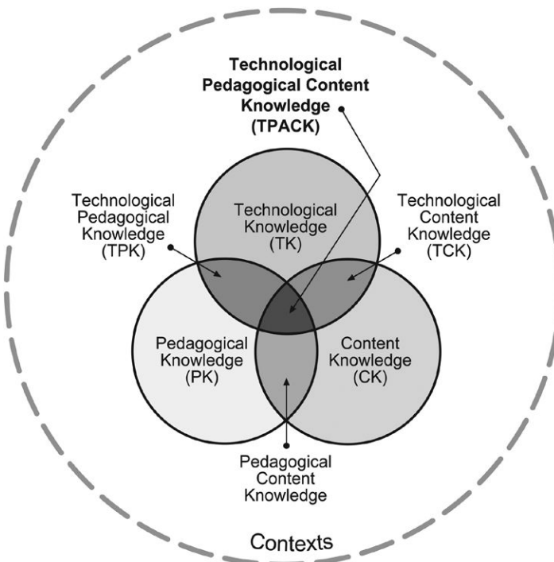

# สัปดาห์ที่ 8 — จากบทเรียนเดี่ยวสู่การสอนกลุ่ม: การซ้อมวง เทคโนโลยี และการเตรียมเข้าสู่การสอนเฉพาะเครื่อง

**วันเรียน:** 21 ก.ย. 2026 · **ส่งงาน:** 26 ก.ย. 2026 ภายใน 23:59 · ช่องทางตามที่ผู้สอนประกาศ

สัปดาห์นี้เราฝึก **วางแผน sectional/กลุ่ม 20 นาที** และ **ตัดสินใจเทคโนโลยีด้วย TPACK** โดยแยกให้ชัดว่าอะไรคือ **สิ่งที่หนังสือกล่าว** และอะไรคือ **คำถามหรือตัวอย่างของครู** ไฟล์นี้ **ไม่กำหนดเครื่องเฉพาะ** และยังไม่ใช่สัปดาห์สอนเทคนิคฟลูต/โอโบ ฯลฯ — เป็นสะพานเข้าสู่การสอนเฉพาะเครื่องในสัปดาห์ถัดไป

---

> *วันนี้เราไม่ได้มา “ซ้อมจนครบทุกห้อง” แต่จะฝึกคิดแบบครูวง: ตั้งวัตถุประสงค์กลุ่ม วางจังหวะเวลา (pacing) ทำนาย error ที่พบบ่อย เลือกลำดับแก้ และตรวจว่าการแก้ **ถ่ายโอน** กลับทั้งท่อนได้ จากนั้นประเมินเครื่องมือเทคโนโลยีด้วย **TPACK** — เป้าหมายทางดนตรีและวิธีสอนมาก่อน เครื่องมือทีหลัง — พร้อมทางเลือกที่ไม่มีเทคโนโลยี เมื่อจบคาบ คุณจะมีแผน sectional 20 นาทีและคำตัดสินใจเทคโนโลยีที่อธิบายเหตุผลได้*

---

## ครูตัดสินใจเรื่องใดบ้างเมื่อมีผู้เรียนหลายคน?

เมื่อวงเล่นแล้ว “ไม่เข้า” เราแยก **“สิ่งที่ได้ยินจริงจากกลุ่ม”** ออกจาก **“การหยุดพูดยาวโดยไม่มีวัตถุประสงค์”** ได้อย่างไร?

**หลังคาบนี้ คุณจะทำได้ 3 อย่าง**
1. วางแผนซ้อมกลุ่ม/sectional ที่มีวัตถุประสงค์ pacing ลำดับแก้ error และตัวตรวจ transfer  
2. ประเมินตัวเลือกเทคโนโลยีด้วย TPACK (content–pedagogy–technology)  
3. เสนอทางเลือกที่ไม่ใช้เทคโนโลยีสำหรับเป้าหมายเดียวกัน

---

## ตัวอย่างกรณีศึกษา

ก่อนเรียนคำศัพท์ ให้เริ่มจากสถานการณ์ที่พบได้ในโรงเรียน เราจะกลับมาที่กิ๊ฟในทุกขั้น

> **ตัวอย่างเดินเรื่อง (ครูสมมติให้ — ไม่ใช่ข้ออ้างจากหนังสือ):**  
> **กิ๊ฟ** เป็นครูช่วยซ้อม **sectional เครื่องลมไม้** 20 นาที สำหรับท่อน 8–16 ของชิ้นวง  
> ได้ยินว่าจังหวะห้อง 12 ไม่ตรง balance ระหว่างคลาริเน็ตกับฟลูตเอียง และปลายประโยคเพลงปล่อยเสียงไม่พร้อม  
> ครูคนหนึ่งเปิดแอปเมโทรนอมดังทั้ง sectional แล้วให้เล่นซ้ำจากต้นท่อนทุกครั้งที่ผิด  
> ครูอีกคนตั้งวัตถุประสงค์ 1 ข้อก่อน (“ปลายประโยคเพลงห้อง 14–16 ปล่อยพร้อมและ balance ได้ยินแนวล่าง”) แบ่งนาที ทำนาย error 3 จุด กำหนดลำดับแก้ และมีแผนตรวจ transfer — จากนั้นค่อยถามว่าจะใช้เครื่องบันทึกเสียงช่วยฟัง balance หรือใช้การสลับที่นั่ง/ให้ผู้เรียนชี้ใครดังเกินแทน  
> ทั้งสองคน “ซ้อมท่อนเดียวกัน” แต่หนึ่งเริ่มที่เครื่องมือ อีกหนึ่งเริ่มที่ **เป้าหมายทางดนตรี + ลำดับการสอน**

คุณไม่ต้องซ้อมคลาริเน็ตเหมือนกิ๊ฟ เลือก ensemble excerpt และกลุ่มของ **คุณเอง** ได้ แต่ใช้วิธีคิดชุดเดียวกัน

**สองเครื่องมือของสัปดาห์นี้ทำงานคู่กัน:** แผนซ้อม/ลำดับแก้ error บอกว่าจะ **จัดการกลุ่มอย่างไร** · TPACK บอกว่าจะ **เลือกหรือไม่เลือกเทคโนโลยีอย่างไร**

---

## เครื่องมือที่ 1: วางแผนซ้อมและลำดับแก้ error

ถ้าไม่มีกรอบนี้ ครูจะหยุดพูดบ่อย แต่ผู้เรียนไม่รู้ว่าวันนี้สำเร็จเมื่อไหร่

**ที่มา:** Colwell & Hewitt, *The Teaching of Instrumental Music* — Chapter 27 Planning for and Rehearsing Instrumental Ensembles

> **สิ่งที่หนังสือกล่าว (SOURCE CLAIM · W8-A):** ผู้สอนควร **วางแผนการซ้อม** ให้ชัด รวมประเภท/ระดับของวัตถุประสงค์และขั้นตอน แล้ว **ทำตามแผน**; หลังซ้อมให้ทบทวน สะท้อน และประเมิน (การบันทึกเสียง/วิดีโอเพื่อประเมินตนเองมีคุณค่า)  
> อย่างน้อย **20% แรก** ของเวลาซ้อมควรเน้นกิจกรรมพื้นฐานของ musicianship (tone, breath support, intonation, technique, phrasing ฯลฯ) — “warm-up” ไม่ใช่แค่ร่างกาย แต่รวมการเตรียมการฟังและการคิด  
> **Pacing:** วางแผนเกือบทุกส่วนเป็นนาที; **ไม่ควร** ทำงานกับ section เดียวเกินไม่กี่นาทีจนคนอื่นเบื่อ; หลายจุดแก้ได้ด้วยการเล่นซ้ำหลังให้สัญญาณแบบไม่พูด (สีหน้า/ท่าทาง) แทนการหยุดพูดยาว  
> เมื่อ drill ท่อน: เปลี่ยน **องค์ประกอบทางดนตรีทีละอย่าง** เพื่อไม่ให้ข้อมูลล้น; ก่อนหยุดวง ครูควรคิดแล้วว่าจะพูดอะไร  
> การแก้ error ที่ส่งเสริม **musical independence** ควรดึงผู้เรียนร่วมระบุปัญหาและหาทางแก้ ไม่ใช่แค่สั่งแก้เร็วแล้วจบ; sectional ช่วยให้ได้ยิน error ชัดกว่าซ้อมใหญ่ทั้งวงเสมอ  
> การแนะนำชิ้นใหม่มักเดินแบบ **synthesis–analysis–synthesis** (ภาพรวม → วิเคราะห์/drill → ภาพรวม); หนังสือเตือนว่า rehearsal **ไม่ใช่** เวลาซ้อมส่วนบุคคลแทนการฝึกที่บ้าน

**อ่านสิ่งที่หนังสือกล่าวแบบภาษาง่าย:** มีเป้า มีนาที มีลำดับแก้ · อย่าค้าง section เดียว · เปลี่ยนทีละอย่าง · ตรวจว่ากลุ่มและบุคคลเข้าใจ · ซ้อมวง ≠ ซ้อมแทนที่บ้าน

| คำ | หมายถึงอะไรโดยย่อ | คำถามที่ครูมักใช้ |
|---|---|---|
| **Objective** | สิ่งที่กลุ่มทำได้/ได้ยินได้เมื่อจบช่วง | วันนี้สำเร็จเมื่อได้ยินอะไร? |
| **Pacing** | การแบ่งและเคลื่อนเวลาซ้อม | นาทีนี้ใครทำอะไร? คนอื่นทำอะไรระหว่างรอ? |
| **Error sequence** | ลำดับตรวจจับ → ตัดสินใจหยุดหรือไม่ → แก้สั้นสุด → ตรวจซ้ำ | ฉันหยุดเพราะอะไร และจะรู้ได้อย่างไรว่าแก้แล้ว? |
| **Transfer check** | ตรวจว่าการแก้ยังอยู่เมื่อกลับท่อน/บริบทเต็ม | เล่นทั้งประโยคเพลงแล้วยังอยู่หรือไม่? |
| **Sectional** | ซ้อมกลุ่มย่อย | error ใดได้ยินชัดในกลุ่มย่อยกว่าวงใหญ่? |

**ตัวอย่างการสอนกลุ่มลม** — *ตัวอย่าง/คำแนะนำของครู — ไม่ใช่ข้ออ้างจากหนังสือ*

- เขียนเป้า 1 ประโยคบนกระดานก่อนจับเครื่อง  
- ทำนาย 3 errors: จังหวะห้อง 12; balance; release ปลายประโยคเพลง  
- ลำดับแก้: ปรบจังหวะเปล่า → เป่าช้าทีละอย่าง → ใส่กลับความเร็ว → เล่นทั้งท่อนตรวจ transfer  
- ระหว่างแก้ฟลูต 15 วินาที: ให้คลาริเน็ต audiation/ปรบ pattern เดียวกัน  

> **คำถามของครู (ใช้ทั้งชั้น):** ก่อนหยุดวง คุณคิดประโยคที่จะพูดจบหรือยัง — และผู้เรียนจะได้ลองใหม่ภายในกี่วินาที?

> 📌 “คำถามของครู” เป็นคำถามสังเกตของรายวิชา **ไม่ใช่** คู่มือเทคนิคเฉพาะเครื่องจาก Colwell บทเครื่อง

**กลับมาที่กิ๊ฟ:** ครูคนที่สองมี objective + pacing + error sequence + transfer check ก่อนเลือกแอป — จึงยังควบคุมการเรียนรู้ได้แม้ไม่มีเทคโนโลยี

---

## เครื่องมือที่ 2: TPACK — เนื้อหาก่อนเครื่องมือ

### ส่วนนี้คืออะไร

เมื่อมีแผนซ้อมแล้ว ขั้นต่อไปคือถามว่า **จะใช้เทคโนโลยีช่วยเป้าหมายนั้นหรือไม่** โดยไม่เริ่มจากแอปแล้วค่อยหาเหตุผล

### สืบค้นข้อมูลมาจากไหน?

| ชั้น | มาจากไหน | หมายเหตุ |
|---|---|---|
| **สิ่งที่หนังสือกล่าว** | Bauer, *Music Learning Today* — Chapter 1 TPACK | ล็อกด้านล่าง |
| **แผนของกิ๊ฟ / ทางเลือก non-tech** | ออกแบบโดยรายวิชา | **ไม่ใช่** ข้อความจากหนังสือ |

> **สิ่งที่หนังสือกล่าว (SOURCE CLAIM · W8-B):** **TPACK** (Technological Pedagogical and Content Knowledge) ขยายจาก pedagogical content knowledge โดยเพิ่ม technology knowledge; ความรู้ด้าน content, pedagogy และ technology **ทับซ้อนและมีผลต่อกัน** ในบริบทการสอนจริง  
> ในแบบจำลองนี้ เทคโนโลยีถูกมองเป็น **เครื่องมือที่รับใช้การเรียนรู้เนื้อหา** ครูต้องพิจารณา **affordances** (สิ่งที่เครื่องมือเอื้อ) และ **constraints** (ข้อจำกัด) ว่าเหมาะสมและช่วยให้ถึงผลลัพธ์หลักสูตรหรือไม่  
> **ไม่มีทางแก้เทคโนโลยีเดียว** ที่เหมาะกับทุกครู ทุกโรงเรียน ทุกห้อง ทุกผู้เรียน — ต้องคิดอย่างรอบคอบว่า content, pedagogy และ technology ทำงานร่วมกันอย่างไรในบริบทนั้น  
> หลายแนวที่เน้น “เครื่องมือก่อน” มักล้มเหลว เพราะครูใช้เทคโนโลยีได้แต่ยังขาด pedagogy ที่เหมาะกับเนื้อหา

**อ่านสิ่งที่หนังสือกล่าวแบบภาษาง่าย:** ตั้งเป้าหมายทางดนตรีและวิธีสอนก่อน · ค่อยเลือกเครื่องมือ · เสมอมีคำถาม “ถ้าไม่มีเครื่องนี้จะสอนอย่างไร”

*เครดิต: Bauer, Music Learning Today, Figure 1.1 Technological Pedagogical and Content Knowledge; Reproduced by permission of the publisher, © 2013 http://www.matt-koehler.com/tpack/using-the-tpack-image/ ; source vault image; ใช้เพื่อการเรียนการสอน*

### แผนซ้อมกับ TPACK ทำงานร่วมกันอย่างไร

- **W8-A** บอกว่าจะ **วางเป้า pacing แก้ error และ transfer** อย่างไร  
- **W8-B** บอกว่าจะ **ตัดสินใจเทคโนโลยีหลังมี content + pedagogy** อย่างไร  

ถ้ามีแค่แอปโดยไม่มีเป้า ครูจะกดปุ่มเก่งแต่ผู้เรียนไม่รู้ว่าเก่งขึ้นด้านใด  
ถ้ามีแค่แผนซ้อมโดยไม่คิด affordances/constraints ครูอาจพึ่งเครื่องมือที่ไม่จำเป็นหรือเข้าไม่ถึงทุกคน

### โครงเขียนงาน: Plan / Fix / Tech

รายวิชาใช้โครงนี้ **เป็นชื่อรายวิชา — ไม่ใช่ชื่อบทในหนังสือ**

- **Plan:** วัตถุประสงค์ + นาที + error ที่คาด 3 จุด  
- **Fix:** ลำดับแก้แต่ละจุด + วิธีตรวจ transfer  
- **Tech:** การตัดสินใจ TPACK 1 รายการ + ทางเลือก non-tech + เหตุผลรับ/ปรับ/ไม่ใช้

### ติดตามกิ๊ฟ: 20 นาที sectional

| นาที | กิจกรรม (ตัวอย่างครู) | หลักฐาน |
|---:|---|---|
| 0–3 | เป้า 1 ข้อ + ฟังท่อนครั้งที่ 1 | ผู้เรียนพูดเป้าซ้ำได้ |
| 3–7 | แก้ error จังหวะ: ปรบ → เป่า | จังหวะห้อง 12 ตรงขึ้น |
| 7–12 | แก้ balance: ใครได้ยินแนวล่าง? | ปรับดัง-เบาได้ยิน |
| 12–16 | แก้ release ปลายประโยคเพลง | ปล่อยพร้อม |
| 16–20 | เล่นทั้งท่อน = transfer check (+ บันทึกถ้าใช้ tech) | เทียบกับเป้า |

**กฎภาษาที่ใช้ทั้งคาบ**
- ขึ้นต้นด้วย **“ฉันได้ยินจากกลุ่มว่า…”**  
- แยก **content outcome** ออกจาก **ชื่อแอป**  
- ทุกครั้งที่เสนอ tech ต้องมี **non-tech alternative**  

> 📌 Plan / Fix / Tech = **โครงรายวิชา**

---

## งานของนิสิต งานที่ 8

**ชื่องาน:** Sectional 20 นาที + การตัดสินใจ TPACK 1 รายการ (มีทางเลือก non-tech)  
ทุกคนทำโครงเดียวกัน ความต่างมาจาก **ท่อนวง + กลุ่มเครื่องของคุณ**

เขียนแผน **1–2 หน้า** (กระชับ) สำหรับ sectional ลม/ทองเหลืองผสมหรือกลุ่มที่คุณจะเจอจริง

> **ไม่ให้คะแนน** ความแพงของเทคโนโลยีหรือความสวยของสไลด์ — วัด **เหตุผลการซ้อมและเหตุผลการเลือก/ไม่เลือกเครื่องมือ**  
> **ไม่ต้องโพสต์สาธารณะ**

### ทำตามขั้นตอนนี้

1. **เลือก passage 1 ท่อน** สำหรับ sectional ลม/ทองเหลือง (หรือกลุ่มที่ระบุชัด)  
2. **เขียน objective 1–2 ข้อ** ที่สังเกต/ได้ยินได้เมื่อครบ 20 นาที  
3. **แบ่งนาที (pacing)** ทั้ง 20 นาที  
4. **ทำนาย errors 3 จุด** ที่คาดว่าจะเจอ  
5. **เขียน correction sequence** ต่อ error แต่ละจุด และ **วิธีตรวจ transfer**  
6. **ตัดสินใจเทคโนโลยี 1 รายการ** ผ่าน TPACK: content คืออะไร · pedagogy คืออะไร · tech คืออะไร · affordance/constraint · ทางเลือก non-tech · สรุป รับ / ปรับ / ไม่ใช้  
7. **อ้างรหัส:** แผนซ้อม/แก้ error → `W8-A` · TPACK → `W8-B`

### โครงเอกสาร

| ส่วน | สิ่งที่ต้องมี |
|---|---|
| 1. บริบท | กลุ่ม / ท่อน / เวลา 20 นาที |
| 2. Objective + pacing | เป้า + ตารางนาที |
| 3. 3 errors + sequences + transfer | ลำดับแก้และตรวจ |
| 4. TPACK decision | 1 tech + non-tech alternative |
| 5. รหัส | `W8-A · W8-B` |

**การส่งงาน:** PDF/DOCX หรือฟอร์มตามที่ผู้สอนประกาศ

---

## ตัวอย่างข้อความ — ของกิ๊ฟ

> **ตัวอย่างของกิ๊ฟ (อ้าง W8-A, W8-B)**  
> *ตัวอย่าง/คำแนะนำของครู — ไม่ใช่ข้ออ้างจากหนังสือ*

> **บริบท —** sectional ลมไม้ 20 นาที ท่อนห้อง 8–16  
>
> **Objective —** เมื่อจบ 20 นาที กลุ่มเล่นห้อง 14–16 แล้ว **ปล่อยปลายประโยคเพลงพร้อม** และ **ได้ยินแนวต่ำชัดขึ้น** ขณะจังหวะห้อง 12 ตรงกับ pulse ที่ตกลง  
>
> **Pacing —** 0–3 เป้า+ฟัง · 3–7 จังหวะ · 7–12 balance · 12–16 release · 16–20 ทั้งท่อน  
>
> **Errors + fix —** (1) จังหวะ 12: ปรบเปล่า → เป่าช้า → ใส่ความเร็ว (2) balance: ให้ผู้เรียนชี้ใครกลบแนวล่าง → ปรับทีละชั้น (3) release: นับในใจ+สัญญาณมือ → เล่นเฉพาะ cadence  
>
> **Transfer —** เล่นทั้ง 8–16 โดยไม่หยุด; ถ้า error กลับมา ระบุว่าขั้น fix ใดยังไม่ถ่ายโอน  
>
> **TPACK —** *Content:* balance ใน cadence · *Pedagogy:* ให้ผู้เรียนฟังและปรับ แล้วตรวจทั้งท่อน · *Tech ที่พิจารณา:* เครื่องบันทึกเสียงสั้นเพื่อฟังซ้ำ · *Affordance:* ได้ยิน balance ซ้ำได้ · *Constraint:* ใช้เวลาเซ็ตอัพ/อาจโฟกัสหน้าจอ · *Non-tech:* สลับให้ผู้เรียนยืนฟังด้านหลังกลุ่ม 1 รอบ · *สรุป:* ใช้บันทึก **เฉพาะ** นาที 16–20 ถ้าเวลาเซ็ตอัพ ≤30 วินาที; ไม่เช่นนั้นใช้ non-tech  
>
> **รหัส:** W8-A · W8-B

---

## ถ้าคุณเป็นครูของ sectional นี้

*ตัวอย่างการสอนของครู — เป็นคำแนะนำของครู ไม่ใช่ข้ออ้างจากหนังสือ*

อย่าเพิ่งพูดว่า “ทำไมไม่ฝึกมาเป็นส่วนตัว”

1. ตั้งเป้าที่ได้ยินได้ 1 ข้อ  
2. ทำนาย error ก่อนจับเครื่อง  
3. เปลี่ยนองค์ประกอบทีละอย่างตอน drill  
4. ตรวจ transfer ด้วยการเล่นทั้งท่อน  
5. เลือก tech หลังมี content + pedagogy และมีทางเลือก non-tech พร้อม

### ข้อเสนอแนะจากเพื่อน (peer feedback) ในชั้น

- **สังเกต 1 ข้อ:** “ฉันเห็นว่า pacing ของคุณเผื่อ transfer ตรงนาที…”  
- **คำถามเพื่อพัฒนา 1 ข้อ:** “ถ้าไฟดับและไม่มีโทรศัพท์ แผน TPACK ของคุณเหลืออะไร?”

---

## แผนการสอน 120 นาที (วันเรียน 21 ก.ย.)

| เวลา | กิจกรรม | หลักฐานในชั้น |
| --- | --- | --- |
| **0–15** | Retrieval จากบทเรียนเดี่ยว → เล่ากิ๊ฟ: เครื่องมือก่อน vs เป้าก่อน | เลือกแนว + เหตุผล |
| **15–40** | อ่าน SOURCE CLAIM W8-A; วิเคราะห์คลิป/สคริปต์ซ้อมสั้น (หรือสาธิตสด) ด้วย checklist pacing/error | checklist กรอก |
| **40–60** | อ่าน W8-B TPACK + ดู Figure 1.1; แยก CK/PK/TK ในตัวอย่าง | ตาราง 3 วงกลมสั้น |
| **60–90** | ร่าง P8: แผน 20 นาที + 3 errors + TPACK 1 ข้อ | ร่างแผน |
| **90–110** | กลุ่มย่อย: นำเสนอการตัดสินใจ tech 90 วินาที + non-tech alternative; เพื่อนถาม 1 คำถาม | บันทึกตัดสินใจ |
| **110–120** | สะพานเข้า Weeks 9–15: สิ่งที่ยังไม่ใช่เทคนิคเฉพาะเครื่อง / สิ่งที่จะส่งต่อผู้เชี่ยวชาญเครื่อง | บัตรสะท้อนคิด |

---

## สิ่งที่ส่ง · กำหนดส่ง · เกณฑ์คะแนน

| รายการ | รายละเอียด |
|---|---|
| แผน sectional 20 นาที | objective · pacing · 3 errors · sequences · transfer |
| TPACK decision | 1 tech + non-tech alternative + เหตุผล |
| รหัสแหล่งความรู้ | `W8-A` · `W8-B` |
| **วันส่ง** | **26 ก.ย. 2026 ภายใน 23:59** |
| **ช่องทาง** | ตามที่ผู้สอนประกาศ |

กติกา: นับวันถัดจากวันเรียนเป็นวันที่ 1 ส่งภายใน 23:59 ของวันที่ 5

### เกณฑ์การให้คะแนน (100)

| ด้าน | คะแนน |
|---|---|
| **Rehearsal plan (W8-A)** — เป้าชัด pacing เป็นนาที ลำดับแก้และ transfer ใช้ได้ | 40 |
| **TPACK (W8-B)** — content ก่อน tool; มี affordance/constraint และ non-tech alternative | 35 |
| **เหตุผลและขอบเขต** — แยก observation/assumption; อ้างรหัส; ไม่โพสต์สาธารณะ; ไม่ลงเทคนิคเฉพาะเครื่องเกินขอบสัปดาห์ | 25 |

> วัดเหตุผลการสอน — ไม่ใช่ความทันสมัยของแอป

### งานศึกษาด้วยตนเอง (~6 ชม.)

1. อ่าน Colwell & Hewitt — Chapter 27 (Rehearsal planning, pacing, rehearsing concert literature, musical independence, tone/balance/blend ตามที่เกี่ยว)  
2. อ่าน Bauer, *Music Learning Today* — Chapter 1 TPACK (และทบทวนบริบท Figure 1.1)  
3. อ่านเสริมได้: Harris เรื่อง group teaching ถ้ามีใน vault — ใช้เป็นมุมมองเพิ่ม ไม่แทน W8-A/B  
4. ทำ P8 ให้ครบ แล้วส่งภายใน 26 ก.ย. 2026 23:59  

**ตรวจตนเองก่อนส่ง**
- [ ] แผน 20 นาทีมีนาทีครบ  
- [ ] มี error 3 จุด + ลำดับแก้ + transfer  
- [ ] TPACK 1 ข้อมี non-tech alternative  
- [ ] อ้าง `W8-A` · `W8-B`  
- [ ] ไม่โพสต์สาธารณะ  
- [ ] ไม่ใช้สัปดาห์นี้แทนบทเฉพาะเครื่อง (Weeks 9+)  

---

## อภิธานศัพท์ (อ้างอิงท้ายหน้า)

| ศัพท์ | ความหมายสั้น |
|---|---|
| Sectional | ซ้อมกลุ่มย่อยตาม section |
| Pacing | การจัดและเคลื่อนเวลาซ้อม |
| Transfer check | ตรวจว่าการแก้ยังอยู่เมื่อกลับบริบทเต็ม |
| Musical independence | ผู้เรียนวิเคราะห์และตัดสินใจทางดนตรีได้มากขึ้น |
| Synthesis–analysis–synthesis | ภาพรวม → วิเคราะห์ → ภาพรวม |
| TPACK | ความรู้ที่ตัดกันของ technology, pedagogy, content |
| Content knowledge (CK) | ความรู้เนื้อหาทางดนตรี |
| Pedagogical knowledge (PK) | ความรู้วิธีสอนและการเรียนรู้ |
| Technology knowledge (TK) | ความรู้เครื่องมือเทคโนโลยี |
| Affordance / Constraint | สิ่งที่เครื่องมือเอื้อ / จำกัด |
| Balance / Blend | สัดส่วนดังระหว่างแนว / การกลมกลืนของเสียง |

---

## เชื่อมไปสัปดาห์ถัดไป

หลังส่งงาน รายวิชาจะส่งต่อสู่ **สัปดาห์ที่ 9 เป็นต้นไป (Module 2)** เริ่มด้วยฟลูต + พื้นฐานสรีรวิทยา/ท่าทาง/ประชากรพิเศษ แล้วต่อลิ้นคู่ ลิ้นเดี่ยว และ brass — เทคนิคเฉพาะเครื่องอยู่นอกขอบ Weeks 1–8 ใช้หลักจากสัปดาห์นี้เป็นกรอบ: **เป้าและหลักฐานก่อน · เครื่องมือและการแก้เป็นลำดับ · เทคโนโลยีรับใช้เนื้อหา**

---

## References

- Richard J. Colwell & Michael P. Hewitt, *The Teaching of Instrumental Music* — Chapter 27 Planning for and Rehearsing Instrumental Ensembles (planning, pacing, daily routines, rehearsing literature, musical independence, tone/balance/blend)
- William I. Bauer, *Music Learning Today* — Chapter 1 Technological Pedagogical and Content Knowledge (TPACK); Figure 1.1
- Paul Harris, *The Virtuoso Teacher* — group teaching notes (optional bridge only)

## Image credits

- tpack.png — Bauer, *Music Learning Today*, Figure 1.1 Technological Pedagogical and Content Knowledge; Reproduced by permission of the publisher, © 2013 http://www.matt-koehler.com/tpack/using-the-tpack-image/
