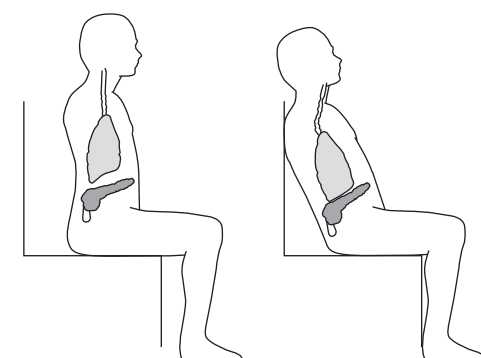

# สัปดาห์ที่ 9 — เปิดบล็อกเครื่องลมไม้: หายใจ ท่าทาง ความรับผิดชอบต่อผู้เรียน และเสียงแรกบนฟลูต

**วันเรียน:** 28 ก.ย. 2026 · **ส่งงาน:** 3 ต.ค. 2026 ภายใน 23:59 · ช่องทางตามที่ผู้สอนประกาศ

สัปดาห์นี้เปิด **Module 2 (การสอนเฉพาะเครื่อง)** ด้วยเครื่องที่ไม่มีลิ้น (no-reed) คือฟลูต พร้อมวางฐานร่วมเรื่องสรีรวิทยา ท่าทาง การหายใจ และขอบเขตความสามารถของครูก่อนลงรายละเอียดเครื่องอื่น เราจะแยกให้ชัดว่าอะไรคือ **สิ่งที่หนังสือกล่าว** และอะไรคือ **คำถามหรือตัวอย่างของครู** รวมถึง **การถ่ายโอน (transfer)** จากฟลูตไปยังเครื่องของตน

---

> *วันนี้เราไม่ได้มาตัดสินว่าใครเป่าฟลูตได้ไพเราะที่สุด แต่จะฝึกวางลำดับบทเรียนแรก: ทำไมต้องเริ่มจากร่างกาย ลม และความปลอดภัยก่อนโน้ต และทำไมฟลูตที่เป็นเครื่องไม่มีลิ้นจึงเป็นจุดเข้าที่ชัดสำหรับสอนทิศทางลมและช่องปาก เราจะใช้หลักจาก Colwell & Hewitt เรื่องประชากรพิเศษ สรีรวิทยา หลักการเครื่องลม และฟลูต แล้วแต่ละคนจะออกแบบแผน micro-teach 3–5 นาทีเรื่องเสียงแรก หรือเขียนบันทึกถ่ายโอนหากไม่ได้เล่นฟลูต เมื่อจบคาบ คุณจะอธิบายได้ว่าจะเริ่ม first tone อย่างไร อ้างหลักใด และขอบเขตของครูอยู่ตรงไหน*

---

## ครูตัดสินใจเรื่องใดบ้างเมื่อเปิดบทเรียนแรกของเครื่องลม?

เมื่อเห็นผู้เริ่มต้น เราแยก **“สิ่งที่ได้ยิน/เห็นจริง”** ออกจาก **“สิ่งที่เราคิดว่าเป็นสาเหตุ”** อย่างไร และเมื่อไหร่ที่ต้องส่งต่อผู้เชี่ยวชาญด้านสุขภาพ?

**หลังคาบนี้ คุณจะทำได้ 3 อย่าง**
1. อธิบายหลักสรีรวิทยา ท่าทาง และการหายใจร่วมของเครื่องลมจากหนังสือ พร้อมขอบเขตความรับผิดชอบของครูต่อผู้เรียนที่หลากหลาย  
2. จัดลำดับ first-tone บนฟลูต (หรือหัว joint) โดยเน้นเสียงก่อนสัญลักษณ์ และระบุจุดสังเกตที่ตรวจสอบได้  
3. เขียนแผน micro-teach 3–5 นาที หรือบันทึกถ่ายโอนไปยังเครื่องของตน พร้อมอ้างรหัส `W9-A` และ `W9-B`

---

## ตัวอย่างกรณีศึกษา

ก่อนเรียนคำศัพท์ ให้เริ่มจากสถานการณ์ที่ครูพบได้จริง เราจะกลับมาที่มิ้นท์ทุกขั้นของบทเรียน

> **ตัวอย่างเดินเรื่อง (ครูสมมติให้ — ไม่ใช่ข้ออ้างจากหนังสือ):**  
> **มิ้นท์** เป็นนักเรียนชั้นม.1 วันแรกของฟลูต เธอได้เครื่องครบและอยาก “เล่นเพลงเร็ว” ทันที  
> ครูเห็นว่ามิ้นท์ก้มหัวลงหาเครื่อง ไหล่ยก และเป่าแรงจนเวียนหัวหลังได้เสียงลมยาว ๆ แต่ยังไม่มี pitch ชัด  
> ครูคนหนึ่งพูดว่า “ต้องตั้งโน้ตและตารางนิ้วก่อน”  
> ครูอีกคนถามว่า “ถ้าเริ่มจากท่าทาง ลม และ head joint อย่างเดียว มิ้นท์จะได้ยินคุณภาพเสียงชัดขึ้นหรือไม่ และถ้าเธอรายงานว่าปวดคอ เราทำอะไรได้บ้างโดยไม่วินิจฉัยโรค”  
> ทั้งสองคนเห็นเหตุการณ์เดียวกัน แต่ลำดับการสอนต่างกัน

คุณไม่ต้องเล่นฟลูตเหมือนมิ้นท์ เลือกเครื่องและสถานการณ์ของ **คุณเอง** ได้ แต่ใช้วิธีคิดชุดเดียวกัน: **ร่างกายและลมก่อนสัญลักษณ์ · สังเกตก่อนสรุป · ขอบเขตก่อนวินิจฉัย**

**สองเครื่องมือของสัปดาห์นี้ทำงานคู่กัน:** W9-A บอกว่าจะ **วางฐานร่างกาย ลม และความรับผิดชอบ** อย่างไร · W9-B บอกว่าจะ **เปิด first tone บนฟลูตและถ่ายโอน** อย่างไร

---

## เครื่องมือที่ 1: ฐานร่างกาย ลม และขอบเขตครู (W9-A)

ถ้าไม่มีกรอบนี้ ครูจะรีบลงนิ้วและโน้ต — แล้วแก้ embouchure ยากภายหลัง

### สืบค้นข้อมูลมาจากไหน?

| ชั้น | มาจากไหน | หมายเหตุ |
|---|---|---|
| **สิ่งที่หนังสือกล่าว** | Colwell & Hewitt, *The Teaching of Instrumental Music* — Chapter 8 (Special Populations); Chapter 9 (Physiology); Chapter 10 (Principles of Winds — breathing / posture) | ล็อกเป็น SOURCE CLAIM ด้านล่าง — ห้ามแต่งเพิ่ม |
| **โครงเขียน ตัวอย่างมิ้นท์ และคำถามชั้น** | ออกแบบโดยรายวิชา (คำถาม/ตัวอย่างของครู) | ใช้สอนและเขียนงาน — **ไม่ใช่** ข้อความจากหนังสือ |

> **สิ่งที่หนังสือกล่าว (SOURCE CLAIM · W9-A · เลือกหลักที่ล็อกใช้ในชั้น):**  
> 1. **ขอบเขตสุขภาพ (Ch. 9):** ข้อมูลในบทสรีรวิทยา **ไม่ใช่** การรักษาความเจ็บปวด เน้นกิจกรรมป้องกัน; หากนักเรียนมีอาการปวด ครูควรส่งต่อไปยังบุคลากรสุขภาพของโรงเรียนก่อน และหากจำเป็นให้ส่งต่อไปยังแพทย์ผู้เชี่ยวชาญ  
> 2. **ท่าทาง (Ch. 9–10):** ท่าทางที่ดีเป็นกุญแจสำคัญในการลดปัญหากล้ามเนื้อ เส้นประสาท และเอ็น; ท่าทางที่ดีคือท่าที่สบาย ศีรษะตั้ง คางเข้า หลังแบน และเชิงกรานตรง — ไม่ใช่ท่า “อกผายไหล่ถ่าง” แบบทหาร  
> 3. **เครื่องมาหาผู้เล่น (Ch. 10):** ตำแหน่งเล่นที่ถูกต้องของเครื่องลมทั้งหมดตั้งอยู่บนหลัก **เลื่อนเครื่องมาหาผู้เล่น** (ปากเป่า/ลิ้นมาที่ embouchure) ไม่ใช่บังคับศีรษะและไหล่ให้เข้าหาเครื่อง  
> 4. **การหายใจ (Ch. 10):** การหายใจที่เหมาะสมคือการดึงอากาศเข้าปอดให้มากพอและหายใจออกภายใต้แรงดันที่รองรับเสียง; ท่าทางที่ดีเป็นเงื่อนไขของการหายใจที่ดี; คอ ไหล่ อก และแขนต้องปราศจากความตึง  
> 5. **ปริมาณลมกับความเร็วลม (Ch. 10):** ปริมาณอากาศกำหนดระดับความดัง ส่วนความเร็วของกระแสลมกำหนด pitch; ผู้เรียนมักสับสนสองอย่างนี้  
> 6. **ประชากรพิเศษ (Ch. 8):** ครูเครื่องดนตรีควรเป็นสมาชิกทีม IEP เมื่อเกี่ยวข้อง; หลัก “zero reject” หมายความว่าประสบการณ์ที่เปิดให้นักเรียนทุกคนต้องเปิดให้นักเรียนที่มีความพิการด้วย; RTI เป็นกรอบประเมินต่อเนื่องแบบหลายระดับ; การจัดวางควรมีโอกาสพัฒนาสมรรถนะทางดนตรี ไม่ใช่เน้นผลลัพธ์ทางสังคมเพียงอย่างเดียว

**อ่านสิ่งที่หนังสือกล่าวแบบภาษาง่าย:** ก่อนสอนนิ้วและโน้ต ครูต้องตั้งร่างกาย ลม และขอบเขตความปลอดภัยให้ชัด — และถ้าสงสัยเรื่องสุขภาพ ต้องส่งต่อ ไม่ใช่วินิจฉัยเอง

| หัวข้อ | สิ่งที่ครูสังเกตได้ในชั้น | คำถามที่ช่วยตัดสินใจสอน |
|---|---|---|
| ท่าทาง | ศีรษะยื่น คอเกร็ง ไหล่ยก นั่งพิงหลังเก้าอี้จนกระดูกสันหลังงอ | ผู้เรียนเลื่อนเครื่องมาหาปาก หรือก้มไปหาเครื่อง? |
| ลม | หายใจตื้น ไหล่ยกตอนหายใจเข้า หมดลมเร็ว | กำลังเป่า “ปริมาณ” มากเกินไป หรือ “ความเร็ว” ไม่พอ? |
| ขอบเขตครู | ผู้เรียนบอกปวด เวียนหัวรุนแรง หรือมี IEP | เราปรับการสอนได้แค่ไหน และเมื่อไหร่ต้องส่งต่อ? |

**ตัวอย่างการสอนเครื่องลม** — *ตัวอย่าง/คำแนะนำของครู — ไม่ใช่ข้ออ้างจากหนังสือ*

- ถามมิ้นท์ว่า “ตอนนี้ไหล่รู้สึกอย่างไร” ก่อนแก้ embouchure  
- ให้มิ้นท์ยืนหรือนั่งตัวตรง แล้วยก head joint มาหาปาก แทนการก้มหัว  
- หากมิ้นท์รายงานปวดคอซ้ำ ครูบันทึกสิ่งที่เห็น หยุดการฝึกที่น่าสงสัย และแนะนำช่องทางสุขภาพของโรงเรียน — **ไม่วินิจฉัย**

> **คำถามของครู (ใช้ทั้งชั้น):** เมื่อผู้เริ่มต้นเวียนหัวหลังเป่าฟลูต คุณจะตรวจลำดับใดก่อน — ท่าทาง ปริมาณลมที่เป่าทิ้ง หรือการจัดวางเครื่อง — และอะไรอยู่นอกขอบเขตครู?

> 📌 “คำถามของครู” เป็นคำถามสังเกตของรายวิชา **ไม่ใช่** คำสั่งวินิจฉัยทางการแพทย์ หนังสือระบุชัดว่าบทสรีรวิทยาไม่ใช่การรักษาความเจ็บปวด

**กลับมาที่มิ้นท์:** ปัญหาที่เห็นได้ทันทีอยู่ที่ **ท่าทาง + ปริมาณลมมากเกิน** ก่อนตารางนิ้ว — จึงเลือก W9-A เป็นฐานก่อนเข้า W9-B

---

## เครื่องมือที่ 2: First tone บนฟลูต และการถ่ายโอน (W9-B)

### ส่วนนี้คืออะไร

เมื่อวางฐานร่างกายและลมแล้ว ขั้นต่อไปคือ **ลำดับเสียงแรก** บนเครื่องที่ไม่มีลิ้น เพื่อให้เห็นการแยกกระแสลมที่ขอบ embouchure hole ก่อนเข้าเรื่องลิ้นในสัปดาห์ถัดไป

### สืบค้นข้อมูลมาจากไหน?

| ชั้น | มาจากไหน | หมายเหตุ |
|---|---|---|
| **สิ่งที่หนังสือกล่าว** | Colwell & Hewitt — Chapter 10 (acoustics of flute/air); Chapter 11 (The Flute: embouchure, first tones, troubleshooting) | ล็อกเป็น SOURCE CLAIM — ห้ามแต่งเพิ่ม |
| **sound-before-symbol + transfer note** | หลัก sound-before-symbol จาก Module 1 (Week 5) นำมาใช้ใหม่; โครง transfer เป็นของรายวิชา | ต้องติดป้าย **teacher transfer** ชัดเจน |

> **สิ่งที่หนังสือกล่าว (SOURCE CLAIM · W9-B · เลือกหลักที่ล็อกใช้ในชั้น):**  
> 1. **อะคูสติกฟลูต (Ch. 10):** ขอบคมของ embouchure hole แยกกระแสลม บางส่วนเข้า head joint บางส่วนพาดผ่าน; การเพิ่มความเร็วลมร่วมกับการเปลี่ยนทิศทางเล็กน้อยทำให้ความถี่สองเท่าและเกิด partial ที่สอง (อ็อกเทฟที่สอง)  
> 2. **ไม่เล่นเหมือนขวด (Ch. 11):** หนังสือเตือนว่า *The flute is not played like a pop bottle* เพราะแนวทางนั้นมักให้เสียงกลวง  
> 3. **เริ่มจาก head joint (Ch. 11):** ผู้เริ่มต้นควรเริ่มบน head joint อย่างเดียว เพื่อโฟกัส embouchure และลดอาการเวียนหัว; ปิดปลาย head joint ด้วยฝ่ามือขวา แล้วเป่าให้ได้ A (ช่องว่างที่ 2) และเมื่อเปิดมือจะได้ A สูงขึ้นหนึ่งอ็อกเทฟ  
> 4. **รูป embouchure เริ่มต้น (Ch. 11):** ริมฝีปากล่างคลุมประมาณหนึ่งในสี่ถึงหนึ่งในสามของ embouchure hole; มุมปากดึงเข้าเล็กน้อย; ช่องเปิดควรเป็นวงรีเล็ก ไม่กว้างเกินความกว้างของ embouchure hole; หลีกเลี่ยงพยางค์ที่ทำให้ปากย่นมากเกินไป (หนังสือแนะนำแนว “pee” สำหรับเริ่มต้น และเตือนไม่ให้กลายเป็นนิสัยอัตโนมัติ)  
> 5. **ปริมาณลมกับความเร็ว (Ch. 11):** ผู้เริ่มต้นมักเป่าลมมากเกินจนเวียนหัวและสิ้นเปลือง; ควรโฟกัสกระแสลมและแยก “เป่ามากกว่า” ออกจาก “เป่าเร็วกว่า”  
> 6. **คุณภาพเสียง (Ch. 11):** เสียงดีพึ่งพาเครื่องดี การหายใจ/การรองรับลม ท่าทาง embouchure ที่ถูกต้อง และภาพในใจของเสียงที่ต้องการ; ลมหายใจเร็วหมดเป็นปัญหาสากลของผู้เริ่มต้นฟลูต  
> 7. **ปัญหาเสียงลม (troubleshooting, Ch. 11):** เสียง breathy อาจมาจากกระแสลมไม่ตรงกลาง ช่องเปิดใหญ่เกินไป การรองรับลมไม่พอ หรือคลุมรูมาก/น้อยเกินไป

**อ่านสิ่งที่หนังสือกล่าวแบบภาษาง่าย:** เริ่มจาก head joint หาจุดแยกลมที่ได้ pitch ชัด ก่อนใส่ตัวเครื่องและตารางนิ้ว — และให้ผู้เรียนได้ยินคุณภาพเสียงเป็นหลักฐาน

### ลำดับ first-tone ที่รายวิชาใช้ในชั้น (ผูกกับหนังสือ + ป้าย transfer)

รายวิชาจัดลำดับดังนี้เพื่อใช้ใน micro-teach **โครงลำดับ 1–5 เป็นการจัดของรายวิชา** โดยแต่ละขั้นอิง SOURCE CLAIM ข้างบน

1. **ตรวจท่าทางและเลื่อนเครื่องมาหาปาก** (W9-A)  
2. **head joint อย่างเดียว** — ปิด/เปิดปลายมือ ฟัง A สองระดับ (W9-B)  
3. **โฟกัสช่องเปิดและทิศทางลม** — ฟังว่าเสียงลมลดลงและ pitch ชัดขึ้นหรือไม่ (W9-B)  
4. **พักเมื่อเวียนหัว** — หนังสือระบุว่าผู้เริ่มต้นควรรู้ว่าหยุดพักได้ (W9-B)  
5. **ยังไม่เปิด fingering chart** ใน micro-teach 3–5 นาทีนี้ — *teacher decision: sound before symbol* (หลักจาก Module 1 นำมาใช้ใหม่ ไม่ใช่ประโยคจาก Ch. 11)

### การถ่ายโอน (teacher transfer — ต้องติดป้าย)

> **คำถามถ่ายโอนของครู (ไม่ใช่ข้อความจากหนังสือ):**  
> ถ้าคุณไม่ได้เล่นฟลูต คุณจะยืมอะไรจากลำดับนี้ไปสอนเครื่องของคุณได้บ้าง  
> - ยืมได้: เครื่องมาหาผู้เล่น · แยกปริมาณลมกับความเร็ว · เสียงก่อนตารางนิ้ว · สังเกต breathy/thin แบบมีหลักฐาน  
> - ต้องเปลี่ยน: รูป embouchure เฉพาะเครื่อง · การมี/ไม่มีลิ้น · จุด first pitch ที่ต่างกัน

**ติดตามมิ้นท์: จากลมเปล่าสู่ pitch**

1. **สังเกต (O)** — “มิ้นท์ก้มหัว ไหล่ยก เป่าแรง ได้เสียงลมยาว ~4 วินาที ยังไม่มี pitch ชัด แล้วบอกว่าเวียนหัว”  
2. **ตีความ (I)** — “อาจเป่าปริมาณลมมากและยังไม่โฟกัสขอบ embouchure hole” *(สมมติฐาน)*  
3. **ทดลองตัวแปรเดียว** — ให้ยก head joint มาหาปาก ลดปริมาณลม โฟกัสช่องเปิดเล็ก แล้วฟังอีกครั้ง  
4. **หลักฐาน (E)** — เทียบไฟล์/การเล่นรอบ 1 กับรอบ 2 ว่ามี pitch ชัดขึ้นหรือเสียงลมลดลงตรงช่วงใด  
5. **ปรับแก้ (R)** — เลือกสิ่งที่จะทำครั้งหน้า 1 ข้อ (เช่น คง head joint อีก 2 นาทีก่อนใส่ตัวเครื่อง)

**กฎภาษาที่ใช้ทั้งคาบ**
- ขึ้นต้นด้วย **“ฉันได้ยิน / ฉันเห็น…”** ก่อน  
- ค่อยตามด้วย **“ฉันคิดว่า…”** และต้องมีจุดในเสียงหรือร่างกายรองรับ  
- **ไม่วินิจฉัยโรค** — ใช้ภาษา “อาจเกี่ยวข้องกับท่าทาง/ลม” และระบุเมื่อต้องส่งต่อ  
- **ความเชื่อ** = สิ่งในหัวเรา · **หลักฐาน** = สิ่งที่เปิดฟัง/ดูตามได้  

### ตารางช่วยเขียน (ใช้ส่งงาน)

| ขั้น | ทำอะไร | ตัวอย่างภาษา (ทั่วไป) | ตัวอย่างของมิ้นท์ |
|---|---|---|---|
| **O สังเกต** | บันทึกสิ่งที่ได้ยิน/เห็นจริง | “ได้เสียงลม ไม่มี pitch ชัด 3 วินาทีแรก” | “ก้มหัว ไหล่ยก เวียนหัวหลังเป่า” |
| **I ตีความ** | สมมติฐานการสอน | “อาจช่องเปิดกว้างและเป่าปริมาณมาก” | “ยังไม่โฟกัสขอบ embouchure hole” |
| **ลำดับสอน** | 3–5 ขั้นสั้น | “ท่าทาง → head joint → โฟกัสลม” | ตามลำดับรายวิชาด้านบน |
| **E หลักฐาน** | ชี้จุดเทียบก่อน–หลัง | “รอบ 2 มี pitch ชัดที่วินาที 1–2” | “เสียงลมลดลงเมื่อช่องเปิดเล็กลง” |
| **Transfer** | เปลี่ยนอะไรบนเครื่องตน | “บนคลาริเน็ตต้องเพิ่มเรื่อง reed” | ระบุ 1 อย่างที่ยืม / 1 อย่างที่เปลี่ยน |
| **ขอบเขต** | สุขภาพ/ส่งต่อ | “ถ้ารายงานปวดคอซ้ำ จะส่งต่อ” | บันทึกในแผน |

> 📌 โครง O / ลำดับ / Transfer = **โครงของรายวิชา** — ไม่ได้อ้างว่าหนังสือตั้งชื่อนี้ไว้

*เครดิต: Colwell & Hewitt, The Teaching of Instrumental Music, Figure 10–2 Proper Posture While Playing; source vault image; ใช้เพื่อการเรียนการสอน*

---

## งานของนิสิต งานที่ 9

**ชื่องาน:** แผน micro-teach เสียงแรก · 3–5 นาที · 1 หลักฐาน · 1 บันทึกถ่ายโอน  
ทุกคนทำโครงเดียวกัน ความต่างมาจาก **บทบาท (ผู้สอนฟลูต / ผู้สังเกต)** และ **เครื่องของคุณ** ไม่ใช่จากใบงานคนละชุด

> **ไม่ให้คะแนน** ความไพเราะของเสียงหรือความสวยของการสาธิต — วัด **ลำดับการสอน ภาษาวินิจฉัยเชิงการสอน และเหตุผลถ่ายโอน**  
> **ทางเลือกความเป็นส่วนตัว:** สอน micro-teach ต่อหน้าผู้สอนเป็นการส่วนตัว หรือส่งไฟล์เสียง/วิดีโอแทนการสาธิตทั้งชั้น ได้คะแนนเท่ากัน

### ทำตามขั้นตอนนี้

1. **เลือกบทบาท**  
   - **ผู้เล่นฟลูต (in focus):** วางแผนและ (ถ้าสะดวก) สาธิต first tone 3–5 นาที  
   - **ผู้สังเกต (นอก family):** เขียนแผน first tone บนฟลูตจากหลักหนังสือ + บันทึกถ่ายโอนไปเครื่องตน  
2. **เขียนเป้าหมาย 1 ประโยค** ที่สังเกตได้ (เช่น “ผู้เรียนสร้าง pitch บน head joint ได้โดยไม่เวียนหัวจนต้องหยุดทันที”)  
3. **ลำดับ 3–5 ขั้น** อ้าง `W9-A` (ท่าทาง/ลม/ขอบเขต) และ `W9-B` (head joint / โฟกัสลม)  
4. **ระบุตัวแปรเดียว** ที่จะฟังเป็นหลักฐานก่อน–หลัง  
5. **เขียนประโยคครู 2–3 ประโยค** ที่ไม่ตัดสิน “เสียงสวย/ไม่สวย”  
6. **Transfer note (ทุกคน):** 1 ย่อหน้า — อะไรที่ยืมได้ / อะไรที่ต้องเปลี่ยนบนเครื่องของตน (ติดป้าย *teacher transfer*)  
7. **ขอบเขตสุขภาพ 1 ประโยค** ในแผน (ส่งต่อเมื่อใด)  
8. **Privacy opt-in:** ระบุว่าจะสาธิตในชั้น / ส่วนตัวกับผู้สอน / ส่งเสียงอย่างเดียว

### โครงเอกสารส่ง (1–2 หน้า)

| ส่วน | สิ่งที่ต้องมี |
|---|---|
| 1. บทบาทและผู้เรียนสมมติ | ฟลูตเริ่มต้น / บริบทสั้น |
| 2. เป้าหมายที่สังเกตได้ | 1 ประโยค |
| 3. ลำดับ 3–5 ขั้น | ผูก W9-A / W9-B |
| 4. ภาษาครู | 2–3 ประโยค ไม่ตัดสิน |
| 5. หลักฐานก่อน–หลัง | 1 ตัวแปร |
| 6. Transfer note | ยืม 1 + เปลี่ยน 1 |
| 7. ขอบเขตสุขภาพ | 1 ประโยค |
| 8. รหัส | `W9-A · W9-B` |
| 9. ช่องทางสาธิต | ในชั้น / ส่วนตัว / เสียง |

**การส่งงาน:** ส่งไฟล์ PDF/DOCX และไฟล์เสียงหรือวิดีโอ (ถ้ามี) ตามช่องทางที่ผู้สอนประกาศก่อนวันส่ง

---

## ตัวอย่างข้อความ — ของมิ้นท์

> **ตัวอย่างแผนสั้น (อ้าง W9-A, W9-B)**  
> *ตัวอย่าง/คำแนะนำของครู — ไม่ใช่ข้ออ้างจากหนังสือ*

> **เป้าหมาย —** มิ้นท์สร้าง pitch บน head joint (ปิดปลาย) ได้ยาวอย่างน้อย 2 วินาที โดยไม่ก้มหัวไปหาเครื่อง  
>
> **ลำดับ —** (1) ตรวจท่านั่ง เท้าแนบพื้น เลื่อน head joint มาหาปาก (W9-A) (2) รูปปากแนว “mmm” แล้วเป่าสั้น ๆ ฟังว่ามี pitch หรือมีแต่ลม (W9-B) (3) ลดปริมาณลม โฟกัสช่องเปิดเล็ก เทียบรอบ 2 (W9-B) (4) หากเวียนหัว ให้หยุดและหายใจตามสบาย — ไม่เร่งต่อ (W9-B)  
>
> **ภาษาครู —** “ฉันได้ยินเสียงลมยาวในรอบแรก ยังไม่ชัดว่ามี pitch รอบนี้ลองคงช่องเปิดเล็กและเป่าเบาลง แล้วเราจะฟังช่วง 2 วินาทีแรกด้วยกัน”  
>
> **Transfer (สำหรับผู้เล่นคลาริเน็ต) —** *teacher transfer:* ยืมหลักเครื่องมาหาผู้เล่นและการแยกปริมาณ/ความเร็วลมได้ แต่ต้องเพิ่มการตรวจ reed และมุมเครื่อง ซึ่งฟลูตไม่มี  
>
> **ขอบเขต —** ถ้ามิ้นท์รายงานปวดคอหรือเวียนหัวรุนแรงซ้ำ จะหยุดการฝึกที่เกี่ยวข้องและแนะนำให้พบบุคลากรสุขภาพของโรงเรียน  
>
> **รหัส:** W9-A · W9-B

---

## ถ้าคุณเป็นครูของมิ้นท์

*ตัวอย่างการสอนของครู — เป็นคำแนะนำของครู ไม่ใช่ข้ออ้างจากหนังสือ*

อย่าเพิ่งพูดว่า “ลมไม่ดี / ปากผิด / เป่าไม่ได้”

1. บอกสิ่งที่เห็น/ได้ยิน — *“ฉันเห็นว่าหัวก้มลง และได้ยินเสียงลมก่อน pitch”*  
2. เปลี่ยนตัวแปรเดียว — เลื่อนเครื่องมาหาปาก หรือลดปริมาณลม  
3. ให้ผู้เรียนเป็นคนบอกว่าอะไรเปลี่ยน  
4. ยังไม่เปิดตารางนิ้วใน 5 นาทีแรก  
5. หากมีอาการปวด — บันทึก ส่งต่อ ไม่วินิจฉัย

### ข้อเสนอแนะจากเพื่อน (peer feedback) ในชั้น

เพื่อน 2 คนฟัง/ดู micro-teach แล้วพูดแบบนี้ (ไม่ใช้ “ดี/ไม่ดี”):

- **สังเกต 1 ข้อ:** “ฉันได้ยิน/เห็นว่าลำดับขั้น… ชัดตรง…”  
- **คำถามเพื่อพัฒนา 1 ข้อ:** “ถ้าตัดคำสั่งภายในร่างกาย 1 คำ แล้วชี้ไปที่เสียงแทน คุณจะพูดว่าอย่างไร?”

---

## แผนการสอน 120 นาที (วันเรียน 28 ก.ย. 2026 · รูปแบบ specialist)

| เวลา | กิจกรรม | หลักฐานในชั้น |
| --- | --- | --- |
| **0:00–0:10** | Retrieval: ท่าทาง ลม ขอบเขตครู (5 คำถามสั้นจาก W8/Module 1) | บัตรคำตอบสั้น |
| **0:10–0:40** | Foundational lecture: W9-A (Ch. 8–10) แยก SOURCE / ตัวอย่างครู | ตาราง W9-A |
| **0:40–1:10** | Guided demonstration: first tone บนฟลูต/head joint (W9-B) ผู้สอนบรรยายการตัดสินใจสอนแบบ real time | observation note |
| **1:10–1:20** | พัก | — |
| **1:20–1:50** | Micro-teach workshop: ผู้เล่นฟลูตสอน 3–5 นาที; คนอื่น annotate + เริ่ม transfer note | ร่างแผน / คลิปสั้น |
| **1:50–2:00** | Transfer note + สะพานไป double reed: “เมื่อมีลิ้น อะไรจะเปลี่ยนเป็นอย่างแรก?” | บัตรสะท้อนคิด |

---

## สิ่งที่ส่ง · กำหนดส่ง · เกณฑ์คะแนน

| รายการ | รายละเอียด |
|---|---|
| แผน micro-teach 1–2 หน้า | ลำดับ 3–5 ขั้น + ภาษาครู + หลักฐาน |
| Transfer note | ยืม 1 + เปลี่ยน 1 (teacher transfer) |
| รหัสแหล่งความรู้ | `W9-A` และ `W9-B` |
| ทางเลือกสาธิต | ในชั้น / ส่วนตัว / ไฟล์เสียง |
| **วันส่ง** | **3 ต.ค. 2026 ภายใน 23:59** |
| **ช่องทาง** | ตามที่ผู้สอนประกาศ |

กติกา: นับวันถัดจากวันเรียนเป็นวันที่ 1 ส่งภายใน 23:59 ของวันที่ 5

### เกณฑ์การให้คะแนน (100)

| ด้าน | คะแนน |
|---|---|
| **ลำดับการสอน first tone** — ท่าทาง/ลมก่อนนิ้ว; อิง W9-A/W9-B | 35 |
| **ภาษาวินิจฉัยเชิงการสอน** — O ก่อน I; ไม่ตัดสินความไพเราะ; ขอบเขตสุขภาพชัด | 30 |
| **Transfer note** — ระบุสิ่งที่ยืมและสิ่งที่ต้องเปลี่ยนอย่างเป็นเหตุเป็นผล | 25 |
| **ความชัดและการอ้างรหัส** — อ่านตามได้; `W9-A · W9-B` | 10 |

> คุณภาพเสียงของผู้อาจารย์หรือนิสิตเป็น **ข้อเสนอแนะ** ไม่ใช่คะแนนหลัก — วิชานี้วัดวิธีคิดเชิงการสอน

### งานศึกษาด้วยตนเอง (~6 ชม.)

1. อ่าน Colwell & Hewitt — Chapter 8 (ภาพรวม special populations, IEP, RTI, บทบาทครู)  
2. อ่าน Chapter 9 (matching student–instrument, posture, teacher responsibility, เมื่อต้องส่งต่อ)  
3. อ่าน Chapter 10 ส่วน Breathing และ woodwind/flute acoustics ที่เกี่ยวข้อง  
4. อ่าน Chapter 11 ส่วน Embouchure and Register, Tone Quality, Troubleshooting (breathy / thin)  
5. ทำ P9 ให้ครบ แล้วส่งภายใน 3 ต.ค. 2026 23:59  

**ตรวจตนเองก่อนส่ง**
- [ ] มีลำดับ 3–5 ขั้นที่แยกท่าทาง/ลมออกจากตารางนิ้ว  
- [ ] มีอย่างน้อย 1 SOURCE CLAIM จาก W9-A และ 1 จาก W9-B  
- [ ] มีประโยค “ฉันได้ยิน/เห็น…” ก่อน “ฉันคิดว่า…”  
- [ ] มี Transfer note ติดป้าย teacher transfer  
- [ ] มีประโยคขอบเขตสุขภาพ/การส่งต่อ  
- [ ] ไม่วินิจฉัยโรคหรืออ้างเทคนิคที่หนังสือตอนนี้ไม่ได้กล่าว  
- [ ] ระบุช่องทางสาธิต (ในชั้น/ส่วนตัว/เสียง)

---

## อภิธานศัพท์ (อ้างอิงท้ายหน้า)

| ศัพท์ | ความหมายสั้น |
|---|---|
| Embouchure | รูปปากและกล้ามเนื้อรอบปากที่ใช้สร้างเสียง |
| Head joint | ส่วนหัวของฟลูต ใช้ฝึกเสียงแรกโดยไม่ต้องใช้ทั้งเครื่อง |
| Airstream | กระแสลมที่ผู้เล่นส่งเข้า/พาดเครื่อง |
| Quantity vs speed of air | ปริมาณลม (ดัง) กับความเร็วลม (pitch) |
| Standing wave | คลื่นนิ่งของอากาศในท่อเครื่องลม |
| IEP | แผนการศึกษาเฉพาะบุคคลสำหรับผู้เรียนที่มีความต้องการพิเศษ |
| RTI | Response to Intervention — กรอบ intervening หลายระดับ |
| Scope of competence | ขอบเขตที่ครูควรทำได้โดยไม่ก้าวสู่การวินิจฉัยทางการแพทย์ |
| Sound before symbol | สอนเสียงและการฟังก่อนสัญลักษณ์โน้ต |
| Transfer | การถ่ายโอนหลักการไปยังเครื่องหรือบริบทอื่น |

---

## เชื่อมไปสัปดาห์ถัดไป

หลังส่งงาน จะทบทวนว่าทุกคนแยกลำดับ first tone กับขอบเขตสุขภาพได้จริงหรือไม่ แล้วจึงไปสัปดาห์ที่ 10: **ลิ้นคู่ (oboe และ bassoon)** — เมื่อมี reed เป็น tone generator หลัก การสอนสัปดาห์แรกมักกลายเป็นสัปดาห์ของ reed พร้อมกัน

---

## References

- Richard J. Colwell & Michael P. Hewitt, *The Teaching of Instrumental Music* — Chapter 8 (Special Populations and Instrumental Music); Chapter 9 (The Physiology of Instrumental Music Performance); Chapter 10 (Principles of Winds and Acoustics of Strings); Chapter 11 (The Flute)
- รายวิชา Module 1 — sound-before-symbol (Week 5) นำมาใช้ใหม่ในฐานะ teacher transfer ไม่ใช่ SOURCE CLAIM ของสัปดาห์นี้

## Image credits

- wind-posture.png — Colwell & Hewitt, The Teaching of Instrumental Music, Figure 10–2 Proper Posture While Playing; source vault image; ใช้เพื่อการเรียนการสอน
